# 1 环境安装
旧版本（1.19.0 及之前）需登录才能使用（存在网络、账号登录困扰）
新版本（2.0 及之后）取消登录但移除内置 CubeMX，无法直接创建工程

## IDE与MX配置
### 下载IDE与MX
打开MX，搜索对应型号芯片
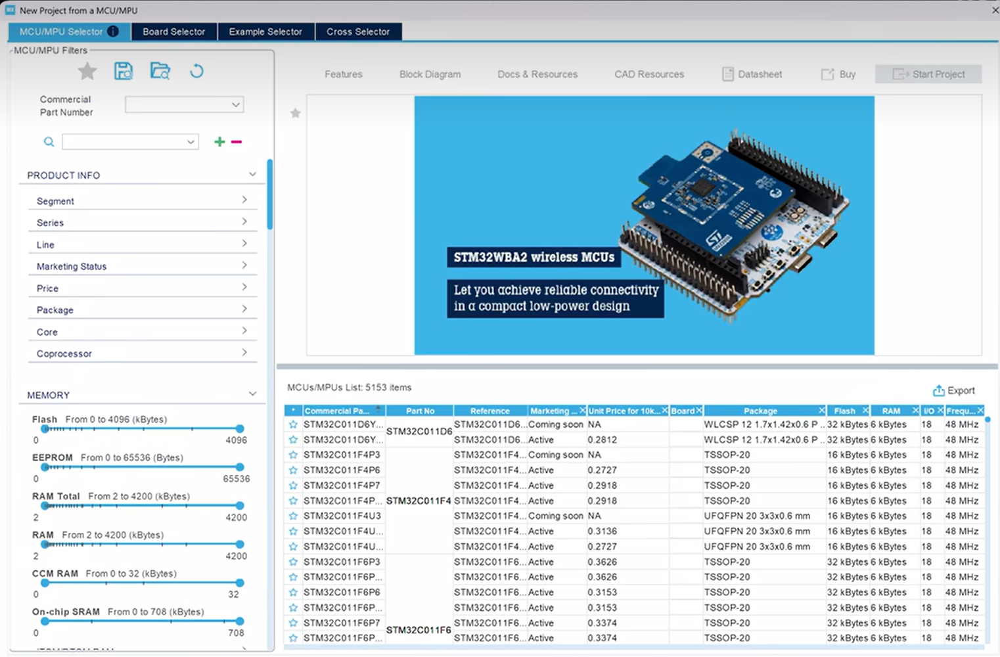
###　设置
需在Project Manager中进行设置，主要是工作路径（IDE中工作空间的路径）和工程名称、工具链（设置为CubeIDE），最终文件夹路径必须是期望的工程文件夹路径
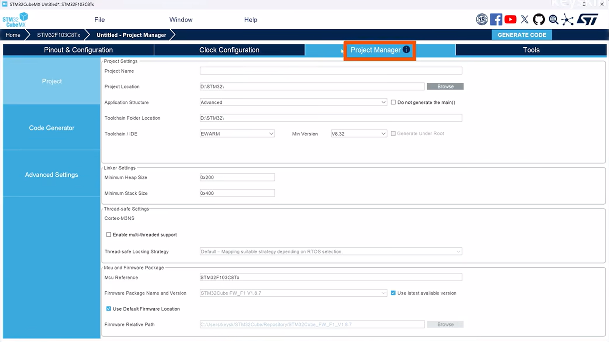
设置完毕
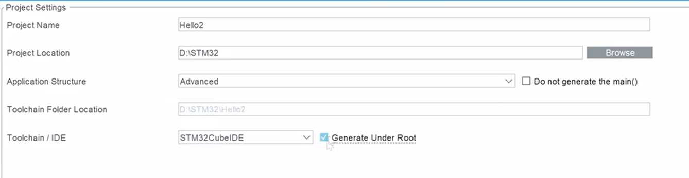
之后电机右上角的`Generate Code`即可
### IDE配置
在IDE中打开正确的文件夹，随后打开MX生成的`.project`文件。
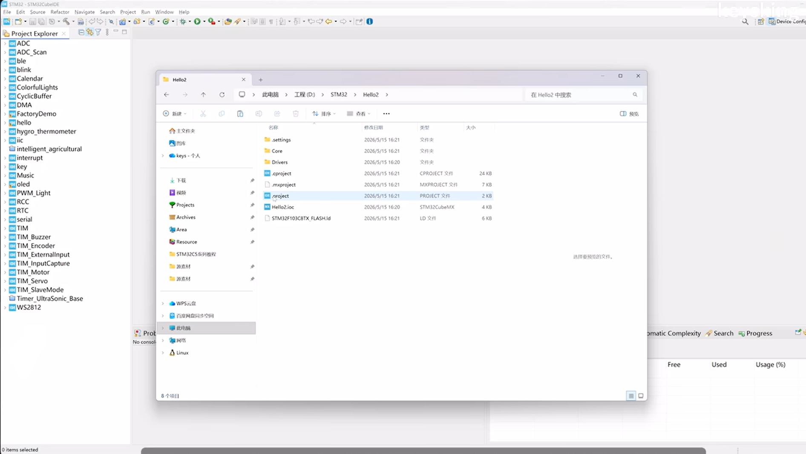

## VScode与MX配置
### VScode的配置文件分隔
打开配置文件
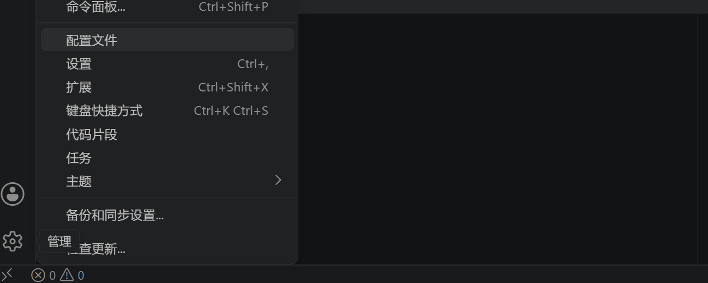
新建配置文件
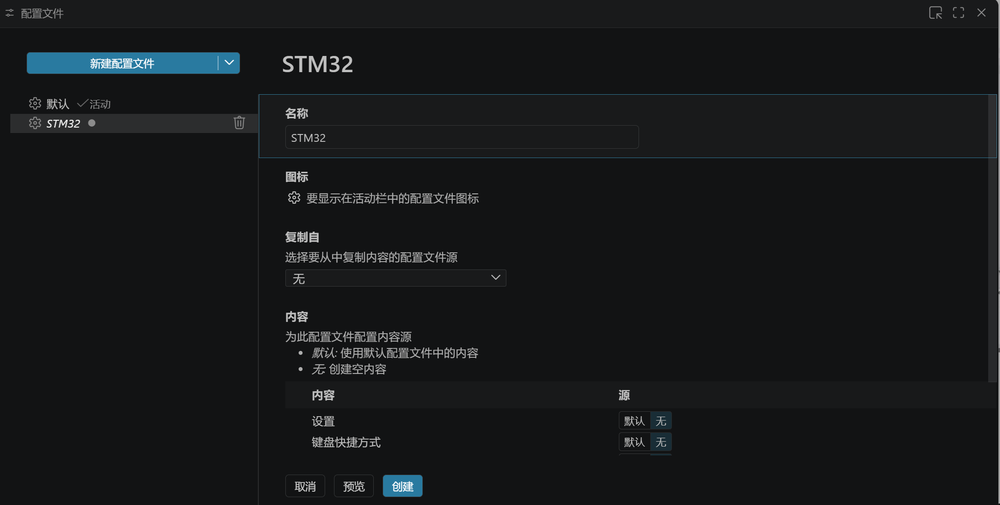
点击“✓”选择
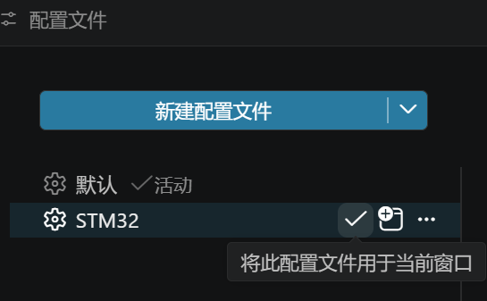
由此便可以独立将下载的插件分隔
### 插件下载
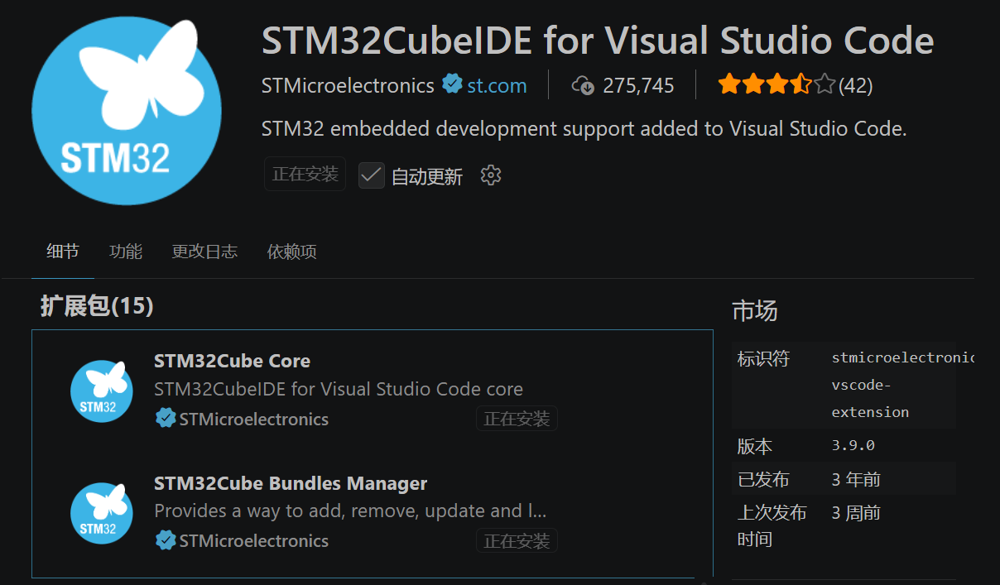
其会自动下载相关的插件
### MX创建
创建方法同上，即选择芯片、Project Manager；工具链需要设置为Cmake
之后MX会在对应文件夹下生成一个工程文件夹

### VScode的导入
打开相应的工程文件夹
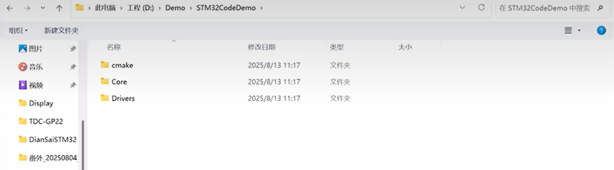
Cmake会识别到此为一个Cmake文件，询问选择预设——开发过程中选择Debug即可
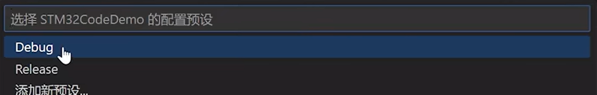
STM32的插件也会识别到是STM32的工程文件，选择是即可，会补齐缺失的`.vscode`和`.settings`文件
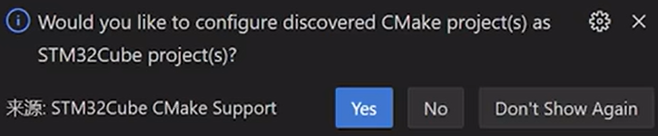

### 代码编写
在Core/Src下即可找到对应的main文件
>对于C语言，Vscode会推荐安装相关插件。但是STM32Cube已经自动安装插件，为了避免冲突无需再安装。

代码补全工具推荐


### 代码的编译与调试
#### 编译
点击Cmake插件生成的编译按钮
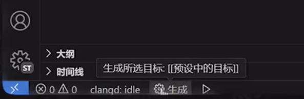
或者是对应的左侧栏中Cmake的`生成`按钮
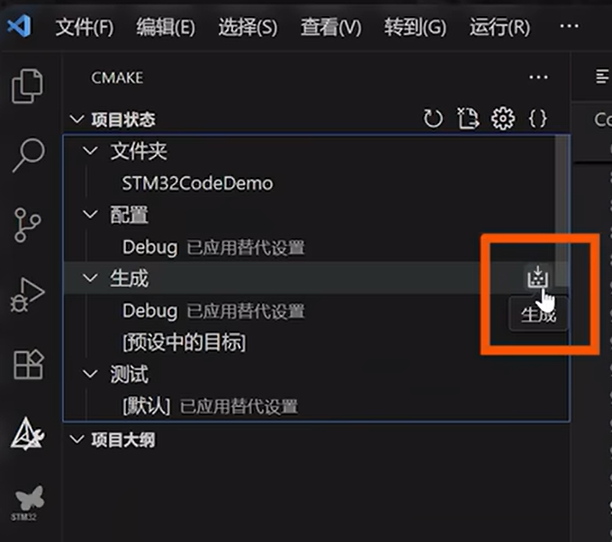
>编译出对应的elf文件后，还会生成对应的占用情况：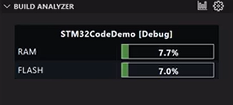

#### 程序完成  
当完成全部编写，需要生成一个最终版本时，可以点击左侧栏中Cmake的`配置`按钮，修改为`Release`
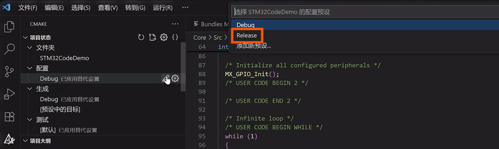
当修改后也可以点击上述配置按钮重新编译文件
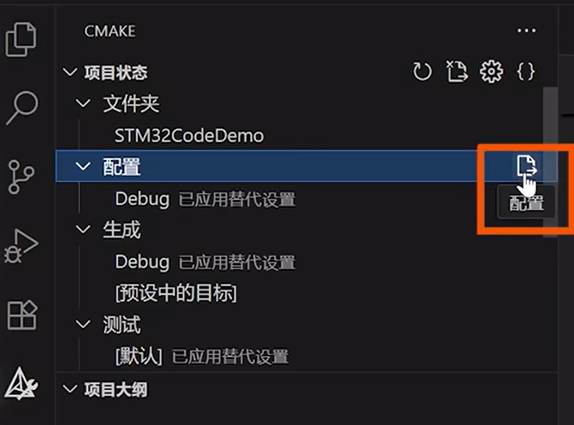
>也可以直接右键CMakeList文件进行操作：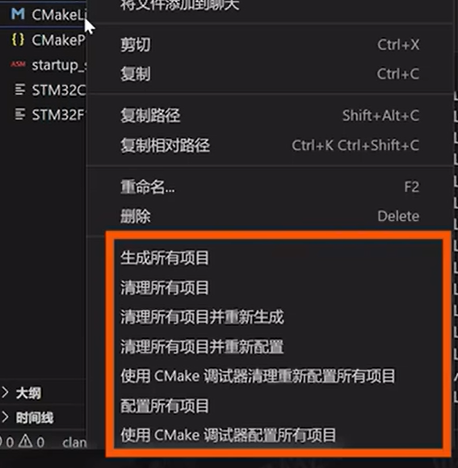
但是其实一般无需手动编译，因为烧录前程序会自动运行Cmake编译。

### 烧录
在`运行与调试`中，会显示插入的设备：
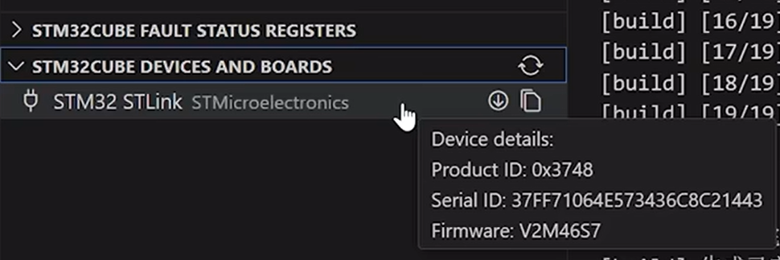
之后可以进行运行与调试了，第一次会询问下载器
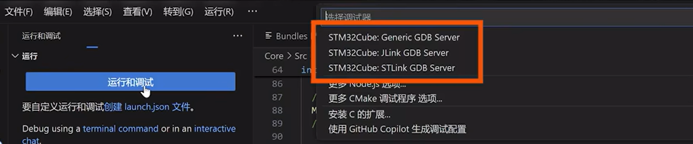
烧录完成后会停在main函数中进行调试

## 补充——Cmake语法
当需要将代码存放在工程文件下新建的文件夹中，需自行新建文件。
使用Cmake可以轻松地在多个编译器之间帮助IDE找到相关的文件
### 利用`target_include_directories`添加文件
```cmake
# 添加 include 路径（你提供的片段）
target_include_directories(${CMAKE_PROJECT_NAME} PRIVATE
    # Add user defined include paths
    Lib/oled/Inc
)

```
### 利用`target_sources`添加代码文件
仅仅添加上对应的代码文件也无法通过，需要再添加代码文件
```cmake
 target_sources(${CMAKE_PROJECT_NAME} PRIVATE
     Lib/oled/Src/font.c
     Lib/oled/Src/oled.c
)
```
如果觉得上述过程较为麻烦，也可以采用下述方式
```cmake
# 递归收集 Lib 目录下所有 .c 文件（注意修正为 *.c）
file(GLOB_RECURSE LIB_SOURCES "Lib/*.c")

# 将收集到的源文件添加到目标
target_sources(${CMAKE_PROJECT_NAME} PRIVATE
    ${LIB_SOURCES}
)
```
但是官方不建议，因为需要每次手动加载Cmake项目

# 2 GPIO
## 2.1 点灯
### GPIO的各大模式
- **推挽输出**：强弱电都强，速度快，不能并联 → LED、PWM、SPI
- **开漏输出**：只驱动低电平，需上拉电阻，可并联 → I2C
- **上拉/下拉输入**：内部带电阻，防引脚悬空 → 按键检测
- **浮空输入**：无内部电阻，需外部电路 → 高速信号
- **模拟输入**：直连ADC，不读数字值 → 模拟信号采样
  
#### 两种输出
| 对比维度 | 推挽输出 | 开漏输出 |
|---------|---------|----------|
| **内部结构** | 两个 MOS 管（上管+下管） | 只有下管（上管不存在） |
| **高电平实现** | 上管导通，直接输出 VCC | 必须外部上拉电阻拉到 VCC |
| **输出 0** | 下管导通 | 下管导通 |
| **输出 1** | 上管导通，电阻极小 | 外部上拉电阻（通常几 kΩ） |
| **驱动能力** | 强（几十 mA） | 弱（取决于上拉电阻，通常 mA 级） |
| **上升沿速度** | 极快（ns 级） | 慢（RC 延迟，μs 级） |
| **总线仲裁** | 不能（直接短路） | 可以（多设备线与） |
| **功耗** | 低（导通电阻小） | 较高（上拉电阻持续耗电） |
| **典型例** | 驱动 LED、MOSFET 栅极 | I2C 的 SDA/SCL 线 |

#### 三种输入
| 对比维度 | 浮空输入 | 上拉输入 | 下拉输入 |
|---------|---------|---------|----------|
| **内部连接** | 直接进施密特触发器 | 通过内部上拉电阻到 VCC | 通过内部下拉电阻到 GND |
| **引脚悬空时** | 电平不确定（易受干扰） | 高电平 | 低电平 |
| **外部电路要求** | 必须外部明确高低电平 | 外部低电平触发 | 外部高电平触发 |
| **抗干扰能力** | 弱 | 中（默认高电平） | 中（默认低电平） |
| **功耗增加** | 无 | 有（上拉电阻持续电流） | 有（下拉电阻持续电流） |
| **典型用途** | 高速信号（SPI MISO） | 按键（另一端接地） | 按键（另一端接 VCC） |

###　新建工程流程