# 1 环境安装
旧版本（1.19.0 及之前）需登录才能使用（存在网络、账号登录困扰）
新版本（2.0 及之后）取消登录但移除内置 CubeMX，无法直接创建工程

## IDE与MX配置
### 下载IDE与MX
打开MX，搜索对应型号芯片

###　设置
需在Project Manager中进行设置，主要是工作路径（IDE中工作空间的路径）和工程名称、工具链（设置为CubeIDE），最终文件夹路径必须是期望的工程文件夹路径

设置完毕

之后电机右上角的`Generate Code`即可
### IDE配置
在IDE中打开正确的文件夹，随后打开MX生成的`.project`文件。


## VScode与MX配置
### VScode的配置文件分隔
打开配置文件

新建配置文件

点击“✓”选择

由此便可以独立将下载的插件分隔
### 插件下载

其会自动下载相关的插件
### MX创建
创建方法同上，即选择芯片、Project Manager；工具链需要设置为Cmake
之后MX会在对应文件夹下生成一个工程文件夹

### VScode的导入
打开相应的工程文件夹

Cmake会识别到此为一个Cmake文件，询问选择预设——开发过程中选择Debug即可

STM32的插件也会识别到是STM32的工程文件，选择是即可，会补齐缺失的`.vscode`和`.settings`文件


### 代码编写
在Core/Src下即可找到对应的main文件
>对于C语言，Vscode会推荐安装相关插件。但是STM32Cube已经自动安装插件，为了避免冲突无需再安装。

代码补全工具推荐


### 代码的编译与调试
#### 编译
点击Cmake插件生成的编译按钮

或者是对应的左侧栏中Cmake的`生成`按钮

>编译出对应的elf文件后，还会生成对应的占用情况：

#### 程序完成  
当完成全部编写，需要生成一个最终版本时，可以点击左侧栏中Cmake的`配置`按钮，修改为`Release`

当修改后也可以点击上述配置按钮重新编译文件

>也可以直接右键CMakeList文件进行操作：
但是其实一般无需手动编译，因为烧录前程序会自动运行Cmake编译。

### 烧录
在`运行与调试`中，会显示插入的设备：

之后可以进行运行与调试了，第一次会询问下载器

烧录完成后会停在main函数中进行调试

## 补充——Cmake语法
当需要将代码存放在工程文件下新建的文件夹中，需自行新建文件。
使用Cmake可以轻松地在多个编译器之间帮助IDE找到相关的文件
### 利用`target_include_directories`添加文件
```cmake
# 添加 include 路径（你提供的片段）
target_include_directories(${CMAKE_PROJECT_NAME} PRIVATE
    # Add user defined include paths
    Lib/oled/Inc
)

```

### 利用`target_sources`添加代码文件
仅仅添加上对应的代码文件也无法通过，需要再添加代码文件
```cmake
 target_sources(${CMAKE_PROJECT_NAME} PRIVATE
     Lib/oled/Src/font.c
     Lib/oled/Src/oled.c
)
```
如果觉得上述过程较为麻烦，也可以采用下述方式
```cmake
# 递归收集 Lib 目录下所有 .c 文件（注意修正为 *.c）
file(GLOB_RECURSE LIB_SOURCES "Lib/*.c")

# 将收集到的源文件添加到目标
target_sources(${CMAKE_PROJECT_NAME} PRIVATE
    ${LIB_SOURCES}
)
```
但是官方不建议，因为需要每次手动加载Cmake项目


##　实际使用的工程流程

实际使用时采用 **CubeMX 配置工程 + VScode 编写代码 + Keil 编译、烧录和调试** 的组合方式。三者的分工如下：

- **CubeMX**：选择芯片、配置时钟和外设，并生成 HAL 初始化代码。
- **VScode**：阅读工程、编写用户代码和管理自己的驱动文件。
- **Keil**：打开生成的 Keil 工程，完成最终编译、下载和在线调试。

### 1. 使用 CubeMX 创建工程

1. 打开 CubeMX，选择具体的 STM32 芯片或开发板。
2. 配置系统时钟、GPIO 和需要使用的外设，例如 USART、I2C、SPI、ADC、定时器等。
3. 在 **Project Manager** 中填写工程名和工程路径。工程路径建议使用纯英文路径，避免空格和特殊字符。
4. 在 **Project Settings** 中将工具链选择为 **MDK-ARM**，然后点击 **Generate Code** 生成工程。
5. 生成完成后，工程目录中会出现 `.uvprojx` 文件，这就是 Keil 的工程文件。

> 如果还需要使用 VScode 的 CMake 功能，可以另外生成一份 CMake 工程；但同一个工程不要在 CubeMX 中反复切换工具链后直接覆盖使用，避免工程文件互相影响。

### 2. 使用 VScode 编写代码

1. 在 VScode 中打开 CubeMX 生成的工程根目录，而不是只打开 `Core` 文件夹。
2. 用户代码主要放在以下位置：
   - `Core/Inc`：用户头文件。
   - `Core/Src`：用户源文件和 `main.c`。
   - `Drivers`：HAL 库、CMSIS 和芯片底层驱动。
   - 自建的 `BSP`、`App` 或 `Lib`：板级驱动、应用代码和通用模块。
3. CubeMX 生成的文件中，优先在 `USER CODE BEGIN` 和 `USER CODE END` 之间编写代码。重新生成代码时，这些区域通常会被保留。
4. 建议将一个功能拆分为 `.h` 和 `.c` 两个文件，例如 `bsp_led.h`、`bsp_led.c`，不要把所有代码都堆在 `main.c` 中。
5. 新增源文件后，要确保它已经加入 Keil 工程；**仅仅把文件放进磁盘目录，并不会自动参与 Keil 编译**。

### 3. 使用 Keil 编译工程

1. 双击工程目录中的 `.uvprojx` 文件，使用 Keil 打开工程。
2. 检查工程中是否包含新增的 `.c` 文件，并检查头文件路径是否正确。路径设置位于 **Options for Target → C/C++ → Include Paths**。
3. 点击 **Rebuild** 或 **Build** 编译工程。
4. 编译无误后，Keil 会生成 `.axf`、`.hex` 或 `.bin` 等输出文件，具体取决于工程设置。
5. 如果出现“找不到头文件”或“函数未定义”，优先检查：
   - 头文件所在目录是否加入 Include Paths；
   - 对应的 `.c` 文件是否加入 Keil 工程；
   - 函数声明和定义的名称、大小写是否一致；
   - 外设初始化函数是否已经在 `main.c` 中调用。

### 4. 下载和调试

1. 通过 ST-Link、J-Link 或其他下载器连接开发板。
2. 在 Keil 的 **Options for Target → Debug** 中选择对应的调试器，并在 **Utilities** 中选择相同的下载器。
3. 点击 **Download** 将程序烧录到芯片，或点击 **Start/Stop Debug Session** 进入在线调试。
4. 调试时可以使用断点、单步执行、查看变量和外设寄存器等功能。
5. 如果程序下载成功但运行不正常，先确认芯片型号、晶振配置、系统时钟配置和复位后的启动文件是否匹配。

### 5. 修改外设配置后的处理顺序

当需要修改 CubeMX 配置时，建议按以下顺序操作：

1. 先保存 VScode 和 Keil 中的代码，并确认用户代码位于 `USER CODE` 区域或独立文件中。
2. 回到 CubeMX 修改配置并重新生成代码。
3. 重新打开或刷新 Keil 工程，检查新增的初始化代码和工程文件变化。
4. 如果新增了 `.c` 文件或目录，重新将它们加入 Keil 工程，并补充头文件搜索路径。
5. 重新编译、下载并验证功能。

整个工程的基本文件流转可以概括为：

```text
CubeMX 配置外设
        ↓ Generate Code
生成 HAL 工程和 Keil 工程
        ↓
VScode 编写用户代码
        ↓
Keil 检查工程并编译
        ↓
下载器烧录、在线调试
```


# 2 GPIO
## 2.1 点灯——GPIO的输出
### GPIO的各大模式
- **推挽输出**：强弱电都强，速度快，不能并联 → LED、PWM、SPI
- **开漏输出**：只驱动低电平，需上拉电阻，可并联 → I2C
- **上拉/下拉输入**：内部带电阻，防引脚悬空 → 按键检测
- **浮空输入**：无内部电阻，需外部电路 → 高速信号
- **模拟输入**：直连ADC，不读数字值 → 模拟信号采样
  
#### 两种输出
| 对比维度 | 推挽输出 | 开漏输出 |
|---------|---------|----------|
| **内部结构** | 两个 MOS 管（上管+下管） | 只有下管（上管不存在） |
| **高电平实现** | 上管导通，直接输出 VCC | 必须外部上拉电阻拉到 VCC |
| **输出 0** | 下管导通 | 下管导通 |
| **输出 1** | 上管导通，电阻极小 | 外部上拉电阻（通常几 kΩ） |
| **驱动能力** | 强（几十 mA） | 弱（取决于上拉电阻，通常 mA 级） |
| **上升沿速度** | 极快（ns 级） | 慢（RC 延迟，μs 级） |
| **总线仲裁** | 不能（直接短路） | 可以（多设备线与） |
| **功耗** | 低（导通电阻小） | 较高（上拉电阻持续耗电） |
| **典型例** | 驱动 LED、MOSFET 栅极 | I2C 的 SDA/SCL 线 |

#### 三种输入
| 对比维度 | 浮空输入 | 上拉输入 | 下拉输入 |
|---------|---------|---------|----------|
| **内部连接** | 直接进施密特触发器 | 通过内部上拉电阻到 VCC | 通过内部下拉电阻到 GND |
| **引脚悬空时** | 电平不确定（易受干扰） | 高电平 | 低电平 |
| **外部电路要求** | 必须外部明确高低电平 | 外部低电平触发 | 外部高电平触发 |
| **抗干扰能力** | 弱 | 中（默认高电平） | 中（默认低电平） |
| **功耗增加** | 无 | 有（上拉电阻持续电流） | 有（下拉电阻持续电流） |
| **典型用途** | 高速信号（SPI MISO） | 按键（另一端接地） | 按键（另一端接 VCC） |

### cubemx的生成代码
#### 代码位置

只需要将代码写在注释：
```c
/* USER CODE BEGIN... */

/* USER CODE END... */
```
之间，每次重新生成我们自己写的代码就不会消失了。

> 使用 `alt`+`A`来获取代码提示。

#### 循环点灯代码
##### 简单的单个小灯
使用 CubeMX 配置好 GPIO 为输出模式后即可点亮 LED。为了使灯循环闪烁，可以在while 中写入以下代码：
```c
/* USER CODE BEGIN WHILE */
while (1)
{
    HAL_GPIO_WritePin(GPIOA, GPIO_PIN_7, GPIO_PIN_SET);
    HAL_Delay(1000);
    HAL_GPIO_WritePin(GPIOA, GPIO_PIN_7, GPIO_PIN_RESET);
    HAL_Delay(500);
    /* USER CODE END WHILE */
}
```
即可完成循环点灯的效果。
>具体选择的引脚根据实际情况修改。

HAL库函数的特点如下：

**命名规范统一**：所有函数都以`HAL_`为前缀，后面跟外设名和操作名。

**与CubeMX深度绑定**：初始化代码由CubeMX自动生成，用户只在`USER CODE BEGIN/END`标记区间添加业务逻辑，方便图形化配置和代码重新生成。

**延时函数为阻塞式**：`HAL_Delay()`基于SysTick中断实现毫秒级延时，使用简单但会占用CPU，延时期间无法响应其他任务，适合简单顺序执行的程序。

**返回值状态明确**：大多数HAL函数会返回`HAL_OK`、`HAL_ERROR`、`HAL_BUSY`、`HAL_TIMEOUT`等状态码，便于错误处理。

##### 不同颜色的小灯组合
完成如下的效果：


可以右键对应引脚进行命名，这样后续可以不写如`GPIOA`、和`GPIO_PIN_7`，而是选择写`xxx_Port`和`xxx_Pin`. 

```c
/* USER CODE BEGIN WHILE */
while (1)
{
    if (state <= 2 || state == 5) {
        HAL_GPIO_WritePin(LED_RED_GPIO_Port, LED_RED_Pin, GPIO_PIN_SET);
    } else {
        HAL_GPIO_WritePin(LED_RED_GPIO_Port, LED_RED_Pin, GPIO_PIN_RESET);
    }

    if (state >= 1 && state <= 3) {
        HAL_GPIO_WritePin(LED_GREEN_GPIO_Port, LED_GREEN_Pin, GPIO_PIN_SET);
    } else {
        HAL_GPIO_WritePin(LED_GREEN_GPIO_Port, LED_GREEN_Pin, GPIO_PIN_RESET);
    }

    if (state >= 2) {
        HAL_GPIO_WritePin(LED_BLUE_GPIO_Port, LED_BLUE_Pin, GPIO_PIN_SET);
    } else {
        HAL_GPIO_WritePin(LED_BLUE_GPIO_Port, LED_BLUE_Pin, GPIO_PIN_RESET);
    }

    HAL_Delay(300);

    state++;
    if (state > 5) {
        state = 0;
    }
}
/* USER CODE END WHILE */
```

## 2.2 按键控制——GPIO的输入
### 电路原理图

并联电容来消减按下或者松开按钮时的抖动问题。

下忽略电容进行分析：
#### 按键松开

引脚直接连到电源，设置浮空状态（相当于内部为高阻态）


需要添加上拉电阻

#### 按键按下


>当然也有下拉电路。
>实际中，芯片内部就有上拉电阻：
>所以说无需我们自己加上上拉电阻。也就是 `外部上拉电阻 + 浮空输入模式` 和 `内部上拉电阻 + 上拉输入模式 `达到的效果几乎完全一样.

总结：
1. 当设置按钮 GPIO 为上拉模式，相当于外接电源：松开按键读取高电平；按下按键读取低电平
2. 当设置按钮 GPIO 为下拉模式，相当于外接GND：松开按键读取低电平；按下按键读取高电平

### CubeMX 设置
先点击芯片上的引脚，设置为 GPIO_Input


随后，在 System Core 下的 GPIO

点击相应的引脚查看详细设置。

配置对应的 上拉/下拉模式


### 代码
```c
/* USER CODE BEGIN WHILE */
while (1)
{

    // 按键1控制绿色LED
    if (HAL_GPIO_ReadPin(KEY1_GPIO_Port, KEY1_Pin) == GPIO_PIN_RESET) {
        HAL_GPIO_WritePin(LED_GREEN_GPIO_Port, LED_GREEN_Pin, GPIO_PIN_SET);   // 按下亮
    } else {
        HAL_GPIO_WritePin(LED_GREEN_GPIO_Port, LED_GREEN_Pin, GPIO_PIN_RESET); // 松开灭
    }

    // 按键2控制红色LED（带松手检测）
    if (HAL_GPIO_ReadPin(KEY2_GPIO_Port, KEY2_Pin) == GPIO_PIN_RESET) {
        HAL_GPIO_TogglePin(LED_RED_GPIO_Port, LED_RED_Pin);      // 翻转红色LED状态

        while(HAL_GPIO_ReadPin(KEY2_GPIO_Port, KEY2_Pin) == GPIO_PIN_RESET){} // 等待按键松开
    }
}
/* USER CODE END WHILE */
```
**效果说明**

| 按键 | 操作 | LED效果 | 控制方式 |
|------|------|---------|-----------|
| **KEY1** | 按下 | 绿灯亮 | 电平控制（实时跟随） |
| **KEY1** | 松开 | 绿灯灭 | |
| **KEY2** | 每按一次 | 红灯翻转（亮↔灭） | 边沿触发（带松手检测） |

### 补充说明——软件消抖
**完整代码**

```c
/* USER CODE BEGIN WHILE */
while (1)
{
    // KEY1控制绿灯：按下亮，松开灭
    if (HAL_GPIO_ReadPin(KEY1_GPIO_Port, KEY1_Pin) == GPIO_PIN_RESET) {
        HAL_GPIO_WritePin(LED_GREEN_GPIO_Port, LED_GREEN_Pin, GPIO_PIN_SET);
    } else {
        HAL_GPIO_WritePin(LED_GREEN_GPIO_Port, LED_GREEN_Pin, GPIO_PIN_RESET);
    }

    // KEY2控制红灯：按键消抖 + 松手检测
    if (HAL_GPIO_ReadPin(KEY2_GPIO_Port, KEY2_Pin) == GPIO_PIN_RESET) {
        HAL_Delay(10);                    // 延时10ms消抖
        if (HAL_GPIO_ReadPin(KEY2_GPIO_Port, KEY2_Pin) == GPIO_PIN_RESET) {
            HAL_GPIO_TogglePin(LED_RED_GPIO_Port, LED_RED_Pin);  // 翻转红灯
            while (HAL_GPIO_ReadPin(KEY2_GPIO_Port, KEY2_Pin) == GPIO_PIN_RESET) {} // 等待松开
        }
    }
}
/* USER CODE END WHILE */
```
**效果说明**

| 按键 | 操作 | LED效果 | 新增特性 |
|------|------|---------|----------|
| **KEY2** | 每按一次 | 红灯翻转（亮↔灭） | ✅ **增加了10ms消抖**，按键更稳定 |

**先检测到，如果延迟后还是一样的，则进入逻辑处理。**

## 2.3 GPIO内部结构——推挽、开漏与八种工作模式

前面使用 GPIO 时已经接触过：

* 推挽输出
* 上拉输入
* 下拉输入
* 浮空输入

实际上这些模式的区别，本质上就是 **GPIO 引脚内部不同电路是否开启，以及数据从哪条路径经过。**

STM32 的一个 GPIO 大致可以分成：
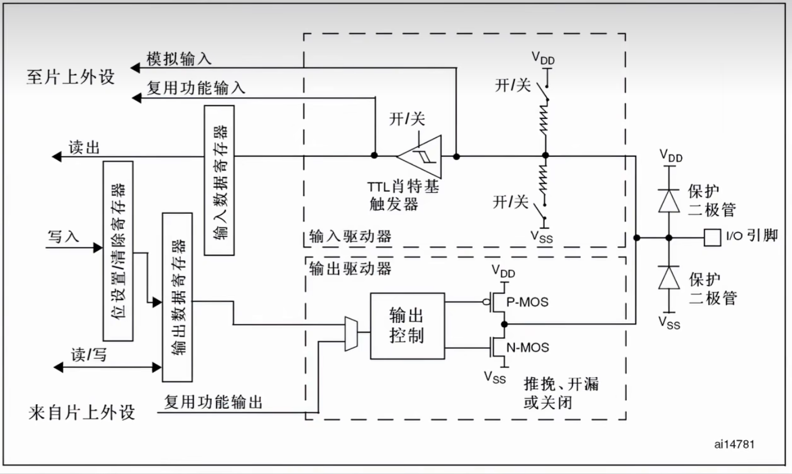
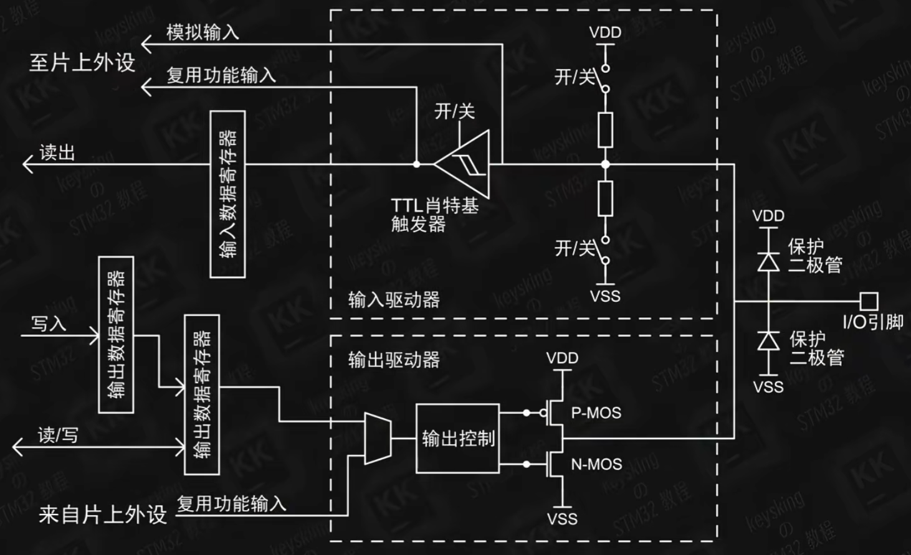

因此一个 GPIO 引脚内部并不是单纯的一根导线，而是存在：

* 保护电路
* 上拉、下拉电阻
* 输入电路
* 输出驱动电路
* 输入寄存器
* 输出寄存器
* 外设复用通道

不同的 GPIO 模式，就是对这些结构进行不同组合。


### GPIO的八种工作模式

STM32 GPIO 一共有八种常见工作模式：

| 类型   | GPIO模式 |
| ---- | ------ |
| 输入   | 浮空输入   |
| 输入   | 上拉输入   |
| 输入   | 下拉输入   |
| 输入   | 模拟输入   |
| 输出   | 推挽输出   |
| 输出   | 开漏输出   |
| 复用输出 | 复用推挽输出 |
| 复用输出 | 复用开漏输出 |

可以简单分成：

```text
GPIO
│
├── 输入
│   ├── 浮空输入
│   ├── 上拉输入
│   ├── 下拉输入
│   └── 模拟输入
│
└── 输出
    ├── 普通输出
    │   ├── 推挽输出
    │   └── 开漏输出
    │
    └── 复用输出
        ├── 复用推挽输出
        └── 复用开漏输出
```


### GPIO引脚的保护电路

GPIO 引脚与芯片内部电路之间存在保护结构，其主要作用就是避免外部引脚出现异常电压时直接损坏内部电路。

可以简单理解为：
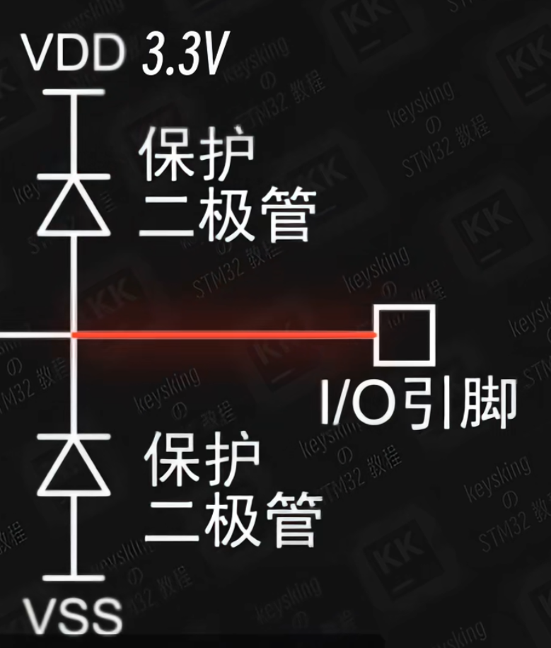

正常情况下：`GND` ≤ `GPIO电压` ≤ `VDD`

保护二极管基本不参与工作。

当外部电压出现明显异常时，保护结构可以在一定程度上限制引脚电压。

> 保护电路并不意味着 GPIO 可以随便接高电压。

部分 STM32 GPIO 是 **5V tolerant（5V耐受）** 引脚，可以接受一定条件下的 5V 输入；但不是所有引脚都支持，需要查看芯片的数据手册。


### 输出部分

#### 推挽输出

推挽输出内部最重要的结构就是两个 MOS 管：
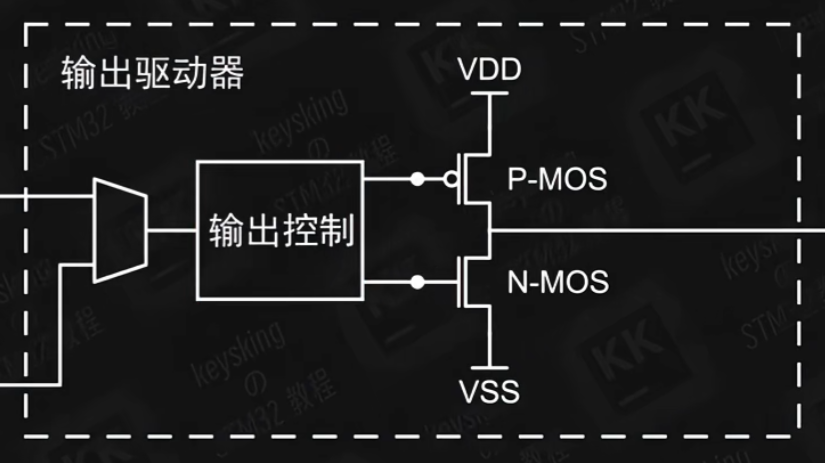
实际等效为：
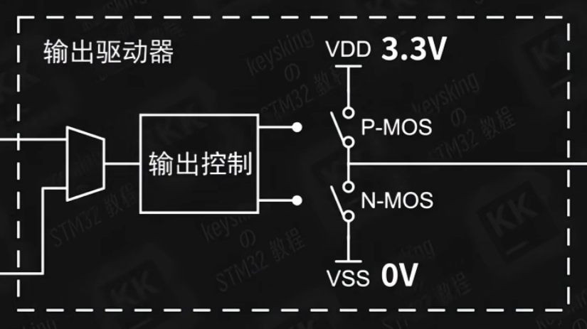

可以把它理解成：

* 上面的 PMOS 负责把 GPIO **推向高电平**
* 下面的 NMOS 负责把 GPIO **拉向低电平**

所以叫：

**推挽输出 Push-Pull。**


##### 输出高电平

当需要 GPIO 输出高电平时：PMOS：导通、NMOS：关闭


形成：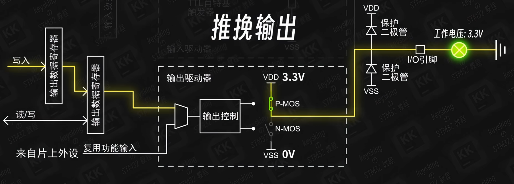

因此 GPIO 可以直接连接到 VDD：GPIO ≈ VDD
>对于常见 STM32：GPIO ≈ 3.3V


##### 输出低电平

当需要输出低电平时：PMOS：关闭、NMOS：导通

形成：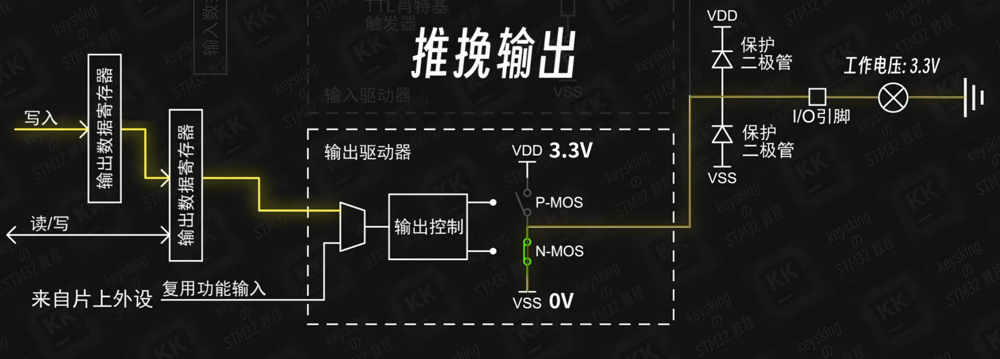

因此：GPIO ≈ 0V


##### 推挽输出总结

| GPIO状态 | PMOS | NMOS | GPIO |
| ------ | ---- | ---- | ---- |
| 输出1，高电平    | 导通   | 关闭   | VDD  |
| 输出0，低电平    | 关闭   | 导通   | GND  |

所以推挽输出最大的特点就是：

高电平和低电平都**由芯片**主动输出。

也就是：
输出1 → 主动接VDD
输出0 → 主动接GND


> 因此普通的 LED、PWM、SPI 等数字输出通常可以使用推挽输出。


#### 开漏输出

开漏输出与推挽输出非常像，但是有一个关键区别：**上面的 PMOS 不工作。**

因此只剩下面的 NMOS：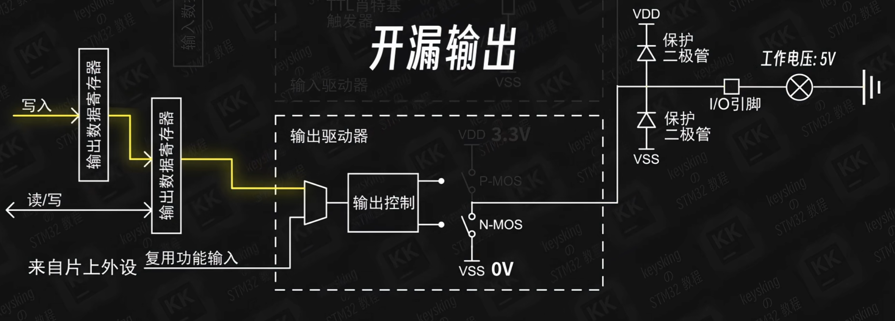

也就是说开漏输出只能：
**主动把 GPIO 拉低；** 却不能主动输出高电平。

##### 开漏输出0

当输出 0 时：NMOS：导通

形成：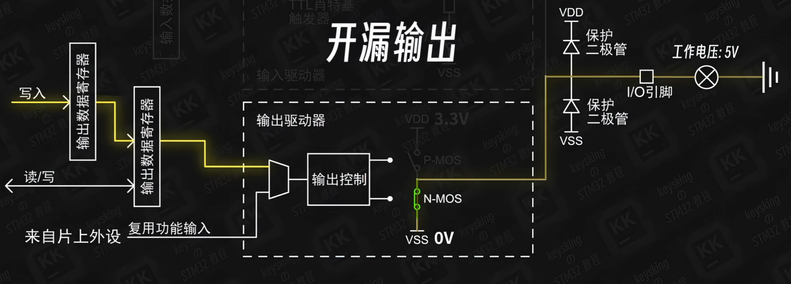

因此：GPIO = 0V

这与推挽输出低电平基本一样。

##### 开漏输出1

但是当程序要求输出 1 时：NMOS：关闭

此时：
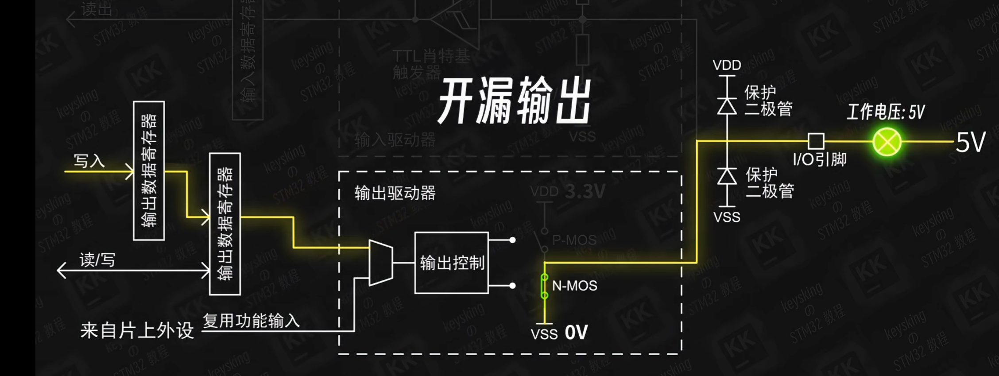

GPIO 既没有连接：VDD；也没有连接：GND

因此 GPIO 进入：

**高阻态。**

也就是：GPIO ≠ 主动输出高电平；GPIO = 什么都不管

##### 开漏输出总结
因此：

| 开漏输出       | NMOS | GPIO实际状态 |
| ---------- | ---- | -------- |
| 输出0        | 导通   | 低电平      |
| 输出1        | 关闭   | 高阻态      |
| 输出1 + 外部上拉 | 关闭   | 被拉成高电平   |

> **开漏输出的“1”并不是真的输出高电平，而是不再拉低。**

#### 推挽与开漏的核心区别

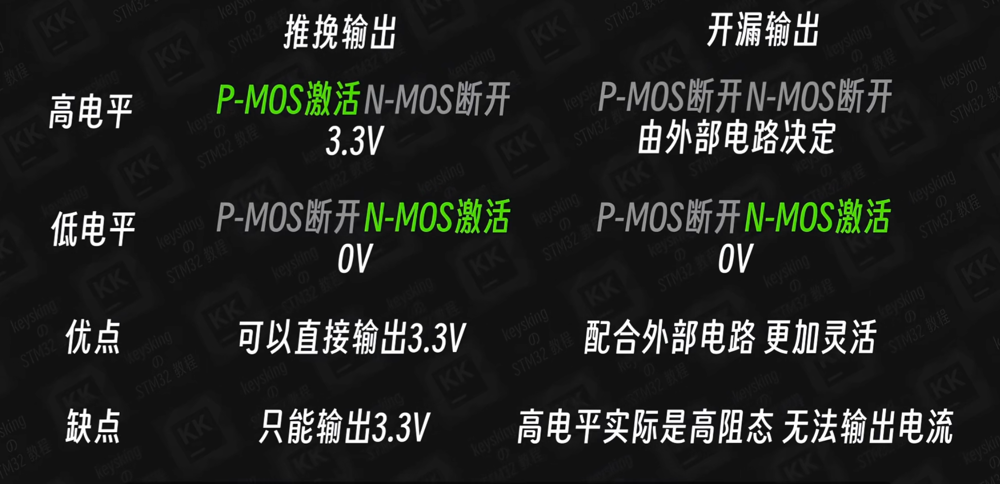

#### 开漏输出有什么用

既然推挽可以直接输出 0 和 1，看起来更加方便，那么为什么还需要开漏？

开漏输出在某些情况下可以实现不同电压之间的接口。
> 前提是对应 GPIO 本身支持相应电压，例如必须确认是否属于 5V 耐受引脚。

开漏结构也非常适合多个器件共同控制一条信号线。不会出现一个设备强行输出高电平、另一个设备强行输出低电平的直接冲突。
>典型例子就是：I2C


#### 普通输出与复用输出

前面的：

```text
推挽输出
开漏输出
```

还可以继续分成：

```text
普通推挽输出
普通开漏输出

复用推挽输出
复用开漏输出
```

它们后面的 MOS 输出结构其实没有本质变化。

真正不同的是：**谁来控制 MOS 管。**

##### 普通输出

普通 GPIO 输出时，控制信号来自 GPIO 自己的输出控制部分。

##### 复用输出

但是很多 GPIO 引脚不只可以作为普通 GPIO 使用。
>例如一个引脚还可能作为：USART、SPI、I2C、TIM……这些都是 STM32 内部的片上外设。

当 GPIO 被配置为复用功能后，输出信号就不再主要由普通 GPIO 输出控制，而是来自对应的外设。

### 输入部分

GPIO 不仅可以输出，也可以读取外部输入。

输入部分大致可以理解成：


外部电压经过输入电路处理以后，最终转换成 0 或 1，然后 CPU 就可以读取这个状态。

#### 施密特触发器

外部输入电压在现实中不一定是标准的 0V 或 3.3V，在电平变化过程中可能出现 0.7V、1.3V、1.8V、2.4V 等中间电压。

因此输入电路需要判断：**当前电压到底应该算低电平还是高电平。**

施密特触发器的作用之一，就是将外部实际电压转换为稳定的数字高低电平，再送入 GPIO 输入寄存器。


#### 浮空输入
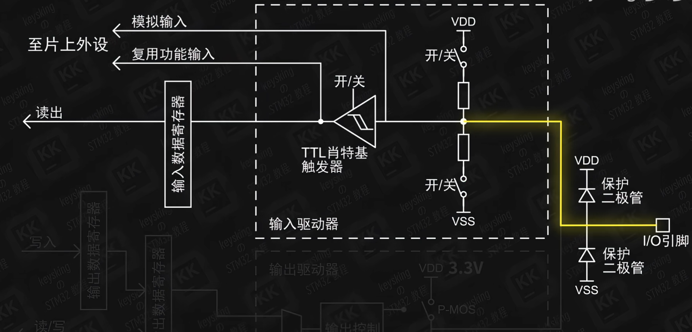
浮空输入时：上拉电阻关闭、下拉电阻关闭。

因此 GPIO 内部不会主动给引脚提供默认电平，而是完全由外部电路决定。

如果外部提供 3.3V，则读取为 1；如果外部提供 0V，则读取为 0。

但是如果 GPIO 什么都没有连接，引脚处于悬空状态，此时电平可能受到外部干扰而发生变化，因此读取结果是不确定的。

##### 浮空输入总结

| 状态      | GPIO读取结果 |
| ------- | -------- |
| 外部输入高电平 | 1        |
| 外部输入低电平 | 0        |
| 引脚悬空    | 不确定      |

所以浮空输入最大的特点就是：

**GPIO 自己不提供默认高低电平，完全由外部信号决定。**

> 因此需要稳定状态的输入引脚，一般不要直接悬空。


#### 上拉输入

上拉输入就是在 GPIO 内部连接一个上拉电阻：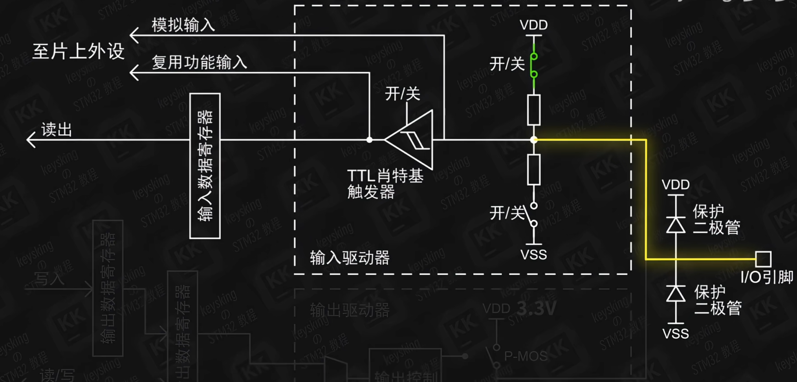

当外部没有提供信号时，上拉电阻会将 GPIO 拉向 VDD，因此默认读取高电平。

当外部将 GPIO 接到 GND 时，引脚被拉低，此时读取低电平。

##### 上拉输入总结

| 外部状态  | GPIO读取结果 |
| ----- | -------- |
| 悬空    | 1，高电平    |
| 接 GND | 0，低电平    |


#### 下拉输入

下拉输入与上拉输入正好相反，GPIO 内部连接的是下拉电阻。

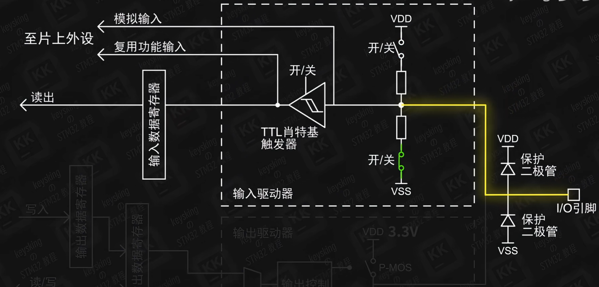

当外部没有提供信号时，下拉电阻会将 GPIO 拉向 GND，因此默认读取低电平。

当外部将 GPIO 接到 VDD 时，引脚被拉高，此时读取高电平。

##### 下拉输入总结

| 外部状态  | GPIO读取结果 |
| ----- | -------- |
| 悬空    | 0，低电平    |
| 接 VDD | 1，高电平    |


#### 三种数字输入对比

| 对比     | 浮空输入       | 上拉输入   | 下拉输入   |
| ------ | ---------- | ------ | ------ |
| 内部上拉   | 关闭         | 开启     | 关闭     |
| 内部下拉   | 关闭         | 关闭     | 开启     |
| 引脚悬空时  | 不确定        | 高电平    | 低电平    |
| 默认状态   | 无          | 1      | 0      |
| 外部控制方式 | 外部必须提供明确电平 | 外部可以拉低 | 外部可以拉高 |

#### 模拟输入

前面的浮空输入、上拉输入和下拉输入，本质上都属于数字输入，最终只需要判断电平是 0 还是 1。

但是有时候我们并不只想知道高低电平，而是希望知道实际电压，例如 0.6V、1.5V、2.7V 等。

这时就需要使用：**模拟输入。**
>典型用途就是 ADC 采样。

GPIO 的输入路径可以简单理解成：

外部 GPIO → 数字输入路径 → 0 / 1
外部 GPIO → 模拟输入路径 → ADC 等模拟外设

当 GPIO 配置为模拟输入时，外部模拟电压主要进入芯片内部的模拟外设，而不是经过普通数字输入路径判断为 0 或 1。

##### 模拟输入总结

1. 数字输入关注的是：**高电平还是低电平。**
2. 模拟输入关注的是：**具体是多少伏。**


# 3 中断
## 3.1 初识中断以及外部中断的使用
### 什么是中断

正常情况下，STM32 会按照 `main()` 中的程序顺序不断执行。例如让绿色 LED 周期闪烁：

```c
while (1)
{
    HAL_GPIO_WritePin(LED_GREEN_GPIO_Port, LED_GREEN_Pin, GPIO_PIN_SET);
    HAL_Delay(1000);
    HAL_GPIO_WritePin(LED_GREEN_GPIO_Port, LED_GREEN_Pin, GPIO_PIN_RESET);
    HAL_Delay(1000);
}
```

如果此时发生了一个已经配置好的中断事件，例如按下按键，CPU 会暂时停止当前正在执行的程序，转而执行对应的中断处理函数。中断处理结束后，再继续执行之前的程序。

主程序运行 → 中断事件发生 → 执行中断程序 → 返回主程序继续执行

因此：**中断就是当某个事件发生时，让 CPU 暂时去处理这个事件。**

### 本节实验

本节通过按键外部中断实现：

* 绿色 LED 在主循环中周期闪烁；
* 按下按键后触发外部中断；
* 在中断中翻转红色 LED；
* 中断结束后继续执行绿色 LED 的闪烁程序。

### 外部中断 EXTI

按键属于 STM32 外部 GPIO 输入，因此使用的是：**EXTI（External Interrupt，外部中断）**。

普通 GPIO 输入时，通过：

```c
HAL_GPIO_ReadPin(KEY1_GPIO_Port, KEY1_Pin);
```

主动读取 GPIO 当前状态。使用外部中断后，可以让 GPIO 在电平发生特定变化时直接产生中断。

常见触发方式：

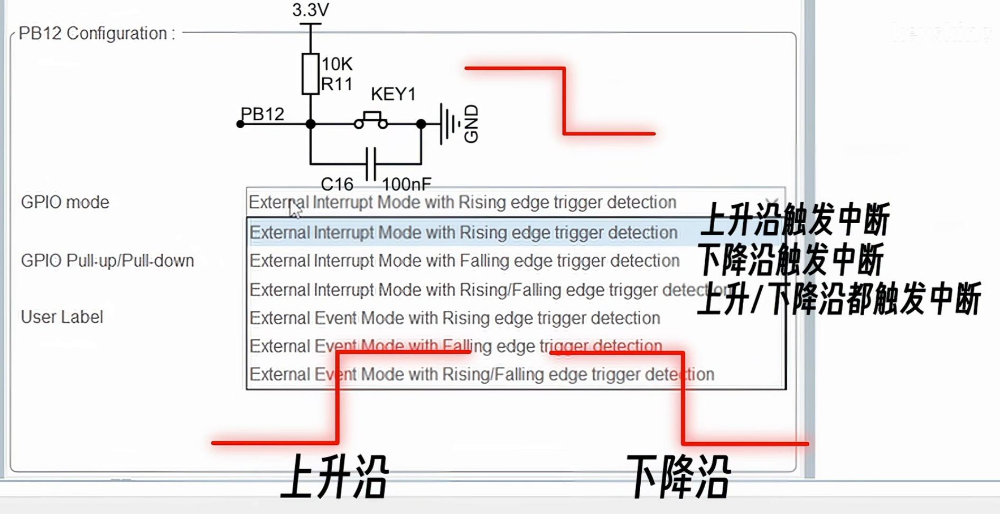

#### 按键为什么使用下降沿触发

前面按键实验使用上拉输入：

松开按键 → 高电平
按下按键 → 低电平

因此按下按键的一瞬间发生：**高电平 → 低电平**，也就是**下降沿**。

所以如果希望在“按下按键”的瞬间触发中断，需要设置：

**External Interrupt Mode with Falling edge trigger detection**

即：**下降沿触发外部中断。**

### CubeMX配置

#### 配置LED

绿色 LED 和红色 LED 都配置为普通 GPIO 输出：`GPIO_Output`。

例如：

* `LED_GREEN`
* `LED_RED`

绿色 LED 用于主程序周期闪烁，红色 LED 用于显示按键中断是否触发。

#### 配置按键外部中断

选择按键对应的 GPIO 引脚，将原来的 `GPIO_Input` 修改为对应的 `GPIO_EXTI`，并根据按键电路选择：

**External Interrupt Mode with Falling edge trigger detection**

如果按键采用内部上拉，则同时配置：**Pull-up**。

整个按键配置可以概括为：

**按键 GPIO → GPIO_EXTI → 下降沿触发 → 上拉输入**

> 具体使用哪个 GPIO 和 EXTI，需要根据开发板上按键连接的实际引脚确定。

### 开启NVIC中断
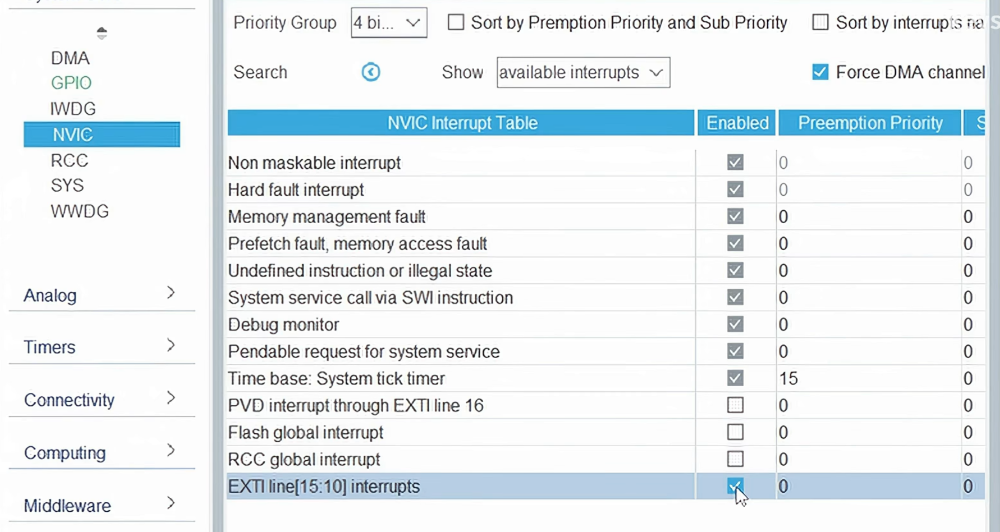
配置完 `GPIO_EXTI` 后，还需要在 NVIC 中开启对应的外部中断。

NVIC 可以暂时理解成：**STM32 中负责管理中断的模块。**

例如按键连接在 EXTI12，则对应：`EXTI line[15:10] interrupts`，需要将其勾选，使能该中断。

### 主程序

主程序继续控制绿色 LED 周期闪烁：

```c
/* USER CODE BEGIN WHILE */
while (1)
{
    HAL_GPIO_WritePin(LED_GREEN_GPIO_Port, LED_GREEN_Pin, GPIO_PIN_SET);
    HAL_Delay(1000);
    HAL_GPIO_WritePin(LED_GREEN_GPIO_Port, LED_GREEN_Pin, GPIO_PIN_RESET);
    HAL_Delay(1000);
}
/* USER CODE END WHILE */
```

这里不需要在 `while(1)` 中不断判断按键。按键发生中断以后，CPU 会自动进入对应的中断处理函数。

### 中断处理函数

CubeMX 开启外部中断后，会自动生成对应的中断处理函数，位于文件`Core/Src/stm32xxxx_it.c`下。
例如按键位于 EXTI10～EXTI15 范围时，会使用：

```c
void EXTI15_10_IRQHandler(void)
{
    /* USER CODE BEGIN EXTI15_10_IRQn 0 */

    //加入软件消抖
    HAL_Delay(10);
    if (HAL_GPIO_ReadPin(KEY1_GPIO_Port, KEY1_Pin) == GPIO_PIN_RESET)
    {
        HAL_GPIO_TogglePin(LED_RED_GPIO_Port, LED_RED_Pin);
    }
    /* USER CODE END EXTI15_10_IRQn 0 */

    HAL_GPIO_EXTI_IRQHandler(KEY1_Pin);

    /* USER CODE BEGIN EXTI15_10_IRQn 1 */
    /* USER CODE END EXTI15_10_IRQn 1 */
}
```

#### HAL_GPIO_EXTI_IRQHandler

CubeMX 自动生成的中断函数中还存在：

```c
HAL_GPIO_EXTI_IRQHandler(KEY1_Pin);
```

这是 HAL 库提供的 GPIO 外部中断处理函数，其中一个重要作用就是处理并清除对应的外部中断标志。

可以暂时理解成：**告诉 STM32：这一次中断已经处理完成。**

否则中断请求一直处于挂起状态，就可能导致中断再次被响应。

> 这一函数内部具体做了什么，以及 EXTI 的挂起标志，会在后面的中断原理中继续学习。

#### HAL_Delay在中断中的问题

本节为了直观演示按键消抖，在中断函数中使用了：

```c
HAL_Delay(10);
```

但是需要注意：**实际工程中一般不建议在中断函数中使用 `HAL_Delay()`。**

因为中断服务函数应该尽可能快速完成。`HAL_Delay()` 会让 CPU 停留在中断处理程序中较长时间，同时它本身还依赖 SysTick 中断计时。

本实验如果需要正常使用 `HAL_Delay()`，SysTick 的中断优先级必须高于按键 EXTI 中断，否则可能导致 `HAL_Delay()` 无法正常计时。
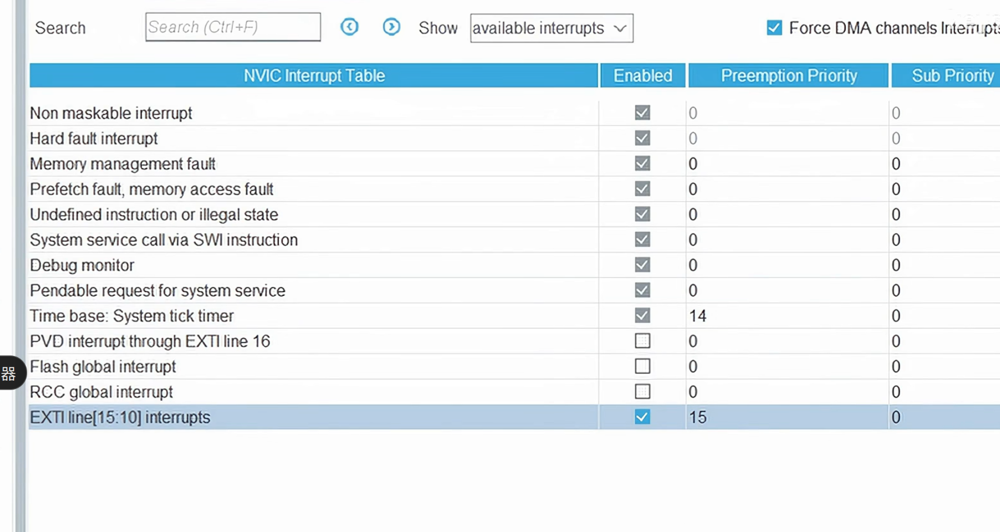

> 这里使用 `HAL_Delay(10)` 主要是为了入门演示。实际项目中，中断一般只进行简单处理或设置标志位，再由主循环处理具体任务。

## 3.2 深入中断
上一节已经实现了按键外部中断：

**按下按键 → 产生下降沿 → CPU进入中断函数 → 翻转LED**

实际上，从 GPIO 产生下降沿到 CPU 真正执行 `EXTI15_10_IRQHandler()`，STM32 内部还经过多个模块。

整个过程可以概括为：

**GPIO → EXTI → NVIC → CPU → 中断服务函数 → 返回原程序**

### EXTI外部中断控制器
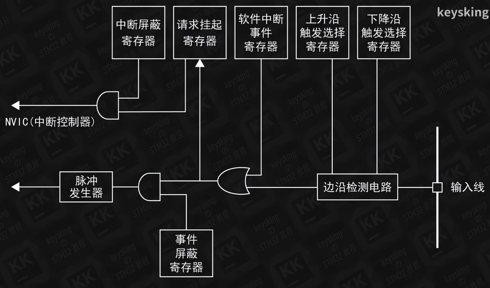
简化版本为：
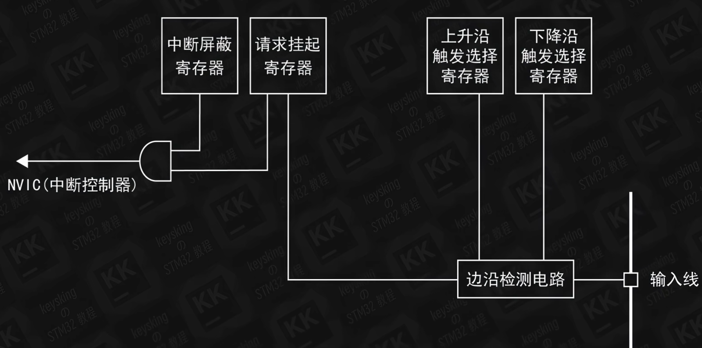

EXTI 全称：**External Interrupt/Event Controller，外部中断/事件控制器**

GPIO 本身只负责产生高低电平，真正检测“上升沿、下降沿”并产生中断请求的是 EXTI。


#### EXTI中断线

GPIO 并不是直接连接 NVIC，而是先连接到对应的 EXTI 中断线。

GPIO 的编号与 EXTI 中断线编号对应：

| GPIO引脚           | 对应EXTI |
| ---------------- | ------ |
| PA0、PB0、PC0……    | EXTI0  |
| PA1、PB1、PC1……    | EXTI1  |
| PA2、PB2、PC2……    | EXTI2  |
| ……               | ……     |
| PA15、PB15、PC15…… | EXTI15 |

也就是：

**引脚编号决定 EXTI 编号，GPIO 端口决定这一条 EXTI 到底连接哪个 GPIO。**

> 例如 PA0、PB0、PC0 都对应 EXTI0，因此同一时刻只能选择其中一个 GPIO 连接 EXTI0。
> 所以不能同时将 PA0 和 PB0 作为两个独立的 EXTI0 外部中断使用。
> 不同 STM32 系列负责 GPIO 与 EXTI 映射的模块名称可能不同，例如 `SYSCFG` 或 `AFIO`。使用 CubeMX 时，这部分通常会自动配置。

#### EXTI的触发

EXTI 可以检测不同的电平变化：

| 触发方式 | 电平变化        |
| ---- | ----------- |
| 上升沿  | 0 → 1       |
| 下降沿  | 1 → 0       |
| 双边沿  | 0 → 1、1 → 0 |

例如按键配置为下降沿触发，当检测到 **1 → 0** 时，EXTI 会将对应中断设置为**挂起状态（Pending）**，表示这里有一个中断正在等待 CPU 处理。

处理完成后还需要清除对应的挂起标志，这就是上一节：

```c
HAL_GPIO_EXTI_IRQHandler(KEY1_Pin);
```

的重要作用之一。

### EXTI与中断函数的对应关系
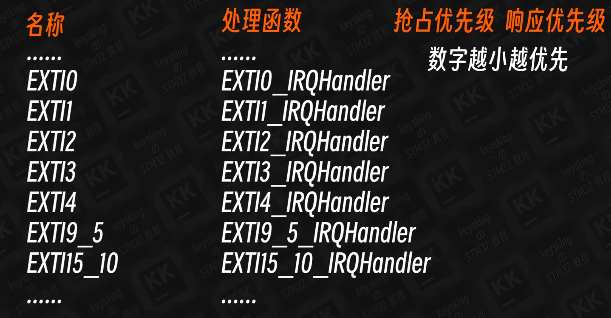
EXTI0～EXTI15 并不是每一条中断线都有一个完全独立的中断函数。

常见 STM32 中：

| EXTI      | 中断函数                     |
| --------- | ------------------------ |
| EXTI0     | `EXTI0_IRQHandler()`     |
| EXTI1     | `EXTI1_IRQHandler()`     |
| EXTI2     | `EXTI2_IRQHandler()`     |
| EXTI3     | `EXTI3_IRQHandler()`     |
| EXTI4     | `EXTI4_IRQHandler()`     |
| EXTI5～9   | `EXTI9_5_IRQHandler()`   |
| EXTI10～15 | `EXTI15_10_IRQHandler()` |

> 如果同一个 `IRQHandler` 中存在多个中断源，还需要进一步判断究竟是哪一条 EXTI 产生了中断。

### NVIC中断控制器

EXTI 产生中断请求后，并不是直接让 CPU 进入中断函数，而是先交给：

**NVIC（Nested Vectored Interrupt Controller，嵌套向量中断控制器）**

NVIC 可以理解成 STM32 的**中断总管理器**，主要负责：

* 中断是否允许；
* 中断优先级；
* 多个中断同时发生时先处理哪个；
* 是否允许高优先级中断打断低优先级中断；
* 将最终需要处理的中断交给 CPU。

因此：

**EXTI负责“产生中断”，NVIC负责“管理中断”。**

> 这也解释了为什么上一节 CubeMX 中除了配置 `GPIO_EXTI`，还必须在 NVIC Settings 中勾选对应的中断，例如：`EXTI line[15:10] interrupts`。

如果 NVIC 没有使能，即使 EXTI 已经检测到下降沿，CPU 也不会正常进入对应的中断服务函数。

#### 中断优先级

如果 STM32 同时产生多个中断，就需要决定 CPU 先处理哪个中断。

CubeMX 的 NVIC 中通常可以看到：
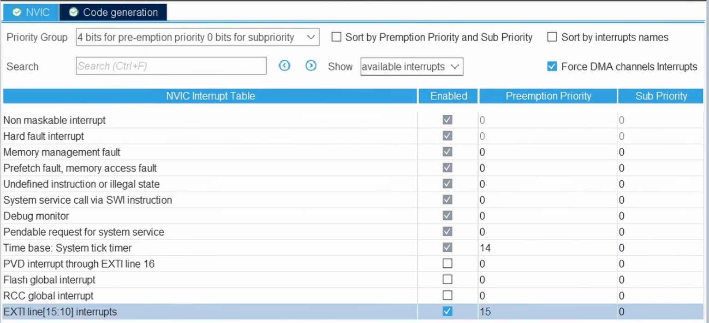

* Preemption Priority：抢占优先级
* Sub Priority：子优先级

需要特别注意：**优先级数字越小，优先级越高。**


##### 抢占优先级

抢占优先级决定：**一个中断能不能打断另一个正在执行的中断。**

> 例如中断A抢占优先级为0，中断B为2。假设 CPU 正在执行中断B，此时中断A发生，则：
> 中断B执行 → 中断A发生 → A优先级更高 → 暂停B → 执行A → A结束 → 返回继续执行B
>这种现象就是：**中断嵌套。**
> 只有更高的抢占优先级才能打断当前正在执行的低优先级中断。

##### 子优先级

如果两个中断的**抢占优先级相同**，它们之间不能互相抢占。如果两者同时处于等待状态，则通过子优先级决定谁先执行。

>   例如：
>    | 中断 | 抢占优先级 | 子优先级 |
>   | -- | ----- | ---- |
>    | A  | 1     | 0    |
>    | B  | 1     | 1    |
>    
> A 和 B 抢占优先级相同，所以不能互相打断；如果两者同时等待 CPU 处理，则 A 先执行，因为子优先级 0 高于 1。

因此可以简单理解为：

**抢占优先级 → 决定能不能插队**
**子优先级 → 不能插队时，决定谁先排队**

# 4 串口通信

## 4.1 初识串口——轮询模式

### 什么是串口

串口通信就是将数据**一位一位地依次发送**。STM32 可以利用串口和电脑、其他单片机、蓝牙模块等设备进行数据通信。

本节主要使用 **TTL 串口**，通过两个主要引脚完成数据收发：

* `TX`（Transmit）：发送数据
* `RX`（Receive）：接收数据

通信双方需要交叉连接：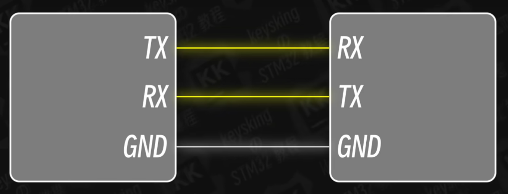

> 两个设备必须共地，因为 TX、RX 上的电压本质上都是相对于 GND 的电压。

电脑本身一般没有 TTL 串口，因此可以通过 USB-TTL 模块将电脑 USB 转换为 TX、RX 串口信号。

### 串口的基本配置
下载配置：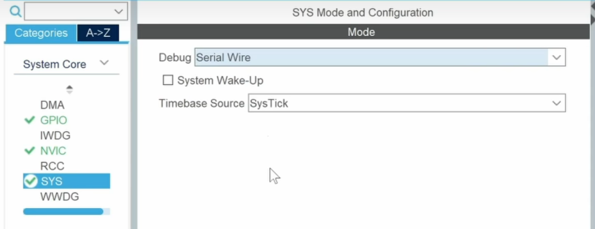

本节使用 STM32 的 `USART2`，在 CubeMX 中选择：**Connectivity → USART2 → Asynchronous**。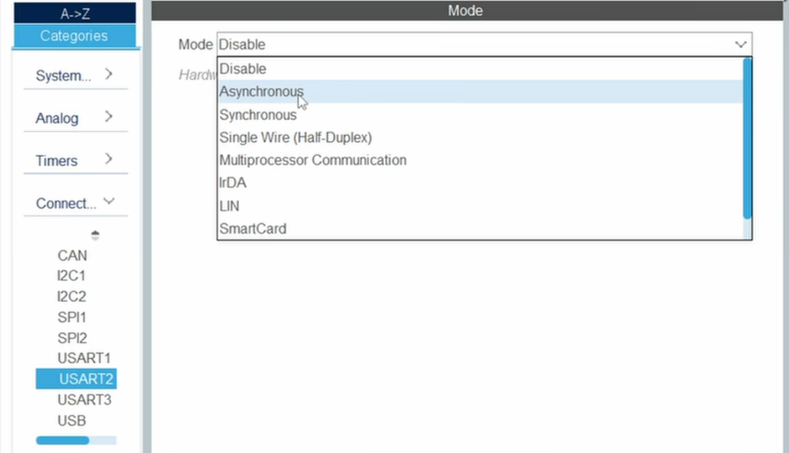

>`Asynchronous` 即**异步通信模式**，不需要额外的时钟线，双方通过提前约定好的通信参数判断数据。

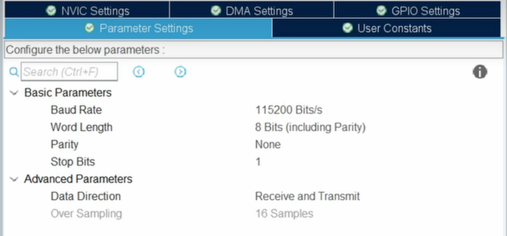
其中最重要的是：**通信双方参数必须一致，否则无法正确解析数据。**

#### 波特率

波特率表示串口的数据传输速度。本节中 `115200 Bits/s` 可以简单理解为每秒传输约 115200 个二进制位。

波特率越高，数据传输越快，但通信双方必须设置相同的波特率。

### 串口数据帧

串口并不是直接连续发送 8 位数据，而是按照规定的数据帧格式发送。本节采用：

**1位起始位 + 8位数据位 + 1位停止位**

| 部分   | 作用           |
| ---- | ------------ |
| 空闲状态 | 保持高电平        |
| 起始位  | 低电平，表示一帧数据开始 |
| 数据位  | 真正传输的数据      |
| 停止位  | 高电平，表示一帧数据结束 |

> 本节没有使用奇偶校验，因此一个字节实际需要发送 10 bit。

### 串口发送

HAL 库使用 `HAL_UART_Transmit()` 进行串口发送，例如：

```c
/* USER CODE BEGIN 2 */
char message[] = "Hello World";
/* USER CODE END 2 */

/* Infinite loop */
/* USER CODE BEGIN WHILE */
while (1)
{
    HAL_UART_Transmit(&huart2, (uint8_t *)message, strlen(message), 100);
    HAL_Delay(1000);
    /* USER CODE END WHILE */

    /* USER CODE BEGIN 3 */
}
/* USER CODE END 3 */
```

即可每隔 1s 向电脑发送一次 `"Hello World"`。
串口调试助手：[网址](https://serial.keysking.com/#/)

#### HAL_UART_Transmit

函数形式：

```c
HAL_UART_Transmit(&huart2, data, size, timeout);
```

| 参数        | 作用           |
| --------- | ------------ |
| `&huart2` | 使用哪个串口       |
| `data`    | 待发送数据的首地址    |
| `size`    | 发送多少个字节      |
| `timeout` | 最大等待时间，单位 ms |

例如 `HAL_UART_Transmit(&huart2, (uint8_t *)message, strlen(message), 100);` 表示：**使用 USART2 → 发送 `message` → 长度为 `strlen(message)` → 最多等待100ms**。

> `HAL_UART_Transmit()` 要求数据指针类型为 `uint8_t *`，所以字符串常写成 `(uint8_t *)message` 进行类型转换。

### 串口接收

HAL 库使用 `HAL_UART_Receive()` 接收串口数据，例如：

```c
uint8_t receiveData[2];

HAL_UART_Receive(&huart2, receiveData, 2, HAL_MAX_DELAY);
```

表示通过 USART2 接收 **2 个字节**，并将数据保存到 `receiveData` 数组中。

#### HAL_UART_Receive

函数形式：

```c
HAL_UART_Receive(&huart2, data, size, timeout);
```

| 参数        | 作用        |
| --------- | --------- |
| `&huart2` | 使用哪个串口    |
| `data`    | 接收数据存放的位置 |
| `size`    | 等待接收多少个字节 |
| `timeout` | 最大等待时间    |

其中 `HAL_MAX_DELAY` 表示：**一直等待，直到接收到指定数量的数据。**

### 串口回显

接收到数据后，可以把相同的数据重新发送回电脑：

```c
/* USER CODE BEGIN 2 */
uint8_t receiveData[2];
/* USER CODE END 2 */

/* Infinite loop */
/* USER CODE BEGIN WHILE */
while (1)
{
    HAL_UART_Receive(&huart2, receiveData, 2, HAL_MAX_DELAY);
    HAL_UART_Transmit(&huart2, receiveData, 2, 100);

    // HAL_UART_Transmit(&huart2, (uint8_t *)message, strlen(message), 100);
    // HAL_Delay(1000);

    /* USER CODE END WHILE */

    /* USER CODE BEGIN 3 */
}
/* USER CODE END 3 */
```

因此：**电脑发送数据 → STM32接收 → STM32原样发送回来 → 电脑重新收到数据**

这种方式叫做：**回显（Echo）**，可以用于判断串口发送和接收是否正常。

### 串口控制LED

本节进一步规定一个简单的两字节指令：

* 第一个字节：控制哪一个 LED
* 第二个字节：控制亮灭状态

| 指令   | 效果   |
| ---- | ---- |
| `R0` | 红灯关闭 |
| `R1` | 红灯打开 |
| `G0` | 绿灯关闭 |
| `G1` | 绿灯打开 |
| `B0` | 蓝灯关闭 |
| `B1` | 蓝灯打开 |

首先定义：

```c
/* USER CODE BEGIN 2 */
uint8_t receiveData[2];
/* USER CODE END 2 */

/* Infinite loop */
```

主循环代码：

```c
/* USER CODE BEGIN WHILE */
while (1)
{
    HAL_UART_Receive(&huart2, receiveData, 2, HAL_MAX_DELAY);
    HAL_UART_Transmit(&huart2, receiveData, 2, 100);

    GPIO_PinState state = GPIO_PIN_SET;

    if (receiveData[1] == '0')
    {
        state = GPIO_PIN_RESET;
    }

    if (receiveData[0] == 'R')
    {
        HAL_GPIO_WritePin(LED_RED_GPIO_Port, LED_RED_Pin, state);
    }
    else if (receiveData[0] == 'G')
    {
        HAL_GPIO_WritePin(LED_GREEN_GPIO_Port, LED_GREEN_Pin, state);
    }
    else if (receiveData[0] == 'B')
    {
        HAL_GPIO_WritePin(LED_BLUE_GPIO_Port, LED_BLUE_Pin, state);
    }

    /* USER CODE END WHILE */

    /* USER CODE BEGIN 3 */
}
/* USER CODE END 3 */
```

代码逻辑：

1. `receiveData[1]` 判断亮灭状态，例如 `'0'` 表示关闭；
2. `receiveData[0]` 判断需要控制哪个 LED，`R/G/B` 分别表示红、绿、蓝。

例如电脑发送 `R0`：`receiveData[0] = 'R'`、`receiveData[1] = '0'` → 红灯关闭。

> `'0'` 是字符 `0`，所以代码中需要写 `'0'`，而不是数字 `0`。

### 什么是轮询模式

本节使用的 `HAL_UART_Transmit()` 和 `HAL_UART_Receive()` 属于**轮询模式（Polling）**。

轮询模式可以简单理解成：**CPU 自己等待并检查串口是否完成发送或接收。**

例如：

```c
HAL_UART_Receive(&huart2, receiveData, 2, HAL_MAX_DELAY);
```

程序运行到这里以后，如果电脑没有发送 2 个字节，CPU 会一直停在这里等待，后面的程序不会继续执行。

因此轮询模式最大的特点就是：**函数执行期间 CPU 会被占用，具有阻塞性。**

#### Timeout

`HAL_UART_Transmit()` 和 `HAL_UART_Receive()` 的最后一个参数都是超时时间。

`HAL_UART_Receive(&huart2, receiveData, 2, 100);` 表示最多等待 100ms；`HAL_UART_Receive(&huart2, receiveData, 2, HAL_MAX_DELAY);` 表示一直等待接收完成。

所以：

**Timeout → 最多等多久；HAL_MAX_DELAY → 一直等到完成**

### 轮询模式总结

轮询模式最大的优点是：**代码简单、容易理解，适合刚开始学习串口。**
但是它存在明显的问题：**CPU 在等待串口收发时不能去做其他事情。**

也就是：**串口等待数据 → CPU阻塞 → 收到指定数据 → 继续执行程序**
所以实际工程中还会使用**串口中断模式、DMA模式**来减少 CPU 的等待。

### 本节核心函数

`HAL_UART_Transmit()`：**STM32 → 外部设备，发送数据**
`HAL_UART_Receive()`：**外部设备 → STM32，接收数据**

整个实验可以概括为：

**配置 USART2 → TX/RX/GND连接 → 设置相同波特率 → STM32发送数据 → STM32接收数据 → 根据串口指令控制LED**

> **最重要的关系：TX负责发送，RX负责接收，双方TX/RX交叉连接并且必须共地。**
>
> **轮询模式 = CPU主动等待串口完成收发，在等待过程中程序会被阻塞。**


## 4.2 串口原理与中断模式收发

上一节使用串口轮询模式实现了 LED 控制，但轮询模式存在两个问题：
1. **程序必须等待发送或接收结束后才能继续执行**
2. **只能接收确定长度的数据。**

本节先使用**中断模式**解决程序长期等待、占用 CPU 的问题；不定长数据将在下一节解决。

### 轮询模式的底层原理

#### 轮询发送
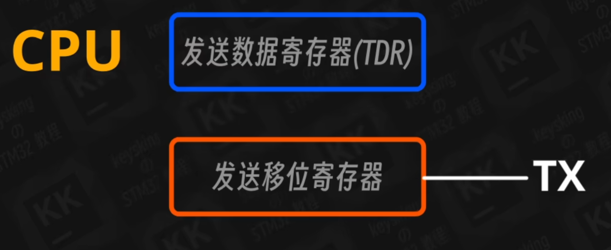
STM32 串口发送主要涉及**发送数据寄存器**和**发送移位寄存器**。
调用 `HAL_UART_Transmit()` 后，CPU 将要发送的数据依次放入发送数据寄存器，数据随后进入发送移位寄存器，并按照设置的波特率转换成高低电平从 TX 引脚逐位发送。

可以简单理解为：**CPU → 发送数据寄存器 → 发送移位寄存器 → TX**

在这个过程中，CPU 会不断查询发送数据寄存器中的数据是否已经移入发送移位寄存器；如果已经移走，就把下一个数据放进去，否则继续查询，直到全部数据发送完成或超过 `timeout`。因此轮询发送期间 CPU 一直被占用。

#### 轮询接收
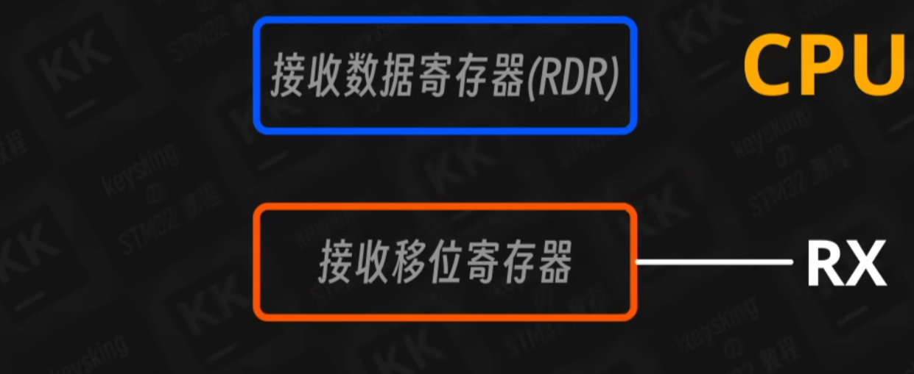
串口接收与发送类似，RX 引脚接收到的高低电平首先进入**接收移位寄存器**，每接收完一帧数据就转移到**接收数据寄存器**，CPU 再不断查询接收数据寄存器是否存在新数据，并将数据复制到我们定义的接收变量中。

可以简单理解为：**RX → 接收移位寄存器 → 接收数据寄存器 → CPU**

>所以无论发送还是接收，轮询模式下 CPU 都需要不断查询寄存器是否可用，这种等待期间程序不能继续向下执行的状态称为**阻塞（Blocking）**。

### 串口中断模式

中断模式下 CPU 不需要一直查询串口状态，而是在需要处理数据时由串口产生中断通知 CPU。这样 CPU 在等待串口的过程中可以继续执行其他任务。

简单理解：

**轮询模式 → CPU一直问串口“好了吗？”**
**中断模式 → CPU先做其他事情，串口需要处理时再通知CPU**

### 中断发送

首先在 CubeMX 的 USART2 → NVIC Settings 中开启 USART2 中断：
**USART2 global interrupt**
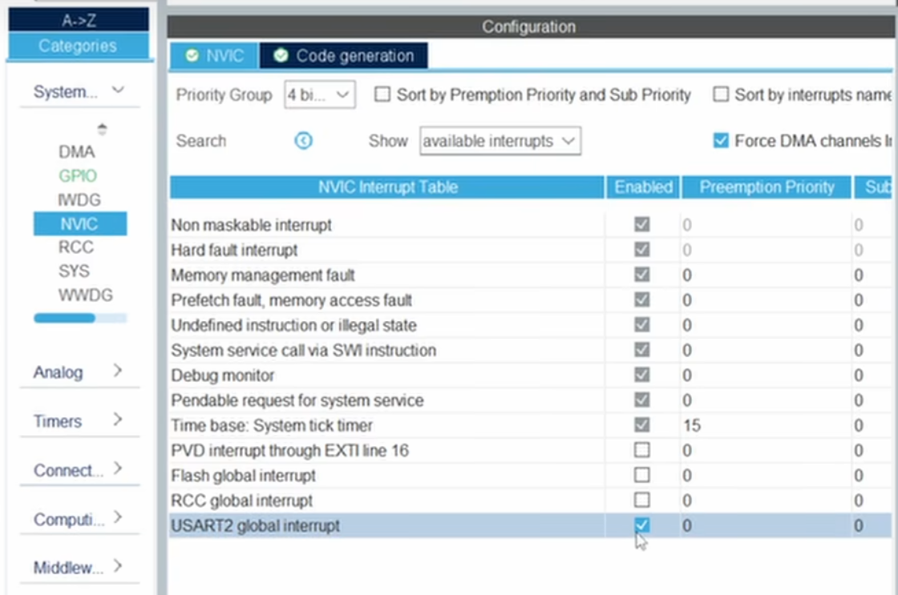

中断发送函数为：

```c
HAL_UART_Transmit_IT(&huart2, (uint8_t *)message, strlen(message));
```

它与上一节的轮询发送函数`HAL_UART_Transmit`基本相同，只是在函数后增加 `_IT`，并且**没有 `timeout` 参数**。
其中 `_IT` 表示 Interrupt，即中断模式。

中断发送时，CPU 将数据放入寄存器后就可以继续处理其他程序；串口需要继续填入下一个数据时产生中断，再让 CPU 回来处理，如此反复直到发送完成。这个过程已经由 HAL 库帮助我们完成，不需要自己编写底层中断逻辑。

### 中断接收

中断接收函数同样是在轮询函数后增加 `_IT`：

```c
HAL_UART_Receive_IT(&huart2, receiveData, 2);
```

与轮询模式的函数`HAL_UART_Receive`相比，中断接收也没有 `timeout` 参数。

#### 特别注意
1. **`HAL_UART_Receive_IT()` 不会阻塞程序。** 调用该函数只是开启一次中断接收，程序会立即继续向下执行，因此不能像轮询模式一样在函数后直接分析 `receiveData`，因为此时数据可能还没有接收完成。

2. **不能将它放在 `while(1)` 中调用**，否则上一次数据可能还没有接收完成，下一次循环就又重新开启了接收。因此第一次中断接收应放在主循环之前：

    ```c
    /* USER CODE BEGIN 2 */
    HAL_UART_Receive_IT(&huart2, receiveData, 2);
    /* USER CODE END 2 */

    while (1)
    {
        // 此处可以执行其他代码
    }
    ```

### 串口中断处理函数

开启 USART2 中断以后，可以在 `Core/Src/stm32f1xx_it.c` 中找到：

```c
void USART2_IRQHandler(void)
{
    HAL_UART_IRQHandler(&huart2);
}
```

`USART2_IRQHandler()` 就是 USART2 对应的中断处理函数，类似前面外部中断中的 `EXTI15_10_IRQHandler()`。

但是 USART 一个中断入口不仅对应接收中断，还包括发送数据寄存器空、接收数据寄存器非空、线路空闲等多个中断源，因此**不能简单地把所有逻辑直接写在 `USART2_IRQHandler()` 中**。

完成具体中断来源的判断，并在满足相应条件以后调用对应的**回调函数（Callback）**。

### 接收完成回调函数

中断接收主要使用：

```c
void HAL_UART_RxCpltCallback(UART_HandleTypeDef *huart)
{
}
```

>其中 `Rx` 表示 Receive，`Cplt` 表示 Complete，因此：
**`HAL_UART_RxCpltCallback()` = 串口接收完成回调函数**

虽然每接收到一帧数据都会产生相应的串口中断，但是只有当接收到 `HAL_UART_Receive_IT()` **指定的数据长度以后，才会调用接收完成回调函数**。因此**处理接收数据和完成逻辑的代码应该放在这个回调函数中**。

#### 弱定义
HAL 库中已经存在该函数的弱定义：

```c
__weak void HAL_UART_RxCpltCallback(UART_HandleTypeDef *huart)
```

`__weak` 表示**弱定义**，因此可以在自己的代码中重新定义同名函数，覆盖 HAL 库中的默认实现。

> 正常工程中可以建立单独文件管理回调函数；视频为了方便演示，直接将其重新定义在 `main.c` 的 `USER CODE BEGIN 0` 中。

### 中断模式接收代码

由于回调函数和 `main()` 都需要使用 `receiveData`，所以将其定义为全局变量，放到 `USER CODE BEGIN PV` 中：

```c
/* USER CODE BEGIN PV */
uint8_t receiveData[2];
/* USER CODE END PV */
```

随后在 `main()` 初始化完成后开启第一次中断接收：

```c
/* USER CODE BEGIN 2 */
HAL_UART_Receive_IT(&huart2, receiveData, 2);
/* USER CODE END 2 */
```

将上一节在 `while` 中的收到数据后的处理逻辑移动到回调函数中：

```c
/* USER CODE BEGIN 0 */
void HAL_UART_RxCpltCallback(UART_HandleTypeDef *huart)
{
    HAL_UART_Transmit_IT(&huart2, receiveData, 2);

    GPIO_PinState state = GPIO_PIN_SET;
    if (receiveData[1] == '0') {
        state = GPIO_PIN_RESET;
    }

    if (receiveData[0] == 'R') {
        HAL_GPIO_WritePin(LED_RED_GPIO_Port, LED_RED_Pin, state);
    } else if (receiveData[0] == 'G') {
        HAL_GPIO_WritePin(LED_GREEN_GPIO_Port, LED_GREEN_Pin, state);
    } else if (receiveData[0] == 'B') {
        HAL_GPIO_WritePin(LED_BLUE_GPIO_Port, LED_BLUE_Pin, state);
    }

    HAL_UART_Receive_IT(&huart2, receiveData, 2);
}
/* USER CODE END 0 */
```

程序流程为：

**开启中断接收 → CPU继续执行其他程序 → 接收到2字节 → 进入USART2中断 → HAL判断中断来源 → 接收完成后调用 `HAL_UART_RxCpltCallback()` → 回显并处理指令 → 再次开启下一次中断接收**

### 为什么最后还要再次开启接收

程序最开始的：

```c
HAL_UART_Receive_IT(&huart2, receiveData, 2);
```

只启动了**一次**串口接收。当接收到规定的 2 个字节并进入回调函数后，这一次接收任务就已经完成。如果还希望继续接收下一条指令，就必须在回调函数处理完成后再次执行：

```c
HAL_UART_Receive_IT(&huart2, receiveData, 2);
```

因此：

**第一次开启接收 → 接收2字节 → 回调处理 → 再次开启接收 → 等待下一组2字节**

> 如果没有在回调函数最后重新开启接收，就会出现**第一次发送指令正常，之后再发送就没有反应**的情况。

### 轮询模式与中断模式

| 对比        | 轮询模式                  | 中断模式                     |
| --------- | --------------------- | ------------------------ |
| 发送函数      | `HAL_UART_Transmit()` | `HAL_UART_Transmit_IT()` |
| 接收函数      | `HAL_UART_Receive()`  | `HAL_UART_Receive_IT()`  |
| `timeout` | 需要                    | 不需要                      |
| CPU等待     | 会                     | 不会一直等待                   |
| 接收数据处理    | 接收函数返回后处理             | 接收完成回调中处理                |
| 特点        | 简单但阻塞CPU              | CPU可以执行其他任务              |


## 4.3 串口DMA模式与收发不定长数据
上一节使用串口中断模式后，CPU 不需要一直阻塞等待串口，但是每发送或接收一个字节仍可能触发一次中断。

本节进一步使用 **DMA（Direct Memory Access，直接内存访问）** 帮助 CPU 搬运数据，并结合串口 **IDLE 空闲中断**实现不定长数据接收。

### DMA是什么

DMA 可以理解成 CPU 的一个“搬运助手”。只需要告诉 DMA 数据从哪里搬到哪里，它就可以直接在**内存与外设寄存器之间搬运数据**，CPU 不需要每个字节都参与，等一次传输完成后再通知 CPU。

串口发送：**内存变量 → DMA → USART发送寄存器 → TX**
串口接收：**RX → USART接收寄存器 → DMA → 内存变量**

因此中断模式与 DMA 模式的主要区别为：

| 模式    | CPU参与情况             |
| ----- | ------------------- |
| 中断模式  | 收发过程中需要频繁进入中断处理数据   |
| DMA模式 | DMA负责搬运数据，完成后再通知CPU |

> DMA 并不是完全不使用中断，只是减少了 CPU 在数据搬运过程中的参与。

### CubeMX配置DMA
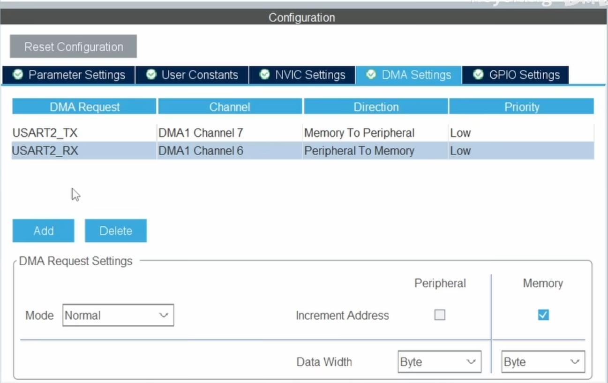
进入 `USART2 → DMA Settings`，点击 `Add`，分别添加：

* `USART2_TX`：用于串口发送
* `USART2_RX`：用于串口接收

发送方向为 **Memory → Peripheral**，接收方向为 **Peripheral → Memory**。

常见配置：

* Peripheral Increment：Disable，外设寄存器地址固定
* Memory Increment：Enable，内存数组地址需要递增
* Data Width：Byte，每次搬运 1 字节
* Mode：Normal
* Priority：保持默认即可

### DMA模式串口收发

上一节中断模式使用：

```c
HAL_UART_Transmit_IT(&huart2, receiveData, 2);
HAL_UART_Receive_IT(&huart2, receiveData, 2);
```

改为 DMA 模式后：

```c
HAL_UART_Transmit_DMA(&huart2, receiveData, 2);
HAL_UART_Receive_DMA(&huart2, receiveData, 2);
```

因此：**`_IT` → 中断模式；`_DMA` → DMA模式**

### 串口空闲中断 IDLE 实现不定长接收

不定长数据可以利用串口的 **IDLE 空闲中断**。

IDLE 检测的是：**串口之前正在接收数据，随后一段时间没有继续收到新数据，串口进入空闲状态。**

### HAL_UARTEx_ReceiveToIdle_DMA

HAL 库已经将 **DMA + IDLE** 封装为：

```c
HAL_UARTEx_ReceiveToIdle_DMA(&huart2, receiveData, sizeof(receiveData));
```

函数形式：

```c
HAL_UARTEx_ReceiveToIdle_DMA(UART_HandleTypeDef *huart, uint8_t *pData, uint16_t Size);
```

其中：

* `&huart2`：使用 USART2
* `receiveData`：接收数据保存的位置，一般是数组
* `Size`：一次允许接收的最大长度，而不是必须接收的长度

例如：

```c
uint8_t receiveData[50];
HAL_UARTEx_ReceiveToIdle_DMA(&huart2, receiveData, sizeof(receiveData));
```

表示最多接收 50 字节。如果只接收到 3 字节后串口进入 IDLE 状态，也会认为本次接收结束。

> `Size` 一般使用 `sizeof(receiveData)`，可以避免接收数据超过数组长度。

### RxEventCallback回调函数

使用 `ReceiveToIdle` 后，其回调函数不使用 `HAL_UART_RxCpltCallback`，而是使用：

```c
void HAL_UARTEx_RxEventCallback(UART_HandleTypeDef *huart, uint16_t Size)
{
}
```

其中 `Size` 表示：**本次实际接收到多少个字节。**

例如：

```c
void HAL_UARTEx_RxEventCallback(UART_HandleTypeDef *huart, uint16_t Size)
{
    if (huart == &huart2)
    {   
        // 回传
        HAL_UART_Transmit_DMA(&huart2, receiveData, Size);

        // 再次发送
        HAL_UARTEx_ReceiveToIdle_DMA(&huart2, receiveData, sizeof(receiveData));
    }
}
```

整个过程为：

**开启DMA+IDLE接收 → DMA将数据搬入数组 → 串口进入IDLE → 进入回调函数 → `Size`得到实际长度 → 处理数据 → 再次开启接收**

>当然，不定长模式也有一般的传输接收函数、一般的带有中断的传输接收函数。
### 与普通DMA接收的区别

| 对比    | `HAL_UART_Receive_DMA()`    | `HAL_UARTEx_ReceiveToIdle_DMA()` |
| ----- | --------------------------- | -------------------------------- |
| 接收方式  | 定长                          | 不定长                              |
| 第三个参数 | 必须接收的长度                     | 最大允许接收长度                         |
| 完成条件  | 收满指定长度                      | IDLE或达到最大长度                      |
| 回调函数  | `HAL_UART_RxCpltCallback()` | `HAL_UARTEx_RxEventCallback()`   |
| 实际长度  | 事先确定                        | 通过 `Size` 获取                     |

### DMA传输过半中断

DMA 在接收到设定长度的一半时，可能触发 **Half Transfer，传输过半中断**，而进入回调函数处理。

本节为了避免数据还没有接收完整就执行处理，可以**在传输函数后**关闭 DMA 半传输中断：

```c
__HAL_DMA_DISABLE_IT(&hdma_usart2_rx, DMA_IT_HT);
```

其中：

* `&hdma_usart2_rx`：USART2 RX 对应的 DMA
* `DMA_IT_HT`：Half Transfer，半传输中断

初始化时：

```c
HAL_UARTEx_ReceiveToIdle_DMA(&huart2, receiveData, sizeof(receiveData));
__HAL_DMA_DISABLE_IT(&hdma_usart2_rx, DMA_IT_HT);
```

回调函数中重新启动接收后，也需要再次关闭：

```c
void HAL_UARTEx_RxEventCallback(UART_HandleTypeDef *huart, uint16_t Size)
{
    // 判断是哪个触发中断
    if (huart == &huart2)
    {
        // 此次发送的数据长度已知，无需使用不定长发送
        HAL_UART_Transmit_DMA(&huart2, receiveData, Size);
        // 再次空闲中断接收
        HAL_UARTEx_ReceiveToIdle_DMA(&huart2, receiveData, sizeof(receiveData));
        // 关闭过半中断
        __HAL_DMA_DISABLE_IT(&hdma_usart2_rx, DMA_IT_HT);
    }
}
```

> 本节关闭 `DMA_IT_HT`，主要是为了避免 DMA 接收到一半数据时就提前执行处理。

### 三种串口模式对比

| 模式       | 典型函数                             | 特点             |
| -------- | -------------------------------- | -------------- |
| 轮询       | `HAL_UART_Receive()`             | CPU一直等待        |
| 中断       | `HAL_UART_Receive_IT()`          | 串口通过中断通知CPU    |
| DMA      | `HAL_UART_Receive_DMA()`         | DMA负责搬运数据      |
| DMA+IDLE | `HAL_UARTEx_ReceiveToIdle_DMA()` | DMA搬运，并支持不定长数据 |

本节主要完成两个升级：

1. **中断模式 → DMA模式：让 DMA 帮 CPU 搬运串口数据。**
2. **定长接收 → IDLE不定长接收：通过 `HAL_UARTEx_RxEventCallback()` 中的 `Size` 获取实际长度。**

> **DMA = 帮 CPU 搬数据；IDLE = 判断这一帧数据什么时候结束。**

> **最终关系：USART接收数据 → DMA搬到内存 → IDLE判断一帧结束 → `HAL_UARTEx_RxEventCallback()` 获取实际长度 → 处理数据 → 再次开启接收。**

# 4.4 蓝牙模块与简易数据包解析
### 蓝牙基本概念

蓝牙是一种常用的无线通信协议。耳机等需要持续传输大量数据的设备通常使用**经典蓝牙**，运动手环等以低功耗、间歇通信为主的设备通常使用 **BLE（Bluetooth Low Energy，低功耗蓝牙）**。蓝牙设备存在主从关系：连接建立前，从机向外广播自己的信息，主机扫描到从机后发起连接，连接建立后双方按照约定的协议进行通信。

BLE 本身涉及广播、扫描、连接、服务和特征值等内容，本节不深入学习完整 BLE 协议，而是直接使用 **BT24 蓝牙串口透传模块**，将复杂的蓝牙通信转换成前面已经学习过的 UART 串口通信。


### BT24串口透传

所谓**串口透传**就是蓝牙模块将一端接收到的数据基本原样从另一端发送出去。
例如手机通过蓝牙发送数据后，BT24 将其转换为 UART 数据发送给 STM32；STM32 通过 UART 返回的数据也会被 BT24 转换成蓝牙数据发送给手机。

因此：

**手机发送蓝牙数据 → BT24 → UART RX → STM32**
**STM32 UART TX → BT24 → 蓝牙 → 手机**

### CubeMX配置

本节使用 `USART3` 与 BT24 通信，选择：**Connectivity → USART3 → Asynchronous**，波特率设置为 `9600`，与 BT24 默认波特率保持一致。
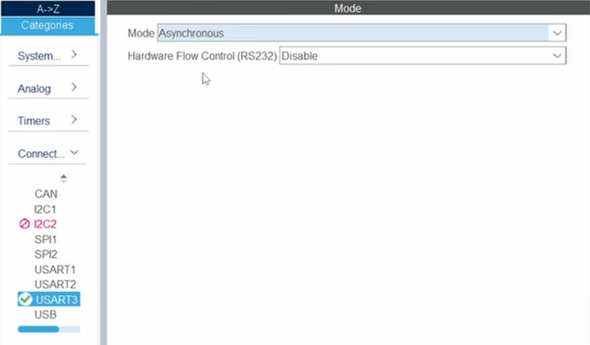
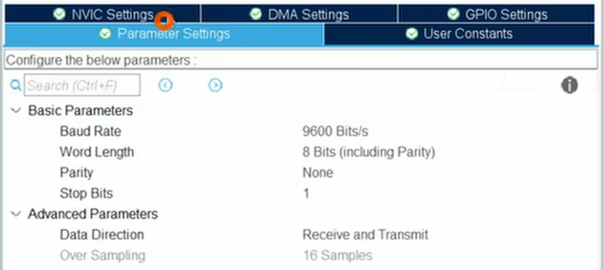


同时配置：
* 开启 USART3 中断；
* 添加 `USART3_TX` DMA；
* 添加 `USART3_RX` DMA。


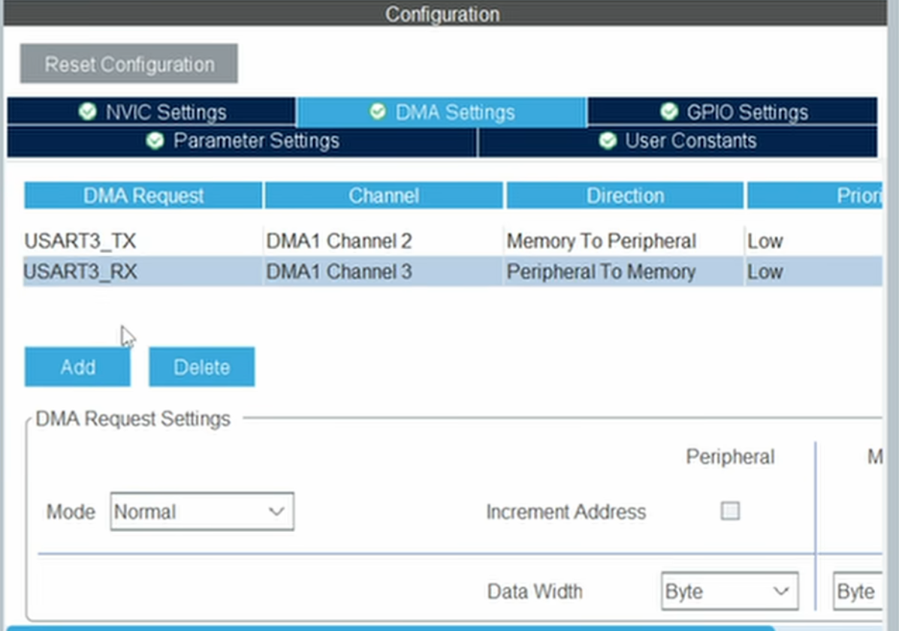


### 开启不定长数据接收

首先定义接收缓冲区：

```c
/* USER CODE BEGIN PV */
uint8_t receiveData[50];
/* USER CODE END PV */
```

初始化完成后开启 USART3 的 DMA + IDLE 接收，同时关闭 DMA 半传输中断：

```c
/* USER CODE BEGIN 2 */
HAL_UARTEx_ReceiveToIdle_DMA(&huart3, receiveData, sizeof(receiveData));
__HAL_DMA_DISABLE_IT(&hdma_usart3_rx, DMA_IT_HT);
/* USER CODE END 2 */
```

> 如果使用 Keil 时无法找到 `hdma_usart3_rx`，可以在 `usart.h` 的用户区域显式声明：
> ```c
> /* USER CODE BEGIN Private defines */
> extern DMA_HandleTypeDef hdma_usart3_rx;
> /* USER CODE END Private defines */
> ```

### 蓝牙数据回显

继续使用上一节的 `HAL_UARTEx_RxEventCallback()`：

```c
void HAL_UARTEx_RxEventCallback(UART_HandleTypeDef *huart, uint16_t Size)
{
    if (huart == &huart3)
    {
        HAL_UART_Transmit_DMA(&huart3, receiveData, Size);
        HAL_UARTEx_ReceiveToIdle_DMA(&huart3, receiveData, sizeof(receiveData));
        __HAL_DMA_DISABLE_IT(&hdma_usart3_rx, DMA_IT_HT);
    }
}
```

当手机通过蓝牙发送任意长度数据时：**BT24接收蓝牙数据 → USART3接收 → DMA保存到 `receiveData` → IDLE触发回调 → 根据 `Size` 得到实际长度 → DMA原样返回 → 再次开启下一次接收**。

> 这里 BT24 只是把原来的“USB-TTL 串口线”变成了“无线蓝牙串口”，STM32 侧仍然按照 UART 数据进行处理。

### AT模式

蓝牙模块通常可以通过 **AT 指令**修改名称、波特率等参数。

如果使用网页串口助手调试 AT 模式，需要注意部分 AT 指令要求结尾携带 `\r\n`。在波特律动串口助手中应该通过设置启用换行，而不是直接在 ASCII 输入框中输入字符 `\r\n`，否则可能将它们作为普通字符发送。

### 为什么需要数据包

直接发送 `R1`、`G0` 这种简单指令虽然容易实现，但是数据复杂以后会出现一些问题，例如很难确定一帧数据从哪里开始、数据有多长以及传输过程中是否出现错误。

因此本节进一步规定一个简单的数据包格式：

**包头 + 数据包长度 + 数据内容 + 校验和**

具体结构：

| 位置    | 内容       | 作用            |
| ----- | -------- | ------------- |
| 第1字节  | `0xAA`   | 包头，表示一帧数据开始   |
| 第2字节  | 数据包总长度   | 表示本帧一共有多少字节   |
| 中间数据  | 控制指令     | LED编号 + LED状态 |
| 最后1字节 | Checksum | 校验和           |

其中 LED 编号规定为：

| 数据     | 设备    |
| ------ | ----- |
| `0x01` | 红色LED |
| `0x02` | 绿色LED |
| `0x03` | 蓝色LED |

LED 状态规定为：

| 数据     | 状态 |
| ------ | -- |
| `0xFF` | 点亮 |
| `0x00` | 熄灭 |

### 数据包解析

接收到一帧数据后，首先判断包头：

```c
if (receiveData[0] == 0xAA)
{
}
```

只有第一个字节是 `0xAA`，才认为可能是一帧有效数据。

随后判断长度：

```c
if (receiveData[1] == Size)
{
}
```

`receiveData[1]` 是数据包中声明的总长度，`Size` 是 `HAL_UARTEx_RxEventCallback()` 得到的实际接收长度。两者相同才继续处理。

因此：**检查包头 → 检查长度 → 检查校验和 → 解析数据**

### 校验和

为了简单判断数据在传输过程中是否出现错误，本节使用**累加和校验**：将除最后一个校验字节以外的数据全部相加，并与最后一个字节比较。

```c
uint8_t sum = 0;
for (int i = 0; i < Size - 1; i++)
{
    sum += receiveData[i];
}

if (sum == receiveData[Size - 1])
{
    // 数据包校验正确
}
```

其中 `uint8_t` 只有 8 位，因此累加超过 `0xFF` 后会自然保留低 8 位。

### LED控制数据解析

包头、长度和校验都正确以后，从 `receiveData[2]` 开始就是实际控制数据。每个控制指令占 2 字节，所以循环步长为 2：

```c
for (int i = 2; i < Size - 1; i += 2)
{
    GPIO_PinState state = GPIO_PIN_SET;

    if (receiveData[i + 1] == 0x00)
    {
        state = GPIO_PIN_RESET;
    }

    if (receiveData[i] == 0x01)
    {
        HAL_GPIO_WritePin(LED_RED_GPIO_Port, LED_RED_Pin, state);
    }
    else if (receiveData[i] == 0x02)
    {
        HAL_GPIO_WritePin(LED_GREEN_GPIO_Port, LED_GREEN_Pin, state);
    }
    else if (receiveData[i] == 0x03)
    {
        HAL_GPIO_WritePin(LED_BLUE_GPIO_Port, LED_BLUE_Pin, state);
    }
}
```

因此 `i` 指向**LED编号**，`i+1` 指向对应的**LED状态**，`i += 2` 后继续处理下一组 LED 控制数据。

### 完整接收与数据包解析

```c
void HAL_UARTEx_RxEventCallback(UART_HandleTypeDef *huart, uint16_t Size)
{
    if (huart == &huart3)
    {
        HAL_UART_Transmit_DMA(&huart3, receiveData, Size);

        if (receiveData[0] == 0xAA)
        {
            if (receiveData[1] == Size)
            {
                uint8_t sum = 0;
                for (int i = 0; i < Size - 1; i++)
                {
                    sum += receiveData[i];
                }

                if (sum == receiveData[Size - 1])
                {
                    for (int i = 2; i < Size - 1; i += 2)
                    {
                        GPIO_PinState state = GPIO_PIN_SET;

                        if (receiveData[i + 1] == 0x00)
                        {
                            state = GPIO_PIN_RESET;
                        }

                        if (receiveData[i] == 0x01)
                        {
                            HAL_GPIO_WritePin(LED_RED_GPIO_Port, LED_RED_Pin, state);
                        }
                        else if (receiveData[i] == 0x02)
                        {
                            HAL_GPIO_WritePin(LED_GREEN_GPIO_Port, LED_GREEN_Pin, state);
                        }
                        else if (receiveData[i] == 0x03)
                        {
                            HAL_GPIO_WritePin(LED_BLUE_GPIO_Port, LED_BLUE_Pin, state);
                        }
                    }
                }
            }
        }

        HAL_UARTEx_ReceiveToIdle_DMA(&huart3, receiveData, sizeof(receiveData));
        __HAL_DMA_DISABLE_IT(&hdma_usart3_rx, DMA_IT_HT);
    }
}
```

该代码与视频中的处理顺序一致：先回显接收数据，再依次判断 `0xAA` 包头、长度和校验和，随后按照两字节一组解析 LED 控制数据，最后重新开启 DMA + IDLE 接收。

### 数据包解析流程

整个过程可以概括为：

**接收一帧数据 → 判断 `0xAA` 包头 → 判断声明长度是否等于 `Size` → 计算并判断校验和 → 每2字节解析一个控制指令 → 控制对应LED → 再次开启DMA接收**

其中数据包的三层检查分别解决：

1. **包头：这是不是一帧数据的开始。**
2. **长度：这帧数据是否接收完整。**
3. **校验和：数据内容是否符合简单校验。**

> **本节最核心的关系：手机 ← 蓝牙 → BT24 ← UART → STM32。BT24负责蓝牙与串口之间的透传，STM32仍然按照UART数据进行处理。**
>
> **简单数据包 = 包头 + 长度 + 数据内容 + 校验和；解析时按照“包头 → 长度 → 校验 → 数据”的顺序进行。**

# 5 IIC通信
## 5.1 IIC通信与温湿度传感器AHT20(DHT20)

本节学习另一种常见的通信方式 **IIC（I²C）**，并使用 STM32 与开发板上的 AHT20 温湿度传感器进行通信，读取环境温度和湿度，最后通过前面学习的串口发送到电脑。

### IIC通信原理
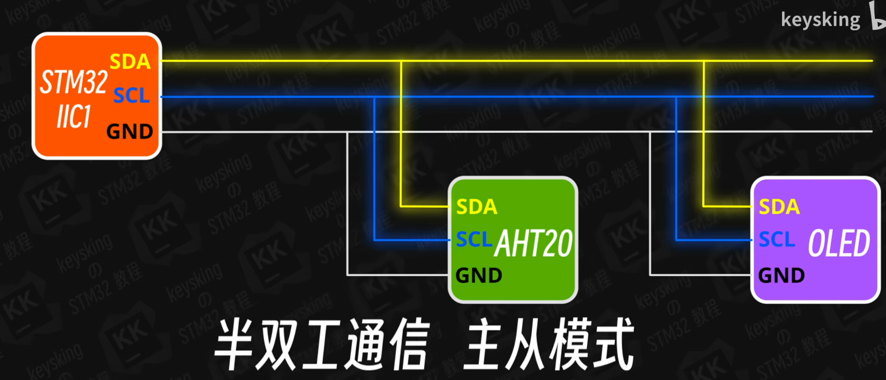
IIC 除了需要共地以外，主要使用两根线：
1. `SDA（Serial Data）` 为数据线，可以双向传输数据；
2. `SCL（Serial Clock）` 为时钟线，由主机提供同步时钟。

**全双工与半双工**
串口的 TX、RX 可以同时收发，因此属于全双工；
IIC 只有一根 SDA 数据线，同一时刻只能进行一个方向的数据传输，因此属于**半双工通信**。

同时 IIC 属于**同步通信**，通信双方通过 SCL 提供的时钟完成数据同步。

IIC 使用**主从模式**：一台设备作为主机，其他设备作为从机，只能由主机主动发起通信，从机根据主机的请求进行响应。

同一条 IIC 总线上可以连接多个从机，每个从机通过自己的**设备地址**进行区分，因此 IIC 也属于一种**总线协议**。主机发送数据时首先指定从机地址，只有地址匹配的从机才会响应。

### IIC为什么需要上拉电阻

IIC 的 SDA、SCL 使用的是前面学习过的**开漏结构**，开漏输出只能主动拉低，不能主动输出高电平，因此需要利用上拉电阻得到高电平。

这种结构还允许多个设备连接到同一根总线上：只要其中任意一个设备将总线拉低，总线就是低电平，同时不会出现一个设备强行输出高电平、另一个设备强行输出低电平造成直接冲突。

### IIC基本时序

IIC 总线空闲时 SDA、SCL 都保持高电平。通信过程中主要包含**开始信号、数据传输、应答信号和结束信号**。

正常传输数据时，一般在 SCL 为低电平时改变 SDA，在 SCL 为高电平时读取 SDA，因此 **SCL 为高电平期间 SDA 应保持稳定**。
只有开始和停止信号属于例外：
1. SCL 为高时，SDA `1 → 0` 表示 **START 开始信号**；
2. SDA `0 → 1` 表示 **STOP 停止信号**。
3. 每传输完 8 位数据后，接收方还需要通过 SDA 返回一个 **ACK 应答信号**，表示数据已经收到。

### IIC设备地址

AHT20 数据手册给出的 7 位设备地址为 `0x38`。由于 IIC 每次实际发送 8 bit，因此 7 位地址会左移一位，最低位用于表示本次通信方向：

| 最低位 R/W | 通信方向      |
| ------- | --------- |
| `0`     | 主机向从机写数据  |
| `1`     | 主机从从机读取数据 |

所以：`0x38 << 1 = 0x70`，写地址为 `0x70`，读操作时最低位变为 1，即 `0x71`。但是使用 HAL 库时不需要自己修改最低位，HAL 会根据使用的是发送还是接收函数自动处理，因此代码中只需要统一定义
```c
#define AHT20_ADDRESS 0x70    // AHT20的7位地址0x38左移1位后的HAL设备地址
```

> **HAL 的 IIC 函数要求传入左移一位后的设备地址，因此这里使用 `0x70`，而不是直接使用 `0x38`。**

### CubeMX配置
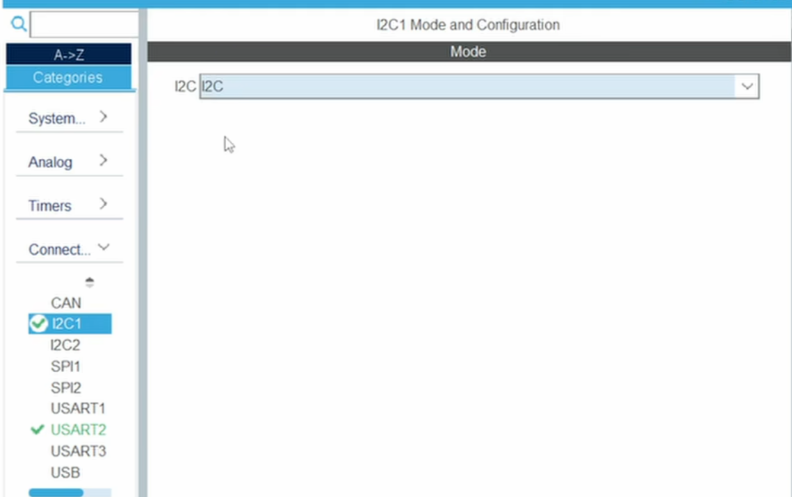
首先开启前面使用过的 `USART2`，用于最后将温湿度数据发送到电脑；

随后开启：**Connectivity → I2C1 → I2C**，其余参数本节基本保持默认即可。

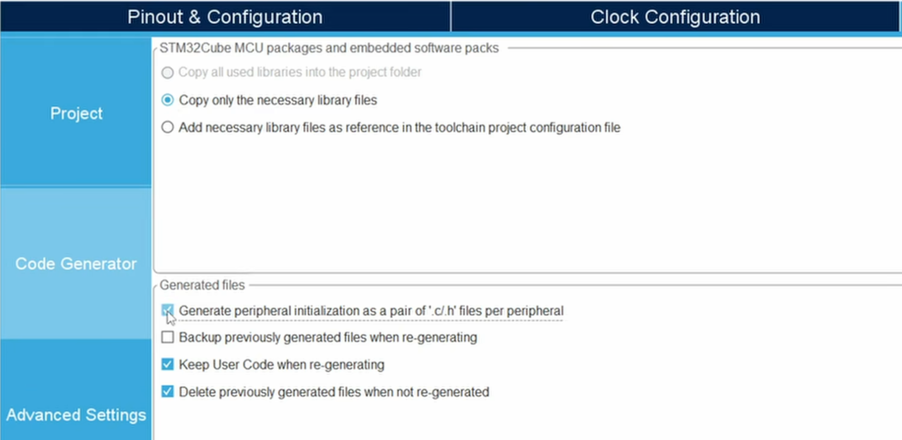
由于本节准备把 AHT20 驱动单独写成 `.c/.h` 文件，可以在 **Project Manager → Code Generator** 中勾选 **Generate peripheral initialization as a pair of '.c/.h' files per peripheral**，这样 CubeMX 会分别生成 `gpio.c/.h`、`i2c.c/.h`、`usart.c/.h` 等文件。

### 建立AHT20驱动文件

在 `Core/Inc` 新建 `aht20.h`，在 `Core/Src` 新建 `aht20.c`。`aht20.h` 包含 `i2c.h`，这样 `aht20.c` 就可以使用 CubeMX 生成的 `hi2c1` 句柄以及 HAL IIC 函数。

头文件包含关系可以简单理解为：

**`aht20.c → aht20.h → i2c.h → main.h → HAL库相关头文件`**

`aht20.h`：

```c
#ifndef INC_AHT20_H_
#define INC_AHT20_H_

#include "i2c.h"    // 获取hi2c1以及HAL I2C相关定义

void AHT20_Init(void);                                  // AHT20初始化
void AHT20_Read(float *Temperature, float *Humidity);   // 读取温度和湿度

#endif /* INC_AHT20_H_ */
```

### IIC发送与接收函数

本节主要使用两个轮询模式 HAL 函数：

```c
HAL_I2C_Master_Transmit(&hi2c1, DevAddress, pData, Size, Timeout); // STM32主机向从机发送数据
HAL_I2C_Master_Receive(&hi2c1, DevAddress, pData, Size, Timeout);  // STM32主机从从机接收数据
```

参数含义：

| 参数           | 作用         |
| ------------ | ---------- |
| `&hi2c1`     | 使用 I2C1    |
| `DevAddress` | 从机设备地址     |
| `pData`      | 发送/接收数据缓冲区 |
| `Size`       | 发送/接收多少字节  |
| `Timeout`    | 最大等待时间     |

例如：

```c
HAL_I2C_Master_Transmit(&hi2c1, AHT20_ADDRESS, sendBuffer, 3, HAL_MAX_DELAY); // 向AHT20发送3字节
HAL_I2C_Master_Receive(&hi2c1, AHT20_ADDRESS, readBuffer, 6, HAL_MAX_DELAY);  // 从AHT20读取6字节
```

`HAL_MAX_DELAY` 表示一直等待操作完成。HAL 会根据调用的是 `Transmit` 还是 `Receive` 自动处理设备地址最低位的读写方向。([SourceVu][4])

### AHT20初始化

根据 AHT20 手册，上电后首先等待 `40ms`，然后读取 1 字节状态信息。如果状态字的 **Bit\[3]** 为 1，说明设备已经正常校准；如果 Bit[3] 为 0，则发送 `0xBE 0x08 0x00` 进行初始化。

`aht20.c`：

```c
#include "aht20.h"

#define AHT20_ADDRESS 0x70    // AHT20的HAL设备地址：0x38 << 1

void AHT20_Init(void)
{
    uint8_t readBuffer;       // 保存AHT20返回的1字节状态信息

    HAL_Delay(40);            // AHT20上电后按照手册要求等待至少40ms

    // 读取AHT20的1字节状态字
    HAL_I2C_Master_Receive(&hi2c1,
                           AHT20_ADDRESS,
                           &readBuffer,
                           1,
                           HAL_MAX_DELAY);

    // 0x08 = 0000 1000，用于检查状态字Bit[3]
    // Bit[3]为0表示传感器还没有正常校准，需要重新初始化
    if ((readBuffer & 0x08) == 0x00)
    {
        uint8_t sendBuffer[3] = {0xBE, 0x08, 0x00};  // AHT20初始化命令及参数

        // 向AHT20发送3字节初始化命令
        HAL_I2C_Master_Transmit(&hi2c1,
                                AHT20_ADDRESS,
                                sendBuffer,
                                3,
                                HAL_MAX_DELAY);
    }
}
```

其中：

```c
readBuffer & 0x08    // 只保留状态字Bit[3]
```

`0x08` 的二进制为 `00001000`，与状态字进行按位与后就可以单独判断 Bit\[3]。

因此初始化过程为：**上电 → 等待40ms → 读取状态字 → 检查Bit\[3] → 未校准则发送 `0xBE 0x08 0x00`**。

### AHT20读取温湿度

要触发一次测量，需要向 AHT20 发送 `0xAC 0x33 0x00`，然后等待约 `75ms`，再读取 6 字节数据。第 0 字节为状态字，后面的字节中保存湿度和温度数据。

```c
void AHT20_Read(float *Temperature, float *Humidity)
{
    uint8_t sendBuffer[3] = {0xAC, 0x33, 0x00}; // 触发测量命令：0xAC + 两个参数
    uint8_t readBuffer[6];                       // 保存AHT20返回的6字节测量数据

    // 向AHT20发送触发测量命令
    HAL_I2C_Master_Transmit(&hi2c1,
                            AHT20_ADDRESS,
                            sendBuffer,
                            3,
                            HAL_MAX_DELAY);

    HAL_Delay(75);   // 等待AHT20完成一次温湿度测量

    // 从AHT20读取6字节：状态字 + 湿度数据 + 温度数据
    HAL_I2C_Master_Receive(&hi2c1,
                           AHT20_ADDRESS,
                           readBuffer,
                           6,
                           HAL_MAX_DELAY);

    // 状态字Bit[7]为0表示测量已经完成，可以解析数据
    if ((readBuffer[0] & 0x80) == 0x00)
    {
        uint32_t data = 0;   // 用于拼接20bit原始数据，uint8_t空间不够

        // 湿度占20bit：
        // readBuffer[1]为高8位
        // readBuffer[2]为中间8位
        // readBuffer[3]高4位为低4位
        data = ((uint32_t)readBuffer[1] << 12)
             + ((uint32_t)readBuffer[2] << 4)
             + ((uint32_t)readBuffer[3] >> 4);

        // 将20bit湿度原始值转换为0~100%的相对湿度
        *Humidity = data * 100.0f / (1 << 20);

        // 温度也占20bit：
        // readBuffer[3]低4位为最高4位
        // readBuffer[4]和readBuffer[5]为剩余16位
        data = (((uint32_t)readBuffer[3] & 0x0F) << 16)
             + ((uint32_t)readBuffer[4] << 8)
             + (uint32_t)readBuffer[5];

        // 将20bit温度原始值转换为摄氏度
        *Temperature = data * 200.0f / (1 << 20) - 50;
    }
}
```

#### 温湿度数据拼接

AHT20 的湿度和温度原始数据都占 **20 bit**，也就是两个半字节，因此需要通过移位将多个 `uint8_t` 数据重新拼成一个 `uint32_t`。

湿度数据结构可以理解为：

**`readBuffer[1] 8bit + readBuffer[2] 8bit + readBuffer[3]高4bit = 20bit`**

代码：

```c
// 先转换为uint32_t再移位，避免uint8_t移位后数据溢出
data = ((uint32_t)readBuffer[1] << 12)
     + ((uint32_t)readBuffer[2] << 4)
     + ((uint32_t)readBuffer[3] >> 4);
```

湿度计算公式：

$$Humidity=\frac{S_{RH}}{2^{20}}\times100\%$$

对应：

```c
// 100.0f使计算按照浮点数进行，避免整数除法丢失小数
// 二进制下左移 20 位相当于除以 2^10
*Humidity = data * 100.0f / (1 << 20);
```

温度数据结构为：

**`readBuffer[3]低4bit + readBuffer[4] 8bit + readBuffer[5] 8bit = 20bit`**

```c
// 0x0F = 00001111，只保留readBuffer[3]的低4位温度数据
data = (((uint32_t)readBuffer[3] & 0x0F) << 16)
     + ((uint32_t)readBuffer[4] << 8)
     + (uint32_t)readBuffer[5];
```

温度计算公式：
$$Temperature=\frac{S_T}{2^{20}}\times200-50$$
对应：

```c
// 将AHT20的20bit原始温度转换为摄氏度
*Temperature = data * 200.0f / (1 << 20) - 50;
```

> `1 << 20` 就是 $2^{20}$；`100.0f`、`200.0f` 中的 `.0f` 可以让整个表达式进行浮点数计算。


### main.c

首先包含需要使用的头文件：

```c
/* USER CODE BEGIN Includes */
#include "aht20.h"     // AHT20驱动
#include <stdio.h>     // sprintf()
#include <string.h>    // strlen()
/* USER CODE END Includes */
```

初始化完成后调用 AHT20 初始化函数，并定义温湿度以及串口发送缓冲区：

```c
/* USER CODE BEGIN 2 */
AHT20_Init();              // 初始化AHT20

float temperature;        // 保存温度
float humidity;           // 保存湿度
char message[50];         // 保存准备通过串口发送的字符串
/* USER CODE END 2 */
```

主循环：

```c
/* USER CODE BEGIN WHILE */
while (1)
{
    // 触发AHT20测量并读取当前温度、湿度
    AHT20_Read(&temperature, &humidity);

    // 将浮点型温湿度转换为字符串
    // %.1f表示保留1位小数，%%表示真正输出一个百分号
    sprintf(message,
            "tem:%.1f, hum:%.1f%%\r\n",
            temperature,
            humidity);

    // 通过USART2将温湿度字符串发送到电脑
    HAL_UART_Transmit(&huart2,
                      (uint8_t *)message,
                      strlen(message),
                      HAL_MAX_DELAY);

    HAL_Delay(1000);   // 每隔1s读取并发送一次温湿度
}
/* USER CODE END WHILE */
```

整个程序过程为：

**初始化I2C和USART → 初始化AHT20 → 发送测量命令 → 等待75ms → IIC读取6字节 → 拼接20bit温湿度数据 → 换算实际值 → `sprintf()`组成字符串 → USART发送到电脑**

### sprintf输出浮点数

如果 STM32CubeIDE 中使用：

```c
sprintf(message, "tem:%.1f, hum:%.1f%%\r\n", temperature, humidity); // 格式化浮点数
```

出现 `%f` 无法正常使用的情况，需要进入：

**Project → Properties → C/C++ Build → Settings → Tool Settings → MCU Settings**

开启浮点数格式化支持，例如 **Use float with printf from newlib-nano (`-u _printf_float`)**。视频中同时展示了 printf/scanf 浮点支持选项。([技术栈][2])

其中：`%.1f` → 输出浮点数并保留1位小数；`%%` → 输出字符 `%`；`\r\n` → 换行。

> **本节核心：IIC使用 SDA 传输数据、SCL 提供同步时钟，采用主从模式并支持多个从机；STM32通过 `HAL_I2C_Master_Transmit()` 向 AHT20 发送命令，通过 `HAL_I2C_Master_Receive()` 读取数据，再根据 AHT20 数据手册进行位拼接和数值转换。**


## 5.2 IIC中断与DMA&状态机编程

上一节使用 `HAL_I2C_Master_Transmit()` 和 `HAL_I2C_Master_Receive()` 以轮询方式读取 AHT20，本节将其改为**中断模式和 DMA 模式**。
这两种模式不会等待整个收发过程完成才返回，因此 CPU 可以继续执行其他程序，但也带来一个新问题：**程序不能再按照“发送 → 接收 → 立即解析”的顺序直接连续执行**，否则可能在数据还没有收完时就开始解析。本节最重要的内容就是利用**状态机**解决这个问题。

### IIC的中断模式

轮询模式使用：

```c
HAL_I2C_Master_Transmit(&hi2c1, AHT20_ADDRESS, sendBuffer, 3, HAL_MAX_DELAY); // 轮询发送，等待发送完成
HAL_I2C_Master_Receive(&hi2c1, AHT20_ADDRESS, readBuffer, 6, HAL_MAX_DELAY);  // 轮询接收，等待接收完成
```

中断模式则使用：

```c
HAL_I2C_Master_Transmit_IT(&hi2c1, AHT20_ADDRESS, sendBuffer, 3); // 开启中断发送后立即返回
HAL_I2C_Master_Receive_IT(&hi2c1, AHT20_ADDRESS, readBuffer, 6);  // 开启中断接收后立即返回
```

其中 `_IT` 表示 Interrupt。轮询模式下函数返回时数据已经收发完成，而中断模式只是**启动收发任务**，真正的数据传输由 IIC 外设配合中断继续完成。

#### CubeMX配置
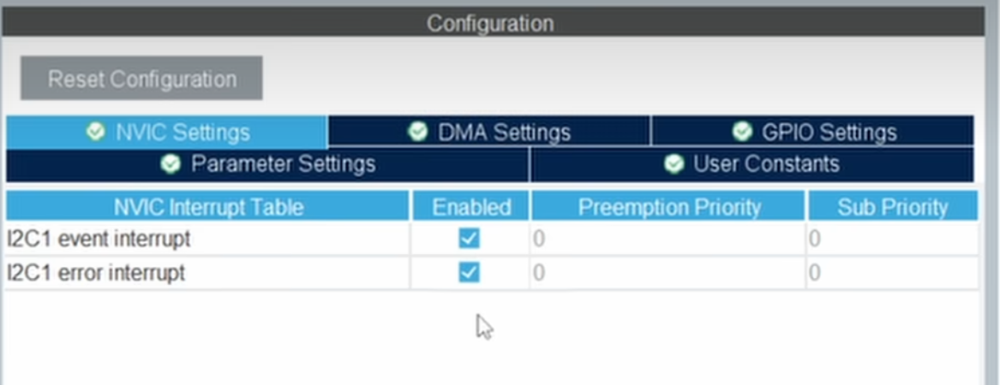
使用中断模式时，在 I2C1 的 `NVIC Settings` 中开启对应的 IIC 中断。

使用 DMA 时，还需要在 `DMA Settings` 中添加 I2C1 的 TX、RX DMA 通道。CubeMX 生成代码后，HAL 会帮助我们完成底层的 IIC 中断和 DMA 处理。

### 为什么不能直接把轮询函数改成中断函数

如果直接把上一节代码修改成：

```c
uint8_t sendBuffer[3] = {0xAC, 0x33, 0x00}; // AHT20触发测量命令
uint8_t readBuffer[6];                       // 保存温湿度原始数据

HAL_I2C_Master_Transmit_IT(&hi2c1, AHT20_ADDRESS, sendBuffer, 3); // 只启动发送
HAL_Delay(75);                                                   // 等待AHT20测量
HAL_I2C_Master_Receive_IT(&hi2c1, AHT20_ADDRESS, readBuffer, 6); // 只启动接收

// 此时程序已经继续运行，但readBuffer可能还没有接收完成
// 如果马上解析，就可能读到旧数据或无效数据
```

问题就在于 `HAL_I2C_Master_Receive_IT()` **不会等待 6 个字节全部接收完成**，调用以后程序马上继续执行，因此后面的解析代码可能比 IIC 接收更早执行。

所以需要保证：

**发送完成 → 再开始下一阶段 → 接收完成 → 再解析数据**

这就需要使用**状态机**。

### 状态机

状态机可以理解为：**用一个变量记录程序当前执行到了哪个阶段，不同状态只执行对应的操作，完成以后再切换到下一个状态。**

本节将 AHT20 一次测量拆成以下状态：

| `aht20State` | 状态            |
| ------------ | ------------- |
| `0`          | 初始状态，准备发送测量命令 |
| `1`          | 正在发送测量命令      |
| `2`          | 测量命令发送完成      |
| `3`          | 正在接收AHT20数据   |
| `4`          | 数据接收完成，可以解析   |

因此整个流程为：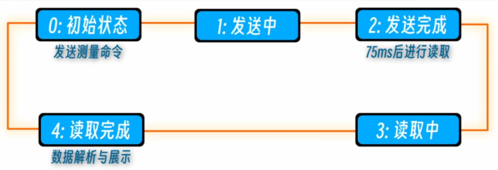

### 改造AHT20驱动

上一节将发送、等待、接收、解析全部写在一个 `AHT20_Read()` 中。本节需要把这些步骤拆开，因为发送和接收完成的时间已经不能由代码顺序直接确定。

#### 全局数据

在 `aht20.c` 中定义 AHT20 地址、命令和接收缓冲区：

```c
#include "aht20.h"

#define AHT20_ADDRESS 0x70                                // AHT20地址：0x38左移1位

static uint8_t AHT20InitCmd[3] = {0xBE, 0x08, 0x00};     // AHT20初始化命令
static uint8_t AHT20MeasureCmd[3] = {0xAC, 0x33, 0x00};  // AHT20触发测量命令
static uint8_t AHT20ReadBuffer[6];                        // 保存AHT20返回的6字节数据
```

这里命令数组使用 `static`，因为中断方式启动传输后函数会立即返回，而数据的实际发送仍在继续，因此用于发送的数据需要在传输完成之前一直有效，不能使用已经退出函数的普通局部数组。

#### 初始化

AHT20 初始化过程与上一节相同。

#### 发送测量命令

```c
void AHT20_Transmit(void)
{
    // 使用中断方式发送0xAC 0x33 0x00测量命令
    HAL_I2C_Master_Transmit_IT(&hi2c1, AHT20_ADDRESS, AHT20MeasureCmd, 3);
}
```

调用后只是**启动发送**，什么时候真正发送完成需要通过回调函数判断。

#### 接收测量数据

```c
void AHT20_Receive(void)
{
    // 使用中断方式接收AHT20返回的6字节数据
    HAL_I2C_Master_Receive_IT(&hi2c1, AHT20_ADDRESS, AHT20ReadBuffer, 6);
}
```

#### 解析测量数据

```c
void AHT20_Analysis(float *Temperature, float *Humidity)
{
    // Bit[7]为0表示AHT20当前不忙，可以解析测量结果
    if ((AHT20ReadBuffer[0] & 0x80) == 0x00)
    {
        uint32_t data = 0;

        // 拼接20bit湿度原始数据
        data = ((uint32_t)AHT20ReadBuffer[1] << 12)
             + ((uint32_t)AHT20ReadBuffer[2] << 4)
             + ((uint32_t)AHT20ReadBuffer[3] >> 4);

        // 视频代码中湿度先计算为0~1的比例值，输出时再乘100
        *Humidity = data * 1.0f / (1 << 20);

        // 拼接20bit温度原始数据
        data = (((uint32_t)AHT20ReadBuffer[3] & 0x0F) << 16)
             + ((uint32_t)AHT20ReadBuffer[4] << 8)
             + (uint32_t)AHT20ReadBuffer[5];

        // 转换为摄氏度
        *Temperature = data * 200.0f / (1 << 20) - 50;
    }
}
```

这里和上一节的计算原理没有变化，只是把**发送、接收、解析三个过程拆成了三个函数**。

### IIC完成回调函数

中断发送完成和接收完成以后，HAL 会调用对应的回调函数：

```c
void HAL_I2C_MasterTxCpltCallback(I2C_HandleTypeDef *hi2c); // 主机发送完成
void HAL_I2C_MasterRxCpltCallback(I2C_HandleTypeDef *hi2c); // 主机接收完成
```

它们在 HAL 中同样是弱定义，可以在用户代码中重新实现。

#### 发送完成回调

```c
void HAL_I2C_MasterTxCpltCallback(I2C_HandleTypeDef *hi2c)
{
    // 判断是否为I2C1完成发送
    if (hi2c == &hi2c1)
    {
        aht20State = 2; // 测量命令已经发送完成，进入下一阶段
    }
}
```

因此：**状态0启动发送 → 状态变为1 → IIC发送完成 → 回调函数自动把状态改为2。**

#### 接收完成回调

```c
void HAL_I2C_MasterRxCpltCallback(I2C_HandleTypeDef *hi2c)
{
    // 判断是否为I2C1完成接收
    if (hi2c == &hi2c1)
    {
        aht20State = 4; // 6字节已经全部接收完成，可以进行解析
    }
}
```

因此：**状态2启动接收 → 状态变为3 → IIC接收完成 → 回调函数自动把状态改为4。**

### main中的状态机

首先定义状态变量：

```c
/* USER CODE BEGIN PV */
// 0：初始状态
// 1：正在发送测量命令
// 2：测量命令发送完成
// 3：正在接收AHT20数据
// 4：数据接收完成
uint8_t aht20State = 0;
/* USER CODE END PV */
```

初始化：

```c
/* USER CODE BEGIN 2 */
AHT20_Init();          // 初始化AHT20

char message[50];      // 串口输出缓冲区
float temperature;     // 保存温度
float humidity;        // 保存湿度
/* USER CODE END 2 */
```

主循环根据 `aht20State` 判断当前应该执行哪个阶段：

```c
/* USER CODE BEGIN WHILE */
while (1)
{
    if (aht20State == 0)
    {
        // 状态0：开始一次新的测量
        AHT20_Transmit(); // 中断方式发送测量命令
        aht20State = 1;   // 等待发送完成回调
    }
    else if (aht20State == 2)
    {
        // 状态2：测量命令已经发送完成
        HAL_Delay(75);    // 等待AHT20完成温湿度测量

        AHT20_Receive();  // 中断方式开始接收6字节数据
        aht20State = 3;   // 等待接收完成回调
    }
    else if (aht20State == 4)
    {
        // 状态4：数据已经完整接收，可以安全解析
        AHT20_Analysis(&temperature, &humidity);

        // 视频代码中的humidity为0~1，因此显示时乘100转换为百分比
        sprintf(message, "温度:%.1f C, 湿度:%.1f %%\r\n",
                temperature, humidity * 100);

        // 通过串口输出测量结果
        HAL_UART_Transmit(&huart2,
                          (uint8_t *)message,
                          strlen(message),
                          HAL_MAX_DELAY);

        HAL_Delay(1000); // 每隔约1s进行下一次测量
        aht20State = 0;  // 回到初始状态，开始下一轮
    }
}
/* USER CODE END WHILE */
```

其中状态 `1` 和 `3` 没有对应的主动处理代码，因为它们表示**正在等待硬件完成操作**：状态1等待发送完成回调，状态3等待接收完成回调。

### 状态机完整流程

整个程序可以概括为：

**`0` 开始发送 → `1` 等待发送 → 发送完成中断 → `2` 等待75ms并启动接收 → `3` 等待接收 → 接收完成中断 → `4` 解析并输出 → `0` 下一轮**

这里最重要的不是 `0~4` 这些具体数字，而是状态机的思想：

**把一个复杂过程拆成多个阶段 → 用状态变量记录当前阶段 → 当前阶段完成后才允许进入下一阶段。**

这样即使中断和 DMA 函数是非阻塞的，也不会发生**数据还没有接收完成就提前解析**的问题。

### DMA模式

IIC 的 DMA 使用方式与中断模式基本相同，只需要将 `_IT` 改为 `_DMA`：

```c
HAL_I2C_Master_Transmit_DMA(&hi2c1, AHT20_ADDRESS, AHT20MeasureCmd, 3); // DMA发送
HAL_I2C_Master_Receive_DMA(&hi2c1, AHT20_ADDRESS, AHT20ReadBuffer, 6);  // DMA接收
```

中断模式主要由 CPU 在中断中参与数据收发，而 DMA 模式主要由 DMA 完成数据搬运，完成之后再通知 CPU。对于本节 AHT20 程序，**状态机的整体逻辑不需要改变**，仍然是在发送完成和接收完成后通过回调函数切换状态。

| 模式  | 发送函数                            | 接收函数                           | 特点                   |
| --- | ------------------------------- | ------------------------------ | -------------------- |
| 轮询  | `HAL_I2C_Master_Transmit()`     | `HAL_I2C_Master_Receive()`     | CPU等待完成，代码顺序直观       |
| 中断  | `HAL_I2C_Master_Transmit_IT()`  | `HAL_I2C_Master_Receive_IT()`  | 非阻塞，通过完成回调判断进度       |
| DMA | `HAL_I2C_Master_Transmit_DMA()` | `HAL_I2C_Master_Receive_DMA()` | DMA负责数据搬运，进一步减少CPU参与 |

> **中断/DMA函数调用完成 ≠ 数据传输已经完成，它只代表传输已经启动。**

> **状态机的核心作用：保证“发送完成 → 接收完成 → 数据解析”按照正确的先后顺序执行。**

> 本节代码虽然将 IIC 收发改成了非阻塞方式，但视频示例中仍使用了 `HAL_Delay(75)` 和 `HAL_Delay(1000)`，因此整个程序并不是完全非阻塞；本节重点是学习 **IIC中断/DMA + 回调函数 + 状态机** 的配合方式。

[1]: https://www.bilibili.com/video/BV1AN41127VL?utm_source=chatgpt.com "〖STM32入门教程-2025〗第13集 IIC的中断与DMA以及状态机编程_哔哩哔哩_bilibili"
[2]: https://keysking.com/docs/stm32/HAL/?utm_source=chatgpt.com "HAL库函数速查手册 | 波特律动"
[3]: https://jishuzhan.net/article/1720317906476077057 "STM32:AHT20温湿度传感器驱动程序开发 - 技术栈"

