# 1 环境安装
旧版本（1.19.0 及之前）需登录才能使用（存在网络、账号登录困扰）
新版本（2.0 及之后）取消登录但移除内置 CubeMX，无法直接创建工程

## IDE与MX配置
### 下载IDE与MX
打开MX，搜索对应型号芯片
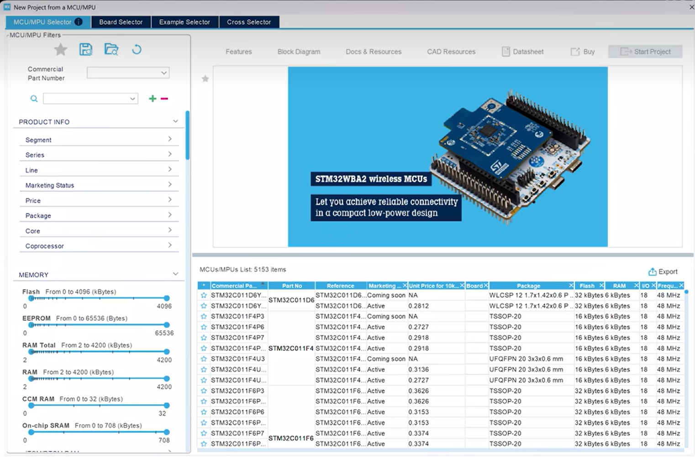
###　设置
需在Project Manager中进行设置，主要是工作路径（IDE中工作空间的路径）和工程名称、工具链（设置为CubeIDE），最终文件夹路径必须是期望的工程文件夹路径
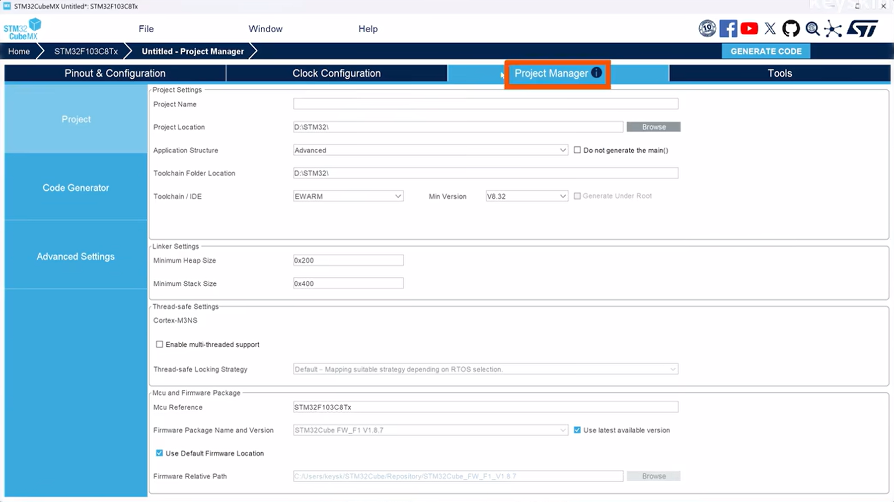
设置完毕
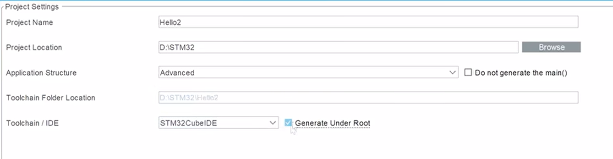
之后电机右上角的`Generate Code`即可
### IDE配置
在IDE中打开正确的文件夹，随后打开MX生成的`.project`文件。
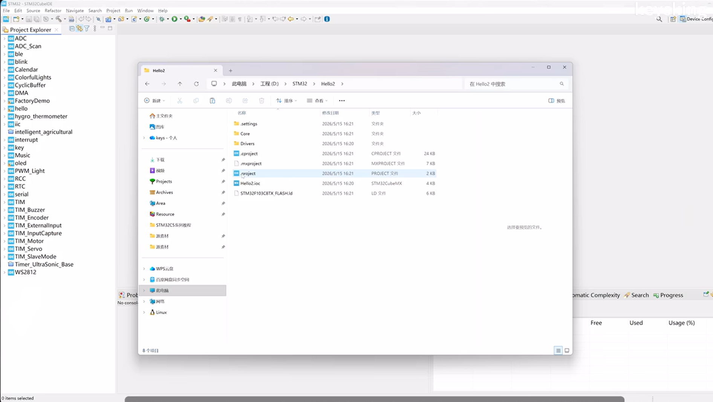

## VScode与MX配置
### VScode的配置文件分隔
打开配置文件
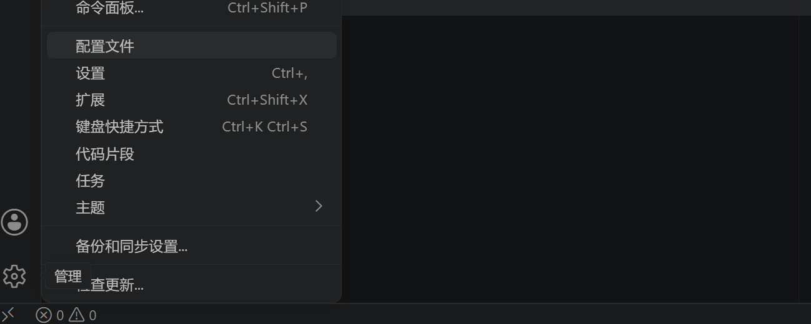
新建配置文件
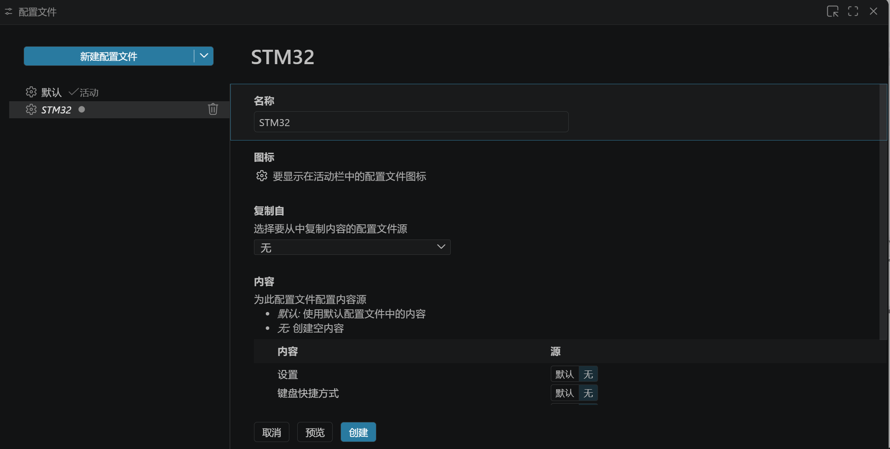
点击“✓”选择
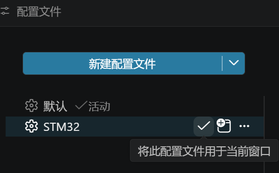
由此便可以独立将下载的插件分隔
### 插件下载

其会自动下载相关的插件
### MX创建
创建方法同上，即选择芯片、Project Manager；工具链需要设置为Cmake
之后MX会在对应文件夹下生成一个工程文件夹

### VScode的导入
打开相应的工程文件夹
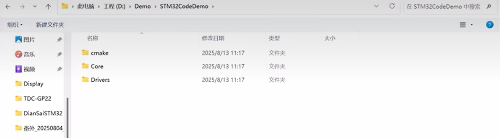
Cmake会识别到此为一个Cmake文件，询问选择预设——开发过程中选择Debug即可
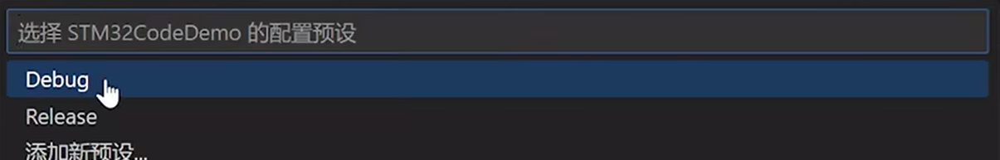
STM32的插件也会识别到是STM32的工程文件，选择是即可，会补齐缺失的`.vscode`和`.settings`文件
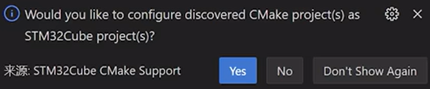

### 代码编写
在Core/Src下即可找到对应的main文件
>对于C语言，Vscode会推荐安装相关插件。但是STM32Cube已经自动安装插件，为了避免冲突无需再安装。

代码补全工具推荐


### 代码的编译与调试
#### 编译
点击Cmake插件生成的编译按钮
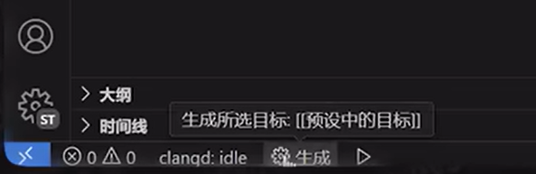
或者是对应的左侧栏中Cmake的`生成`按钮
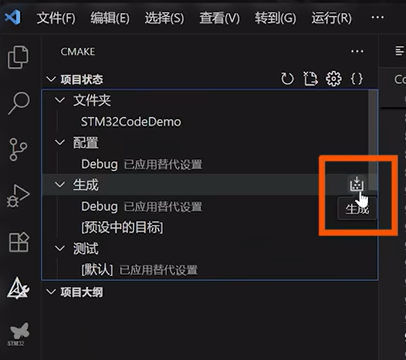
>编译出对应的elf文件后，还会生成对应的占用情况：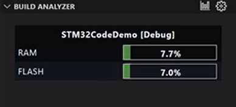

#### 程序完成  
当完成全部编写，需要生成一个最终版本时，可以点击左侧栏中Cmake的`配置`按钮，修改为`Release`
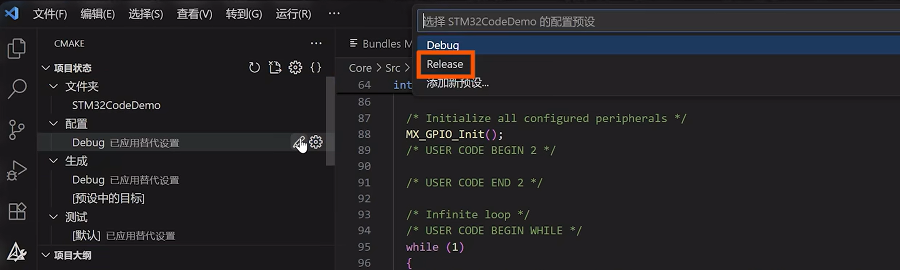
当修改后也可以点击上述配置按钮重新编译文件
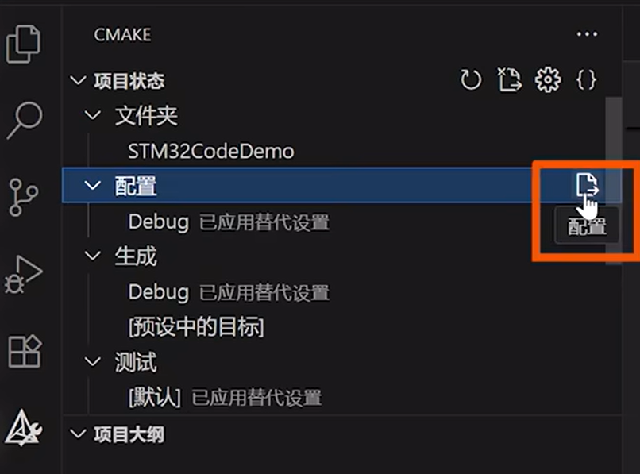
>也可以直接右键CMakeList文件进行操作：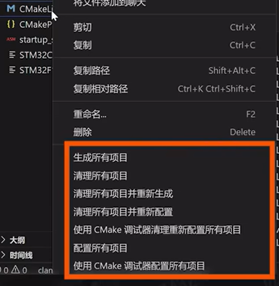
但是其实一般无需手动编译，因为烧录前程序会自动运行Cmake编译。

### 烧录
在`运行与调试`中，会显示插入的设备：
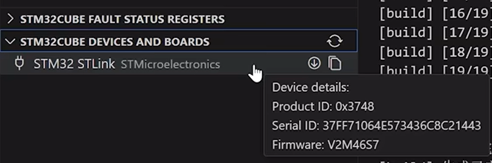
之后可以进行运行与调试了，第一次会询问下载器
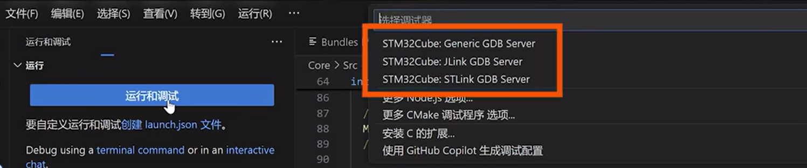
烧录完成后会停在main函数中进行调试

## 补充——Cmake语法
当需要将代码存放在工程文件下新建的文件夹中，需自行新建文件。
使用Cmake可以轻松地在多个编译器之间帮助IDE找到相关的文件
### 利用`target_include_directories`添加文件
```cmake
# 添加 include 路径（你提供的片段）
target_include_directories(${CMAKE_PROJECT_NAME} PRIVATE
    # Add user defined include paths
    Lib/oled/Inc
)

```

### 利用`target_sources`添加代码文件
仅仅添加上对应的代码文件也无法通过，需要再添加代码文件
```cmake
 target_sources(${CMAKE_PROJECT_NAME} PRIVATE
     Lib/oled/Src/font.c
     Lib/oled/Src/oled.c
)
```
如果觉得上述过程较为麻烦，也可以采用下述方式
```cmake
# 递归收集 Lib 目录下所有 .c 文件（注意修正为 *.c）
file(GLOB_RECURSE LIB_SOURCES "Lib/*.c")

# 将收集到的源文件添加到目标
target_sources(${CMAKE_PROJECT_NAME} PRIVATE
    ${LIB_SOURCES}
)
```
但是官方不建议，因为需要每次手动加载Cmake项目


##　实际使用的工程流程

实际使用时采用 **CubeMX 配置工程 + VScode 编写代码 + Keil 编译、烧录和调试** 的组合方式。三者的分工如下：

- **CubeMX**：选择芯片、配置时钟和外设，并生成 HAL 初始化代码。
- **VScode**：阅读工程、编写用户代码和管理自己的驱动文件。
- **Keil**：打开生成的 Keil 工程，完成最终编译、下载和在线调试。

### 1. 使用 CubeMX 创建工程

1. 打开 CubeMX，选择具体的 STM32 芯片或开发板。
2. 配置系统时钟、GPIO 和需要使用的外设，例如 USART、I2C、SPI、ADC、定时器等。
3. 在 **Project Manager** 中填写工程名和工程路径。工程路径建议使用纯英文路径，避免空格和特殊字符。
4. 在 **Project Settings** 中将工具链选择为 **MDK-ARM**，然后点击 **Generate Code** 生成工程。
5. 生成完成后，工程目录中会出现 `.uvprojx` 文件，这就是 Keil 的工程文件。

> 如果还需要使用 VScode 的 CMake 功能，可以另外生成一份 CMake 工程；但同一个工程不要在 CubeMX 中反复切换工具链后直接覆盖使用，避免工程文件互相影响。

### 2. 使用 VScode 编写代码

1. 在 VScode 中打开 CubeMX 生成的工程根目录，而不是只打开 `Core` 文件夹。
2. 用户代码主要放在以下位置：
   - `Core/Inc`：用户头文件。
   - `Core/Src`：用户源文件和 `main.c`。
   - `Drivers`：HAL 库、CMSIS 和芯片底层驱动。
   - 自建的 `BSP`、`App` 或 `Lib`：板级驱动、应用代码和通用模块。
3. CubeMX 生成的文件中，优先在 `USER CODE BEGIN` 和 `USER CODE END` 之间编写代码。重新生成代码时，这些区域通常会被保留。
4. 建议将一个功能拆分为 `.h` 和 `.c` 两个文件，例如 `bsp_led.h`、`bsp_led.c`，不要把所有代码都堆在 `main.c` 中。
5. 新增源文件后，要确保它已经加入 Keil 工程；**仅仅把文件放进磁盘目录，并不会自动参与 Keil 编译**。

### 3. 使用 Keil 编译工程

1. 双击工程目录中的 `.uvprojx` 文件，使用 Keil 打开工程。
2. 检查工程中是否包含新增的 `.c` 文件，并检查头文件路径是否正确。路径设置位于 **Options for Target → C/C++ → Include Paths**。
3. 点击 **Rebuild** 或 **Build** 编译工程。
4. 编译无误后，Keil 会生成 `.axf`、`.hex` 或 `.bin` 等输出文件，具体取决于工程设置。
5. 如果出现“找不到头文件”或“函数未定义”，优先检查：
   - 头文件所在目录是否加入 Include Paths；
   - 对应的 `.c` 文件是否加入 Keil 工程；
   - 函数声明和定义的名称、大小写是否一致；
   - 外设初始化函数是否已经在 `main.c` 中调用。

### 4. 下载和调试

1. 通过 ST-Link、J-Link 或其他下载器连接开发板。
2. 在 Keil 的 **Options for Target → Debug** 中选择对应的调试器，并在 **Utilities** 中选择相同的下载器。
3. 点击 **Download** 将程序烧录到芯片，或点击 **Start/Stop Debug Session** 进入在线调试。
4. 调试时可以使用断点、单步执行、查看变量和外设寄存器等功能。
5. 如果程序下载成功但运行不正常，先确认芯片型号、晶振配置、系统时钟配置和复位后的启动文件是否匹配。

### 5. 修改外设配置后的处理顺序

当需要修改 CubeMX 配置时，建议按以下顺序操作：

1. 先保存 VScode 和 Keil 中的代码，并确认用户代码位于 `USER CODE` 区域或独立文件中。
2. 回到 CubeMX 修改配置并重新生成代码。
3. 重新打开或刷新 Keil 工程，检查新增的初始化代码和工程文件变化。
4. 如果新增了 `.c` 文件或目录，重新将它们加入 Keil 工程，并补充头文件搜索路径。
5. 重新编译、下载并验证功能。

整个工程的基本文件流转可以概括为：

```text
CubeMX 配置外设
        ↓ Generate Code
生成 HAL 工程和 Keil 工程
        ↓
VScode 编写用户代码
        ↓
Keil 检查工程并编译
        ↓
下载器烧录、在线调试
```


# 2 GPIO
## 2.1 点灯——GPIO的输出
### GPIO的各大模式
- **推挽输出**：强弱电都强，速度快，不能并联 → LED、PWM、SPI
- **开漏输出**：只驱动低电平，需上拉电阻，可并联 → I2C
- **上拉/下拉输入**：内部带电阻，防引脚悬空 → 按键检测
- **浮空输入**：无内部电阻，需外部电路 → 高速信号
- **模拟输入**：直连ADC，不读数字值 → 模拟信号采样
  
#### 两种输出
| 对比维度 | 推挽输出 | 开漏输出 |
|---------|---------|----------|
| **内部结构** | 两个 MOS 管（上管+下管） | 只有下管（上管不存在） |
| **高电平实现** | 上管导通，直接输出 VCC | 必须外部上拉电阻拉到 VCC |
| **输出 0** | 下管导通 | 下管导通 |
| **输出 1** | 上管导通，电阻极小 | 外部上拉电阻（通常几 kΩ） |
| **驱动能力** | 强（几十 mA） | 弱（取决于上拉电阻，通常 mA 级） |
| **上升沿速度** | 极快（ns 级） | 慢（RC 延迟，μs 级） |
| **总线仲裁** | 不能（直接短路） | 可以（多设备线与） |
| **功耗** | 低（导通电阻小） | 较高（上拉电阻持续耗电） |
| **典型例** | 驱动 LED、MOSFET 栅极 | I2C 的 SDA/SCL 线 |

#### 三种输入
| 对比维度 | 浮空输入 | 上拉输入 | 下拉输入 |
|---------|---------|---------|----------|
| **内部连接** | 直接进施密特触发器 | 通过内部上拉电阻到 VCC | 通过内部下拉电阻到 GND |
| **引脚悬空时** | 电平不确定（易受干扰） | 高电平 | 低电平 |
| **外部电路要求** | 必须外部明确高低电平 | 外部低电平触发 | 外部高电平触发 |
| **抗干扰能力** | 弱 | 中（默认高电平） | 中（默认低电平） |
| **功耗增加** | 无 | 有（上拉电阻持续电流） | 有（下拉电阻持续电流） |
| **典型用途** | 高速信号（SPI MISO） | 按键（另一端接地） | 按键（另一端接 VCC） |

### cubemx的生成代码
#### 代码位置
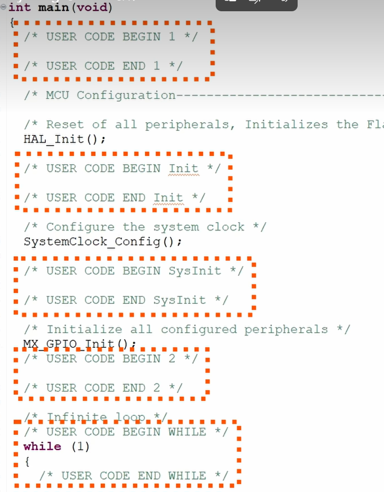
只需要将代码写在注释：
```c
/* USER CODE BEGIN... */

/* USER CODE END... */
```
之间，每次重新生成我们自己写的代码就不会消失了。

> 使用 `alt`+`A`来获取代码提示。

#### 循环点灯代码
##### 简单的单个小灯
使用 CubeMX 配置好 GPIO 为输出模式后即可点亮 LED。为了使灯循环闪烁，可以在while 中写入以下代码：
```c
/* USER CODE BEGIN WHILE */
while (1)
{
    HAL_GPIO_WritePin(GPIOA, GPIO_PIN_7, GPIO_PIN_SET);
    HAL_Delay(1000);
    HAL_GPIO_WritePin(GPIOA, GPIO_PIN_7, GPIO_PIN_RESET);
    HAL_Delay(500);
    /* USER CODE END WHILE */
}
```
即可完成循环点灯的效果。
>具体选择的引脚根据实际情况修改。

HAL库函数的特点如下：

**命名规范统一**：所有函数都以`HAL_`为前缀，后面跟外设名和操作名。

**与CubeMX深度绑定**：初始化代码由CubeMX自动生成，用户只在`USER CODE BEGIN/END`标记区间添加业务逻辑，方便图形化配置和代码重新生成。

**延时函数为阻塞式**：`HAL_Delay()`基于SysTick中断实现毫秒级延时，使用简单但会占用CPU，延时期间无法响应其他任务，适合简单顺序执行的程序。

**返回值状态明确**：大多数HAL函数会返回`HAL_OK`、`HAL_ERROR`、`HAL_BUSY`、`HAL_TIMEOUT`等状态码，便于错误处理。

##### 不同颜色的小灯组合
完成如下的效果：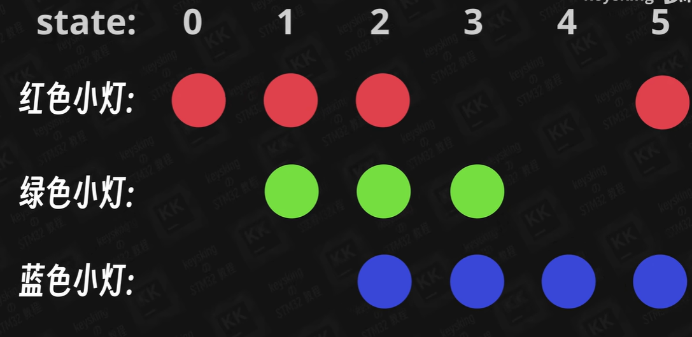

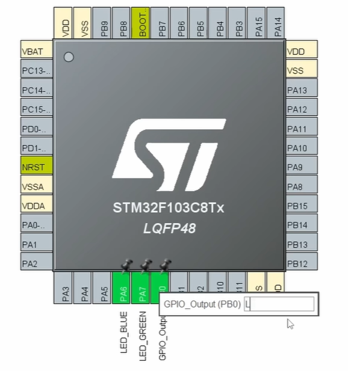
可以右键对应引脚进行命名，这样后续可以不写如`GPIOA`、和`GPIO_PIN_7`，而是选择写`xxx_Port`和`xxx_Pin`. 

```c
/* USER CODE BEGIN WHILE */
while (1)
{
    if (state <= 2 || state == 5) {
        HAL_GPIO_WritePin(LED_RED_GPIO_Port, LED_RED_Pin, GPIO_PIN_SET);
    } else {
        HAL_GPIO_WritePin(LED_RED_GPIO_Port, LED_RED_Pin, GPIO_PIN_RESET);
    }

    if (state >= 1 && state <= 3) {
        HAL_GPIO_WritePin(LED_GREEN_GPIO_Port, LED_GREEN_Pin, GPIO_PIN_SET);
    } else {
        HAL_GPIO_WritePin(LED_GREEN_GPIO_Port, LED_GREEN_Pin, GPIO_PIN_RESET);
    }

    if (state >= 2) {
        HAL_GPIO_WritePin(LED_BLUE_GPIO_Port, LED_BLUE_Pin, GPIO_PIN_SET);
    } else {
        HAL_GPIO_WritePin(LED_BLUE_GPIO_Port, LED_BLUE_Pin, GPIO_PIN_RESET);
    }

    HAL_Delay(300);

    state++;
    if (state > 5) {
        state = 0;
    }
}
/* USER CODE END WHILE */
```

## 2.2 按键控制——GPIO的输入
### 电路原理图
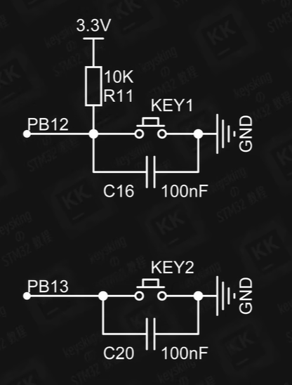
并联电容来消减按下或者松开按钮时的抖动问题。

下忽略电容进行分析：
#### 按键松开

引脚直接连到电源，设置浮空状态（相当于内部为高阻态）
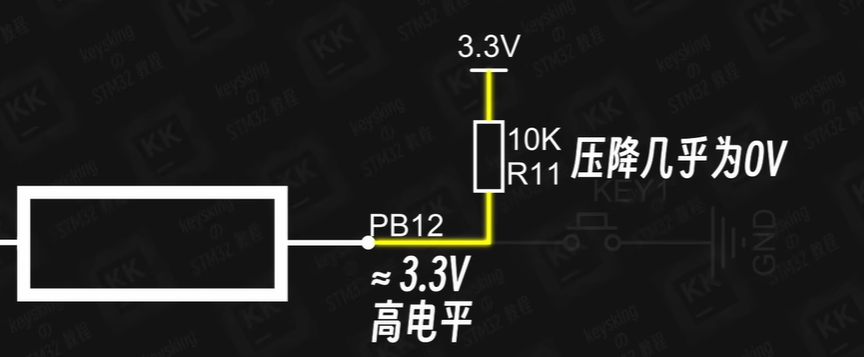
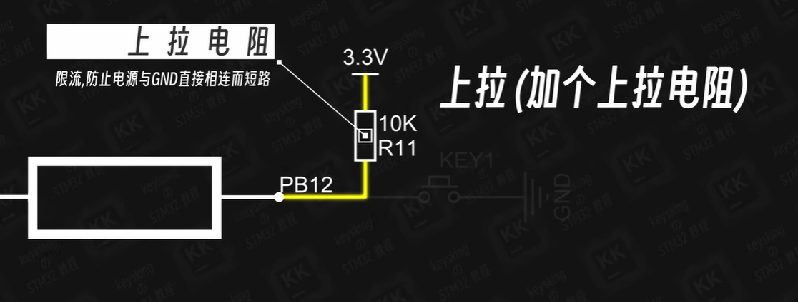
需要添加上拉电阻

#### 按键按下
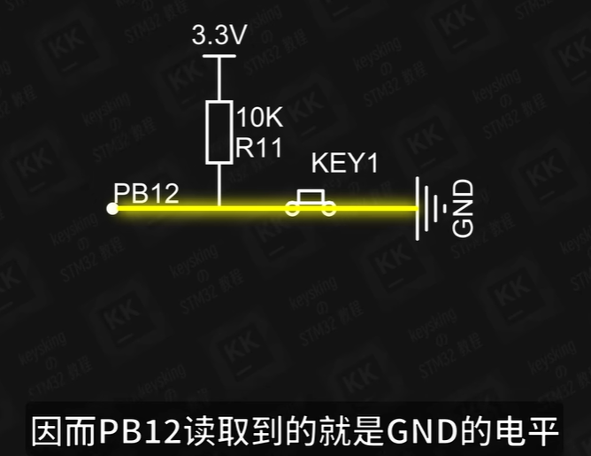

>当然也有下拉电路。
>实际中，芯片内部就有上拉电阻：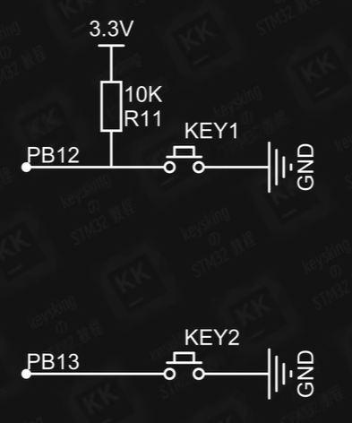
>所以说无需我们自己加上上拉电阻。也就是 `外部上拉电阻 + 浮空输入模式` 和 `内部上拉电阻 + 上拉输入模式 `达到的效果几乎完全一样.

总结：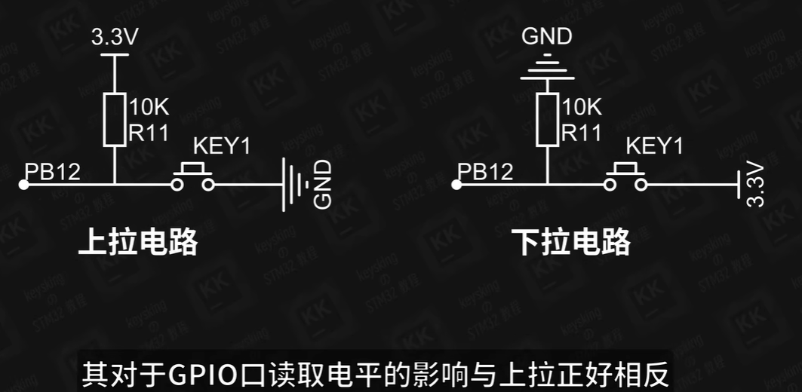
1. 当设置按钮 GPIO 为上拉模式，相当于外接电源：松开按键读取高电平；按下按键读取低电平
2. 当设置按钮 GPIO 为下拉模式，相当于外接GND：松开按键读取低电平；按下按键读取高电平

### CubeMX 设置
先点击芯片上的引脚，设置为 GPIO_Input
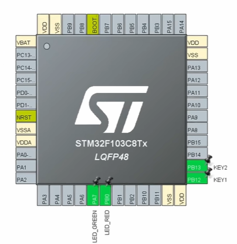

随后，在 System Core 下的 GPIO
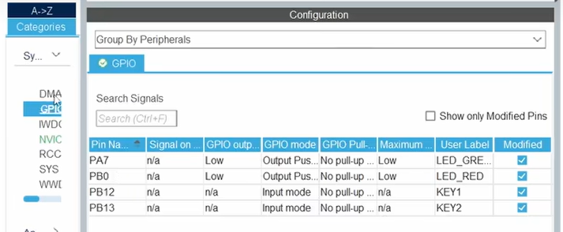
点击相应的引脚查看详细设置。

配置对应的 上拉/下拉模式
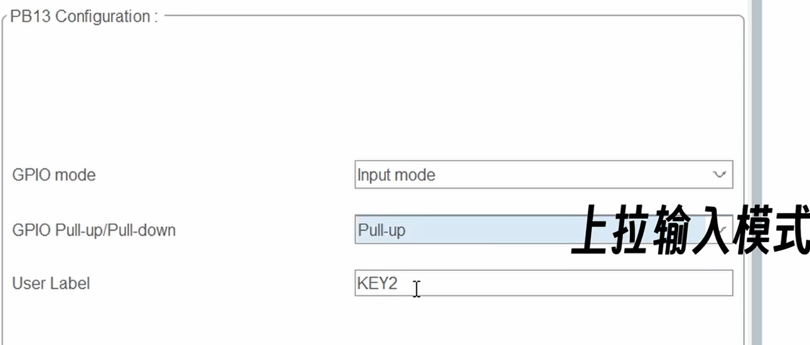

### 代码
```c
/* USER CODE BEGIN WHILE */
while (1)
{

    // 按键1控制绿色LED
    if (HAL_GPIO_ReadPin(KEY1_GPIO_Port, KEY1_Pin) == GPIO_PIN_RESET) {
        HAL_GPIO_WritePin(LED_GREEN_GPIO_Port, LED_GREEN_Pin, GPIO_PIN_SET);   // 按下亮
    } else {
        HAL_GPIO_WritePin(LED_GREEN_GPIO_Port, LED_GREEN_Pin, GPIO_PIN_RESET); // 松开灭
    }

    // 按键2控制红色LED（带松手检测）
    if (HAL_GPIO_ReadPin(KEY2_GPIO_Port, KEY2_Pin) == GPIO_PIN_RESET) {
        HAL_GPIO_TogglePin(LED_RED_GPIO_Port, LED_RED_Pin);      // 翻转红色LED状态

        while(HAL_GPIO_ReadPin(KEY2_GPIO_Port, KEY2_Pin) == GPIO_PIN_RESET){} // 等待按键松开
    }
}
/* USER CODE END WHILE */
```
**效果说明**

| 按键 | 操作 | LED效果 | 控制方式 |
|------|------|---------|-----------|
| **KEY1** | 按下 | 绿灯亮 | 电平控制（实时跟随） |
| **KEY1** | 松开 | 绿灯灭 | |
| **KEY2** | 每按一次 | 红灯翻转（亮↔灭） | 边沿触发（带松手检测） |

### 补充说明——软件消抖
**完整代码**

```c
/* USER CODE BEGIN WHILE */
while (1)
{
    // KEY1控制绿灯：按下亮，松开灭
    if (HAL_GPIO_ReadPin(KEY1_GPIO_Port, KEY1_Pin) == GPIO_PIN_RESET) {
        HAL_GPIO_WritePin(LED_GREEN_GPIO_Port, LED_GREEN_Pin, GPIO_PIN_SET);
    } else {
        HAL_GPIO_WritePin(LED_GREEN_GPIO_Port, LED_GREEN_Pin, GPIO_PIN_RESET);
    }

    // KEY2控制红灯：按键消抖 + 松手检测
    if (HAL_GPIO_ReadPin(KEY2_GPIO_Port, KEY2_Pin) == GPIO_PIN_RESET) {
        HAL_Delay(10);                    // 延时10ms消抖
        if (HAL_GPIO_ReadPin(KEY2_GPIO_Port, KEY2_Pin) == GPIO_PIN_RESET) {
            HAL_GPIO_TogglePin(LED_RED_GPIO_Port, LED_RED_Pin);  // 翻转红灯
            while (HAL_GPIO_ReadPin(KEY2_GPIO_Port, KEY2_Pin) == GPIO_PIN_RESET) {} // 等待松开
        }
    }
}
/* USER CODE END WHILE */
```
**效果说明**

| 按键 | 操作 | LED效果 | 新增特性 |
|------|------|---------|----------|
| **KEY2** | 每按一次 | 红灯翻转（亮↔灭） | ✅ **增加了10ms消抖**，按键更稳定 |

**先检测到，如果延迟后还是一样的，则进入逻辑处理。**

## 2.3 GPIO内部结构——推挽、开漏与八种工作模式

前面使用 GPIO 时已经接触过：

* 推挽输出
* 上拉输入
* 下拉输入
* 浮空输入

实际上这些模式的区别，本质上就是 **GPIO 引脚内部不同电路是否开启，以及数据从哪条路径经过。**

STM32 的一个 GPIO 大致可以分成：

```text
                     STM32 内部

                         VDD
                          │
                     ┌────┴────┐
                     │ 上拉电阻 │
                     └────┬────┘
                          │
                          ├──────── 输入电路 ───────→ 输入寄存器
                          │
外部引脚 ─────────────────●
                          │
                          ├──────── 输出电路
                          │              │
                     ┌────┴────┐    PMOS / NMOS
                     │ 下拉电阻 │
                     └────┬────┘
                          │
                         GND
```

因此一个 GPIO 引脚内部并不是单纯的一根导线，而是存在：

* 保护电路
* 上拉、下拉电阻
* 输入电路
* 输出驱动电路
* 输入寄存器
* 输出寄存器
* 外设复用通道

不同的 GPIO 模式，就是对这些结构进行不同组合。

---

### GPIO的八种工作模式

STM32 GPIO 一共有八种常见工作模式：

| 类型   | GPIO模式 |
| ---- | ------ |
| 输入   | 浮空输入   |
| 输入   | 上拉输入   |
| 输入   | 下拉输入   |
| 输入   | 模拟输入   |
| 输出   | 推挽输出   |
| 输出   | 开漏输出   |
| 复用输出 | 复用推挽输出 |
| 复用输出 | 复用开漏输出 |

可以简单分成：

```text
GPIO
│
├── 输入
│   ├── 浮空输入
│   ├── 上拉输入
│   ├── 下拉输入
│   └── 模拟输入
│
└── 输出
    ├── 普通输出
    │   ├── 推挽输出
    │   └── 开漏输出
    │
    └── 复用输出
        ├── 复用推挽输出
        └── 复用开漏输出
```

---

### GPIO引脚的保护电路

GPIO 引脚与芯片内部电路之间存在保护结构，其主要作用就是避免外部引脚出现异常电压时直接损坏内部电路。

可以简单理解为：

```text
                 VDD
                  │
               保护二极管
                  │
外部 GPIO ────────●────── 内部电路
                  │
               保护二极管
                  │
                 GND
```

正常情况下：

```text
GND ≤ GPIO电压 ≤ VDD
```

保护二极管基本不参与工作。

当外部电压出现明显异常时，保护结构可以在一定程度上限制引脚电压。

> 保护电路并不意味着 GPIO 可以随便接高电压。

部分 STM32 GPIO 是 **5V tolerant（5V耐受）** 引脚，可以接受一定条件下的 5V 输入；但不是所有引脚都支持，需要查看芯片的数据手册。

---

# 输出部分

## 推挽输出

推挽输出内部最重要的结构就是两个 MOS 管：

```text
             VDD
              │
            PMOS
              │
              ├────── GPIO
              │
            NMOS
              │
             GND
```

可以把它理解成：

* 上面的 PMOS 负责把 GPIO **推向高电平**
* 下面的 NMOS 负责把 GPIO **拉向低电平**

所以叫：

**推挽输出 Push-Pull。**

---

### 输出高电平

当需要 GPIO 输出高电平时：

```text
PMOS：导通
NMOS：关闭
```

形成：

```text
VDD
 │
PMOS
 │
 ├──── GPIO = 高电平
 │
NMOS ×
 │
GND
```

因此 GPIO 可以直接连接到 VDD：

```text
GPIO ≈ VDD
```

对于常见 STM32：

```text
GPIO ≈ 3.3V
```

---

### 输出低电平

当需要输出低电平时：

```text
PMOS：关闭
NMOS：导通
```

形成：

```text
VDD
 │
PMOS ×
 │
 ├──── GPIO = 低电平
 │
NMOS
 │
GND
```

因此：

```text
GPIO ≈ 0V
```

---

### 推挽输出总结

| GPIO状态 | PMOS | NMOS | GPIO |
| ------ | ---- | ---- | ---- |
| 输出1    | 导通   | 关闭   | VDD  |
| 输出0    | 关闭   | 导通   | GND  |

所以推挽输出最大的特点就是：

**高电平和低电平都由芯片主动输出。**

也就是：

```text
输出1 → 主动接VDD
输出0 → 主动接GND
```

> 因此普通的 LED、PWM、SPI 等数字输出通常可以使用推挽输出。

---

## 开漏输出

开漏输出与推挽输出非常像，但是有一个关键区别：

**上面的 PMOS 不工作。**

因此只剩下面的 NMOS：

```text
GPIO ─────┐
          │
        NMOS
          │
         GND
```

也就是说开漏输出只能：

**主动把 GPIO 拉低。**

却不能主动输出高电平。

---

### 开漏输出0

当输出 0 时：

```text
NMOS：导通
```

形成：

```text
GPIO
 │
NMOS
 │
GND
```

因此：

```text
GPIO = 0V
```

这与推挽输出低电平基本一样。

---

### 开漏输出1

但是当程序要求输出 1 时：

```text
NMOS：关闭
```

此时：

```text
GPIO
 │
NMOS ×
 │
GND
```

GPIO 既没有连接：

```text
VDD
```

也没有连接：

```text
GND
```

因此 GPIO 进入：

**高阻态。**

也就是：

```text
GPIO ≠ 主动输出高电平

GPIO = 什么都不管
```

---

### 什么是高阻态

高阻态可以简单理解成：

**这个 GPIO 引脚暂时和内部输出电路断开了。**

近似：

```text
GPIO ───── ×
```

因此此时 GPIO 到底是多少伏，并不是 STM32 决定的，而是由外部电路决定。

---

## 为什么开漏还需要上拉电阻

因为开漏模式不能主动输出高电平。

所以通常需要：

```text
       VDD
        │
      上拉电阻
        │
        ├──── GPIO
        │
      NMOS
        │
       GND
```

### NMOS关闭

```text
       VDD
        │
      上拉电阻
        │
        └──── GPIO
              │
            NMOS ×
              │
             GND
```

此时 GPIO 被外部上拉电阻拉到：

```text
GPIO = VDD
```

也就是高电平。

---

### NMOS导通

```text
       VDD
        │
      上拉电阻
        │
        ├──── GPIO
        │
      NMOS
        │
       GND
```

NMOS 将 GPIO 拉到 GND：

```text
GPIO = 0V
```

因此：

| 开漏输出       | NMOS | GPIO实际状态 |
| ---------- | ---- | -------- |
| 输出0        | 导通   | 低电平      |
| 输出1        | 关闭   | 高阻态      |
| 输出1 + 外部上拉 | 关闭   | 被拉成高电平   |

> **开漏输出的“1”并不是真的输出高电平，而是不再拉低。**

这句话非常重要。

---

## 推挽与开漏的核心区别

| 对比          | 推挽输出       | 开漏输出 |
| ----------- | ---------- | ---- |
| PMOS        | 使用         | 不使用  |
| NMOS        | 使用         | 使用   |
| 输出0         | 主动拉低       | 主动拉低 |
| 输出1         | 主动拉高       | 高阻态  |
| 是否可以直接输出高电平 | 可以         | 不可以  |
| 高电平来源       | STM32内部VDD | 外部上拉 |
| 是否通常需要上拉电阻  | 不需要        | 需要   |

最简单的记忆方式：

```text
推挽：

1 → 我主动给你高电平
0 → 我主动给你低电平


开漏：

1 → 我不管了
0 → 我把你拉到地
```

---

## 开漏输出有什么用

既然推挽可以直接输出 0 和 1，看起来更加方便，那么为什么还需要开漏？

其中一个重要原因就是：

**高电平可以由外部决定。**

例如：

```text
       5V
        │
      上拉电阻
        │
GPIO ───┘
 │
NMOS
 │
GND
```

此时 NMOS 关闭后，高电平由外部的 5V 提供，而不是 STM32 自己的 3.3V。

因此开漏输出在某些情况下可以实现不同电压之间的接口。

> 前提是对应 GPIO 本身支持相应电压，例如必须确认是否属于 5V 耐受引脚。

开漏结构也非常适合多个器件共同控制一条信号线。

例如多个设备都只能：

```text
拉低
或
不管
```

就不会出现一个设备强行输出高电平、另一个设备强行输出低电平的直接冲突。

典型例子就是：

```text
I2C
```

---

# 普通输出与复用输出

前面的：

```text
推挽输出
开漏输出
```

还可以继续分成：

```text
普通推挽输出
普通开漏输出

复用推挽输出
复用开漏输出
```

它们后面的 MOS 输出结构其实没有本质变化。

真正不同的是：

**谁来控制 MOS 管。**

---

## 普通输出

普通 GPIO 输出时，控制信号来自 GPIO 自己的输出控制部分。

例如我们调用：

```c
HAL_GPIO_WritePin(GPIOA, GPIO_PIN_7, GPIO_PIN_SET);
```

最终就是让 GPIO 输出对应的电平。

可以简单理解成：

```text
CPU
 │
GPIO输出数据
 │
输出驱动器
 │
GPIO
```

这种就是：

```text
GPIO_Output
```

---

## 复用输出

但是很多 GPIO 引脚不只可以作为普通 GPIO 使用。

例如一个引脚还可能作为：

```text
USART
SPI
I2C
TIM
……
```

这些都是 STM32 内部的片上外设。

当 GPIO 被配置为复用功能后，输出信号就不再主要由普通 GPIO 输出控制，而是来自对应的外设。

例如：

```text
USART
  │
  │ TX数据
  ↓
输出驱动器
  │
 GPIO
```

此时 USART 自己决定引脚什么时候输出 0、什么时候输出 1。

---

### 普通输出与复用输出

```text
普通输出：

CPU / GPIO寄存器
       ↓
   输出驱动器
       ↓
      GPIO


复用输出：

USART / SPI / TIM / I2C ...
          ↓
      输出驱动器
          ↓
         GPIO
```

所以：

**普通和复用的区别主要在于控制信号从哪里来。**

而：

**推挽和开漏的区别主要在于最后的输出驱动电路怎么工作。**

因此两者组合后就形成：

```text
普通推挽
普通开漏
复用推挽
复用开漏
```

---

# 输入部分

GPIO 不仅可以输出，也可以读取外部输入。

输入部分大致可以理解成：

```text
外部 GPIO
    │
    ↓
施密特触发器
    │
    ↓
输入寄存器
    │
    ↓
   CPU
```

外部的电压经过输入电路处理以后，最终转换成：

```text
0
或
1
```

然后 CPU 就可以读取这个状态。

例如：

```c
HAL_GPIO_ReadPin(KEY1_GPIO_Port, KEY1_Pin);
```

---

## 施密特触发器

外部输入电压在现实中不一定是完美的：

```text
0V
或者
3.3V
```

可能在变化过程中出现：

```text
0.7V
1.3V
1.8V
2.4V
……
```

因此输入电路需要判断：

```text
现在到底算 0 还是 1？
```

施密特触发器的作用之一，就是把外部实际电压转换成稳定的数字高低电平。

可以简单理解成：

```text
外部模拟电压
      ↓
  施密特触发器
      ↓
    0 或 1
```

然后再送入 GPIO 输入寄存器。

---

# 浮空输入

浮空输入时：

```text
上拉电阻：关闭
下拉电阻：关闭
```

因此 GPIO 内部不会主动给这个引脚一个默认电平。

结构近似：

```text
外部信号 ───── GPIO ───── 输入电路
```

如果外部电路明确提供：

```text
3.3V
```

则读取：

```text
1
```

如果外部明确提供：

```text
0V
```

则读取：

```text
0
```

但是如果 GPIO 什么都没有接：

```text
GPIO ───── 空气
```

那么电平就可能不确定。

因此浮空输入最重要的特点就是：

**GPIO 自己不决定默认高低电平。**

> 所以不要把一个需要稳定状态的输入引脚随便悬空。

---

# 上拉输入

上拉输入就是在 GPIO 内部连接一个上拉电阻：

```text
        VDD
         │
      上拉电阻
         │
         ├──── GPIO ─── 输入电路
         │
       外部
```

如果外部什么都不做：

```text
VDD
 │
上拉电阻
 │
GPIO
```

GPIO 会被拉到高电平。

所以默认读取：

```text
1
```

当外部把 GPIO 接地：

```text
GPIO ───── GND
```

则读取：

```text
0
```

因此：

```text
上拉输入：

悬空 → 1
接GND → 0
```

这就是前面按键实验使用上拉输入时：

```text
松开按键 → 高电平
按下按键 → 低电平
```

的原因。

---

# 下拉输入

下拉输入正好相反：

```text
GPIO ─── 输入电路
 │
下拉电阻
 │
GND
```

默认：

```text
GPIO = 0
```

如果外部连接 VDD：

```text
VDD ───── GPIO
```

则：

```text
GPIO = 1
```

因此：

```text
下拉输入：

悬空 → 0
接VDD → 1
```

---

## 三种数字输入对比

| 对比     | 浮空输入   | 上拉输入 | 下拉输入 |
| ------ | ------ | ---- | ---- |
| 内部上拉   | 关闭     | 开启   | 关闭   |
| 内部下拉   | 关闭     | 关闭   | 开启   |
| 无外部信号时 | 不确定    | 高电平  | 低电平  |
| 默认状态   | 无      | 1    | 0    |
| 外部信号   | 必须自己确定 | 可以拉低 | 可以拉高 |

简单记忆：

```text
浮空：我不管你

上拉：没人管你，我就把你拉成1

下拉：没人管你，我就把你拉成0
```

---

# 模拟输入

前面的：

```text
浮空输入
上拉输入
下拉输入
```

最后都需要判断：

```text
0还是1
```

属于数字输入。

但是有时候我们并不是只想知道：

```text
高 or 低
```

而是希望知道具体电压，例如：

```text
0.6V
1.5V
2.7V
……
```

这时就需要：

```text
模拟输入
```

例如 ADC。

可以简单理解成：

```text
外部GPIO
   │
   ├──── 数字输入路径 ───→ 0 / 1
   │
   └──── 模拟路径 ───────→ ADC等模拟外设
```

当 GPIO 配置为模拟输入时，就主要把外部模拟电压交给芯片内部的模拟外设处理，而不是当成普通数字 0/1 使用。

典型用途：

```text
ADC采样
```

---

# GPIO八种模式最终总结

| 模式     | 内部特点          | 最终用途           |
| ------ | ------------- | -------------- |
| 浮空输入   | 无上拉、无下拉       | 外部已经有明确电平      |
| 上拉输入   | 内部连接上拉电阻      | 默认保持高电平        |
| 下拉输入   | 内部连接下拉电阻      | 默认保持低电平        |
| 模拟输入   | 进入模拟信号通道      | ADC等           |
| 推挽输出   | PMOS + NMOS   | 普通数字输出         |
| 开漏输出   | 主要使用NMOS，需要上拉 | I2C、电平接口等      |
| 复用推挽输出 | 外设控制推挽结构      | USART、SPI、TIM等 |
| 复用开漏输出 | 外设控制开漏结构      | I2C等           |

---

# 最核心关系

八种 GPIO 模式看起来很多，但实际上只需要理解三个问题。

### 1. 输入还是输出？

```text
输入 → 外面告诉STM32是什么电平

输出 → STM32告诉外面是什么电平
```

### 2. 如果是输入，默认电平怎么办？

```text
浮空 → 不管

上拉 → 默认1

下拉 → 默认0

模拟 → 不判断0/1，读取模拟电压
```

### 3. 如果是输出，怎么输出？

```text
推挽：

1 → 主动拉高
0 → 主动拉低


开漏：

1 → 高阻态，不管
0 → 主动拉低
```

至于普通与复用：

```text
普通输出 → GPIO自己控制

复用输出 → USART / SPI / TIM / I2C 等外设控制
```

所以整个 GPIO 八种模式最终可以压缩成：

```text
                         GPIO
                          │
              ┌───────────┴───────────┐
              │                       │
             输入                    输出
              │                       │
      ┌───────┼───────┐         ┌─────┴─────┐
      │       │       │         │           │
    浮空    上拉    下拉       推挽        开漏
      │
    模拟输入

普通 / 复用
只是决定输出信号由
GPIO 还是片上外设控制
```

> **最重要的一句话：**
>
> **推挽 = 0 和 1 都主动输出；开漏 = 只主动输出 0，输出 1 实际上是高阻态。**
