# 1 环境安装
旧版本（1.19.0 及之前）需登录才能使用（存在网络、账号登录困扰）
新版本（2.0 及之后）取消登录但移除内置 CubeMX，无法直接创建工程

## IDE与MX配置
### 下载IDE与MX
打开MX，搜索对应型号芯片

###　设置
需在Project Manager中进行设置，主要是工作路径（IDE中工作空间的路径）和工程名称、工具链（设置为CubeIDE），最终文件夹路径必须是期望的工程文件夹路径

设置完毕

之后电机右上角的`Generate Code`即可
### IDE配置
在IDE中打开正确的文件夹，随后打开MX生成的`.project`文件。


## VScode与MX配置
### VScode的配置文件分隔
打开配置文件

新建配置文件

点击“✓”选择

由此便可以独立将下载的插件分隔
### 插件下载

其会自动下载相关的插件
### MX创建
创建方法同上，即选择芯片、Project Manager；工具链需要设置为Cmake
之后MX会在对应文件夹下生成一个工程文件夹

### VScode的导入
打开相应的工程文件夹

Cmake会识别到此为一个Cmake文件，询问选择预设——开发过程中选择Debug即可

STM32的插件也会识别到是STM32的工程文件，选择是即可，会补齐缺失的`.vscode`和`.settings`文件


### 代码编写
在Core/Src下即可找到对应的main文件
>对于C语言，Vscode会推荐安装相关插件。但是STM32Cube已经自动安装插件，为了避免冲突无需再安装。
代码补全工具推荐


### 代码的编译与调试
#### 编译
点击Cmake插件生成的编译按钮

或者是对应的左侧栏中Cmake的`生成`按钮

>编译出对应的elf文件后，还会生成对应的占用情况：

#### 程序完成  
当完成全部编写，需要生成一个最终版本时，可以点击左侧栏中Cmake的`配置`按钮，修改为`Release`

当修改后也可以点击上述配置按钮重新编译文件

>也可以直接右键CMakeList文件进行操作：
但是其实一般无需手动编译，因为烧录前程序会自动运行Cmake编译。

### 烧录
在`运行与调试`中，会显示插入的设备：

之后可以进行运行与调试了，第一次会询问下载器

烧录完成后会停在main函数中进行调试

## 补充——Cmake语法
当需要将代码存放在工程文件下新建的文件夹中，需自行新建文件。
使用Cmake可以轻松地在多个编译器之间帮助IDE找到相关的文件
### 利用`target_include_directories`添加文件
```cmake
# 添加 include 路径（你提供的片段）
target_include_directories(${CMAKE_PROJECT_NAME} PRIVATE
    # Add user defined include paths
    Lib/oled/Inc
)

```

### 利用`target_sources`添加代码文件
仅仅添加上对应的代码文件也无法通过，需要再添加代码文件
```cmake
 target_sources(${CMAKE_PROJECT_NAME} PRIVATE
     Lib/oled/Src/font.c
     Lib/oled/Src/oled.c
)
```
如果觉得上述过程较为麻烦，也可以采用下述方式
```cmake
# 递归收集 Lib 目录下所有 .c 文件（注意修正为 *.c）
file(GLOB_RECURSE LIB_SOURCES "Lib/*.c")

# 将收集到的源文件添加到目标
target_sources(${CMAKE_PROJECT_NAME} PRIVATE
    ${LIB_SOURCES}
)
```
但是官方不建议，因为需要每次手动加载Cmake项目

##　实际使用的工程流程

实际使用时采用 **CubeMX 配置工程 + VScode 编写代码 + Keil 编译、烧录和调试** 的组合方式。三者的分工如下：

- **CubeMX**：选择芯片、配置时钟和外设，并生成 HAL 初始化代码。
- **VScode**：阅读工程、编写用户代码和管理自己的驱动文件。
- **Keil**：打开生成的 Keil 工程，完成最终编译、下载和在线调试。

### 1. 使用 CubeMX 创建工程

1. 打开 CubeMX，选择具体的 STM32 芯片或开发板。
2. 配置系统时钟、GPIO 和需要使用的外设，例如 USART、I2C、SPI、ADC、定时器等。
3. 在 **Project Manager** 中填写工程名和工程路径。工程路径建议使用纯英文路径，避免空格和特殊字符。
4. 在 **Project Settings** 中将工具链选择为 **MDK-ARM**，然后点击 **Generate Code** 生成工程。
5. 生成完成后，工程目录中会出现 `.uvprojx` 文件，这就是 Keil 的工程文件。

> 如果还需要使用 VScode 的 CMake 功能，可以另外生成一份 CMake 工程；但同一个工程不要在 CubeMX 中反复切换工具链后直接覆盖使用，避免工程文件互相影响。

### 2. 使用 VScode 编写代码

1. 在 VScode 中打开 CubeMX 生成的工程根目录，而不是只打开 `Core` 文件夹。
2. 用户代码主要放在以下位置：
   - `Core/Inc`：用户头文件。
   - `Core/Src`：用户源文件和 `main.c`。
   - `Drivers`：HAL 库、CMSIS 和芯片底层驱动。
   - 自建的 `BSP`、`App` 或 `Lib`：板级驱动、应用代码和通用模块。
3. CubeMX 生成的文件中，优先在 `USER CODE BEGIN` 和 `USER CODE END` 之间编写代码。重新生成代码时，这些区域通常会被保留。
4. 建议将一个功能拆分为 `.h` 和 `.c` 两个文件，例如 `bsp_led.h`、`bsp_led.c`，不要把所有代码都堆在 `main.c` 中。
5. 新增源文件后，要确保它已经加入 Keil 工程；**仅仅把文件放进磁盘目录，并不会自动参与 Keil 编译**。

### 3. 使用 Keil 编译工程

1. 双击工程目录中的 `.uvprojx` 文件，使用 Keil 打开工程。
2. 检查工程中是否包含新增的 `.c` 文件，并检查头文件路径是否正确。路径设置位于 **Options for Target → C/C++ → Include Paths**。
3. 点击 **Rebuild** 或 **Build** 编译工程。
4. 编译无误后，Keil 会生成 `.axf`、`.hex` 或 `.bin` 等输出文件，具体取决于工程设置。
5. 如果出现“找不到头文件”或“函数未定义”，优先检查：
   - 头文件所在目录是否加入 Include Paths；
   - 对应的 `.c` 文件是否加入 Keil 工程；
   - 函数声明和定义的名称、大小写是否一致；
   - 外设初始化函数是否已经在 `main.c` 中调用。

### 4. 下载和调试

1. 通过 ST-Link、J-Link 或其他下载器连接开发板。
2. 在 Keil 的 **Options for Target → Debug** 中选择对应的调试器，并在 **Utilities** 中选择相同的下载器。
3. 点击 **Download** 将程序烧录到芯片，或点击 **Start/Stop Debug Session** 进入在线调试。
4. 调试时可以使用断点、单步执行、查看变量和外设寄存器等功能。
5. 如果程序下载成功但运行不正常，先确认芯片型号、晶振配置、系统时钟配置和复位后的启动文件是否匹配。

### 5. 修改外设配置后的处理顺序

当需要修改 CubeMX 配置时，建议按以下顺序操作：

1. 先保存 VScode 和 Keil 中的代码，并确认用户代码位于 `USER CODE` 区域或独立文件中。
2. 回到 CubeMX 修改配置并重新生成代码。
3. 重新打开或刷新 Keil 工程，检查新增的初始化代码和工程文件变化。
4. 如果新增了 `.c` 文件或目录，重新将它们加入 Keil 工程，并补充头文件搜索路径。
5. 重新编译、下载并验证功能。

整个工程的基本文件流转可以概括为：

```text
CubeMX 配置外设
        ↓ Generate Code
生成 HAL 工程和 Keil 工程
        ↓
VScode 编写用户代码
        ↓
Keil 检查工程并编译
        ↓
下载器烧录、在线调试
```

# 2 GPIO
## 2.1 点灯——GPIO的输出
### GPIO的各大模式
- **推挽输出**：强弱电都强，速度快，不能并联 → LED、PWM、SPI
- **开漏输出**：只驱动低电平，需上拉电阻，可并联 → I2C
- **上拉/下拉输入**：内部带电阻，防引脚悬空 → 按键检测
- **浮空输入**：无内部电阻，需外部电路 → 高速信号
- **模拟输入**：直连ADC，不读数字值 → 模拟信号采样
  
#### 两种输出
| 对比维度 | 推挽输出 | 开漏输出 |
|---------|---------|----------|
| **内部结构** | 两个 MOS 管（上管+下管） | 只有下管（上管不存在） |
| **高电平实现** | 上管导通，直接输出 VCC | 必须外部上拉电阻拉到 VCC |
| **输出 0** | 下管导通 | 下管导通 |
| **输出 1** | 上管导通，电阻极小 | 外部上拉电阻（通常几 kΩ） |
| **驱动能力** | 强（几十 mA） | 弱（取决于上拉电阻，通常 mA 级） |
| **上升沿速度** | 极快（ns 级） | 慢（RC 延迟，μs 级） |
| **总线仲裁** | 不能（直接短路） | 可以（多设备线与） |
| **功耗** | 低（导通电阻小） | 较高（上拉电阻持续耗电） |
| **典型例** | 驱动 LED、MOSFET 栅极 | I2C 的 SDA/SCL 线 |

#### 三种输入
| 对比维度 | 浮空输入 | 上拉输入 | 下拉输入 |
|---------|---------|---------|----------|
| **内部连接** | 直接进施密特触发器 | 通过内部上拉电阻到 VCC | 通过内部下拉电阻到 GND |
| **引脚悬空时** | 电平不确定（易受干扰） | 高电平 | 低电平 |
| **外部电路要求** | 必须外部明确高低电平 | 外部低电平触发 | 外部高电平触发 |
| **抗干扰能力** | 弱 | 中（默认高电平） | 中（默认低电平） |
| **功耗增加** | 无 | 有（上拉电阻持续电流） | 有（下拉电阻持续电流） |
| **典型用途** | 高速信号（SPI MISO） | 按键（另一端接地） | 按键（另一端接 VCC） |

### cubemx的生成代码
#### 代码位置

只需要将代码写在注释：
```c
/* USER CODE BEGIN... */
/* USER CODE END... */
```
之间，每次重新生成我们自己写的代码就不会消失了。

> 使用 `alt`+`A`来获取代码提示。

#### 循环点灯代码
##### 简单的单个小灯
使用 CubeMX 配置好 GPIO 为输出模式后即可点亮 LED。为了使灯循环闪烁，可以在while 中写入以下代码：
```c
/* USER CODE BEGIN WHILE */
while (1)
{
    HAL_GPIO_WritePin(GPIOA, GPIO_PIN_7, GPIO_PIN_SET);
    HAL_Delay(1000);
    HAL_GPIO_WritePin(GPIOA, GPIO_PIN_7, GPIO_PIN_RESET);
    HAL_Delay(500);
    /* USER CODE END WHILE */
}
```
即可完成循环点灯的效果。
>具体选择的引脚根据实际情况修改。
HAL库函数的特点如下：
**命名规范统一**：所有函数都以`HAL_`为前缀，后面跟外设名和操作名。
**与CubeMX深度绑定**：初始化代码由CubeMX自动生成，用户只在`USER CODE BEGIN/END`标记区间添加业务逻辑，方便图形化配置和代码重新生成。
**延时函数为阻塞式**：`HAL_Delay()`基于SysTick中断实现毫秒级延时，使用简单但会占用CPU，延时期间无法响应其他任务，适合简单顺序执行的程序。
**返回值状态明确**：大多数HAL函数会返回`HAL_OK`、`HAL_ERROR`、`HAL_BUSY`、`HAL_TIMEOUT`等状态码，便于错误处理。

##### 不同颜色的小灯组合
完成如下的效果：


可以右键对应引脚进行命名，这样后续可以不写如`GPIOA`、和`GPIO_PIN_7`，而是选择写`xxx_Port`和`xxx_Pin`. 

```c
/* USER CODE BEGIN WHILE */
while (1)
{
    if (state <= 2 || state == 5) {
        HAL_GPIO_WritePin(LED_RED_GPIO_Port, LED_RED_Pin, GPIO_PIN_SET);
    } else {
        HAL_GPIO_WritePin(LED_RED_GPIO_Port, LED_RED_Pin, GPIO_PIN_RESET);
    }
    if (state >= 1 && state <= 3) {
        HAL_GPIO_WritePin(LED_GREEN_GPIO_Port, LED_GREEN_Pin, GPIO_PIN_SET);
    } else {
        HAL_GPIO_WritePin(LED_GREEN_GPIO_Port, LED_GREEN_Pin, GPIO_PIN_RESET);
    }
    if (state >= 2) {
        HAL_GPIO_WritePin(LED_BLUE_GPIO_Port, LED_BLUE_Pin, GPIO_PIN_SET);
    } else {
        HAL_GPIO_WritePin(LED_BLUE_GPIO_Port, LED_BLUE_Pin, GPIO_PIN_RESET);
    }
    HAL_Delay(300);
    state++;
    if (state > 5) {
        state = 0;
    }
}
/* USER CODE END WHILE */
```

## 2.2 按键控制——GPIO的输入
### 电路原理图

并联电容来消减按下或者松开按钮时的抖动问题。
下忽略电容进行分析：
#### 按键松开

引脚直接连到电源，设置浮空状态（相当于内部为高阻态）


需要添加上拉电阻

#### 按键按下


>当然也有下拉电路。
>实际中，芯片内部就有上拉电阻：
>所以说无需我们自己加上上拉电阻。也就是 `外部上拉电阻 + 浮空输入模式` 和 `内部上拉电阻 + 上拉输入模式 `达到的效果几乎完全一样.
总结：
1. 当设置按钮 GPIO 为上拉模式，相当于外接电源：松开按键读取高电平；按下按键读取低电平
2. 当设置按钮 GPIO 为下拉模式，相当于外接GND：松开按键读取低电平；按下按键读取高电平

### CubeMX 设置
先点击芯片上的引脚，设置为 GPIO_Input


随后，在 System Core 下的 GPIO

点击相应的引脚查看详细设置。
配置对应的 上拉/下拉模式


### 代码
```c
/* USER CODE BEGIN WHILE */
while (1)
{
    // 按键1控制绿色LED
    if (HAL_GPIO_ReadPin(KEY1_GPIO_Port, KEY1_Pin) == GPIO_PIN_RESET) {
        HAL_GPIO_WritePin(LED_GREEN_GPIO_Port, LED_GREEN_Pin, GPIO_PIN_SET);   // 按下亮
    } else {
        HAL_GPIO_WritePin(LED_GREEN_GPIO_Port, LED_GREEN_Pin, GPIO_PIN_RESET); // 松开灭
    }
    // 按键2控制红色LED（带松手检测）
    if (HAL_GPIO_ReadPin(KEY2_GPIO_Port, KEY2_Pin) == GPIO_PIN_RESET) {
        HAL_GPIO_TogglePin(LED_RED_GPIO_Port, LED_RED_Pin);      // 翻转红色LED状态
        while(HAL_GPIO_ReadPin(KEY2_GPIO_Port, KEY2_Pin) == GPIO_PIN_RESET){} // 等待按键松开
    }
}
/* USER CODE END WHILE */
```
**效果说明**

| 按键 | 操作 | LED效果 | 控制方式 |
|------|------|---------|-----------|
| **KEY1** | 按下 | 绿灯亮 | 电平控制（实时跟随） |
| **KEY1** | 松开 | 绿灯灭 | |
| **KEY2** | 每按一次 | 红灯翻转（亮↔灭） | 边沿触发（带松手检测） |

### 补充说明——软件消抖
**完整代码**

```c
/* USER CODE BEGIN WHILE */
while (1)
{
    // KEY1控制绿灯：按下亮，松开灭
    if (HAL_GPIO_ReadPin(KEY1_GPIO_Port, KEY1_Pin) == GPIO_PIN_RESET) {
        HAL_GPIO_WritePin(LED_GREEN_GPIO_Port, LED_GREEN_Pin, GPIO_PIN_SET);
    } else {
        HAL_GPIO_WritePin(LED_GREEN_GPIO_Port, LED_GREEN_Pin, GPIO_PIN_RESET);
    }
    // KEY2控制红灯：按键消抖 + 松手检测
    if (HAL_GPIO_ReadPin(KEY2_GPIO_Port, KEY2_Pin) == GPIO_PIN_RESET) {
        HAL_Delay(10);                    // 延时10ms消抖
        if (HAL_GPIO_ReadPin(KEY2_GPIO_Port, KEY2_Pin) == GPIO_PIN_RESET) {
            HAL_GPIO_TogglePin(LED_RED_GPIO_Port, LED_RED_Pin);  // 翻转红灯
            while (HAL_GPIO_ReadPin(KEY2_GPIO_Port, KEY2_Pin) == GPIO_PIN_RESET) {} // 等待松开
        }
    }
}
/* USER CODE END WHILE */
```
**效果说明**

| 按键 | 操作 | LED效果 | 新增特性 |
|------|------|---------|----------|
| **KEY2** | 每按一次 | 红灯翻转（亮↔灭） | ✅ **增加了10ms消抖**，按键更稳定 |

**先检测到，如果延迟后还是一样的，则进入逻辑处理。**

## 2.3 GPIO内部结构——推挽、开漏与八种工作模式

前面使用 GPIO 时已经接触过：

* 推挽输出
* 上拉输入
* 下拉输入
* 浮空输入

实际上这些模式的区别，本质上就是 **GPIO 引脚内部不同电路是否开启，以及数据从哪条路径经过。**
STM32 的一个 GPIO 大致可以分成：


因此一个 GPIO 引脚内部并不是单纯的一根导线，而是存在：

* 保护电路
* 上拉、下拉电阻
* 输入电路
* 输出驱动电路
* 输入寄存器
* 输出寄存器
* 外设复用通道

不同的 GPIO 模式，就是对这些结构进行不同组合。

### GPIO的八种工作模式

STM32 GPIO 一共有八种常见工作模式：

| 类型   | GPIO模式 |
| ---- | ------ |
| 输入   | 浮空输入   |
| 输入   | 上拉输入   |
| 输入   | 下拉输入   |
| 输入   | 模拟输入   |
| 输出   | 推挽输出   |
| 输出   | 开漏输出   |
| 复用输出 | 复用推挽输出 |
| 复用输出 | 复用开漏输出 |

可以简单分成：

```text
GPIO
│
├── 输入
│   ├── 浮空输入
│   ├── 上拉输入
│   ├── 下拉输入
│   └── 模拟输入
│
└── 输出
    ├── 普通输出
    │   ├── 推挽输出
    │   └── 开漏输出
    │
    └── 复用输出
        ├── 复用推挽输出
        └── 复用开漏输出
```

### GPIO引脚的保护电路

GPIO 引脚与芯片内部电路之间存在保护结构，其主要作用就是避免外部引脚出现异常电压时直接损坏内部电路。
可以简单理解为：


正常情况下：`GND` ≤ `GPIO电压` ≤ `VDD`
保护二极管基本不参与工作。
当外部电压出现明显异常时，保护结构可以在一定程度上限制引脚电压。

> 保护电路并不意味着 GPIO 可以随便接高电压。

部分 STM32 GPIO 是 **5V tolerant（5V耐受）** 引脚，可以接受一定条件下的 5V 输入；但不是所有引脚都支持，需要查看芯片的数据手册。

### 输出部分

#### 推挽输出

推挽输出内部最重要的结构就是两个 MOS 管：

实际等效为：


可以把它理解成：

* 上面的 PMOS 负责把 GPIO **推向高电平**
* 下面的 NMOS 负责把 GPIO **拉向低电平**

所以叫：
**推挽输出 Push-Pull。**

##### 输出高电平

当需要 GPIO 输出高电平时：PMOS：导通、NMOS：关闭
形成：
因此 GPIO 可以直接连接到 VDD：GPIO ≈ VDD
>对于常见 STM32：GPIO ≈ 3.3V

##### 输出低电平

当需要输出低电平时：PMOS：关闭、NMOS：导通
形成：
因此：GPIO ≈ 0V

##### 推挽输出总结

| GPIO状态 | PMOS | NMOS | GPIO |
| ------ | ---- | ---- | ---- |
| 输出1，高电平    | 导通   | 关闭   | VDD  |
| 输出0，低电平    | 关闭   | 导通   | GND  |

所以推挽输出最大的特点就是：
高电平和低电平都**由芯片**主动输出。
也就是：
输出1 → 主动接VDD
输出0 → 主动接GND

> 因此普通的 LED、PWM、SPI 等数字输出通常可以使用推挽输出。

#### 开漏输出

开漏输出与推挽输出非常像，但是有一个关键区别：**上面的 PMOS 不工作。**
因此只剩下面的 NMOS：
也就是说开漏输出只能：
**主动把 GPIO 拉低；** 却不能主动输出高电平。

##### 开漏输出0

当输出 0 时：NMOS：导通
形成：
因此：GPIO = 0V
这与推挽输出低电平基本一样。

##### 开漏输出1

但是当程序要求输出 1 时：NMOS：关闭
此时：


GPIO 既没有连接：VDD；也没有连接：GND
因此 GPIO 进入：
**高阻态。**
也就是：GPIO ≠ 主动输出高电平；GPIO = 什么都不管

##### 开漏输出总结
因此：

| 开漏输出       | NMOS | GPIO实际状态 |
| ---------- | ---- | -------- |
| 输出0        | 导通   | 低电平      |
| 输出1        | 关闭   | 高阻态      |
| 输出1 + 外部上拉 | 关闭   | 被拉成高电平   |

> **开漏输出的“1”并不是真的输出高电平，而是不再拉低。**

#### 推挽与开漏的核心区别


#### 开漏输出有什么用

既然推挽可以直接输出 0 和 1，看起来更加方便，那么为什么还需要开漏？
开漏输出在某些情况下可以实现不同电压之间的接口。
> 前提是对应 GPIO 本身支持相应电压，例如必须确认是否属于 5V 耐受引脚。

开漏结构也非常适合多个器件共同控制一条信号线。不会出现一个设备强行输出高电平、另一个设备强行输出低电平的直接冲突。
>典型例子就是：I2C

#### 普通输出与复用输出

前面的：

```text
推挽输出
开漏输出
```

还可以继续分成：

```text
普通推挽输出
普通开漏输出
复用推挽输出
复用开漏输出
```

它们后面的 MOS 输出结构其实没有本质变化。
真正不同的是：**谁来控制 MOS 管。**

##### 普通输出

普通 GPIO 输出时，控制信号来自 GPIO 自己的输出控制部分。

##### 复用输出

但是很多 GPIO 引脚不只可以作为普通 GPIO 使用。
>例如一个引脚还可能作为：USART、SPI、I2C、TIM……这些都是 STM32 内部的片上外设。
当 GPIO 被配置为复用功能后，输出信号就不再主要由普通 GPIO 输出控制，而是来自对应的外设。

### 输入部分

GPIO 不仅可以输出，也可以读取外部输入。
输入部分大致可以理解成：


外部电压经过输入电路处理以后，最终转换成 0 或 1，然后 CPU 就可以读取这个状态。

#### 施密特触发器

外部输入电压在现实中不一定是标准的 0V 或 3.3V，在电平变化过程中可能出现 0.7V、1.3V、1.8V、2.4V 等中间电压。
因此输入电路需要判断：**当前电压到底应该算低电平还是高电平。**
施密特触发器的作用之一，就是将外部实际电压转换为稳定的数字高低电平，再送入 GPIO 输入寄存器。

#### 浮空输入

浮空输入时：上拉电阻关闭、下拉电阻关闭。
因此 GPIO 内部不会主动给引脚提供默认电平，而是完全由外部电路决定。
如果外部提供 3.3V，则读取为 1；如果外部提供 0V，则读取为 0。
但是如果 GPIO 什么都没有连接，引脚处于悬空状态，此时电平可能受到外部干扰而发生变化，因此读取结果是不确定的。

##### 浮空输入总结

| 状态      | GPIO读取结果 |
| ------- | -------- |
| 外部输入高电平 | 1        |
| 外部输入低电平 | 0        |
| 引脚悬空    | 不确定      |

所以浮空输入最大的特点就是：
**GPIO 自己不提供默认高低电平，完全由外部信号决定。**

> 因此需要稳定状态的输入引脚，一般不要直接悬空。

#### 上拉输入

上拉输入就是在 GPIO 内部连接一个上拉电阻：
当外部没有提供信号时，上拉电阻会将 GPIO 拉向 VDD，因此默认读取高电平。
当外部将 GPIO 接到 GND 时，引脚被拉低，此时读取低电平。

##### 上拉输入总结

| 外部状态  | GPIO读取结果 |
| ----- | -------- |
| 悬空    | 1，高电平    |
| 接 GND | 0，低电平    |

#### 下拉输入

下拉输入与上拉输入正好相反，GPIO 内部连接的是下拉电阻。


当外部没有提供信号时，下拉电阻会将 GPIO 拉向 GND，因此默认读取低电平。
当外部将 GPIO 接到 VDD 时，引脚被拉高，此时读取高电平。

##### 下拉输入总结

| 外部状态  | GPIO读取结果 |
| ----- | -------- |
| 悬空    | 0，低电平    |
| 接 VDD | 1，高电平    |

#### 三种数字输入对比

| 对比     | 浮空输入       | 上拉输入   | 下拉输入   |
| ------ | ---------- | ------ | ------ |
| 内部上拉   | 关闭         | 开启     | 关闭     |
| 内部下拉   | 关闭         | 关闭     | 开启     |
| 引脚悬空时  | 不确定        | 高电平    | 低电平    |
| 默认状态   | 无          | 1      | 0      |
| 外部控制方式 | 外部必须提供明确电平 | 外部可以拉低 | 外部可以拉高 |

#### 模拟输入

前面的浮空输入、上拉输入和下拉输入，本质上都属于数字输入，最终只需要判断电平是 0 还是 1。
但是有时候我们并不只想知道高低电平，而是希望知道实际电压，例如 0.6V、1.5V、2.7V 等。
这时就需要使用：**模拟输入。**
>典型用途就是 ADC 采样。
GPIO 的输入路径可以简单理解成：
外部 GPIO → 数字输入路径 → 0 / 1
外部 GPIO → 模拟输入路径 → ADC 等模拟外设
当 GPIO 配置为模拟输入时，外部模拟电压主要进入芯片内部的模拟外设，而不是经过普通数字输入路径判断为 0 或 1。

##### 模拟输入总结

1. 数字输入关注的是：**高电平还是低电平。**
2. 模拟输入关注的是：**具体是多少伏。**

# 3 中断
## 3.1 初识中断以及外部中断的使用
### 什么是中断

正常情况下，STM32 会按照 `main()` 中的程序顺序不断执行。例如让绿色 LED 周期闪烁：

```c
while (1)
{
    HAL_GPIO_WritePin(LED_GREEN_GPIO_Port, LED_GREEN_Pin, GPIO_PIN_SET);
    HAL_Delay(1000);
    HAL_GPIO_WritePin(LED_GREEN_GPIO_Port, LED_GREEN_Pin, GPIO_PIN_RESET);
    HAL_Delay(1000);
}
```

如果此时发生了一个已经配置好的中断事件，例如按下按键，CPU 会暂时停止当前正在执行的程序，转而执行对应的中断处理函数。中断处理结束后，再继续执行之前的程序。
主程序运行 → 中断事件发生 → 执行中断程序 → 返回主程序继续执行
因此：**中断就是当某个事件发生时，让 CPU 暂时去处理这个事件。**

### 本节实验

本节通过按键外部中断实现：

* 绿色 LED 在主循环中周期闪烁；
* 按下按键后触发外部中断；
* 在中断中翻转红色 LED；
* 中断结束后继续执行绿色 LED 的闪烁程序。

### 外部中断 EXTI

按键属于 STM32 外部 GPIO 输入，因此使用的是：**EXTI（External Interrupt，外部中断）**。
普通 GPIO 输入时，通过：

```c
HAL_GPIO_ReadPin(KEY1_GPIO_Port, KEY1_Pin);
```

主动读取 GPIO 当前状态。使用外部中断后，可以让 GPIO 在电平发生特定变化时直接产生中断。
常见触发方式：


#### 按键为什么使用下降沿触发

前面按键实验使用上拉输入：
松开按键 → 高电平
按下按键 → 低电平
因此按下按键的一瞬间发生：**高电平 → 低电平**，也就是**下降沿**。
所以如果希望在“按下按键”的瞬间触发中断，需要设置：
**External Interrupt Mode with Falling edge trigger detection**
即：**下降沿触发外部中断。**

### CubeMX配置

#### 配置LED

绿色 LED 和红色 LED 都配置为普通 GPIO 输出：`GPIO_Output`。
例如：

* `LED_GREEN`
* `LED_RED`

绿色 LED 用于主程序周期闪烁，红色 LED 用于显示按键中断是否触发。

#### 配置按键外部中断

选择按键对应的 GPIO 引脚，将原来的 `GPIO_Input` 修改为对应的 `GPIO_EXTI`，并根据按键电路选择：
**External Interrupt Mode with Falling edge trigger detection**
如果按键采用内部上拉，则同时配置：**Pull-up**。
整个按键配置可以概括为：
**按键 GPIO → GPIO_EXTI → 下降沿触发 → 上拉输入**

> 具体使用哪个 GPIO 和 EXTI，需要根据开发板上按键连接的实际引脚确定。

### 开启NVIC中断

配置完 `GPIO_EXTI` 后，还需要在 NVIC 中开启对应的外部中断。
NVIC 可以暂时理解成：**STM32 中负责管理中断的模块。**
例如按键连接在 EXTI12，则对应：`EXTI line[15:10] interrupts`，需要将其勾选，使能该中断。

### 主程序

主程序继续控制绿色 LED 周期闪烁：

```c
/* USER CODE BEGIN WHILE */
while (1)
{
    HAL_GPIO_WritePin(LED_GREEN_GPIO_Port, LED_GREEN_Pin, GPIO_PIN_SET);
    HAL_Delay(1000);
    HAL_GPIO_WritePin(LED_GREEN_GPIO_Port, LED_GREEN_Pin, GPIO_PIN_RESET);
    HAL_Delay(1000);
}
/* USER CODE END WHILE */
```

这里不需要在 `while(1)` 中不断判断按键。按键发生中断以后，CPU 会自动进入对应的中断处理函数。

### 中断处理函数

CubeMX 开启外部中断后，会自动生成对应的中断处理函数，位于文件`Core/Src/stm32xxxx_it.c`下。
例如按键位于 EXTI10～EXTI15 范围时，会使用：

```c
void EXTI15_10_IRQHandler(void)
{
    /* USER CODE BEGIN EXTI15_10_IRQn 0 */
    //加入软件消抖
    HAL_Delay(10);
    if (HAL_GPIO_ReadPin(KEY1_GPIO_Port, KEY1_Pin) == GPIO_PIN_RESET)
    {
        HAL_GPIO_TogglePin(LED_RED_GPIO_Port, LED_RED_Pin);
    }
    /* USER CODE END EXTI15_10_IRQn 0 */
    HAL_GPIO_EXTI_IRQHandler(KEY1_Pin);
    /* USER CODE BEGIN EXTI15_10_IRQn 1 */
    /* USER CODE END EXTI15_10_IRQn 1 */
}
```

#### HAL_GPIO_EXTI_IRQHandler

CubeMX 自动生成的中断函数中还存在：

```c
HAL_GPIO_EXTI_IRQHandler(KEY1_Pin);
```

这是 HAL 库提供的 GPIO 外部中断处理函数，其中一个重要作用就是处理并清除对应的外部中断标志。
可以暂时理解成：**告诉 STM32：这一次中断已经处理完成。**
否则中断请求一直处于挂起状态，就可能导致中断再次被响应。

> 这一函数内部具体做了什么，以及 EXTI 的挂起标志，会在后面的中断原理中继续学习。

#### HAL_Delay在中断中的问题

本节为了直观演示按键消抖，在中断函数中使用了：

```c
HAL_Delay(10);
```

但是需要注意：**实际工程中一般不建议在中断函数中使用 `HAL_Delay()`。**
因为中断服务函数应该尽可能快速完成。`HAL_Delay()` 会让 CPU 停留在中断处理程序中较长时间，同时它本身还依赖 SysTick 中断计时。
本实验如果需要正常使用 `HAL_Delay()`，SysTick 的中断优先级必须高于按键 EXTI 中断，否则可能导致 `HAL_Delay()` 无法正常计时。


> 这里使用 `HAL_Delay(10)` 主要是为了入门演示。实际项目中，中断一般只进行简单处理或设置标志位，再由主循环处理具体任务。

## 3.2 深入中断
上一节已经实现了按键外部中断：
**按下按键 → 产生下降沿 → CPU进入中断函数 → 翻转LED**
实际上，从 GPIO 产生下降沿到 CPU 真正执行 `EXTI15_10_IRQHandler()`，STM32 内部还经过多个模块。
整个过程可以概括为：
**GPIO → EXTI → NVIC → CPU → 中断服务函数 → 返回原程序**

### EXTI外部中断控制器

简化版本为：


EXTI 全称：**External Interrupt/Event Controller，外部中断/事件控制器**
GPIO 本身只负责产生高低电平，真正检测“上升沿、下降沿”并产生中断请求的是 EXTI。

#### EXTI中断线

GPIO 并不是直接连接 NVIC，而是先连接到对应的 EXTI 中断线。
GPIO 的编号与 EXTI 中断线编号对应：

| GPIO引脚           | 对应EXTI |
| ---------------- | ------ |
| PA0、PB0、PC0……    | EXTI0  |
| PA1、PB1、PC1……    | EXTI1  |
| PA2、PB2、PC2……    | EXTI2  |
| ……               | ……     |
| PA15、PB15、PC15…… | EXTI15 |

也就是：
**引脚编号决定 EXTI 编号，GPIO 端口决定这一条 EXTI 到底连接哪个 GPIO。**

> 例如 PA0、PB0、PC0 都对应 EXTI0，因此同一时刻只能选择其中一个 GPIO 连接 EXTI0。
> 所以不能同时将 PA0 和 PB0 作为两个独立的 EXTI0 外部中断使用。
> 不同 STM32 系列负责 GPIO 与 EXTI 映射的模块名称可能不同，例如 `SYSCFG` 或 `AFIO`。使用 CubeMX 时，这部分通常会自动配置。

#### EXTI的触发

EXTI 可以检测不同的电平变化：

| 触发方式 | 电平变化        |
| ---- | ----------- |
| 上升沿  | 0 → 1       |
| 下降沿  | 1 → 0       |
| 双边沿  | 0 → 1、1 → 0 |

例如按键配置为下降沿触发，当检测到 **1 → 0** 时，EXTI 会将对应中断设置为**挂起状态（Pending）**，表示这里有一个中断正在等待 CPU 处理。
处理完成后还需要清除对应的挂起标志，这就是上一节：

```c
HAL_GPIO_EXTI_IRQHandler(KEY1_Pin);
```

的重要作用之一。

### EXTI与中断函数的对应关系

EXTI0～EXTI15 并不是每一条中断线都有一个完全独立的中断函数。
常见 STM32 中：

| EXTI      | 中断函数                     |
| --------- | ------------------------ |
| EXTI0     | `EXTI0_IRQHandler()`     |
| EXTI1     | `EXTI1_IRQHandler()`     |
| EXTI2     | `EXTI2_IRQHandler()`     |
| EXTI3     | `EXTI3_IRQHandler()`     |
| EXTI4     | `EXTI4_IRQHandler()`     |
| EXTI5～9   | `EXTI9_5_IRQHandler()`   |
| EXTI10～15 | `EXTI15_10_IRQHandler()` |

> 如果同一个 `IRQHandler` 中存在多个中断源，还需要进一步判断究竟是哪一条 EXTI 产生了中断。

### NVIC中断控制器

EXTI 产生中断请求后，并不是直接让 CPU 进入中断函数，而是先交给：
**NVIC（Nested Vectored Interrupt Controller，嵌套向量中断控制器）**
NVIC 可以理解成 STM32 的**中断总管理器**，主要负责：

* 中断是否允许；
* 中断优先级；
* 多个中断同时发生时先处理哪个；
* 是否允许高优先级中断打断低优先级中断；
* 将最终需要处理的中断交给 CPU。

因此：
**EXTI负责“产生中断”，NVIC负责“管理中断”。**

> 这也解释了为什么上一节 CubeMX 中除了配置 `GPIO_EXTI`，还必须在 NVIC Settings 中勾选对应的中断，例如：`EXTI line[15:10] interrupts`。

如果 NVIC 没有使能，即使 EXTI 已经检测到下降沿，CPU 也不会正常进入对应的中断服务函数。

#### 中断优先级

如果 STM32 同时产生多个中断，就需要决定 CPU 先处理哪个中断。
CubeMX 的 NVIC 中通常可以看到：


* Preemption Priority：抢占优先级
* Sub Priority：子优先级

需要特别注意：**优先级数字越小，优先级越高。**

##### 抢占优先级

抢占优先级决定：**一个中断能不能打断另一个正在执行的中断。**

> 例如中断A抢占优先级为0，中断B为2。假设 CPU 正在执行中断B，此时中断A发生，则：
> 中断B执行 → 中断A发生 → A优先级更高 → 暂停B → 执行A → A结束 → 返回继续执行B
>这种现象就是：**中断嵌套。**
> 只有更高的抢占优先级才能打断当前正在执行的低优先级中断。

##### 子优先级

如果两个中断的**抢占优先级相同**，它们之间不能互相抢占。如果两者同时处于等待状态，则通过子优先级决定谁先执行。

>   例如：
>    | 中断 | 抢占优先级 | 子优先级 |
>   | -- | ----- | ---- |
>    | A  | 1     | 0    |
>    | B  | 1     | 1    |
>    
> A 和 B 抢占优先级相同，所以不能互相打断；如果两者同时等待 CPU 处理，则 A 先执行，因为子优先级 0 高于 1。

因此可以简单理解为：
**抢占优先级 → 决定能不能插队**
**子优先级 → 不能插队时，决定谁先排队**

# 4 串口通信

## 4.1 初识串口——轮询模式

### 什么是串口

串口通信就是将数据**一位一位地依次发送**。STM32 可以利用串口和电脑、其他单片机、蓝牙模块等设备进行数据通信。
本节主要使用 **TTL 串口**，通过两个主要引脚完成数据收发：

* `TX`（Transmit）：发送数据
* `RX`（Receive）：接收数据

通信双方需要交叉连接：

> 两个设备必须共地，因为 TX、RX 上的电压本质上都是相对于 GND 的电压。

电脑本身一般没有 TTL 串口，因此可以通过 USB-TTL 模块将电脑 USB 转换为 TX、RX 串口信号。

### 串口的基本配置
下载配置：
本节使用 STM32 的 `USART2`，在 CubeMX 中选择：**Connectivity → USART2 → Asynchronous**。
>`Asynchronous` 即**异步通信模式**，不需要额外的时钟线，双方通过提前约定好的通信参数判断数据。


其中最重要的是：**通信双方参数必须一致，否则无法正确解析数据。**

#### 波特率

波特率表示串口的数据传输速度。本节中 `115200 Bits/s` 可以简单理解为每秒传输约 115200 个二进制位。
波特率越高，数据传输越快，但通信双方必须设置相同的波特率。

### 串口数据帧

串口并不是直接连续发送 8 位数据，而是按照规定的数据帧格式发送。本节采用：
**1位起始位 + 8位数据位 + 1位停止位**

| 部分   | 作用           |
| ---- | ------------ |
| 空闲状态 | 保持高电平        |
| 起始位  | 低电平，表示一帧数据开始 |
| 数据位  | 真正传输的数据      |
| 停止位  | 高电平，表示一帧数据结束 |

> 本节没有使用奇偶校验，因此一个字节实际需要发送 10 bit。

### 串口发送

HAL 库使用 `HAL_UART_Transmit()` 进行串口发送，例如：

```c
/* USER CODE BEGIN 2 */
char message[] = "Hello World";
/* USER CODE END 2 */
/* Infinite loop */
/* USER CODE BEGIN WHILE */
while (1)
{
    HAL_UART_Transmit(&huart2, (uint8_t *)message, strlen(message), 100);
    HAL_Delay(1000);
    /* USER CODE END WHILE */
    /* USER CODE BEGIN 3 */
}
/* USER CODE END 3 */
```

即可每隔 1s 向电脑发送一次 `"Hello World"`。
串口调试助手：[网址](https://serial.keysking.com/#/)

#### HAL_UART_Transmit

函数形式：

```c
HAL_UART_Transmit(&huart2, data, size, timeout);
```

| 参数        | 作用           |
| --------- | ------------ |
| `&huart2` | 使用哪个串口       |
| `data`    | 待发送数据的首地址    |
| `size`    | 发送多少个字节      |
| `timeout` | 最大等待时间，单位 ms |

例如 `HAL_UART_Transmit(&huart2, (uint8_t *)message, strlen(message), 100);` 表示：**使用 USART2 → 发送 `message` → 长度为 `strlen(message)` → 最多等待100ms**。

> `HAL_UART_Transmit()` 要求数据指针类型为 `uint8_t *`，所以字符串常写成 `(uint8_t *)message` 进行类型转换。

### 串口接收

HAL 库使用 `HAL_UART_Receive()` 接收串口数据，例如：

```c
uint8_t receiveData[2];
HAL_UART_Receive(&huart2, receiveData, 2, HAL_MAX_DELAY);
```

表示通过 USART2 接收 **2 个字节**，并将数据保存到 `receiveData` 数组中。

#### HAL_UART_Receive

函数形式：

```c
HAL_UART_Receive(&huart2, data, size, timeout);
```

| 参数        | 作用        |
| --------- | --------- |
| `&huart2` | 使用哪个串口    |
| `data`    | 接收数据存放的位置 |
| `size`    | 等待接收多少个字节 |
| `timeout` | 最大等待时间    |

其中 `HAL_MAX_DELAY` 表示：**一直等待，直到接收到指定数量的数据。**

### 串口回显

接收到数据后，可以把相同的数据重新发送回电脑：

```c
/* USER CODE BEGIN 2 */
uint8_t receiveData[2];
/* USER CODE END 2 */
/* Infinite loop */
/* USER CODE BEGIN WHILE */
while (1)
{
    HAL_UART_Receive(&huart2, receiveData, 2, HAL_MAX_DELAY);
    HAL_UART_Transmit(&huart2, receiveData, 2, 100);
    // HAL_UART_Transmit(&huart2, (uint8_t *)message, strlen(message), 100);
    // HAL_Delay(1000);
    /* USER CODE END WHILE */
    /* USER CODE BEGIN 3 */
}
/* USER CODE END 3 */
```

因此：**电脑发送数据 → STM32接收 → STM32原样发送回来 → 电脑重新收到数据**
这种方式叫做：**回显（Echo）**，可以用于判断串口发送和接收是否正常。

### 串口控制LED

本节进一步规定一个简单的两字节指令：

* 第一个字节：控制哪一个 LED
* 第二个字节：控制亮灭状态

| 指令   | 效果   |
| ---- | ---- |
| `R0` | 红灯关闭 |
| `R1` | 红灯打开 |
| `G0` | 绿灯关闭 |
| `G1` | 绿灯打开 |
| `B0` | 蓝灯关闭 |
| `B1` | 蓝灯打开 |

首先定义：

```c
/* USER CODE BEGIN 2 */
uint8_t receiveData[2];
/* USER CODE END 2 */
/* Infinite loop */
```

主循环代码：

```c
/* USER CODE BEGIN WHILE */
while (1)
{
    HAL_UART_Receive(&huart2, receiveData, 2, HAL_MAX_DELAY);
    HAL_UART_Transmit(&huart2, receiveData, 2, 100);
    GPIO_PinState state = GPIO_PIN_SET;
    if (receiveData[1] == '0')
    {
        state = GPIO_PIN_RESET;
    }
    if (receiveData[0] == 'R')
    {
        HAL_GPIO_WritePin(LED_RED_GPIO_Port, LED_RED_Pin, state);
    }
    else if (receiveData[0] == 'G')
    {
        HAL_GPIO_WritePin(LED_GREEN_GPIO_Port, LED_GREEN_Pin, state);
    }
    else if (receiveData[0] == 'B')
    {
        HAL_GPIO_WritePin(LED_BLUE_GPIO_Port, LED_BLUE_Pin, state);
    }
    /* USER CODE END WHILE */
    /* USER CODE BEGIN 3 */
}
/* USER CODE END 3 */
```

代码逻辑：

1. `receiveData[1]` 判断亮灭状态，例如 `'0'` 表示关闭；
2. `receiveData[0]` 判断需要控制哪个 LED，`R/G/B` 分别表示红、绿、蓝。

例如电脑发送 `R0`：`receiveData[0] = 'R'`、`receiveData[1] = '0'` → 红灯关闭。

> `'0'` 是字符 `0`，所以代码中需要写 `'0'`，而不是数字 `0`。

### 什么是轮询模式

本节使用的 `HAL_UART_Transmit()` 和 `HAL_UART_Receive()` 属于**轮询模式（Polling）**。
轮询模式可以简单理解成：**CPU 自己等待并检查串口是否完成发送或接收。**
例如：

```c
HAL_UART_Receive(&huart2, receiveData, 2, HAL_MAX_DELAY);
```

程序运行到这里以后，如果电脑没有发送 2 个字节，CPU 会一直停在这里等待，后面的程序不会继续执行。
因此轮询模式最大的特点就是：**函数执行期间 CPU 会被占用，具有阻塞性。**

#### Timeout

`HAL_UART_Transmit()` 和 `HAL_UART_Receive()` 的最后一个参数都是超时时间。
`HAL_UART_Receive(&huart2, receiveData, 2, 100);` 表示最多等待 100ms；`HAL_UART_Receive(&huart2, receiveData, 2, HAL_MAX_DELAY);` 表示一直等待接收完成。
所以：
**Timeout → 最多等多久；HAL_MAX_DELAY → 一直等到完成**

### 轮询模式总结

轮询模式最大的优点是：**代码简单、容易理解，适合刚开始学习串口。**
但是它存在明显的问题：**CPU 在等待串口收发时不能去做其他事情。**
也就是：**串口等待数据 → CPU阻塞 → 收到指定数据 → 继续执行程序**
所以实际工程中还会使用**串口中断模式、DMA模式**来减少 CPU 的等待。

### 本节核心函数

`HAL_UART_Transmit()`：**STM32 → 外部设备，发送数据**
`HAL_UART_Receive()`：**外部设备 → STM32，接收数据**
整个实验可以概括为：
**配置 USART2 → TX/RX/GND连接 → 设置相同波特率 → STM32发送数据 → STM32接收数据 → 根据串口指令控制LED**

> **最重要的关系：TX负责发送，RX负责接收，双方TX/RX交叉连接并且必须共地。**
>
> **轮询模式 = CPU主动等待串口完成收发，在等待过程中程序会被阻塞。**

## 4.2 串口原理与中断模式收发

上一节使用串口轮询模式实现了 LED 控制，但轮询模式存在两个问题：
1. **程序必须等待发送或接收结束后才能继续执行**
2. **只能接收确定长度的数据。**

本节先使用**中断模式**解决程序长期等待、占用 CPU 的问题；不定长数据将在下一节解决。

### 轮询模式的底层原理

#### 轮询发送

STM32 串口发送主要涉及**发送数据寄存器**和**发送移位寄存器**。
调用 `HAL_UART_Transmit()` 后，CPU 将要发送的数据依次放入发送数据寄存器，数据随后进入发送移位寄存器，并按照设置的波特率转换成高低电平从 TX 引脚逐位发送。
可以简单理解为：**CPU → 发送数据寄存器 → 发送移位寄存器 → TX**
在这个过程中，CPU 会不断查询发送数据寄存器中的数据是否已经移入发送移位寄存器；如果已经移走，就把下一个数据放进去，否则继续查询，直到全部数据发送完成或超过 `timeout`。因此轮询发送期间 CPU 一直被占用。

#### 轮询接收

串口接收与发送类似，RX 引脚接收到的高低电平首先进入**接收移位寄存器**，每接收完一帧数据就转移到**接收数据寄存器**，CPU 再不断查询接收数据寄存器是否存在新数据，并将数据复制到我们定义的接收变量中。
可以简单理解为：**RX → 接收移位寄存器 → 接收数据寄存器 → CPU**
>所以无论发送还是接收，轮询模式下 CPU 都需要不断查询寄存器是否可用，这种等待期间程序不能继续向下执行的状态称为**阻塞（Blocking）**。

### 串口中断模式

中断模式下 CPU 不需要一直查询串口状态，而是在需要处理数据时由串口产生中断通知 CPU。这样 CPU 在等待串口的过程中可以继续执行其他任务。
简单理解：
**轮询模式 → CPU一直问串口“好了吗？”**
**中断模式 → CPU先做其他事情，串口需要处理时再通知CPU**

### 中断发送

首先在 CubeMX 的 USART2 → NVIC Settings 中开启 USART2 中断：
**USART2 global interrupt**


中断发送函数为：

```c
HAL_UART_Transmit_IT(&huart2, (uint8_t *)message, strlen(message));
```

它与上一节的轮询发送函数`HAL_UART_Transmit`基本相同，只是在函数后增加 `_IT`，并且**没有 `timeout` 参数**。
其中 `_IT` 表示 Interrupt，即中断模式。
中断发送时，CPU 将数据放入寄存器后就可以继续处理其他程序；串口需要继续填入下一个数据时产生中断，再让 CPU 回来处理，如此反复直到发送完成。这个过程已经由 HAL 库帮助我们完成，不需要自己编写底层中断逻辑。

### 中断接收

中断接收函数同样是在轮询函数后增加 `_IT`：

```c
HAL_UART_Receive_IT(&huart2, receiveData, 2);
```

与轮询模式的函数`HAL_UART_Receive`相比，中断接收也没有 `timeout` 参数。

#### 特别注意
1. **`HAL_UART_Receive_IT()` 不会阻塞程序。** 调用该函数只是开启一次中断接收，程序会立即继续向下执行，因此不能像轮询模式一样在函数后直接分析 `receiveData`，因为此时数据可能还没有接收完成。

2. **不能将它放在 `while(1)` 中调用**，否则上一次数据可能还没有接收完成，下一次循环就又重新开启了接收。因此第一次中断接收应放在主循环之前：

    ```c
    /* USER CODE BEGIN 2 */
    HAL_UART_Receive_IT(&huart2, receiveData, 2);
    /* USER CODE END 2 */
    while (1)
    {
        // 此处可以执行其他代码
    }
    ```

### 串口中断处理函数

开启 USART2 中断以后，可以在 `Core/Src/stm32f1xx_it.c` 中找到：

```c
void USART2_IRQHandler(void)
{
    HAL_UART_IRQHandler(&huart2);
}
```

`USART2_IRQHandler()` 就是 USART2 对应的中断处理函数，类似前面外部中断中的 `EXTI15_10_IRQHandler()`。
但是 USART 一个中断入口不仅对应接收中断，还包括发送数据寄存器空、接收数据寄存器非空、线路空闲等多个中断源，因此**不能简单地把所有逻辑直接写在 `USART2_IRQHandler()` 中**。
完成具体中断来源的判断，并在满足相应条件以后调用对应的**回调函数（Callback）**。

### 接收完成回调函数

中断接收主要使用：

```c
void HAL_UART_RxCpltCallback(UART_HandleTypeDef *huart)
{
}
```

>其中 `Rx` 表示 Receive，`Cplt` 表示 Complete，因此：
**`HAL_UART_RxCpltCallback()` = 串口接收完成回调函数**
虽然每接收到一帧数据都会产生相应的串口中断，但是只有当接收到 `HAL_UART_Receive_IT()` **指定的数据长度以后，才会调用接收完成回调函数**。因此**处理接收数据和完成逻辑的代码应该放在这个回调函数中**。

#### 弱定义
HAL 库中已经存在该函数的弱定义：

```c
__weak void HAL_UART_RxCpltCallback(UART_HandleTypeDef *huart)
```

`__weak` 表示**弱定义**，因此可以在自己的代码中重新定义同名函数，覆盖 HAL 库中的默认实现。

> 正常工程中可以建立单独文件管理回调函数；视频为了方便演示，直接将其重新定义在 `main.c` 的 `USER CODE BEGIN 0` 中。

### 中断模式接收代码

由于回调函数和 `main()` 都需要使用 `receiveData`，所以将其定义为全局变量，放到 `USER CODE BEGIN PV` 中：

```c
/* USER CODE BEGIN PV */
uint8_t receiveData[2];
/* USER CODE END PV */
```

随后在 `main()` 初始化完成后开启第一次中断接收：

```c
/* USER CODE BEGIN 2 */
HAL_UART_Receive_IT(&huart2, receiveData, 2);
/* USER CODE END 2 */
```

将上一节在 `while` 中的收到数据后的处理逻辑移动到回调函数中：

```c
/* USER CODE BEGIN 0 */
void HAL_UART_RxCpltCallback(UART_HandleTypeDef *huart)
{
    HAL_UART_Transmit_IT(&huart2, receiveData, 2);
    GPIO_PinState state = GPIO_PIN_SET;
    if (receiveData[1] == '0') {
        state = GPIO_PIN_RESET;
    }
    if (receiveData[0] == 'R') {
        HAL_GPIO_WritePin(LED_RED_GPIO_Port, LED_RED_Pin, state);
    } else if (receiveData[0] == 'G') {
        HAL_GPIO_WritePin(LED_GREEN_GPIO_Port, LED_GREEN_Pin, state);
    } else if (receiveData[0] == 'B') {
        HAL_GPIO_WritePin(LED_BLUE_GPIO_Port, LED_BLUE_Pin, state);
    }
    HAL_UART_Receive_IT(&huart2, receiveData, 2);
}
/* USER CODE END 0 */
```

程序流程为：
**开启中断接收 → CPU继续执行其他程序 → 接收到2字节 → 进入USART2中断 → HAL判断中断来源 → 接收完成后调用 `HAL_UART_RxCpltCallback()` → 回显并处理指令 → 再次开启下一次中断接收**

### 为什么最后还要再次开启接收

程序最开始的：

```c
HAL_UART_Receive_IT(&huart2, receiveData, 2);
```

只启动了**一次**串口接收。当接收到规定的 2 个字节并进入回调函数后，这一次接收任务就已经完成。如果还希望继续接收下一条指令，就必须在回调函数处理完成后再次执行：

```c
HAL_UART_Receive_IT(&huart2, receiveData, 2);
```

因此：
**第一次开启接收 → 接收2字节 → 回调处理 → 再次开启接收 → 等待下一组2字节**

> 如果没有在回调函数最后重新开启接收，就会出现**第一次发送指令正常，之后再发送就没有反应**的情况。

### 轮询模式与中断模式

| 对比        | 轮询模式                  | 中断模式                     |
| --------- | --------------------- | ------------------------ |
| 发送函数      | `HAL_UART_Transmit()` | `HAL_UART_Transmit_IT()` |
| 接收函数      | `HAL_UART_Receive()`  | `HAL_UART_Receive_IT()`  |
| `timeout` | 需要                    | 不需要                      |
| CPU等待     | 会                     | 不会一直等待                   |
| 接收数据处理    | 接收函数返回后处理             | 接收完成回调中处理                |
| 特点        | 简单但阻塞CPU              | CPU可以执行其他任务              |

## 4.3 串口DMA模式与收发不定长数据
上一节使用串口中断模式后，CPU 不需要一直阻塞等待串口，但是每发送或接收一个字节仍可能触发一次中断。
本节进一步使用 **DMA（Direct Memory Access，直接内存访问）** 帮助 CPU 搬运数据，并结合串口 **IDLE 空闲中断**实现不定长数据接收。

### DMA是什么

DMA 可以理解成 CPU 的一个“搬运助手”。只需要告诉 DMA 数据从哪里搬到哪里，它就可以直接在**内存与外设寄存器之间搬运数据**，CPU 不需要每个字节都参与，等一次传输完成后再通知 CPU。
串口发送：**内存变量 → DMA → USART发送寄存器 → TX**
串口接收：**RX → USART接收寄存器 → DMA → 内存变量**
因此中断模式与 DMA 模式的主要区别为：

| 模式    | CPU参与情况             |
| ----- | ------------------- |
| 中断模式  | 收发过程中需要频繁进入中断处理数据   |
| DMA模式 | DMA负责搬运数据，完成后再通知CPU |

> DMA 并不是完全不使用中断，只是减少了 CPU 在数据搬运过程中的参与。

### CubeMX配置DMA

进入 `USART2 → DMA Settings`，点击 `Add`，分别添加：

* `USART2_TX`：用于串口发送
* `USART2_RX`：用于串口接收

发送方向为 **Memory → Peripheral**，接收方向为 **Peripheral → Memory**。
常见配置：

* Peripheral Increment：Disable，外设寄存器地址固定
* Memory Increment：Enable，内存数组地址需要递增
* Data Width：Byte，每次搬运 1 字节
* Mode：Normal
* Priority：保持默认即可

### DMA模式串口收发

上一节中断模式使用：

```c
HAL_UART_Transmit_IT(&huart2, receiveData, 2);
HAL_UART_Receive_IT(&huart2, receiveData, 2);
```

改为 DMA 模式后：

```c
HAL_UART_Transmit_DMA(&huart2, receiveData, 2);
HAL_UART_Receive_DMA(&huart2, receiveData, 2);
```

因此：**`_IT` → 中断模式；`_DMA` → DMA模式**

### 串口空闲中断 IDLE 实现不定长接收

不定长数据可以利用串口的 **IDLE 空闲中断**。
IDLE 检测的是：**串口之前正在接收数据，随后一段时间没有继续收到新数据，串口进入空闲状态。**

### HAL_UARTEx_ReceiveToIdle_DMA

HAL 库已经将 **DMA + IDLE** 封装为：

```c
HAL_UARTEx_ReceiveToIdle_DMA(&huart2, receiveData, sizeof(receiveData));
```

函数形式：

```c
HAL_UARTEx_ReceiveToIdle_DMA(UART_HandleTypeDef *huart, uint8_t *pData, uint16_t Size);
```

其中：

* `&huart2`：使用 USART2
* `receiveData`：接收数据保存的位置，一般是数组
* `Size`：一次允许接收的最大长度，而不是必须接收的长度

例如：

```c
uint8_t receiveData[50];
HAL_UARTEx_ReceiveToIdle_DMA(&huart2, receiveData, sizeof(receiveData));
```

表示最多接收 50 字节。如果只接收到 3 字节后串口进入 IDLE 状态，也会认为本次接收结束。

> `Size` 一般使用 `sizeof(receiveData)`，可以避免接收数据超过数组长度。

### RxEventCallback回调函数

使用 `ReceiveToIdle` 后，其回调函数不使用 `HAL_UART_RxCpltCallback`，而是使用：

```c
void HAL_UARTEx_RxEventCallback(UART_HandleTypeDef *huart, uint16_t Size)
{
}
```

其中 `Size` 表示：**本次实际接收到多少个字节。**
例如：

```c
void HAL_UARTEx_RxEventCallback(UART_HandleTypeDef *huart, uint16_t Size)
{
    if (huart == &huart2)
    {   
        // 回传
        HAL_UART_Transmit_DMA(&huart2, receiveData, Size);
        // 再次发送
        HAL_UARTEx_ReceiveToIdle_DMA(&huart2, receiveData, sizeof(receiveData));
    }
}
```

整个过程为：
**开启DMA+IDLE接收 → DMA将数据搬入数组 → 串口进入IDLE → 进入回调函数 → `Size`得到实际长度 → 处理数据 → 再次开启接收**
>当然，不定长模式也有一般的传输接收函数、一般的带有中断的传输接收函数。
### 与普通DMA接收的区别

| 对比    | `HAL_UART_Receive_DMA()`    | `HAL_UARTEx_ReceiveToIdle_DMA()` |
| ----- | --------------------------- | -------------------------------- |
| 接收方式  | 定长                          | 不定长                              |
| 第三个参数 | 必须接收的长度                     | 最大允许接收长度                         |
| 完成条件  | 收满指定长度                      | IDLE或达到最大长度                      |
| 回调函数  | `HAL_UART_RxCpltCallback()` | `HAL_UARTEx_RxEventCallback()`   |
| 实际长度  | 事先确定                        | 通过 `Size` 获取                     |

### DMA传输过半中断

DMA 在接收到设定长度的一半时，可能触发 **Half Transfer，传输过半中断**，而进入回调函数处理。
本节为了避免数据还没有接收完整就执行处理，可以**在传输函数后**关闭 DMA 半传输中断：

```c
__HAL_DMA_DISABLE_IT(&hdma_usart2_rx, DMA_IT_HT);
```

其中：

* `&hdma_usart2_rx`：USART2 RX 对应的 DMA
* `DMA_IT_HT`：Half Transfer，半传输中断

初始化时：

```c
HAL_UARTEx_ReceiveToIdle_DMA(&huart2, receiveData, sizeof(receiveData));
__HAL_DMA_DISABLE_IT(&hdma_usart2_rx, DMA_IT_HT);
```

回调函数中重新启动接收后，也需要再次关闭：

```c
void HAL_UARTEx_RxEventCallback(UART_HandleTypeDef *huart, uint16_t Size)
{
    // 判断是哪个触发中断
    if (huart == &huart2)
    {
        // 此次发送的数据长度已知，无需使用不定长发送
        HAL_UART_Transmit_DMA(&huart2, receiveData, Size);
        // 再次空闲中断接收
        HAL_UARTEx_ReceiveToIdle_DMA(&huart2, receiveData, sizeof(receiveData));
        // 关闭过半中断
        __HAL_DMA_DISABLE_IT(&hdma_usart2_rx, DMA_IT_HT);
    }
}
```

> 本节关闭 `DMA_IT_HT`，主要是为了避免 DMA 接收到一半数据时就提前执行处理。

### 三种串口模式对比

| 模式       | 典型函数                             | 特点             |
| -------- | -------------------------------- | -------------- |
| 轮询       | `HAL_UART_Receive()`             | CPU一直等待        |
| 中断       | `HAL_UART_Receive_IT()`          | 串口通过中断通知CPU    |
| DMA      | `HAL_UART_Receive_DMA()`         | DMA负责搬运数据      |
| DMA+IDLE | `HAL_UARTEx_ReceiveToIdle_DMA()` | DMA搬运，并支持不定长数据 |

本节主要完成两个升级：

1. **中断模式 → DMA模式：让 DMA 帮 CPU 搬运串口数据。**
2. **定长接收 → IDLE不定长接收：通过 `HAL_UARTEx_RxEventCallback()` 中的 `Size` 获取实际长度。**

> **DMA = 帮 CPU 搬数据；IDLE = 判断这一帧数据什么时候结束。**

> **最终关系：USART接收数据 → DMA搬到内存 → IDLE判断一帧结束 → `HAL_UARTEx_RxEventCallback()` 获取实际长度 → 处理数据 → 再次开启接收。**

# 4.4 蓝牙模块与简易数据包解析
### 蓝牙基本概念

蓝牙是一种常用的无线通信协议。耳机等需要持续传输大量数据的设备通常使用**经典蓝牙**，运动手环等以低功耗、间歇通信为主的设备通常使用 **BLE（Bluetooth Low Energy，低功耗蓝牙）**。蓝牙设备存在主从关系：连接建立前，从机向外广播自己的信息，主机扫描到从机后发起连接，连接建立后双方按照约定的协议进行通信。
BLE 本身涉及广播、扫描、连接、服务和特征值等内容，本节不深入学习完整 BLE 协议，而是直接使用 **BT24 蓝牙串口透传模块**，将复杂的蓝牙通信转换成前面已经学习过的 UART 串口通信。

### BT24串口透传

所谓**串口透传**就是蓝牙模块将一端接收到的数据基本原样从另一端发送出去。
例如手机通过蓝牙发送数据后，BT24 将其转换为 UART 数据发送给 STM32；STM32 通过 UART 返回的数据也会被 BT24 转换成蓝牙数据发送给手机。
因此：
**手机发送蓝牙数据 → BT24 → UART RX → STM32**
**STM32 UART TX → BT24 → 蓝牙 → 手机**

### CubeMX配置

本节使用 `USART3` 与 BT24 通信，选择：**Connectivity → USART3 → Asynchronous**，波特率设置为 `9600`，与 BT24 默认波特率保持一致。


同时配置：
* 开启 USART3 中断；
* 添加 `USART3_TX` DMA；
* 添加 `USART3_RX` DMA。


### 开启不定长数据接收

首先定义接收缓冲区：

```c
/* USER CODE BEGIN PV */
uint8_t receiveData[50];
/* USER CODE END PV */
```

初始化完成后开启 USART3 的 DMA + IDLE 接收，同时关闭 DMA 半传输中断：

```c
/* USER CODE BEGIN 2 */
HAL_UARTEx_ReceiveToIdle_DMA(&huart3, receiveData, sizeof(receiveData));
__HAL_DMA_DISABLE_IT(&hdma_usart3_rx, DMA_IT_HT);
/* USER CODE END 2 */
```

> 如果使用 Keil 时无法找到 `hdma_usart3_rx`，可以在 `usart.h` 的用户区域显式声明：
> ```c
> /* USER CODE BEGIN Private defines */
> extern DMA_HandleTypeDef hdma_usart3_rx;
> /* USER CODE END Private defines */
> ```

### 蓝牙数据回显

继续使用上一节的 `HAL_UARTEx_RxEventCallback()`：

```c
void HAL_UARTEx_RxEventCallback(UART_HandleTypeDef *huart, uint16_t Size)
{
    if (huart == &huart3)
    {
        HAL_UART_Transmit_DMA(&huart3, receiveData, Size);
        HAL_UARTEx_ReceiveToIdle_DMA(&huart3, receiveData, sizeof(receiveData));
        __HAL_DMA_DISABLE_IT(&hdma_usart3_rx, DMA_IT_HT);
    }
}
```

当手机通过蓝牙发送任意长度数据时：**BT24接收蓝牙数据 → USART3接收 → DMA保存到 `receiveData` → IDLE触发回调 → 根据 `Size` 得到实际长度 → DMA原样返回 → 再次开启下一次接收**。

> 这里 BT24 只是把原来的“USB-TTL 串口线”变成了“无线蓝牙串口”，STM32 侧仍然按照 UART 数据进行处理。

### AT模式

蓝牙模块通常可以通过 **AT 指令**修改名称、波特率等参数。
如果使用网页串口助手调试 AT 模式，需要注意部分 AT 指令要求结尾携带 `\r\n`。在波特律动串口助手中应该通过设置启用换行，而不是直接在 ASCII 输入框中输入字符 `\r\n`，否则可能将它们作为普通字符发送。

### 为什么需要数据包

直接发送 `R1`、`G0` 这种简单指令虽然容易实现，但是数据复杂以后会出现一些问题，例如很难确定一帧数据从哪里开始、数据有多长以及传输过程中是否出现错误。
因此本节进一步规定一个简单的数据包格式：
**包头 + 数据包长度 + 数据内容 + 校验和**
具体结构：

| 位置    | 内容       | 作用            |
| ----- | -------- | ------------- |
| 第1字节  | `0xAA`   | 包头，表示一帧数据开始   |
| 第2字节  | 数据包总长度   | 表示本帧一共有多少字节   |
| 中间数据  | 控制指令     | LED编号 + LED状态 |
| 最后1字节 | Checksum | 校验和           |

其中 LED 编号规定为：

| 数据     | 设备    |
| ------ | ----- |
| `0x01` | 红色LED |
| `0x02` | 绿色LED |
| `0x03` | 蓝色LED |

LED 状态规定为：

| 数据     | 状态 |
| ------ | -- |
| `0xFF` | 点亮 |
| `0x00` | 熄灭 |

### 数据包解析

接收到一帧数据后，首先判断包头：

```c
if (receiveData[0] == 0xAA)
{
}
```

只有第一个字节是 `0xAA`，才认为可能是一帧有效数据。
随后判断长度：

```c
if (receiveData[1] == Size)
{
}
```

`receiveData[1]` 是数据包中声明的总长度，`Size` 是 `HAL_UARTEx_RxEventCallback()` 得到的实际接收长度。两者相同才继续处理。
因此：**检查包头 → 检查长度 → 检查校验和 → 解析数据**

### 校验和

为了简单判断数据在传输过程中是否出现错误，本节使用**累加和校验**：将除最后一个校验字节以外的数据全部相加，并与最后一个字节比较。

```c
uint8_t sum = 0;
for (int i = 0; i < Size - 1; i++)
{
    sum += receiveData[i];
}
if (sum == receiveData[Size - 1])
{
    // 数据包校验正确
}
```

其中 `uint8_t` 只有 8 位，因此累加超过 `0xFF` 后会自然保留低 8 位。

### LED控制数据解析

包头、长度和校验都正确以后，从 `receiveData[2]` 开始就是实际控制数据。每个控制指令占 2 字节，所以循环步长为 2：

```c
for (int i = 2; i < Size - 1; i += 2)
{
    GPIO_PinState state = GPIO_PIN_SET;
    if (receiveData[i + 1] == 0x00)
    {
        state = GPIO_PIN_RESET;
    }
    if (receiveData[i] == 0x01)
    {
        HAL_GPIO_WritePin(LED_RED_GPIO_Port, LED_RED_Pin, state);
    }
    else if (receiveData[i] == 0x02)
    {
        HAL_GPIO_WritePin(LED_GREEN_GPIO_Port, LED_GREEN_Pin, state);
    }
    else if (receiveData[i] == 0x03)
    {
        HAL_GPIO_WritePin(LED_BLUE_GPIO_Port, LED_BLUE_Pin, state);
    }
}
```

因此 `i` 指向**LED编号**，`i+1` 指向对应的**LED状态**，`i += 2` 后继续处理下一组 LED 控制数据。

### 完整接收与数据包解析

```c
void HAL_UARTEx_RxEventCallback(UART_HandleTypeDef *huart, uint16_t Size)
{
    if (huart == &huart3)
    {
        HAL_UART_Transmit_DMA(&huart3, receiveData, Size);
        if (receiveData[0] == 0xAA)
        {
            if (receiveData[1] == Size)
            {
                uint8_t sum = 0;
                for (int i = 0; i < Size - 1; i++)
                {
                    sum += receiveData[i];
                }
                if (sum == receiveData[Size - 1])
                {
                    for (int i = 2; i < Size - 1; i += 2)
                    {
                        GPIO_PinState state = GPIO_PIN_SET;
                        if (receiveData[i + 1] == 0x00)
                        {
                            state = GPIO_PIN_RESET;
                        }
                        if (receiveData[i] == 0x01)
                        {
                            HAL_GPIO_WritePin(LED_RED_GPIO_Port, LED_RED_Pin, state);
                        }
                        else if (receiveData[i] == 0x02)
                        {
                            HAL_GPIO_WritePin(LED_GREEN_GPIO_Port, LED_GREEN_Pin, state);
                        }
                        else if (receiveData[i] == 0x03)
                        {
                            HAL_GPIO_WritePin(LED_BLUE_GPIO_Port, LED_BLUE_Pin, state);
                        }
                    }
                }
            }
        }
        HAL_UARTEx_ReceiveToIdle_DMA(&huart3, receiveData, sizeof(receiveData));
        __HAL_DMA_DISABLE_IT(&hdma_usart3_rx, DMA_IT_HT);
    }
}
```

该代码与视频中的处理顺序一致：先回显接收数据，再依次判断 `0xAA` 包头、长度和校验和，随后按照两字节一组解析 LED 控制数据，最后重新开启 DMA + IDLE 接收。

### 数据包解析流程

整个过程可以概括为：
**接收一帧数据 → 判断 `0xAA` 包头 → 判断声明长度是否等于 `Size` → 计算并判断校验和 → 每2字节解析一个控制指令 → 控制对应LED → 再次开启DMA接收**
其中数据包的三层检查分别解决：

1. **包头：这是不是一帧数据的开始。**
2. **长度：这帧数据是否接收完整。**
3. **校验和：数据内容是否符合简单校验。**

> **本节最核心的关系：手机 ← 蓝牙 → BT24 ← UART → STM32。BT24负责蓝牙与串口之间的透传，STM32仍然按照UART数据进行处理。**
>
> **简单数据包 = 包头 + 长度 + 数据内容 + 校验和；解析时按照“包头 → 长度 → 校验 → 数据”的顺序进行。**

# 5 IIC通信
## 5.1 IIC通信与温湿度传感器AHT20(DHT20)

本节学习另一种常见的通信方式 **IIC（I²C）**，并使用 STM32 与开发板上的 AHT20 温湿度传感器进行通信，读取环境温度和湿度，最后通过前面学习的串口发送到电脑。

### IIC通信原理

IIC 除了需要共地以外，主要使用两根线：
1. `SDA（Serial Data）` 为数据线，可以双向传输数据；
2. `SCL（Serial Clock）` 为时钟线，由主机提供同步时钟。

**全双工与半双工**
串口的 TX、RX 可以同时收发，因此属于全双工；
IIC 只有一根 SDA 数据线，同一时刻只能进行一个方向的数据传输，因此属于**半双工通信**。
同时 IIC 属于**同步通信**，通信双方通过 SCL 提供的时钟完成数据同步。
IIC 使用**主从模式**：一台设备作为主机，其他设备作为从机，只能由主机主动发起通信，从机根据主机的请求进行响应。
同一条 IIC 总线上可以连接多个从机，每个从机通过自己的**设备地址**进行区分，因此 IIC 也属于一种**总线协议**。主机发送数据时首先指定从机地址，只有地址匹配的从机才会响应。

### IIC为什么需要上拉电阻

IIC 的 SDA、SCL 使用的是前面学习过的**开漏结构**，开漏输出只能主动拉低，不能主动输出高电平，因此需要利用上拉电阻得到高电平。
这种结构还允许多个设备连接到同一根总线上：只要其中任意一个设备将总线拉低，总线就是低电平，同时不会出现一个设备强行输出高电平、另一个设备强行输出低电平造成直接冲突。

### IIC基本时序

IIC 总线空闲时 SDA、SCL 都保持高电平。通信过程中主要包含**开始信号、数据传输、应答信号和结束信号**。
正常传输数据时，一般在 SCL 为低电平时改变 SDA，在 SCL 为高电平时读取 SDA，因此 **SCL 为高电平期间 SDA 应保持稳定**。
只有开始和停止信号属于例外：
1. SCL 为高时，SDA `1 → 0` 表示 **START 开始信号**；
2. SDA `0 → 1` 表示 **STOP 停止信号**。
3. 每传输完 8 位数据后，接收方还需要通过 SDA 返回一个 **ACK 应答信号**，表示数据已经收到。

### IIC设备地址

AHT20 数据手册给出的 7 位设备地址为 `0x38`。由于 IIC 每次实际发送 8 bit，因此 7 位地址会左移一位，最低位用于表示本次通信方向：

| 最低位 R/W | 通信方向      |
| ------- | --------- |
| `0`     | 主机向从机写数据  |
| `1`     | 主机从从机读取数据 |

所以：`0x38 << 1 = 0x70`，写地址为 `0x70`，读操作时最低位变为 1，即 `0x71`。但是使用 HAL 库时不需要自己修改最低位，HAL 会根据使用的是发送还是接收函数自动处理，因此代码中只需要统一定义
```c
#define AHT20_ADDRESS 0x70    // AHT20的7位地址0x38左移1位后的HAL设备地址
```

> **HAL 的 IIC 函数要求传入左移一位后的设备地址，因此这里使用 `0x70`，而不是直接使用 `0x38`。**

### CubeMX配置

首先开启前面使用过的 `USART2`，用于最后将温湿度数据发送到电脑；
随后开启：**Connectivity → I2C1 → I2C**，其余参数本节基本保持默认即可。


由于本节准备把 AHT20 驱动单独写成 `.c/.h` 文件，可以在 **Project Manager → Code Generator** 中勾选 **Generate peripheral initialization as a pair of '.c/.h' files per peripheral**，这样 CubeMX 会分别生成 `gpio.c/.h`、`i2c.c/.h`、`usart.c/.h` 等文件。

### 建立AHT20驱动文件

在 `Core/Inc` 新建 `aht20.h`，在 `Core/Src` 新建 `aht20.c`。`aht20.h` 包含 `i2c.h`，这样 `aht20.c` 就可以使用 CubeMX 生成的 `hi2c1` 句柄以及 HAL IIC 函数。
头文件包含关系可以简单理解为：
**`aht20.c → aht20.h → i2c.h → main.h → HAL库相关头文件`**
`aht20.h`：

```c
#ifndef INC_AHT20_H_
#define INC_AHT20_H_

#include "i2c.h"    // 获取hi2c1以及HAL I2C相关定义

void AHT20_Init(void);                                  // AHT20初始化
void AHT20_Read(float *Temperature, float *Humidity);   // 读取温度和湿度

#endif /* INC_AHT20_H_ */
```

### IIC发送与接收函数

本节主要使用两个轮询模式 HAL 函数：

```c
HAL_I2C_Master_Transmit(&hi2c1, DevAddress, pData, Size, Timeout); // STM32主机向从机发送数据
HAL_I2C_Master_Receive(&hi2c1, DevAddress, pData, Size, Timeout);  // STM32主机从从机接收数据
```

参数含义：

| 参数           | 作用         |
| ------------ | ---------- |
| `&hi2c1`     | 使用 I2C1    |
| `DevAddress` | 从机设备地址     |
| `pData`      | 发送/接收数据缓冲区 |
| `Size`       | 发送/接收多少字节  |
| `Timeout`    | 最大等待时间     |

例如：

```c
HAL_I2C_Master_Transmit(&hi2c1, AHT20_ADDRESS, sendBuffer, 3, HAL_MAX_DELAY); // 向AHT20发送3字节
HAL_I2C_Master_Receive(&hi2c1, AHT20_ADDRESS, readBuffer, 6, HAL_MAX_DELAY);  // 从AHT20读取6字节
```

`HAL_MAX_DELAY` 表示一直等待操作完成。HAL 会根据调用的是 `Transmit` 还是 `Receive` 自动处理设备地址最低位的读写方向。([SourceVu][4])

### AHT20初始化

根据 AHT20 手册，上电后首先等待 `40ms`，然后读取 1 字节状态信息。如果状态字的 **Bit\[3]** 为 1，说明设备已经正常校准；如果 Bit[3] 为 0，则发送 `0xBE 0x08 0x00` 进行初始化。
`aht20.c`：

```c
#include "aht20.h"

#define AHT20_ADDRESS 0x70    // AHT20的HAL设备地址：0x38 << 1

void AHT20_Init(void)
{
    uint8_t readBuffer;       // 保存AHT20返回的1字节状态信息
    HAL_Delay(40);            // AHT20上电后按照手册要求等待至少40ms
    // 读取AHT20的1字节状态字
    HAL_I2C_Master_Receive(&hi2c1,
                           AHT20_ADDRESS,
                           &readBuffer,
                           1,
                           HAL_MAX_DELAY);
    // 0x08 = 0000 1000，用于检查状态字Bit[3]
    // Bit[3]为0表示传感器还没有正常校准，需要重新初始化
    if ((readBuffer & 0x08) == 0x00)
    {
        uint8_t sendBuffer[3] = {0xBE, 0x08, 0x00};  // AHT20初始化命令及参数
        // 向AHT20发送3字节初始化命令
        HAL_I2C_Master_Transmit(&hi2c1,
                                AHT20_ADDRESS,
                                sendBuffer,
                                3,
                                HAL_MAX_DELAY);
    }
}
```

其中：

```c
readBuffer & 0x08    // 只保留状态字Bit[3]
```

`0x08` 的二进制为 `00001000`，与状态字进行按位与后就可以单独判断 Bit\[3]。
因此初始化过程为：**上电 → 等待40ms → 读取状态字 → 检查Bit\[3] → 未校准则发送 `0xBE 0x08 0x00`**。

### AHT20读取温湿度

要触发一次测量，需要向 AHT20 发送 `0xAC 0x33 0x00`，然后等待约 `75ms`，再读取 6 字节数据。第 0 字节为状态字，后面的字节中保存湿度和温度数据。

```c
void AHT20_Read(float *Temperature, float *Humidity)
{
    uint8_t sendBuffer[3] = {0xAC, 0x33, 0x00}; // 触发测量命令：0xAC + 两个参数
    uint8_t readBuffer[6];                       // 保存AHT20返回的6字节测量数据
    // 向AHT20发送触发测量命令
    HAL_I2C_Master_Transmit(&hi2c1,
                            AHT20_ADDRESS,
                            sendBuffer,
                            3,
                            HAL_MAX_DELAY);
    HAL_Delay(75);   // 等待AHT20完成一次温湿度测量
    // 从AHT20读取6字节：状态字 + 湿度数据 + 温度数据
    HAL_I2C_Master_Receive(&hi2c1,
                           AHT20_ADDRESS,
                           readBuffer,
                           6,
                           HAL_MAX_DELAY);
    // 状态字Bit[7]为0表示测量已经完成，可以解析数据
    if ((readBuffer[0] & 0x80) == 0x00)
    {
        uint32_t data = 0;   // 用于拼接20bit原始数据，uint8_t空间不够
        // 湿度占20bit：
        // readBuffer[1]为高8位
        // readBuffer[2]为中间8位
        // readBuffer[3]高4位为低4位
        data = ((uint32_t)readBuffer[1] << 12)
             + ((uint32_t)readBuffer[2] << 4)
             + ((uint32_t)readBuffer[3] >> 4);
        // 将20bit湿度原始值转换为0~100%的相对湿度
        *Humidity = data * 100.0f / (1 << 20);
        // 温度也占20bit：
        // readBuffer[3]低4位为最高4位
        // readBuffer[4]和readBuffer[5]为剩余16位
        data = (((uint32_t)readBuffer[3] & 0x0F) << 16)
             + ((uint32_t)readBuffer[4] << 8)
             + (uint32_t)readBuffer[5];
        // 将20bit温度原始值转换为摄氏度
        *Temperature = data * 200.0f / (1 << 20) - 50;
    }
}
```

#### 温湿度数据拼接

AHT20 的湿度和温度原始数据都占 **20 bit**，也就是两个半字节，因此需要通过移位将多个 `uint8_t` 数据重新拼成一个 `uint32_t`。
湿度数据结构可以理解为：
**`readBuffer[1] 8bit + readBuffer[2] 8bit + readBuffer[3]高4bit = 20bit`**
代码：

```c
// 先转换为uint32_t再移位，避免uint8_t移位后数据溢出
data = ((uint32_t)readBuffer[1] << 12)
     + ((uint32_t)readBuffer[2] << 4)
     + ((uint32_t)readBuffer[3] >> 4);
```

湿度计算公式：
$$Humidity=\frac{S_{RH}}{2^{20}}\times100\%$$
对应：

```c
// 100.0f使计算按照浮点数进行，避免整数除法丢失小数
// 二进制下左移 20 位相当于除以 2^10
*Humidity = data * 100.0f / (1 << 20);
```

温度数据结构为：
**`readBuffer[3]低4bit + readBuffer[4] 8bit + readBuffer[5] 8bit = 20bit`**

```c
// 0x0F = 00001111，只保留readBuffer[3]的低4位温度数据
data = (((uint32_t)readBuffer[3] & 0x0F) << 16)
     + ((uint32_t)readBuffer[4] << 8)
     + (uint32_t)readBuffer[5];
```

温度计算公式：
$$Temperature=\frac{S_T}{2^{20}}\times200-50$$
对应：

```c
// 将AHT20的20bit原始温度转换为摄氏度
*Temperature = data * 200.0f / (1 << 20) - 50;
```

> `1 << 20` 就是 $2^{20}$；`100.0f`、`200.0f` 中的 `.0f` 可以让整个表达式进行浮点数计算。

### main.c

首先包含需要使用的头文件：

```c
/* USER CODE BEGIN Includes */
#include "aht20.h"     // AHT20驱动
#include <stdio.h>     // sprintf()
#include <string.h>    // strlen()
/* USER CODE END Includes */
```

初始化完成后调用 AHT20 初始化函数，并定义温湿度以及串口发送缓冲区：

```c
/* USER CODE BEGIN 2 */
AHT20_Init();              // 初始化AHT20
float temperature;        // 保存温度
float humidity;           // 保存湿度
char message[50];         // 保存准备通过串口发送的字符串
/* USER CODE END 2 */
```

主循环：

```c
/* USER CODE BEGIN WHILE */
while (1)
{
    // 触发AHT20测量并读取当前温度、湿度
    AHT20_Read(&temperature, &humidity);
    // 将浮点型温湿度转换为字符串
    // %.1f表示保留1位小数，%%表示真正输出一个百分号
    sprintf(message,
            "tem:%.1f, hum:%.1f%%\r\n",
            temperature,
            humidity);
    // 通过USART2将温湿度字符串发送到电脑
    HAL_UART_Transmit(&huart2,
                      (uint8_t *)message,
                      strlen(message),
                      HAL_MAX_DELAY);
    HAL_Delay(1000);   // 每隔1s读取并发送一次温湿度
}
/* USER CODE END WHILE */
```

整个程序过程为：
**初始化I2C和USART → 初始化AHT20 → 发送测量命令 → 等待75ms → IIC读取6字节 → 拼接20bit温湿度数据 → 换算实际值 → `sprintf()`组成字符串 → USART发送到电脑**

### sprintf输出浮点数

如果 STM32CubeIDE 中使用：

```c
sprintf(message, "tem:%.1f, hum:%.1f%%\r\n", temperature, humidity); // 格式化浮点数
```

出现 `%f` 无法正常使用的情况，需要进入：
**Project → Properties → C/C++ Build → Settings → Tool Settings → MCU Settings**
开启浮点数格式化支持，例如 **Use float with printf from newlib-nano (`-u _printf_float`)**。视频中同时展示了 printf/scanf 浮点支持选项。([技术栈][2])
其中：`%.1f` → 输出浮点数并保留1位小数；`%%` → 输出字符 `%`；`\r\n` → 换行。

> **本节核心：IIC使用 SDA 传输数据、SCL 提供同步时钟，采用主从模式并支持多个从机；STM32通过 `HAL_I2C_Master_Transmit()` 向 AHT20 发送命令，通过 `HAL_I2C_Master_Receive()` 读取数据，再根据 AHT20 数据手册进行位拼接和数值转换。**

## 5.2 IIC中断与DMA&状态机编程

上一节使用 `HAL_I2C_Master_Transmit()` 和 `HAL_I2C_Master_Receive()` 以轮询方式读取 AHT20，本节将其改为**中断模式和 DMA 模式**。
这两种模式不会等待整个收发过程完成才返回，因此 CPU 可以继续执行其他程序，但也带来一个新问题：**程序不能再按照“发送 → 接收 → 立即解析”的顺序直接连续执行**，否则可能在数据还没有收完时就开始解析。本节最重要的内容就是利用**状态机**解决这个问题。

### IIC的中断模式

轮询模式使用：

```c
HAL_I2C_Master_Transmit(&hi2c1, AHT20_ADDRESS, sendBuffer, 3, HAL_MAX_DELAY); // 轮询发送，等待发送完成
HAL_I2C_Master_Receive(&hi2c1, AHT20_ADDRESS, readBuffer, 6, HAL_MAX_DELAY);  // 轮询接收，等待接收完成
```

中断模式则使用：

```c
HAL_I2C_Master_Transmit_IT(&hi2c1, AHT20_ADDRESS, sendBuffer, 3); // 开启中断发送后立即返回
HAL_I2C_Master_Receive_IT(&hi2c1, AHT20_ADDRESS, readBuffer, 6);  // 开启中断接收后立即返回
```

其中 `_IT` 表示 Interrupt。轮询模式下函数返回时数据已经收发完成，而中断模式只是**启动收发任务**，真正的数据传输由 IIC 外设配合中断继续完成。

#### CubeMX配置

使用中断模式时，在 I2C1 的 `NVIC Settings` 中开启对应的 IIC 中断。
使用 DMA 时，还需要在 `DMA Settings` 中添加 I2C1 的 TX、RX DMA 通道。CubeMX 生成代码后，HAL 会帮助我们完成底层的 IIC 中断和 DMA 处理。

### 为什么不能直接把轮询函数改成中断函数

如果直接把上一节代码修改成：

```c
uint8_t sendBuffer[3] = {0xAC, 0x33, 0x00}; // AHT20触发测量命令
uint8_t readBuffer[6];                       // 保存温湿度原始数据
HAL_I2C_Master_Transmit_IT(&hi2c1, AHT20_ADDRESS, sendBuffer, 3); // 只启动发送
HAL_Delay(75);                                                   // 等待AHT20测量
HAL_I2C_Master_Receive_IT(&hi2c1, AHT20_ADDRESS, readBuffer, 6); // 只启动接收
// 此时程序已经继续运行，但readBuffer可能还没有接收完成
// 如果马上解析，就可能读到旧数据或无效数据
```

问题就在于 `HAL_I2C_Master_Receive_IT()` **不会等待 6 个字节全部接收完成**，调用以后程序马上继续执行，因此后面的解析代码可能比 IIC 接收更早执行。
所以需要保证：
**发送完成 → 再开始下一阶段 → 接收完成 → 再解析数据**
这就需要使用**状态机**。

### 状态机

状态机可以理解为：**用一个变量记录程序当前执行到了哪个阶段，不同状态只执行对应的操作，完成以后再切换到下一个状态。**
本节将 AHT20 一次测量拆成以下状态：

| `aht20State` | 状态            |
| ------------ | ------------- |
| `0`          | 初始状态，准备发送测量命令 |
| `1`          | 正在发送测量命令      |
| `2`          | 测量命令发送完成      |
| `3`          | 正在接收AHT20数据   |
| `4`          | 数据接收完成，可以解析   |

因此整个流程为：

### 改造AHT20驱动

上一节将发送、等待、接收、解析全部写在一个 `AHT20_Read()` 中。本节需要把这些步骤拆开，因为发送和接收完成的时间已经不能由代码顺序直接确定。

#### 全局数据

在 `aht20.c` 中定义 AHT20 地址、命令和接收缓冲区：

```c
#include "aht20.h"

#define AHT20_ADDRESS 0x70                                // AHT20地址：0x38左移1位

static uint8_t AHT20InitCmd[3] = {0xBE, 0x08, 0x00};     // AHT20初始化命令
static uint8_t AHT20MeasureCmd[3] = {0xAC, 0x33, 0x00};  // AHT20触发测量命令
static uint8_t AHT20ReadBuffer[6];                        // 保存AHT20返回的6字节数据
```

这里命令数组使用 `static`，因为中断方式启动传输后函数会立即返回，而数据的实际发送仍在继续，因此用于发送的数据需要在传输完成之前一直有效，不能使用已经退出函数的普通局部数组。

#### 初始化

AHT20 初始化过程与上一节相同。

#### 发送测量命令

```c
void AHT20_Transmit(void)
{
    // 使用中断方式发送0xAC 0x33 0x00测量命令
    HAL_I2C_Master_Transmit_IT(&hi2c1, AHT20_ADDRESS, AHT20MeasureCmd, 3);
}
```

调用后只是**启动发送**，什么时候真正发送完成需要通过回调函数判断。

#### 接收测量数据

```c
void AHT20_Receive(void)
{
    // 使用中断方式接收AHT20返回的6字节数据
    HAL_I2C_Master_Receive_IT(&hi2c1, AHT20_ADDRESS, AHT20ReadBuffer, 6);
}
```

#### 解析测量数据

```c
void AHT20_Analysis(float *Temperature, float *Humidity)
{
    // Bit[7]为0表示AHT20当前不忙，可以解析测量结果
    if ((AHT20ReadBuffer[0] & 0x80) == 0x00)
    {
        uint32_t data = 0;
        // 拼接20bit湿度原始数据
        data = ((uint32_t)AHT20ReadBuffer[1] << 12)
             + ((uint32_t)AHT20ReadBuffer[2] << 4)
             + ((uint32_t)AHT20ReadBuffer[3] >> 4);
        // 视频代码中湿度先计算为0~1的比例值，输出时再乘100
        *Humidity = data * 1.0f / (1 << 20);
        // 拼接20bit温度原始数据
        data = (((uint32_t)AHT20ReadBuffer[3] & 0x0F) << 16)
             + ((uint32_t)AHT20ReadBuffer[4] << 8)
             + (uint32_t)AHT20ReadBuffer[5];
        // 转换为摄氏度
        *Temperature = data * 200.0f / (1 << 20) - 50;
    }
}
```

这里和上一节的计算原理没有变化，只是把**发送、接收、解析三个过程拆成了三个函数**。

### IIC完成回调函数

中断发送完成和接收完成以后，HAL 会调用对应的回调函数：

```c
void HAL_I2C_MasterTxCpltCallback(I2C_HandleTypeDef *hi2c); // 主机发送完成
void HAL_I2C_MasterRxCpltCallback(I2C_HandleTypeDef *hi2c); // 主机接收完成
```

它们在 HAL 中同样是弱定义，可以在用户代码中重新实现。

#### 发送完成回调

```c
void HAL_I2C_MasterTxCpltCallback(I2C_HandleTypeDef *hi2c)
{
    // 判断是否为I2C1完成发送
    if (hi2c == &hi2c1)
    {
        aht20State = 2; // 测量命令已经发送完成，进入下一阶段
    }
}
```

因此：**状态0启动发送 → 状态变为1 → IIC发送完成 → 回调函数自动把状态改为2。**

#### 接收完成回调

```c
void HAL_I2C_MasterRxCpltCallback(I2C_HandleTypeDef *hi2c)
{
    // 判断是否为I2C1完成接收
    if (hi2c == &hi2c1)
    {
        aht20State = 4; // 6字节已经全部接收完成，可以进行解析
    }
}
```

因此：**状态2启动接收 → 状态变为3 → IIC接收完成 → 回调函数自动把状态改为4。**

### main中的状态机

首先定义状态变量：

```c
/* USER CODE BEGIN PV */
// 0：初始状态
// 1：正在发送测量命令
// 2：测量命令发送完成
// 3：正在接收AHT20数据
// 4：数据接收完成
uint8_t aht20State = 0;
/* USER CODE END PV */
```

初始化：

```c
/* USER CODE BEGIN 2 */
AHT20_Init();          // 初始化AHT20
char message[50];      // 串口输出缓冲区
float temperature;     // 保存温度
float humidity;        // 保存湿度
/* USER CODE END 2 */
```

主循环根据 `aht20State` 判断当前应该执行哪个阶段：

```c
/* USER CODE BEGIN WHILE */
while (1)
{
    if (aht20State == 0)
    {
        // 状态0：开始一次新的测量
        AHT20_Transmit(); // 中断方式发送测量命令
        aht20State = 1;   // 等待发送完成回调
    }
    else if (aht20State == 2)
    {
        // 状态2：测量命令已经发送完成
        HAL_Delay(75);    // 等待AHT20完成温湿度测量
        AHT20_Receive();  // 中断方式开始接收6字节数据
        aht20State = 3;   // 等待接收完成回调
    }
    else if (aht20State == 4)
    {
        // 状态4：数据已经完整接收，可以安全解析
        AHT20_Analysis(&temperature, &humidity);
        // 视频代码中的humidity为0~1，因此显示时乘100转换为百分比
        sprintf(message, "温度:%.1f C, 湿度:%.1f %%\r\n",
                temperature, humidity * 100);
        // 通过串口输出测量结果
        HAL_UART_Transmit(&huart2,
                          (uint8_t *)message,
                          strlen(message),
                          HAL_MAX_DELAY);
        HAL_Delay(1000); // 每隔约1s进行下一次测量
        aht20State = 0;  // 回到初始状态，开始下一轮
    }
}
/* USER CODE END WHILE */
```

其中状态 `1` 和 `3` 没有对应的主动处理代码，因为它们表示**正在等待硬件完成操作**：状态1等待发送完成回调，状态3等待接收完成回调。

### 状态机完整流程

整个程序可以概括为：
**`0` 开始发送 → `1` 等待发送 → 发送完成中断 → `2` 等待75ms并启动接收 → `3` 等待接收 → 接收完成中断 → `4` 解析并输出 → `0` 下一轮**
这里最重要的不是 `0~4` 这些具体数字，而是状态机的思想：
**把一个复杂过程拆成多个阶段 → 用状态变量记录当前阶段 → 当前阶段完成后才允许进入下一阶段。**
这样即使中断和 DMA 函数是非阻塞的，也不会发生**数据还没有接收完成就提前解析**的问题。

### DMA模式

IIC 的 DMA 使用方式与中断模式基本相同，只需要将 `_IT` 改为 `_DMA`：

```c
HAL_I2C_Master_Transmit_DMA(&hi2c1, AHT20_ADDRESS, AHT20MeasureCmd, 3); // DMA发送
HAL_I2C_Master_Receive_DMA(&hi2c1, AHT20_ADDRESS, AHT20ReadBuffer, 6);  // DMA接收
```

中断模式主要由 CPU 在中断中参与数据收发，而 DMA 模式主要由 DMA 完成数据搬运，完成之后再通知 CPU。对于本节 AHT20 程序，**状态机的整体逻辑不需要改变**，仍然是在发送完成和接收完成后通过回调函数切换状态。

| 模式  | 发送函数                            | 接收函数                           | 特点                   |
| --- | ------------------------------- | ------------------------------ | -------------------- |
| 轮询  | `HAL_I2C_Master_Transmit()`     | `HAL_I2C_Master_Receive()`     | CPU等待完成，代码顺序直观       |
| 中断  | `HAL_I2C_Master_Transmit_IT()`  | `HAL_I2C_Master_Receive_IT()`  | 非阻塞，通过完成回调判断进度       |
| DMA | `HAL_I2C_Master_Transmit_DMA()` | `HAL_I2C_Master_Receive_DMA()` | DMA负责数据搬运，进一步减少CPU参与 |

> **中断/DMA函数调用完成 ≠ 数据传输已经完成，它只代表传输已经启动。**

> **状态机的核心作用：保证“发送完成 → 接收完成 → 数据解析”按照正确的先后顺序执行。**

> 本节代码虽然将 IIC 收发改成了非阻塞方式，但视频示例中仍使用了 `HAL_Delay(75)` 和 `HAL_Delay(1000)`，因此整个程序并不是完全非阻塞；本节重点是学习 **IIC中断/DMA + 回调函数 + 状态机** 的配合方式。

# 6 OLED显示
## 6.1 OLED原理、驱动库与取模
本节使用 OLED 屏幕进一步练习上一章学习的 IIC 通信，主要学习 **OLED 的基本显示原理、SSD1306 驱动芯片、视频提供的 OLED 驱动库以及字符和汉字的取模显示**。实际使用时不需要自己从头编写 SSD1306 的底层通信代码，而是直接使用已经提供好的 OLED 驱动库。

### OLED基本结构
本节使用的 OLED 分辨率为 **128×64**，也就是一共有：
$$128\times64=8192$$
个像素。如果 STM32 直接控制每一个像素会非常麻烦，因此 OLED 模块内部使用 **SSD1306** 驱动芯片。可以简单理解为：**STM32 → IIC → SSD1306 → OLED像素点**，STM32 只需要通过驱动库告诉 SSD1306“显示什么”，具体像素的控制由 SSD1306 完成。


#### SSD1306的分页
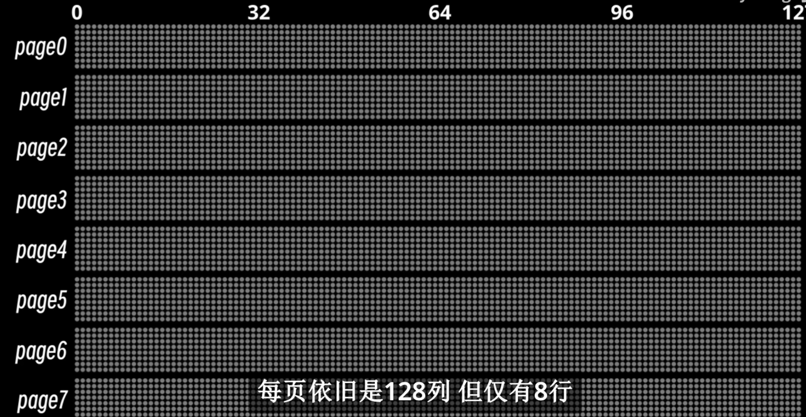

SSD1306 将 128×64 的屏幕纵向划分为 **8个 Page**，每个 Page 高8个像素，即：**Page0～Page7，每个 Page = 128列 × 8行像素。**
因此驱动库中常见的坐标可以理解为：`x = 0~127` 表示横向列坐标，`y = 0~7` 表示 Page 编号。

> 这里的 `y` 并不是单个像素的纵坐标，而是 **Page编号**。一个 Page 包含纵向8个像素。

SSD1306 在这种显示方式下，每写入1字节数据，8个 bit 就可以控制当前列纵向的8个像素。因此：**1字节显示数据 → 当前列8个纵向像素。**

### OLED驱动库
视频已经提供了完整的 OLED 驱动库，实际使用时主要关注**如何把驱动库加入工程以及如何调用其中已经封装好的函数**，不需要自己实现 IIC 时序、SSD1306 命令发送、Page地址设置等底层代码。
驱动库可以简单理解为：
**用户程序 → OLED驱动库 → IIC → SSD1306 → OLED**

### 字模

OLED 并不知道 `'A'`、`'1'` 或汉字本身是什么意思，它最终只认识**哪些像素亮、哪些像素灭**。因此显示文字时，需要提前将字符转换成对应的点阵数据，这些点阵数据就是**字模**。

### 汉字显示与取模

ASCII 字符数量有限，可以直接将常用字符的完整字模保存在 `codetab.h` 中；但汉字数量非常多，不可能全部保存进 STM32，因此一般只对程序实际需要显示的汉字进行取模。

> 注意：OLED取模工具与驱动库：[在线取模工具](https://les.baud-dance.com/)

## 6.2 温湿度计实战（AHT20+OLED）
本节将前面已经学习的 **AHT20 温湿度传感器**与 **OLED 显示库**组合起来，快速制作一个温湿度计。AHT20 和 OLED 都通过 IIC 与 STM32 通信，因此可以挂载在同一条 IIC 总线上，通过不同的设备地址区分。
整个过程为：**AHT20采集温湿度 → STM32读取数据 → `sprintf()`转换为字符串 → OLED显示温湿度**

### CubeMX工程配置
#### 配置外部高速时钟
首先进入 **System Core → RCC**，将：
`High Speed Clock (HSE)` → `Crystal/Ceramic Resonator`
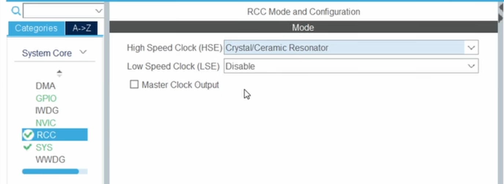

也就是使用开发板上的**外部高速晶振**作为后续系统时钟源。

#### 配置系统时钟
进入 **Clock Configuration**，将：
- `PLL Source Mux` → `HSE`
- `System Clock Mux` → `PLLCLK`
- `HCLK` → `72 MHz`

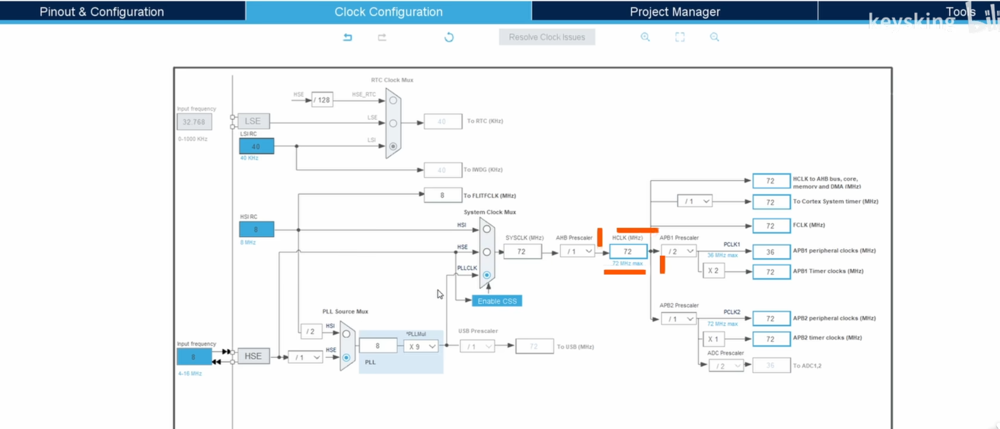

最终使 STM32F103 的系统主频运行在 **72 MHz**。
可以简单理解为：**外部晶振 HSE → PLL倍频 → SYSCLK → HCLK = 72MHz**

> 这一部分虽然和 OLED、AHT20 的功能没有直接关系，但是一个正常工程通常需要先将系统时钟配置好，后面的 IIC、延时等外设都会基于系统时钟工作。

#### 配置I2C1
进入 **Connectivity → I2C1**，将模式设置为：
`I2C`
随后在 `Parameter Settings` 中将：
`I2C Speed Mode` → `Fast Mode`

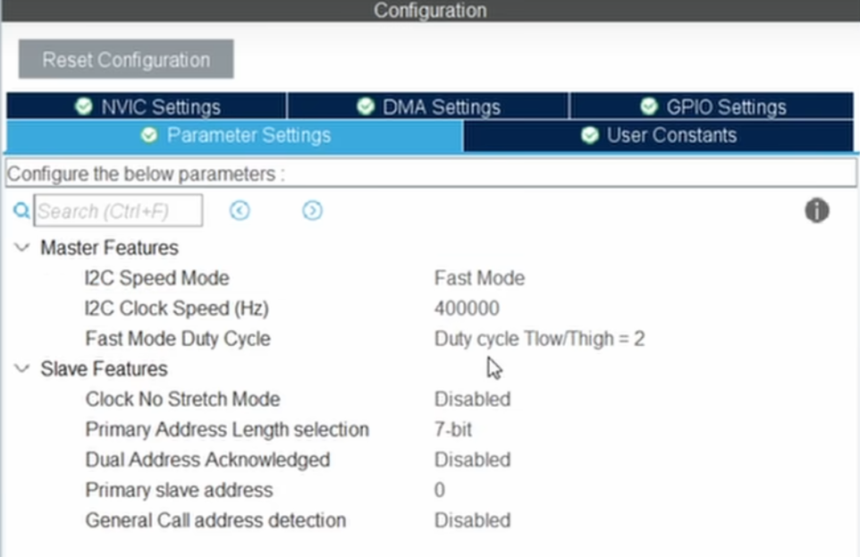

AHT20 和 OLED 都连接在 I2C1 上，因此**只需要配置一组 I2C1，不需要分别为两个设备配置两套 IIC**。
IIC 支持一主多从，因此可以理解为：
**STM32(IIC主机) → I2C1总线 → AHT20 + OLED**
AHT20 和 OLED 具有不同的从机地址，所以 STM32 可以在同一组 `SCL`、`SDA` 上分别与它们通信。

#### Code Generator配置
进入 **Project Manager → Code Generator**，勾选：
`Generate peripheral initialization as a pair of '.c/.h' files per peripheral`
这样生成工程后，I2C 等外设会分别生成对应的 `.c/.h` 文件，方便后面驱动库直接引用。

#### 开启sprintf浮点数支持
本节需要使用 `sprintf()` 将 `float` 类型的温度、湿度转换为字符串，因此需要打开浮点数格式化支持：
**Project → Properties → C/C++ Build → Settings → Tool Settings → MCU Settings → Use float with printf from newlib-nano**
否则：

```c
sprintf(message, "%.1f", temperature);
```

中的 `%f` 可能无法正常输出浮点数。

> 本节**没有使用串口**，开启浮点输出支持是因为 OLED 显示前仍然需要利用 `sprintf()` 把浮点数转换成字符串。

### 导入AHT20与OLED驱动库
视频并不重新编写 AHT20 和 OLED 的底层代码，而是直接使用前面提供好的驱动库。
将源文件放入：
`Core/Src`
例如：
- `aht20.c`
- `oled.c`
- `font.c`

将头文件放入：
`Core/Inc`
例如：
- `aht20.h`
- `oled.h`
- `font.h`

整个程序结构可以理解为：
**main.c → AHT20驱动 / OLED驱动 → HAL I2C → I2C1 → 外部设备**
在 `main.c` 中加入：

```c
/* USER CODE BEGIN Includes */
#include "aht20.h"    // AHT20温湿度传感器驱动
#include "oled.h"     // keysking提供的OLED驱动库
#include <stdio.h>    // sprintf()
/* USER CODE END Includes */
```

### OLED驱动库的使用
keysking 提供的 OLED 库已经将 OLED 底层通信和绘图过程封装完成，因此在 `main.c` 中主要调用几个高级函数即可。

#### OLED_Init
```c
OLED_Init();    // 初始化OLED
```

负责完成 OLED 驱动芯片的初始化，实际使用时不需要自己重新编写 OLED 寄存器初始化代码。
由于单片机启动速度可能比 OLED 上电稳定速度快，所以初始化前先等待一段时间：

```c
HAL_Delay(20);    // 等待OLED上电稳定
OLED_Init();      // 初始化OLED
```

#### OLED_NewFrame
```c
OLED_NewFrame();    // 创建一帧新的空白画面
```

OLED 库会先在 STM32 内存中维护一块**显示缓冲区**。`OLED_NewFrame()` 会清空这一块缓冲区，相当于准备一张新的“画布”。

> `OLED_NewFrame()` 并不会马上更新 OLED 屏幕，只是在内存中准备新的显示内容。

#### OLED_PrintString
用于将字符串绘制到当前显示缓冲区：

```c
OLED_PrintString(0, 16, "Hello", &font16x16, OLED_COLOR_NORMAL); // 在指定位置绘制字符串
```

常见形式：

```c
OLED_PrintString(x, y, str, font, color);
```

| 参数 | 作用 |
|---|---|
| `x` | 起始横坐标 |
| `y` | 起始纵坐标 |
| `str` | 要显示的字符串 |
| `font` | 使用的字体 |
| `color` | 正常显示或反色显示 |

例如 `&font16x16` 表示使用 **16×16 字体**，`OLED_COLOR_NORMAL` 表示正常显示。

#### OLED_ShowFrame
```c
OLED_ShowFrame();    // 将显示缓冲区真正刷新到OLED
```

前面所有 `OLED_PrintString()` 等函数主要是在内存缓冲区中修改画面，最后必须调用 `OLED_ShowFrame()` 才会把这一整帧发送到 OLED。
因此 OLED 显示的基本流程为：
**`OLED_NewFrame()`准备画面 → `OLED_PrintString()`绘制内容 → `OLED_ShowFrame()`刷新屏幕**

> 如果只调用 `OLED_PrintString()` 而没有调用 `OLED_ShowFrame()`，屏幕不会显示最新内容。

### OLED字模与在线取模
OLED 最终显示的是点阵像素，因此中文字符需要提前转换成对应的**字模数据**。ASCII 字符已经包含在 keysking 提供的字体库中，可以直接使用；中文字符数量太多，不会全部存入 STM32，需要把实际使用到的汉字单独取模。
在线取模工具：[波特律动在线取模](https://les.baud-dance.com/)

#### 中文取模
本节需要显示温湿度，因此至少需要准备：
`温`、`湿`、`度`、`℃`
基本流程为：
**打开取模网站 → 输入需要使用的中文字符 → 选择对应字体大小 → 生成字模代码 → 复制字模 → 加入 `font.c`**
同时按照生成的代码和驱动库要求，在 `font.h` 中加入对应声明。

> 不需要把所有汉字全部加入工程，只需要把程序实际显示到的汉字进行取模，可以节省 Flash 空间。

例如最终使用：

```c
OLED_PrintString(0, 16, message_temp, &font16x16, OLED_COLOR_NORMAL);
```

那么 `message_temp` 中出现的中文字符必须已经包含在 `font16x16` 对应的字模中，否则 OLED 无法正确显示这些汉字。

#### ASCII字符
数字、英文字母、空格、冒号、百分号等常见 ASCII 字符，keysking 提供的字体库中已经包含，因此通常不需要另外取模。
所以：`温度: 25.6 ℃`
其中 `温`、`度`、`℃` 需要准备中文字模，而数字、`.`、`:`、空格等可以直接使用字体库已有的 ASCII 字模。

### 初始化
CubeMX 初始化完成后，再初始化 AHT20 和 OLED：

```c
/* USER CODE BEGIN 2 */
AHT20_Init();          // 初始化AHT20温湿度传感器
HAL_Delay(20);         // 等待OLED上电稳定
OLED_Init();           // 初始化OLED
float temperature;     // 保存温度
float humidity;        // 保存湿度
char message_temp[30]; // OLED显示温度字符串
char message_hum[30];  // OLED显示湿度字符串
/* USER CODE END 2 */
```

这里两个模块都使用 I2C1，但它们拥有不同的设备地址，因此不会发生冲突。

### 读取温湿度
前面已经将 AHT20 的底层操作封装到了驱动库中，因此这里只需要：

```c
AHT20_Read(&temperature, &humidity); // 读取当前温度和湿度
```

执行完成后：
- `temperature` 保存实际温度
- `humidity` 保存实际湿度

不需要再在 `main.c` 中重新进行 IIC 收发和原始数据解析。

### sprintf生成OLED字符串
OLED 的字符串显示函数需要接收字符串，而 AHT20 得到的是 `float` 类型，因此使用 `sprintf()` 将数据格式化：

```c
// 将温度转换为字符串，%.1f表示保留1位小数
sprintf(message_temp, "温度: %.1f ℃", temperature);
// 将湿度转换为字符串，%%表示真正输出一个%
sprintf(message_hum, "湿度: %.1f %%", humidity);
```

例如：
`temperature = 25.67` → `"温度: 25.7 ℃"`  
`humidity = 63.24` → `"湿度: 63.2 %"`
这里 `%` 在 `sprintf()` 中本身具有格式控制作用，因此想真正显示一个百分号，需要写成 `%%`。

### OLED显示温湿度
得到两个字符串后，使用 OLED 驱动库进行显示：

```c
OLED_NewFrame(); // 新建一帧空白画面
// 在OLED第16像素高度处显示温度
OLED_PrintString(0, 16,
                 message_temp,
                 &font16x16,
                 OLED_COLOR_NORMAL);
// 在OLED第32像素高度处显示湿度
OLED_PrintString(0, 32,
                 message_hum,
                 &font16x16,
                 OLED_COLOR_NORMAL);
OLED_ShowFrame(); // 将整帧内容刷新到OLED
```

这里温度放在 `y = 16`，湿度放在 `y = 32`，使两个字符串分别显示在不同的位置。

### 主循环完整代码
```c
/* USER CODE BEGIN WHILE */
while (1)
{
    // 从AHT20读取当前温湿度
    AHT20_Read(&temperature, &humidity);
    // 将float类型温湿度转换成OLED需要显示的字符串
    sprintf(message_temp, "温度: %.1f ℃", temperature);
    sprintf(message_hum, "湿度: %.1f %%", humidity);
    // 创建一帧新的OLED画面
    OLED_NewFrame();
    // 显示温度
    OLED_PrintString(0, 16,
                     message_temp,
                     &font16x16,
                     OLED_COLOR_NORMAL);
    // 显示湿度
    OLED_PrintString(0, 32,
                     message_hum,
                     &font16x16,
                     OLED_COLOR_NORMAL);
    // 将当前缓冲区中的整帧画面刷新到OLED
    OLED_ShowFrame();
    HAL_Delay(1000); // 每隔1s重新读取并刷新一次
}
/* USER CODE END WHILE */
```

整个程序不需要自己编写 AHT20 和 OLED 的底层通信，只需要调用已经封装好的驱动接口：
**`AHT20_Read()`负责获得数据 → `sprintf()`负责转换字符串 → OLED驱动库负责显示**

### 本节整体流程
CubeMX 部分：
**开启HSE → 系统时钟配置为72MHz → 开启I2C1 Fast Mode → 生成工程**
代码部分：
**导入AHT20库 + OLED库 + 字体库 → 为“温湿度℃”取模 → 初始化AHT20 → 初始化OLED → 读取温湿度 → `sprintf()`生成字符串 → `OLED_NewFrame()` → `OLED_PrintString()` → `OLED_ShowFrame()`**

> **AHT20和OLED都属于IIC从机，可以共用同一个I2C1；STM32根据不同设备地址选择需要通信的设备。**

> **keysking提供的OLED库已经封装好了OLED底层驱动，实际使用时重点掌握 `OLED_Init()`、`OLED_NewFrame()`、`OLED_PrintString()`、`OLED_ShowFrame()` 以及字模的添加方法即可。**

# 7 定时器

## 7.1 时钟树与时钟源

在正式学习定时器之前，首先需要知道 STM32 中的**时钟是怎么产生的，以及时钟最终是怎么送到 CPU 和各个外设的**。

### 为什么需要时钟

STM32 芯片内部存在大量逻辑电路，数字信号需要经过不同的逻辑门才能得到最终结果。但是现实中的逻辑门并不能瞬间完成运算，而是存在一定的**传播延迟**。
例如视频中给出的逻辑电路，在输入发生改变以后，前面的逻辑门和后面的逻辑门并不会同时改变输出，因此在最终结果稳定以前可能短暂出现一个错误的**过渡状态**。
如果寄存器在这个过渡状态中读取数据，就可能把错误结果保存下来。

#### 边沿触发器

为了解决这个问题，可以让寄存器并不是随时读取输入，而是只在某一个规定的时刻读取，例如只在**上升沿**到来时读取。
于是加入边沿触发器以后可以理解为：
**逻辑电路进行运算 → 等待结果稳定 → 时钟上升沿到来 → 寄存器读取并保存结果**
只要给逻辑电路留下足够的运算时间，就可以避开中间的过渡状态。视频就是通过这里引出了一个周期性变化的方波信号，也就是**时钟信号**。([博客园][2])

### 时钟信号

时钟信号通常是一个周期性的方波：
一个完整方波所需要的时间称为周期 `T`，单位通常为秒；每秒重复多少次称为频率 `f`，单位为 Hz。
\(f=\frac{1}{T}\)

### 时钟源

既然 STM32 需要持续的时钟信号，就需要有能够周期性产生信号的电路，这就是**时钟源**。
STM32F103 中主要存在：

| 时钟源   | 全称                  | 类型     |
| ----- | ------------------- | ------ |
| `HSE` | High Speed External | 外部高速时钟 |
| `LSE` | Low Speed External  | 外部低速时钟 |
| `HSI` | High Speed Internal | 内部高速时钟 |
| `LSI` | Low Speed Internal  | 内部低速时钟 |

#### 外部高速时钟HSE

HSE 来自 STM32 外部的高速时钟电路，常见开发板使用外部晶振产生。STM32F103 开发板通常使用 **8MHz 外部晶振**。
外部晶振的优点是频率比较稳定、精度较高，因此通常使用 HSE 作为系统高速时钟的基础。

##### 外部晶振模式

在 CubeMX 的 RCC 中经常可以看到：
`Crystal/Ceramic Resonator`
这种方式使用的是**无源晶振**，需要 STM32 内部的振荡电路配合外部晶振一起产生时钟。

##### 外部时钟模式

还可以选择：
`Bypass Clock Source`
这种情况下外部已经有其他电路产生了完整的时钟信号，直接输入 STM32，因此不再需要 STM32 自身配合晶振振荡。

#### 外部低速时钟LSE

LSE 通常使用 **32.768kHz** 外部晶振，主要为 RTC 实时时钟等需要低速且较准确时钟的模块提供时钟。
\(32768=2^{15}\)
因此 `32.768kHz` 可以比较方便地不断进行二分频，最终得到 `1Hz`，也就是每秒一次的时钟。([博客园][2])

#### 内部高速时钟HSI

HSI 由 STM32 芯片内部的 **RC 振荡器**产生，STM32F103 中为 **8MHz**。
相比 HSE，它不需要外接晶振，芯片本身就能够产生。STM32 上电启动时可以先直接使用 HSI，因此即使没有配置外部晶振，芯片也能够启动运行。([博客园][2])
但内部 RC 振荡器的时钟精度一般不如外部晶振，所以正常需要较稳定的高速系统时钟时通常会使用 HSE。

#### 内部低速时钟LSI

LSI 同样来自芯片内部的 RC 振荡器，STM32F103 中频率约为 **40kHz**，主要可以为独立看门狗等模块提供时钟。
所以四种基础时钟源可以概括为：

|    | 内部  | 外部  |
| -- | --- | --- |
| 高速 | HSI | HSE |
| 低速 | LSI | LSE |

### PLL锁相环

开发板上的 HSE 通常只有 `8MHz`，但是 STM32F103 可以运行到 `72MHz`。如果只使用原始 HSE，显然无法得到这么高的频率，因此需要利用 **PLL（Phase Locked Loop，锁相环）**进行倍频。
可以暂时把 PLL 理解成：
**输入时钟 → PLL倍频 → 更高频率的时钟**
例如：
\(8MHz\times9=72MHz\)
因此开发板上非常常见的一条路径就是：
**HSE 8MHz → PLL ×9 → 72MHz**
PLL 自身并不是像 HSI、HSE 一样从零产生时钟，而是需要先使用已有时钟作为输入，再进行倍频。STM32F1 的 PLL 可以使用 HSI 或 HSE 相关时钟作为输入。

### STM32时钟树

有了不同的时钟源之后，还需要把时钟送给 STM32 内部不同的模块。但是 CPU、总线、ADC、定时器等并不一定需要完全相同的频率，所以 STM32 使用大量的**选择器、倍频器和分频器**处理这些时钟。
最终形成的结构就像一棵树，因此叫做**时钟树**。

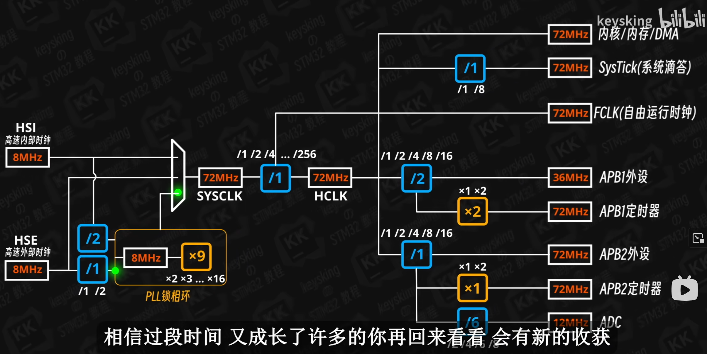

### SYSCLK系统时钟

首先 HSI、HSE、PLL 等时钟经过选择以后，可以得到：
**SYSCLK（System Clock，系统时钟）**
SYSCLK 可以从不同的来源中选择，常见的就是：
**HSI / HSE / PLLCLK → SYSCLK**

### AHB总线与HCLK

SYSCLK 接下来经过 **AHB Prescaler**，也就是 AHB 预分频器，得到：**HCLK**
HCLK 会继续提供给 CPU、存储器、DMA 等高速模块。

### APB1和APB2总线
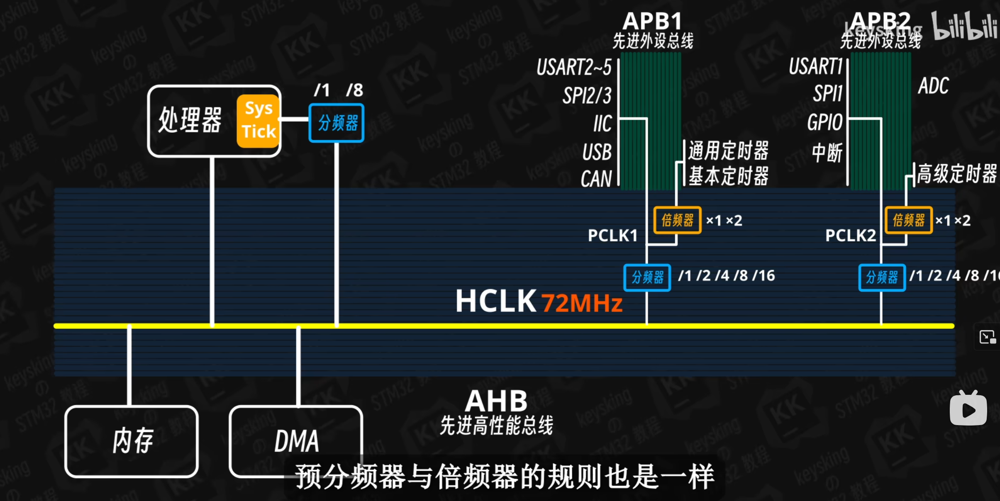
HCLK 接下来又分别进入 APB1 和 APB2 的预分频器，从而得到两个主要的外设总线时钟：
**HCLK → APB1 Prescaler → PCLK1**
**HCLK → APB2 Prescaler → PCLK2**

#### APB1

APB1 属于低速外设总线，STM32F103 中最大频率为 **36MHz**，很多普通外设连接在 APB1 上，例如部分 USART、IIC 和通用定时器。([博客园][3])
常见配置为：

#### APB2

APB2 属于高速外设总线，STM32F103 中可以工作到 **72MHz**，GPIO、USART1、部分高级外设等连接在这里。

### 定时器时钟的特殊处理

这里也是后面学习定时器非常重要的一点。
虽然 APB1 的 `PCLK1` 为 `36MHz`，但是挂载在 APB1 上的定时器并不一定只能获得 `36MHz`。
STM32 对 APB 上的定时器有一个特殊规则：
**如果 APB 预分频系数为 1 → 定时器时钟 = PCLK**
**如果 APB 预分频系数不为 1 → 定时器时钟 = PCLK × 2**
APB2 常见配置为 `/1`，因此：
**PCLK2 = 72MHz → 定时器不需要再×2 → TIM1时钟仍为72MHz**

> 所以以后计算定时器时，不能只看 `PCLK1/PCLK2`，还需要看 **APB预分频系数**。

### 时钟树的整体关系

按照视频前面的内容一路连接起来：
**时钟是数字电路的工作节拍 → 时钟源产生时钟 → PLL可以对时钟进行倍频 → SYSCLK选择系统时钟 → AHB产生HCLK → APB1/APB2产生外设时钟 → 时钟最终送到各个外设**

# 8 定时器
## 8.1 基本定时功能
TIM 是 **Timer（定时器）** 的缩写。定时器本质上就是一个能够按照一定频率自动计数的硬件外设，当计数达到设定值时可以产生事件甚至触发中断。本节先理解定时器的基本计数过程，然后**不开启中断观察 CNT 计数值**，最后开启定时器中断，实现：**TIM2每隔1s产生一次中断 → 在中断回调中通过串口发送一次消息。**

### STM32中的定时器
STM32 中的定时器主要可以分为：

| 类型 | 特点 |
|---|---|
| 基本定时器 | 主要完成基本定时功能 |
| 通用定时器 | 在基本定时基础上增加输入捕获、输出比较、PWM等功能 |
| 高级定时器 | 在通用定时器基础上进一步增加高级控制功能 |

不同定时器具体功能不同，但是它们实现基本定时时都离不开**时钟源、预分频器、计数器和自动重装载寄存器**。

### 定时器的基本结构
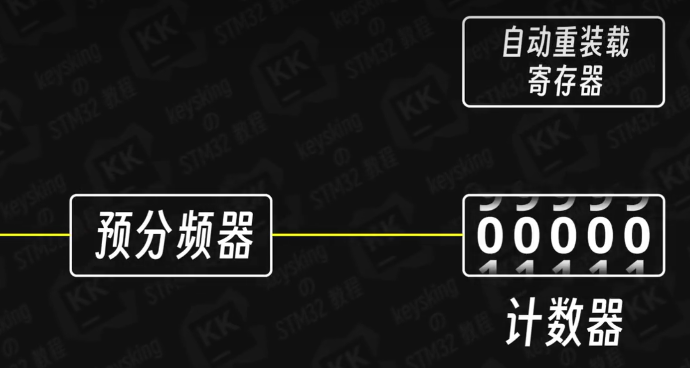

暂时忽略框图中的其他功能，实现基本定时主要经过：
**内部时钟 `CK_INT` → 预分频器 PSC → 计数时钟 `CK_CNT` → 计数器 CNT → 自动重装载寄存器 ARR → 更新事件**

#### 影子寄存器
观察定时器框图可以发现，PSC、ARR 等位置存在对应的**影子寄存器（Shadow Register）**。可以简单理解为：程序写入的寄存器值和定时器硬件当前真正使用的值之间，还存在一层缓冲。
基本关系可以理解为：
**程序写入预装载寄存器 → 在合适的时刻更新影子寄存器 → 定时器实际使用影子寄存器中的值**
设置影子寄存器的主要原因是：**防止定时器正在进行一个计数周期时，参数突然改变，从而破坏当前计数周期。**
例如定时器原本按照某个 PSC 值进行分频，如果程序在计数到一半时修改 PSC，并且新值立即生效，那么同一个计数周期前后使用的计数频率就不同，定时时间会变得不完整。因此可以先保存新值，等到产生更新事件时再统一让新参数生效。

##### PSC的影子寄存器
PSC（预分频器）具有缓冲机制。程序修改 PSC 后，新的值不会直接改变当前正在工作的分频器，而是在**更新事件**发生时装载到影子寄存器中。
因此：
**程序写PSC → 新值暂时保存 → 产生更新事件 → 新PSC装入影子寄存器 → 新分频系数生效**
例如原来：
```c
PSC = 7199;    // 7200分频
```

运行过程中改为：

```c
PSC = 3599;    // 希望改为3600分频
```

新的 PSC 一般要等更新事件发生后才真正用于后续计数。

> **PSC寄存器中的值和当前实际参与分频的值不一定在修改后立即同步。**

##### ARR的影子寄存器

ARR（自动重装载寄存器）也具有预装载和影子寄存器机制，不过是否等待更新事件生效受到 **ARPE（Auto-Reload Preload Enable）**控制。
在 CubeMX 中对应：
`Auto-reload preload`
当 ARR 预装载关闭时，修改 ARR 后新的值可以较快参与工作；当 ARR 预装载开启时，新值先保存在预装载寄存器中，等更新事件发生后再装入影子寄存器。
可以理解为：
**ARR预装载关闭 → 修改ARR → 新值直接更新实际使用值**
**ARR预装载开启 → 修改ARR → 等待更新事件 → 新值进入影子寄存器 → 新ARR生效**

##### 更新事件的作用

因此 Update Event 不只是“CNT计满了”的标志，它还承担了**更新部分影子寄存器**的作用。
可以理解为：
**CNT完成一个周期 → 产生更新事件 → CNT重新开始 + 更新需要同步的PSC/ARR等参数**

> **影子寄存器的核心作用就是缓冲和同步更新参数，避免在一个计数周期中途突然改变定时器工作状态。**

#### 时钟源

定时器要计数，首先需要一个时钟。本节使用 **Internal Clock（内部时钟）**，也就是 `CK_INT`。根据上一节的时钟树，TIM2 位于 APB1，而 APB1 预分频不为1时，定时器时钟会自动 ×2，所以本节 TIM2 最终获得：
\(f_{TIM2}=72MHz\)

#### 预分频器PSC

72MHz 的时钟直接用于计数速度太快，所以首先经过 **PSC（Prescaler，预分频器）**分频：
\(f_{CK\_CNT}=\frac{f_{TIM}}{PSC+1}\)
例如：
\(PSC=7200-1=7199\)
则：
\(f_{CK\_CNT}=\frac{72MHz}{7200}=10kHz\)
所以 CNT 每：
\(\frac{1}{10000}s=0.1ms\)
计数一次。
这里要注意：
`PSC = 0` → 1分频
`PSC = 1` → 2分频
`PSC = 2` → 3分频
`PSC = 7199` → 7200分频
因此实际分频系数始终为：
\(PSC+1\)

> **PSC决定计数器“多久加一次”。**

#### 计数器CNT与ARR

经过 PSC 分频后的时钟进入 **CNT（Counter，计数器）**。本节采用向上计数模式，每出现一个 `CK_CNT`，CNT 加1：
**0 → 1 → 2 → 3 → ……**
CNT 数到哪里由 **ARR（Auto-Reload Register，自动重装载寄存器）**决定。
例如：
`ARR = 9`
则 CNT：
**0 → 1 → 2 → …… → 9 → 溢出 → 重新从0开始**
虽然 ARR 为9，但实际上经历了10次计数，所以：
\(计数次数=ARR+1\)
如果需要计数10000次：
\(ARR=10000-1=9999\)

> **PSC决定“多久计一次”，ARR决定“一共计多少次”，CNT表示“当前已经计到多少”。**

#### 更新事件

CNT 达到 ARR 并溢出后会产生一次 **Update Event（更新事件）**。更新事件发生后，一方面 CNT 重新开始下一轮计数，另一方面需要更新的预装载值会传入对应的影子寄存器，使新的 PSC、ARR 等参数在合适的时刻生效。
如果同时开启更新中断，更新事件还可以进一步产生定时器中断。
因此：
**CNT达到ARR → 产生更新事件 → CNT重新开始 + 更新影子寄存器**
开启中断以后：
**CNT达到ARR → 更新事件 → 更新中断 → CPU处理中断**

### 定时时间计算

定时器更新频率为：
\(f_{update}=\frac{f_{TIM}}{(PSC+1)(ARR+1)}\)
对应的定时时间：
\(T=\frac{(PSC+1)(ARR+1)}{f_{TIM}}\)
本节希望每 `1s` 完成一次计数周期，设置：
\(PSC=7200-1\)
\(ARR=10000-1\)
则：
\(T=\frac{7200\times10000}{72\times10^6}=1s\)
也可以分两步理解：
**72MHz → PSC进行7200分频 → 10kHz → CNT每0.1ms加1 → CNT计10000次 → 1s**

### CubeMX配置

本节需要使用 **TIM2 + USART2**：TIM2负责硬件计时，USART2在后面的中断实验中负责向电脑发送消息。

#### 配置RCC时钟源

进入 **Pinout & Configuration → System Core → RCC**，将：
`High Speed Clock (HSE)` → `Crystal/Ceramic Resonator`

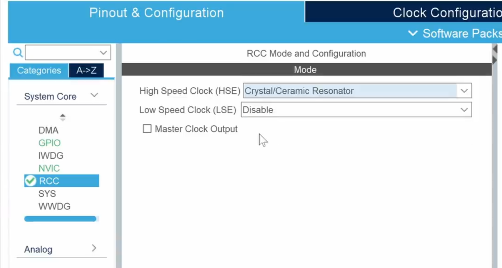

表示使用开发板上的**外部高速晶振**作为系统高速时钟源。

#### 配置系统时钟

进入 **Clock Configuration**，将：
`HCLK (MHz)` → `72`
CubeMX 会自动配置对应的 PLL，使：
**HSE 8MHz → PLL ×9 → SYSCLK 72MHz → HCLK 72MHz**

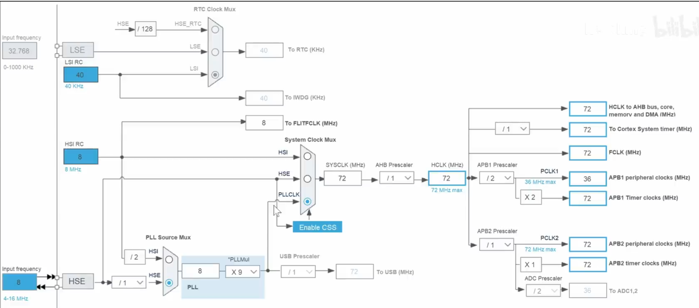

此时：
**APB1 → 36MHz**
**APB2 → 72MHz**
TIM2 位于 APB1，总线时钟 `PCLK1 = 36MHz`。由于 APB1 的预分频系数不为1，定时器时钟自动 ×2：
\(f_{TIM2}=36MHz\times2=72MHz\)
所以后面计算 PSC 和 ARR 时使用：
\(f_{TIM2}=72MHz\)

> **一定要先确定定时器实际得到的时钟频率，再计算 PSC 和 ARR。**

#### 配置USART2

进入 **Connectivity → USART2**：
`Mode` → `Asynchronous`
串口配置与前面章节相同，使用：
**115200，8N1**
这里只使用 USART2 发送消息，所以后面直接调用：

```c
HAL_UART_Transmit();
```

**不需要开启 USART2 的 NVIC 中断。**

#### 配置TIM2

进入 **Timers → TIM2**：
`Clock Source` → `Internal Clock`

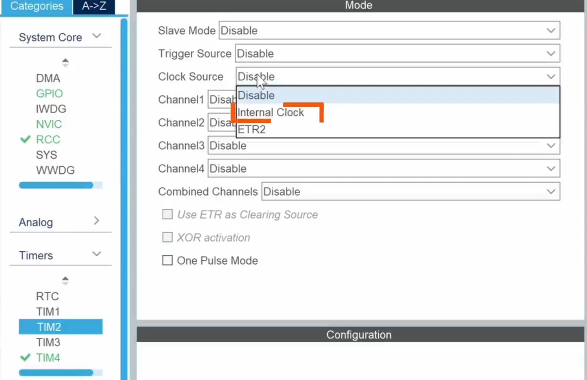

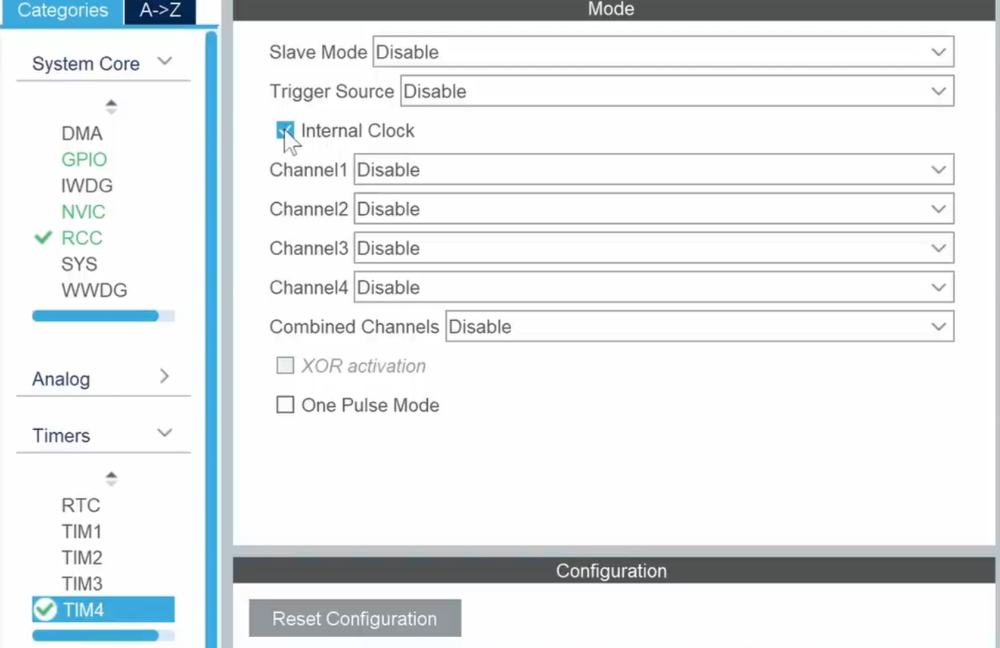

随后配置 TIM2 参数：

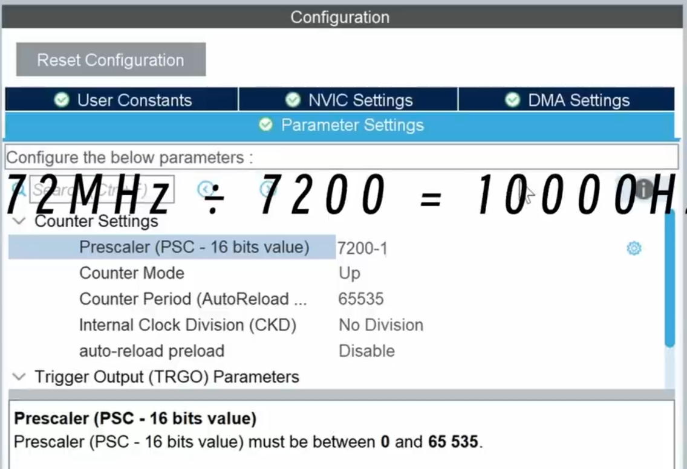

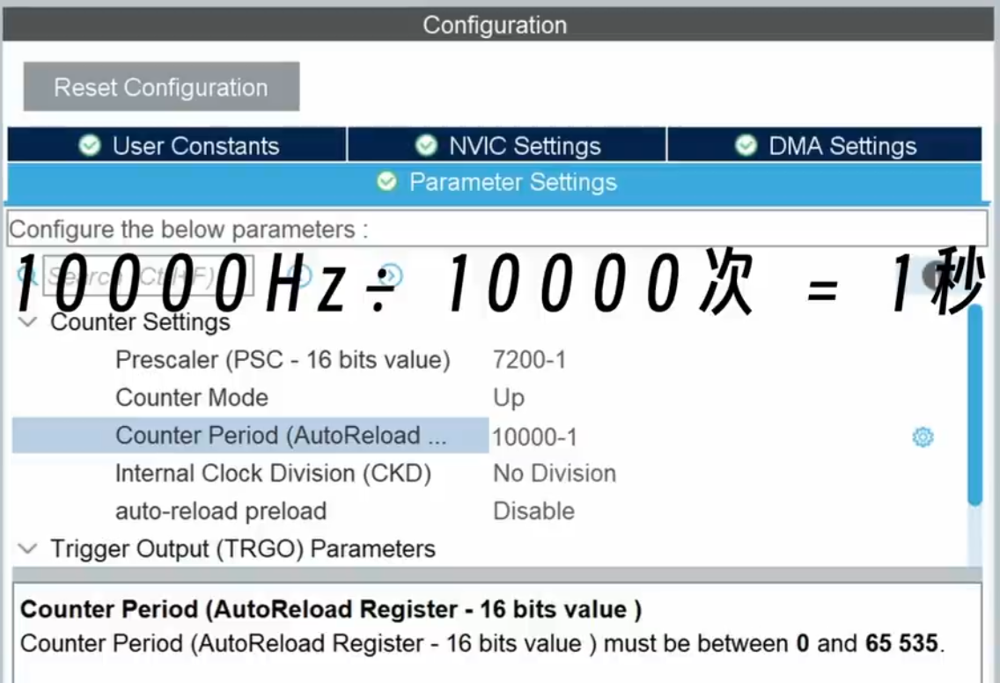

主要参数：

| 参数                  |        设置 | 作用                    |
| ------------------- | --------: | --------------------- |
| Prescaler           |  `7200-1` | 72MHz进行7200分频，得到10kHz |
| Counter Mode        |      `Up` | CNT向上计数               |
| Counter Period      | `10000-1` | CNT计数10000次           |
| Clock Division      |    `DIV1` | 保持默认                  |
| Auto-reload preload |     按视频设置 | 控制ARR预装载机制            |

所以：
**TIM2 72MHz → PSC分频 → 10kHz → CNT每0.1ms加1 → CNT计10000次 → 1s完成一个周期**

### 不开启中断观察CNT计数

视频这里并没有马上开启 TIM2 中断，而是先让定时器单独运行，通过程序读取 CNT，观察定时器是不是真的在计数。
此时 **TIM2 → NVIC Settings 暂时不要勾选 `TIM2 global interrupt`**。

#### 启动普通定时器

CubeMX 会自动生成：

```c
MX_TIM2_Init();    // 初始化TIM2参数
```

但是初始化并不等于启动，所以还需要：

```c
/* USER CODE BEGIN 2 */
HAL_TIM_Base_Start(&htim2);    // 启动TIM2，只进行计数，不开启中断
/* USER CODE END 2 */
```

`HAL_TIM_Base_Start()` 执行以后，TIM2 开始按照配置好的 PSC 和 ARR 自动计数。

#### 使用宏读取CNT

HAL 提供：

```c
__HAL_TIM_GET_COUNTER(&htim2);
```

用于读取定时器当前 CNT 寄存器的值。


先定义变量：

```c
/* USER CODE BEGIN PV */
uint32_t counterValue = 0;    // 保存TIM2当前CNT值
/* USER CODE END PV */
```

在 `while(1)` 中不断读取：

```c
/* USER CODE BEGIN WHILE */
while (1)
{
    // 读取TIM2当前CNT计数值
    counterValue = __HAL_TIM_GET_COUNTER(&htim2);
    /* USER CODE END WHILE */
    /* USER CODE BEGIN 3 */
}
/* USER CODE END 3 */
```

进入 Debug 后观察 `counterValue`，可以看到 CNT 不断变化：
**0 → 1 → 2 → …… → 9999 → 0 → 1 → ……**
因为：
\(f_{CK\_CNT}=10kHz\)
所以 CNT 每：
\(0.1ms\)
加1，累计10000次：
\(0.1ms\times10000=1s\)
然后产生更新事件并重新从0计数。
所以这一阶段可以直接验证：
**PSC控制计数速度 → CNT保存当前计数值 → ARR决定CNT什么时候重新开始**

> `__HAL_TIM_GET_COUNTER()` 只是读取 CNT 当前值，并不会影响定时器本身继续计数。

### 开启TIM2中断

确认 TIM2 可以正常计数以后，再让定时器在计满时**主动通知CPU**。
进入：
**TIM2 → NVIC Settings**
勾选：
`TIM2 global interrupt`

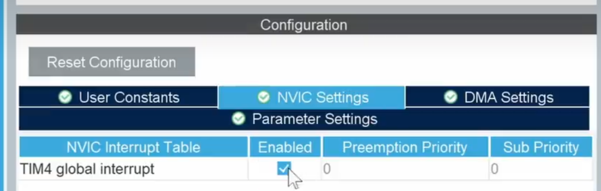

此时把原来的：

```c
HAL_TIM_Base_Start(&htim2);       // 只启动定时器
```

修改为：

```c
HAL_TIM_Base_Start_IT(&htim2);    // 启动TIM2并开启更新中断
```

两者区别：

| 函数                        | 作用             |
| ------------------------- | -------------- |
| `HAL_TIM_Base_Start()`    | 启动定时器，只进行计数    |
| `HAL_TIM_Base_Start_IT()` | 启动定时器，同时开启更新中断 |

其中：
`Base` → 基本定时功能
`Start` → 启动定时器
`IT` → Interrupt，中断模式
所以视频中的学习过程实际上是：
**`HAL_TIM_Base_Start()` → 主动读取CNT观察计数 → 开启NVIC → `HAL_TIM_Base_Start_IT()` → CNT计满后产生中断**

### 定时器中断与回调

TIM2 每计满1s产生一次更新中断，CPU 首先进入：

```c
void TIM2_IRQHandler(void)
{
    HAL_TIM_IRQHandler(&htim2);    // 交给HAL库处理TIM2中断
}
```

`HAL_TIM_IRQHandler()` 对定时器中断进行判断和处理，随后调用周期完成回调：

```c
HAL_TIM_PeriodElapsedCallback();
```

因此整个调用关系为：
**TIM2计满 → 更新事件 → 更新中断 → `TIM2_IRQHandler()` → `HAL_TIM_IRQHandler()` → `HAL_TIM_PeriodElapsedCallback()`**

### 定时器周期发送串口消息

先准备需要发送的消息：

```c
/* USER CODE BEGIN PV */
uint8_t message[] = "Hello World\r\n";    // 定时器每到1s发送一次
/* USER CODE END PV */
```

然后重新实现定时器周期完成回调：

```c
/* USER CODE BEGIN 4 */
void HAL_TIM_PeriodElapsedCallback(TIM_HandleTypeDef *htim)
{
    // HAL中的定时器共用该回调，先判断中断来源
    if (htim == &htim2)
    {
        // TIM2每隔1s进入一次，通过USART2发送消息
        HAL_UART_Transmit(&huart2,
                          message,
                          sizeof(message) - 1,    // 不发送字符串末尾的'\0'
                          100);
    }
}
/* USER CODE END 4 */
```

主程序中只需要启动一次 TIM2：

```c
/* USER CODE BEGIN 2 */
HAL_TIM_Base_Start_IT(&htim2);    // 启动TIM2及更新中断
/* USER CODE END 2 */
/* USER CODE BEGIN WHILE */
while (1)
{
    // TIM2由硬件自动计数，主循环可以执行其他任务
}
/* USER CODE END WHILE */
```

烧录并打开串口调试助手后，可以看到 STM32 **每隔1s发送一次 `"Hello World"`**。
整个过程：
**TIM2开始计数 → CNT每0.1ms加1 → CNT计满10000次 → 1s产生更新中断 → `HAL_TIM_PeriodElapsedCallback()` → USART2发送消息 → TIM2继续下一轮计数**

### 普通计数与中断方式

前面的 CNT 观察实验属于主动查询：

```c
while (1)
{
    counterValue = __HAL_TIM_GET_COUNTER(&htim2);    // CPU主动读取CNT
}
```

此时 TIM2 自己一直在计数，只是 CPU 需要主动读取才能知道当前数到了哪里。
开启中断后：

```c
HAL_TIM_Base_Start_IT(&htim2);
```

CPU 不需要不断检查 CNT，TIM2 计满后会主动产生中断。
因此：
**普通启动 → TIM自动计数，CPU主动读取CNT**
**中断启动 → TIM自动计数，计满后主动通知CPU**
这个思想和前面串口的轮询、中断模式类似：
**轮询 → CPU主动检查外设**
**中断 → 外设发生事件后主动通知CPU**

### 为什么使用定时器而不是HAL_Delay

以前如果想每隔1s发送一次消息，可以：

```c
while (1)
{
    // 发送串口消息
    HAL_UART_Transmit(&huart2,
                      message,
                      sizeof(message) - 1,
                      100);
    HAL_Delay(1000);    // 等待1s
}
```

这种方式程序执行到 `HAL_Delay(1000)` 后需要等待延时结束，再继续执行后面的主循环代码。
使用硬件定时器以后：

```c
HAL_TIM_Base_Start_IT(&htim2);
```

TIM2 可以独立计数，主循环可以继续执行其他任务，只有1s计满时才通过中断让 CPU 执行对应代码。
所以可以理解为：
**`HAL_Delay()` → 主程序通过延时控制时间**
**TIM定时器 → 定时器硬件自己计时，时间到后通知CPU**

### 本节完整流程

#### 第一阶段：理解定时器结构

**定时器框图 → 影子寄存器 → 时钟源 → PSC预分频 → CNT计数 → ARR控制计数周期 → 更新事件**

#### 第二阶段：观察CNT计数

**配置RCC与72MHz时钟 → 配置USART2 → 配置TIM2 → 暂不开启TIM2中断 → `HAL_TIM_Base_Start()` → `while`中调用 `__HAL_TIM_GET_COUNTER()` → 观察CNT从0计数到9999后重新开始**

#### 第三阶段：使用定时器中断

**开启 `TIM2 global interrupt` → 将启动函数改为 `HAL_TIM_Base_Start_IT()` → TIM2硬件计数 → 1s产生更新中断 → `HAL_TIM_PeriodElapsedCallback()` → USART2发送消息**

### 本节核心

基本定时过程：
**`CK_INT` → PSC预分频 → `CK_CNT` → CNT计数 → 达到ARR → 更新事件**
更新事件还会负责：
**CNT重新开始 + 更新相关影子寄存器 + 在开启中断时产生更新中断**
定时时间：
\(T=\frac{(PSC+1)(ARR+1)}{f_{TIM}}\)
本节配置：
**72MHz → `PSC=7199` → 10kHz → `ARR=9999` → 1s完成一个计数周期**
普通计数：

```c
HAL_TIM_Base_Start(&htim2);    // 启动TIM2，不开启中断
counterValue = __HAL_TIM_GET_COUNTER(&htim2);    // 读取当前CNT值
```

中断方式：

```c
HAL_TIM_Base_Start_IT(&htim2);    // 启动TIM2及更新中断
```

周期回调：

```c
void HAL_TIM_PeriodElapsedCallback(TIM_HandleTypeDef *htim)
{
    if (htim == &htim2)
    {
        // TIM2每完成一个周期后执行
    }
}
```

> **PSC决定计数速度，ARR决定一个周期需要计多少次，CNT保存当前已经计到哪里。**

> **影子寄存器负责缓冲和同步更新参数，使PSC、ARR等配置能够在合适的时刻生效，避免破坏正在进行的计数周期。**

> **`HAL_TIM_Base_Start()`只启动计数，可以使用 `__HAL_TIM_GET_COUNTER()`主动查看CNT；`HAL_TIM_Base_Start_IT()`进一步开启更新中断，计满以后由定时器主动通知CPU。**

> **本节最终效果：先观察TIM2的CNT实际计数过程，再开启TIM2更新中断，使其每隔1s通过USART2发送一次消息。**

## 8.2 外部时钟与循迹模块
上一节使用定时器的**内部时钟**进行计数，本节进一步学习定时器的**外部时钟**：不再按照 STM32 内部固定频率计数，而是让外部设备产生脉冲，**外部每产生一个有效脉冲，定时器 CNT 就进行一次计数**。最后利用循迹模块检测传送带上的黑白条纹，将产生的方波作为 TIM2 的外部时钟，实现传送带运动距离与速度的测量。

### 定时器的外部时钟
上一节的基本定时过程为：
**内部时钟 `CK_INT` → PSC → CNT → ARR**
但对于通用定时器和高级定时器，时钟并不一定来自 STM32 内部，也可以来自 GPIO 外部输入。

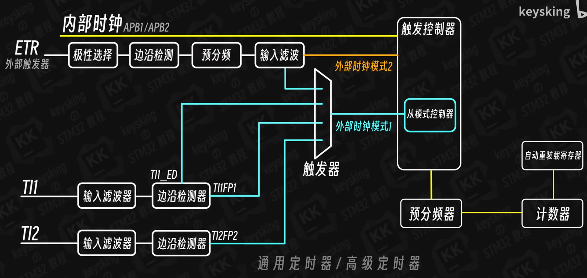

#### 定时器输入通道
通用定时器存在 `TI1`、`TI2`、`TI3`、`TI4` 等输入通道，其中 `TI1` 和 `TI2` 还能进入定时器的触发控制部分。
外部 GPIO 信号在真正进入定时器之前，会经过**输入滤波器和边沿检测器**：
**GPIO外部信号 → 输入滤波 → 边沿检测 → 产生内部脉冲**
输入滤波器用于过滤外部信号中的毛刺和抖动；边沿检测器则用于决定什么时候产生一个有效脉冲，例如：
- 上升沿触发：检测到 `0 → 1` 时产生脉冲；
- 下降沿触发：检测到 `1 → 0` 时产生脉冲；
- 双边沿触发：两种边沿都可以产生脉冲。

对于 TI1、TI2，可以看到一些经过处理后的内部信号，例如：
`TI1FP1`、`TI2FP2`、`TI1F_ED`
其中 `FP` 可以理解为经过滤波、极性等处理后的信号，`ED` 表示 Edge Detector，即边沿检测。

#### 外部时钟模式1
这些经过处理的输入信号可以进入**触发选择器**，选择其中一路形成：
`TRGI（Trigger Input）`
随后 TRGI 进入**从模式控制器**。当从模式控制器被设置为 External Clock Mode 1 时，TRGI 就不再只是一个普通触发信号，而是作为 CNT 的计数时钟。
因此外部时钟模式1可以简单理解为：
**外部/内部触发信号 → 触发选择器 → TRGI → 从模式控制器 → CNT计数**
外部时钟模式1的来源比较多，例如：
- `ETR` 外部触发引脚；
- `TI1FP1`；
- `TI2FP2`；
- `TI1F_ED`；
- `ITR0~ITR3`，即来自其他定时器的内部触发信号。

其中 ITR 可以用于**定时器之间的连接和级联**，这部分会在后面的定时器从模式中继续学习。

#### 外部时钟模式2
除了通过 TRGI 进入从模式控制器以外，STM32 还给 `ETR（External Trigger）` 提供了一条更加直接的路径。


ETR 外部信号首先经过：
**ETR引脚 → 极性选择/预分频 → 输入滤波 → ETRF**
然后直接作为定时器的计数时钟，这就是：
**External Clock Mode 2（外部时钟模式2）**
可以理解为：
**ETR外部脉冲 → 滤波与边沿处理 → 定时器计数时钟 → CNT**
与模式1相比，模式2不需要先经过触发选择器和从模式控制器，路径更加直接。因此如果只是想让定时器**对某一个外部设备产生的脉冲进行计数**，使用 ETR 的外部时钟模式2更加简单。

> **外部时钟模式1：通过 TRGI + 从模式控制器进入定时器，可以选择多种触发源。**
>
> **外部时钟模式2：ETR直接作为定时器外部时钟，适合简单的外部脉冲计数。**

### 循迹模块
理解外部时钟以后，视频使用**循迹模块**产生实际的外部脉冲。
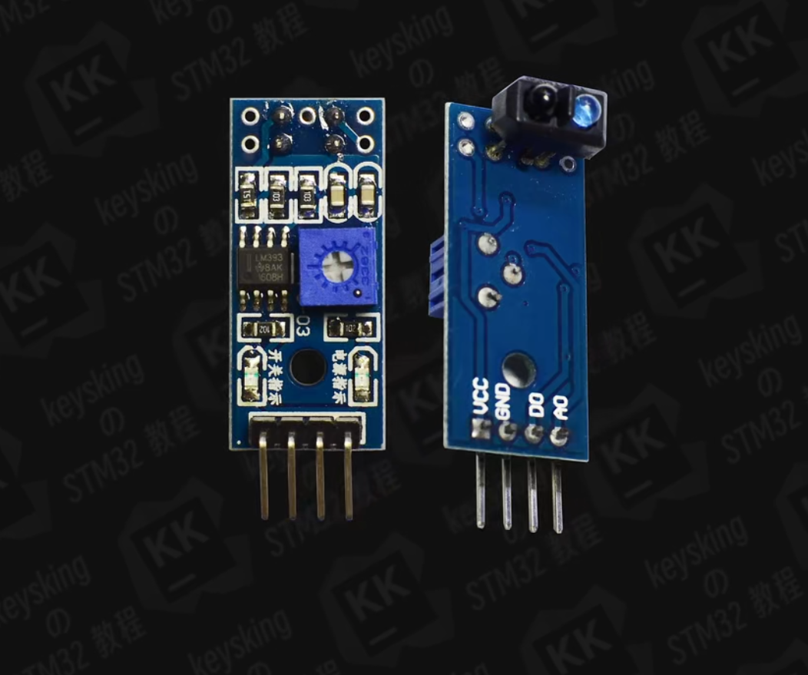

循迹模块主要由**红外发射管、红外接收管、比较电路和电位器**组成。透明的红外发射管向外发射红外光，旁边的接收管检测反射回来的红外光强度。
使用时将循迹模块的 `AO` 引脚与定时器的输入引脚相接即可，例如 定时器为 TIM2时，使用ETR2、ETR1、TF1时 应与 `PA0` 引脚相连接；使用  TF2时 应与 `PA1` 引脚相连接。

#### 黑色与白色的区别
白色物体对红外光的反射能力较强，黑色物体会吸收更多红外光，因此接收管获得的红外光强度不同。
模块一般提供：
- `AO`：模拟量输出，反映实际检测到的红外光强度；
- `DO`：数字量输出，将检测值与设定阈值比较后输出高低电平。

模块上的电位器用于调整**比较阈值，也就是检测灵敏度**。
对于本节使用的模块：
**检测到物体/白色 → 红外反射较强 → 模块指示灯亮 → DO输出低电平**
**没有物体/检测到黑色 → 红外反射较弱 → 模块指示灯灭 → DO输出高电平**
所以当黑色、白色不断从循迹模块下面经过时：
**白 → 黑 → 白 → 黑 → ……**
DO 就会不断输出：
**低 → 高 → 低 → 高 → ……**
也就是产生一个**方波信号**。波特律动当前的循迹模块文档同样使用“白色/有物体输出低电平，黑色/无物体输出高电平”的逻辑。 

### 利用循迹模块测量传送带
视频中在传送带上设置**黑白相间的条纹**，然后将循迹模块固定在传送带上方。

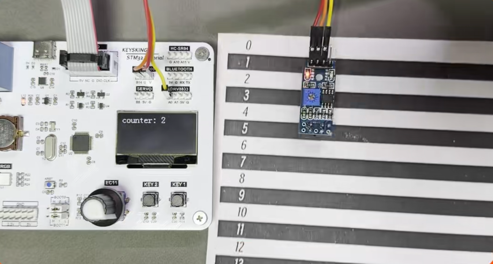

传送带运动时：
**黑白条纹不断经过循迹模块 → DO产生高低电平变化 → 形成方波 → 输入TIM2外部时钟 → CNT计数**
因此 CNT 不再代表“过去了多少时间”，而是代表：
**已经经过了多少个有效的黑白条纹脉冲。**
假设每一个有效脉冲对应传送带移动：
$$W=1.5cm$$
如果定时器总共统计到 `N` 个脉冲，那么移动距离可以简单计算为：
$$S=N\times W$$
因此只要统计一段时间内新增了多少个脉冲，就可以进一步得到传送带速度：
$$v=\frac{\Delta N\times W}{\Delta t}$$
这就是本节传送带测速的基本原理：
**循迹模块把“移动距离”转换成脉冲 → TIM2负责硬件计数 → 程序根据单位时间内的脉冲数计算速度**

### CubeMX配置
理解原理以后开始配置工程。本节主要使用 **TIM2 + I2C1 + OLED**。与上一节不同，这次不再通过串口显示数据，而是直接在 OLED 上显示总计数值和速度。

#### RCC时钟配置
与上一节不同，本节使用 **TIM2外部时钟模式**，CNT 的计数脉冲来自循迹模块，而不是 STM32 内部时钟：
**循迹模块DO → TIM2_ETR → CNT计数**
因此本节**不需要像8.1那样专门配置 `HSE → PLL → 72MHz` 来决定TIM2的计数速度**。外部每出现一个有效脉冲，CNT 就加1，所以这里主要是在**统计外部事件次数**，而不是利用内部时钟进行定时。
可以对比：

| 模式 | CNT计数来源 |
|---|---|
| 内部时钟模式 | STM32内部TIM时钟 |
| 外部时钟模式 | ETR等外部脉冲 |

> **这里“不配置RCC”并不是STM32不需要系统时钟。CPU、I2C、OLED以及定时器内部的滤波等功能仍然需要系统时钟，只是TIM2的CNT计数节拍由外部ETR脉冲决定。**

所以本节重点配置：
**TIM2 → External Clock Mode 2 → ETR输入 → 极性/滤波 → CNT对外部脉冲计数**
#### 配置TIM2外部时钟模式2
进入：
**Timers → TIM2**
将：`Clock Source` → `ETR2`

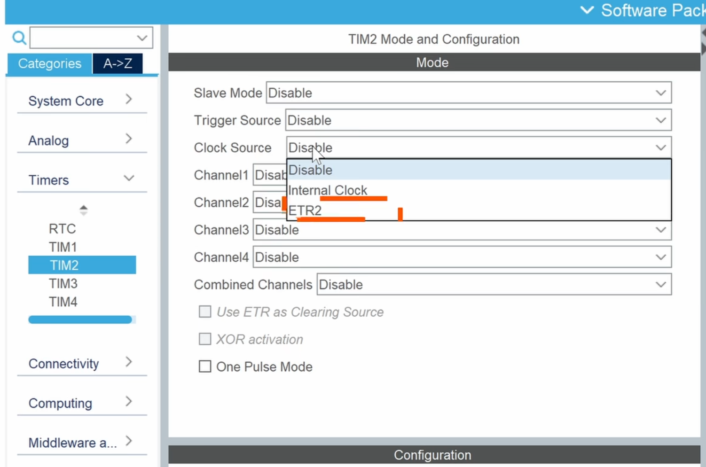

这里的 `ETR2` 表示使用 **ETR External Clock Mode 2**。配置以后，TIM2 的时钟不再来自内部的 `CK_INT`，而是来自 TIM2_ETR 引脚输入的外部脉冲。
本视频使用 TIM2，因此将循迹模块的 `DO` 信号连接到 TIM2 对应的 **ETR外部触发引脚**。
此时：
**循迹模块DO → TIM2_ETR → 外部时钟模式2 → CNT**
每出现一个符合条件的外部边沿，CNT 就进行一次计数。

#### ETR参数
由于现在输入的是现实中的外部信号，因此还需要配置 ETR 的相关参数。
主要包括：

| 参数 | 作用 |
|---|---|
| ETR Prescaler | 对外部脉冲提前进行分频 |
| ETR Polarity | 设置检测的有效极性/边沿 |
| Clock Filter | 对输入信号进行数字滤波 |

本实验希望**一个有效脉冲对应一次计数**，因此 ETR 不需要额外预分频。

### 输入滤波器
实际循迹模块输出的信号并不会像理论方波一样完全干净，在黑白交界处、模块振动或受到环境干扰时可能出现很窄的毛刺：
**正常边沿 + 短时间抖动 → 如果全部计数 → CNT会多计**
因此 STM32 的定时器输入端提供了**数字滤波器**。

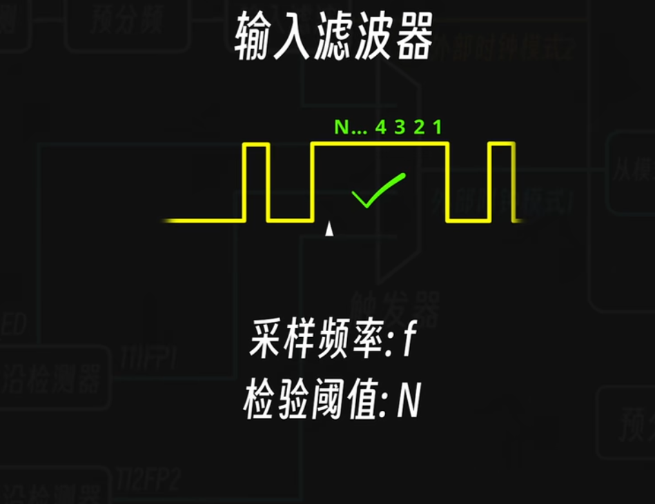

滤波器会按照一定的采样频率 `f` 对输入信号进行连续采样。如果连续 `N` 次采样得到相同电平，才认为输入信号真正发生了变化。
因此可以理解为：
**输入发生变化 → 连续采样N次 → 如果一直保持相同 → 判定为有效信号**
如果只是一个非常窄的毛刺：
**输入变化 → 后续采样马上恢复 → 未满足连续N次 → 抖动被过滤**
所以：
**采样频率越低 / 连续采样次数N越多 → 滤波能力越强，但响应速度也会变慢**
视频中在 CubeMX 的 TIM2 参数中通过：
`Clock Filter`
设置输入滤波，本实验将其调大以过滤循迹模块产生的抖动，例如：
`Clock Filter = 15`

> **滤波越强并不一定越好。如果真正的有效脉冲本身很窄，滤波过强也可能把有效信号过滤掉。**

### 配置OLED
本节不再使用 USART2 输出数据，而是使用前面已经学过的 OLED 驱动库显示结果，因此开启：
**Connectivity → I2C1 → I2C**
OLED 的具体 IIC 配置与前面的 OLED 章节相同。


随后进入：
**Project Manager → Code Generator**
勾选：
`Generate peripheral initialization as a pair of '.c/.h' files per peripheral`
使 TIM、I2C 等外设分别生成对应的 `.c/.h` 文件，方便后面编写程序。


### 导入OLED驱动库
继续使用前面 keysking 提供的 OLED 驱动库，将：
`oled.c`、`font.c` → `Core/Src`
`oled.h`、`font.h` → `Core/Inc`
在 `main.c` 中：

```c
/* USER CODE BEGIN Includes */
#include "oled.h"     // OLED驱动库
#include <stdio.h>    // sprintf()
/* USER CODE END Includes */
```

OLED 库的具体实现前面已经学习过，本节直接调用：
**`OLED_Init()` → `OLED_NewFrame()` → `OLED_PrintString()` → `OLED_ShowFrame()`**

### 代码实现
#### 定义参数
首先定义本实验需要使用的两个参数：

```c
/* USER CODE BEGIN PM */
#define Period 10       // 每一轮定时器对应的脉冲数，与Counter Period配合
#define Wideth 1.5      // 视频代码命名：每个有效脉冲对应的实际移动距离，单位cm
/* USER CODE END PM */
```

其中 `Wideth` 表示一个有效外部脉冲所对应的传送带移动距离。本实验中：
$$W=1.5cm$$

#### 记录溢出次数
定义一个全局变量记录 TIM2 更新次数：

```c
/* USER CODE BEGIN PV */
int loop = -1;    // 记录TIM2发生更新事件的次数
/* USER CODE END PV */
```

视频工程中初始化 TIM2 的过程中会产生一次更新相关状态，因此这里将 `loop` 初始化为 `-1`，用于抵消开始时的一次更新。

#### 更新中断回调
TIM2 每完成一个计数周期，就进入：

```c
/* USER CODE BEGIN 0 */
void HAL_TIM_PeriodElapsedCallback(TIM_HandleTypeDef *htim)
{
    // 判断是否为TIM2产生的更新中断
    if (htim == &htim2)
    {
        loop++;    // 记录CNT已经完成了多少轮
    }
}
/* USER CODE END 0 */
```

因此：
**CNT累计Period个外部脉冲 → 更新事件 → `loop++` → CNT重新开始下一轮**

### 初始化OLED和TIM2
在外设初始化完成后：

```c
/* USER CODE BEGIN 2 */
HAL_Delay(20);     // 等待OLED上电稳定
OLED_Init();       // 初始化OLED
HAL_TIM_Base_Start_IT(&htim2);    // 启动TIM2以及更新中断
int counter = 0;        // 保存累计脉冲总数
int lastCounter = 0;    // 保存上一次计算速度时的脉冲总数
float speed = 0;        // 保存计算得到的速度
char message[20] = "";  // OLED显示字符串
/* USER CODE END 2 */
```

虽然使用的是：

```c
HAL_TIM_Base_Start_IT(&htim2);
```

但是这里 TIM2 的**计数时钟已经配置成 ETR 外部时钟**，所以调用该函数只是启动 TIM2 和更新中断，并不会让 CNT 按内部72MHz计数。
此时只有：
**循迹模块产生有效ETR脉冲 → CNT才会增加。**

### 计算累计脉冲数
由于 CNT 每达到一个周期就会重新开始，因此总脉冲数不能只读取 CNT，而是：
$$总计数=已经完成的周期数\times每周期脉冲数+当前CNT$$
代码为：

```c
counter = loop * Period + __HAL_TIM_GET_COUNTER(&htim2);
```

其中：
`loop * Period` → 前面已经完整计过的脉冲数  
`__HAL_TIM_GET_COUNTER(&htim2)` → 当前这一轮已经计数的脉冲数
因此即使 CNT 发生重装载：
**CNT：9 → 0**
累计的 `counter` 仍然可以继续增加，而不是跟着重新变成0。
随后将累计值显示到 OLED：

```c
sprintf(message, "counter: %d", counter);
OLED_PrintString(0, 0,
                 message,
                 &font16x16,
                 OLED_COLOR_NORMAL);
```

### 计算传送带速度
除了累计距离，还可以根据一段固定时间内增加了多少脉冲计算速度。
首先得到：
$$\Delta N=counter-lastCounter$$
每个脉冲对应：
$$W=1.5cm$$
程序每隔：
$$\Delta t=100ms=0.1s$$
计算一次，所以：
$$v=\frac{\Delta N\times W}{0.1}$$
代码：

```c
// 计算最近0.1s内传送带移动的速度
speed = ((counter - lastCounter) * Wideth) / 0.1;
// 保存当前值，下次用于计算脉冲增量
lastCounter = counter;
```

然后转换成字符串显示：

```c
sprintf(message, "speed: %.1fcm/s", speed);
OLED_PrintString(0, 20,
                 message,
                 &font16x16,
                 OLED_COLOR_NORMAL);
```

可以理解为：
**本次总脉冲数 - 上次总脉冲数 → 0.1s内新增脉冲数 → ×每脉冲距离 → ÷0.1s → 得到速度**

### 主循环
最终在 `while(1)` 中不断计算总计数和速度，并显示到 OLED：

```c
/* USER CODE BEGIN WHILE */
while (1)
{
    // 新建一帧OLED画面
    OLED_NewFrame();
    // 总计数 = 已经完成的计数周期 + 当前CNT
    counter = loop * Period + __HAL_TIM_GET_COUNTER(&htim2);
    // 显示累计脉冲数
    sprintf(message, "counter: %d", counter);
    OLED_PrintString(0, 0,
                     message,
                     &font16x16,
                     OLED_COLOR_NORMAL);
    // 根据最近0.1s新增的脉冲数量计算速度
    speed = ((counter - lastCounter) * Wideth) / 0.1;
    lastCounter = counter;
    // 显示传送带速度
    sprintf(message, "speed: %.1fcm/s", speed);
    OLED_PrintString(0, 20,
                     message,
                     &font16x16,
                     OLED_COLOR_NORMAL);
    // 将整帧内容刷新到OLED
    OLED_ShowFrame();
    // 每100ms计算一次速度
    HAL_Delay(100);
    /* USER CODE END WHILE */
    /* USER CODE BEGIN 3 */
}
/* USER CODE END 3 */
```

最终数据流为：
**黑白条纹移动 → 循迹模块产生方波 → DO输入TIM2_ETR → ETR2外部时钟 → CNT计数 → 更新中断记录溢出次数 → 计算总脉冲数 → 计算速度 → OLED显示**

### 外部时钟模式1的CubeMX配置
视频最后重新回到 CubeMX，演示 **External Clock Mode 1** 的配置方法。模式1和前面实际测速使用的模式2不同，它不是直接在 `Clock Source` 中选择 `ETR2`，而是通过 **Slave Mode + Trigger Source** 来配置。
首先进入：
**Timers → TIM2**
设置：
`Slave Mode` → `External Clock Mode 1`
此时还需要继续选择：
`Trigger Source`
也就是告诉 TIM2：**到底使用哪一路信号作为 TRGI，再由 TRGI 的边沿驱动 CNT 计数。**

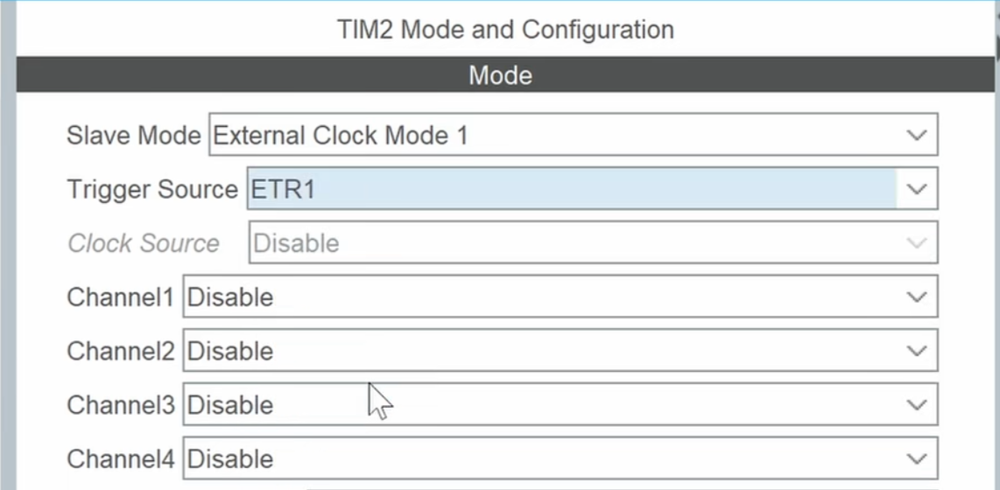

因此模式1的基本配置逻辑为：
**Slave Mode = External Clock Mode 1 → 选择 Trigger Source → 对应信号成为TRGI → CNT对TRGI有效边沿计数**

#### 使用ETR作为外部时钟
如果还是想使用专门的 `TIM2_ETR` 引脚作为外部时钟，可以配置：
`Slave Mode` → `External Clock Mode 1`
`Trigger Source` → `ETR1 / ETRF`
这样外部 ETR 信号不会像模式2一样直接进入计数器，而是：
**TIM2_ETR → ETRF → TRGI → External Clock Mode 1 → CNT**
这种配置和前面模式2都可以利用 ETR 进行外部脉冲计数，只是内部路径不同。

> 前面传送带测速直接使用 `Clock Source → ETR2` 即可，配置更加简单。

#### 使用CH1作为外部时钟
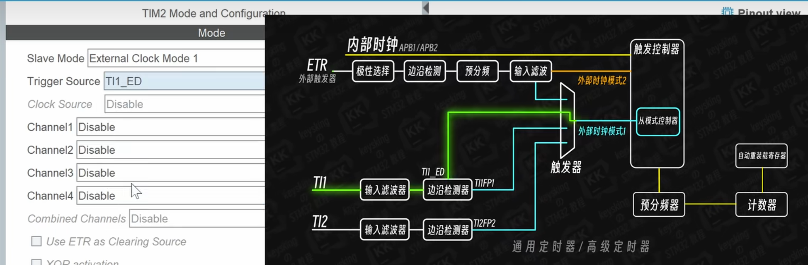
如果希望直接使用 **TIM2_CH1** 引脚输入的信号作为计数时钟，可以设置：
`Slave Mode` → `External Clock Mode 1`
`Trigger Source` → `TI1FP1`
此时 CubeMX 会使用 TIM2 的 CH1 对应引脚作为输入：
**TIM2_CH1 → 输入滤波/极性处理 → TI1FP1 → TRGI → CNT**
例如外部设备每向 CH1 输入一个有效脉冲，CNT 就增加一次。
所以这种情况下不再使用专门的 ETR 引脚，而是可以直接通过**定时器通道1**输入外部时钟。

#### 使用CH2作为外部时钟
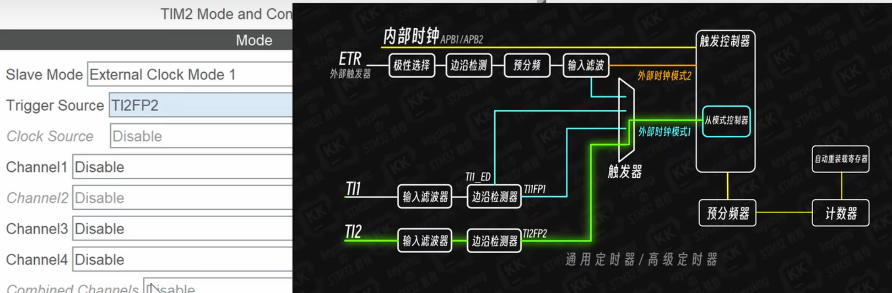
如果外部信号连接在 TIM2 的 **CH2**，则配置：
`Slave Mode` → `External Clock Mode 1`
`Trigger Source` → `TI2FP2`
对应关系为：
**TIM2_CH2 → 输入滤波/极性处理 → TI2FP2 → TRGI → CNT**
所以：
`TI1FP1` → 使用 CH1 输入  
`TI2FP2` → 使用 CH2 输入

> 使用 TI1FP1、TI2FP2 时，实际使用哪个 GPIO 由芯片的 TIM2_CH1、TIM2_CH2 引脚映射决定，不能随便选择一个 GPIO。

#### 使用CH1双边沿作为时钟
视频中还列举了：
`Trigger Source` → `TI1 Edge Detector`
也就是 `TI1F_ED`。
配置仍然是：
`Slave Mode` → `External Clock Mode 1`
`Trigger Source` → `TI1 Edge Detector`
这时信号来自 TIM2_CH1，但是与 `TI1FP1` 不同，它会对 CH1 的**上升沿和下降沿都进行检测**：
**TIM2_CH1 → 双边沿检测 → TI1F_ED → TRGI → CNT**
例如输入一个完整方波：
**上升沿 → CNT加1**
**下降沿 → CNT再加1**
所以一个完整周期可以产生两次有效计数。

#### 使用其他定时器作为时钟
模式1还可以选择：
`ITR0`、`ITR1`、`ITR2`、`ITR3`
这些不是外部 GPIO，而是 STM32 内部其他定时器提供的触发信号。
CubeMX 中配置例如：
`Slave Mode` → `External Clock Mode 1`
`Trigger Source` → `ITR0`
此时可以形成：
**其他定时器TRGO → TIM2的ITR0 → TRGI → TIM2 CNT**
也就是让**一个定时器为另一个定时器提供计数时钟**。
这种方式可以实现**定时器级联**。例如前一个定时器先进行一次分频或计数，每产生一次 TRGO，后面的 TIM2 再加1，从而进一步扩大计数范围。

> `ITR0~ITR3` 分别连接哪个定时器的 TRGO，需要查看当前芯片参考手册中的定时器内部触发连接表，并不是所有定时器都完全相同。
> 注意上述所有的都不要忘记配置 **滤波**.

### CubeMX配置对应关系
视频最后列举的几种 Trigger Source，在 CubeMX 中可以这样理解：

| 想使用的时钟来源 | Slave Mode | Trigger Source | 实际输入 |
|---|---|---|---|
| ETR引脚 | `External Clock Mode 1` | `ETR1 / ETRF` | `TIM2_ETR` |
| CH1输入 | `External Clock Mode 1` | `TI1FP1` | `TIM2_CH1` |
| CH2输入 | `External Clock Mode 1` | `TI2FP2` | `TIM2_CH2` |
| CH1双边沿 | `External Clock Mode 1` | `TI1 Edge Detector` | `TIM2_CH1` |
| 其他定时器 | `External Clock Mode 1` | `ITR0~ITR3` | 其他TIM的TRGO |

所以 External Clock Mode 1 最重要的配置关系就是：
**先选 `Slave Mode = External Clock Mode 1` → 再根据实际信号来源选择 `Trigger Source`**
而前面实际使用的 External Clock Mode 2 则直接：
`Clock Source` → `ETR2`
所以：
**模式1 → Slave Mode + Trigger Source，输入来源更多**
**模式2 → Clock Source = ETR2，只能使用ETR，配置更直接**

> **视频最后列举这些例子的重点，就是说明 External Clock Mode 1 并不是固定使用某一个引脚，而是由 `Trigger Source` 决定具体使用 ETR、CH1、CH2、双边沿还是其他定时器。**

### 本节核心
定时器不仅可以用内部时钟计数，也可以让外部信号作为计数时钟：
**内部时钟：固定频率时钟 → CNT，所以适合“计时间”**
**外部时钟：外部事件产生脉冲 → CNT，所以适合“计事件次数”**
本节实际应用：
**黑白条纹 → TCRT5000循迹模块 → 方波 → TIM2_ETR → External Clock Mode 2 → CNT**
累计计数：
$$counter=loop\times Period+CNT$$
移动距离：
$$S=counter\times Wideth$$
速度：
$$v=\frac{(counter-lastCounter)\times Wideth}{0.1}$$

> **输入滤波器负责过滤循迹模块产生的毛刺和抖动，边沿检测负责把有效电平变化转换为计数脉冲。**

> **更新中断不是用来定时发送数据，而是用于记录CNT已经溢出了多少轮，从而将有限位宽的CNT扩展成更大的累计计数值。**

> **外部时钟模式1走“Trigger Source → TRGI → Slave Mode”路径；外部时钟模式2由ETR直接进入，简单的外部脉冲计数优先使用模式2。**

## 8.3 定时器从模式
上一节已经接触过 `External Clock Mode 1`，它实际上就是定时器**从模式（Slave Mode）**中的一种。本节继续学习从模式中的另外三种模式：**Reset Mode（复位模式）、Gated Mode（门模式）、Trigger Mode（触发模式）**。

外部时钟模式1主要是让 TRGI 作为 CNT 的**计数时钟**，而本节的三种从模式并不是给 CNT 提供新的时钟，而是通过 TRGI **控制定时器什么时候复位、什么时候计数、什么时候启动**。

| 从模式 | 作用 |
|---|---|
| `External Clock Mode 1` | TRGI每出现一个有效边沿，CNT计数一次 |
| `Reset Mode` | TRGI有效边沿到来时重新计数 |
| `Gated Mode` | TRGI电平控制计数器运行或暂停 |
| `Trigger Mode` | TRGI有效边沿启动定时器 |

> **从模式控制器的核心就是：选择一个 Trigger Source 形成 TRGI，再决定 TRGI 到来以后让定时器做什么。**

### 复位模式Reset Mode
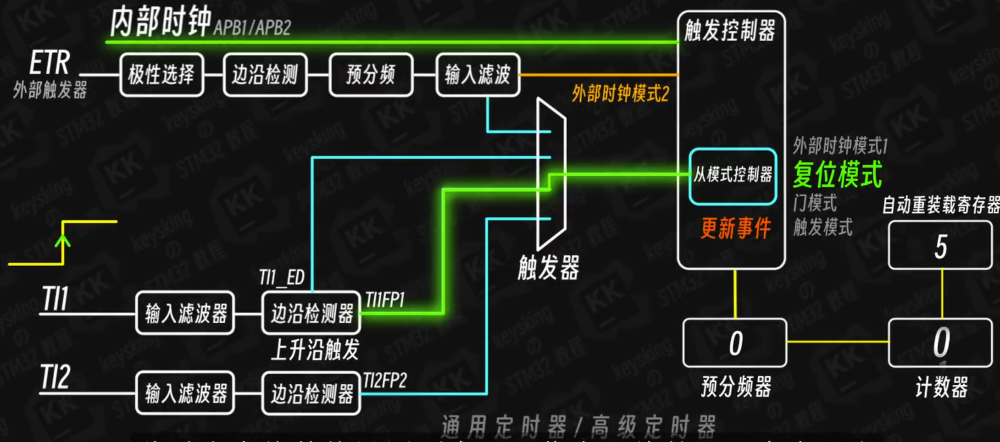

首先学习 **Reset Mode（复位模式）**。复位模式下，定时器本身仍然使用自己的时钟正常计数；当 TRGI 出现有效触发信号时，从模式控制器会让计数器**重新从0开始计数**。

例如 CNT 原本正在计数：

**0 → 1 → 2 → 3 → 4 → ……**

此时突然出现一个 TRGI 有效边沿：

**0 → 1 → 2 → 3 → TRGI → 0 → 1 → 2 → ……**

所以复位模式可以理解为：

**定时器正常计数 → TRGI触发 → CNT复位 → 重新计数**

#### 从模式与时钟源
这里需要注意：`Slave Mode` 已经选择了 `Reset Mode`，因此**不能同时再把 External Clock Mode 1 当作计数时钟使用**，因为二者都需要使用从模式控制器。

所以复位模式下可以选择其他计数时钟，例如：

**内部时钟 `CK_INT` → CNT**

或者：

**ETR → External Clock Mode 2 → CNT**

而 TRGI 只负责控制“什么时候复位”。

因此可以同时存在两个不同的信号：

**Clock Source → 决定CNT按照什么速度计数**

**Trigger Source → 决定什么时候触发从模式**

#### CubeMX配置
本节使用 **TIM2内部时钟 + TI1作为触发信号 + USART2观察实验结果**。

##### 系统时钟
本节 TIM2 仍然使用内部时钟进行计时，因此继续使用前面的 72MHz 系统时钟配置。如果沿用前面的工程，则不需要重新配置：

**HSE 8MHz → PLL×9 → SYSCLK 72MHz → TIM2时钟72MHz**

##### 配置SYS与USART2
在 **System Core → SYS** 中保持：

`Debug` → `Serial Wire`

同时开启：

**Connectivity → USART2 → Asynchronous**

串口继续使用前面的 **115200，8N1**，用于显示 CNT 以及从模式触发信息。

##### 配置TIM2
进入 **Timers → TIM2**，首先设置：

`Clock Source` → `Internal Clock`

`Slave Mode` → `Reset Mode`

`Trigger Source` → `TI1FP1`

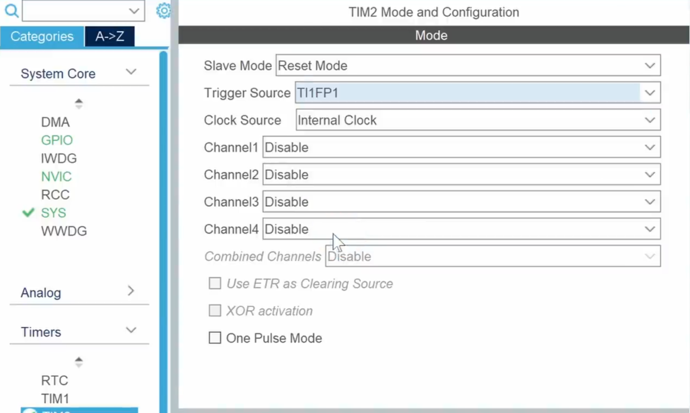

选择 `TI1FP1` 后，TIM2_CH1 对应的输入信号经过滤波和极性检测形成 TRGI：

**TIM2_CH1 → TI1FP1 → TRGI → Reset Mode → CNT复位**

随后设置触发参数：

`Trigger Polarity` → `Rising Edge`

`Trigger Filter` → `15`

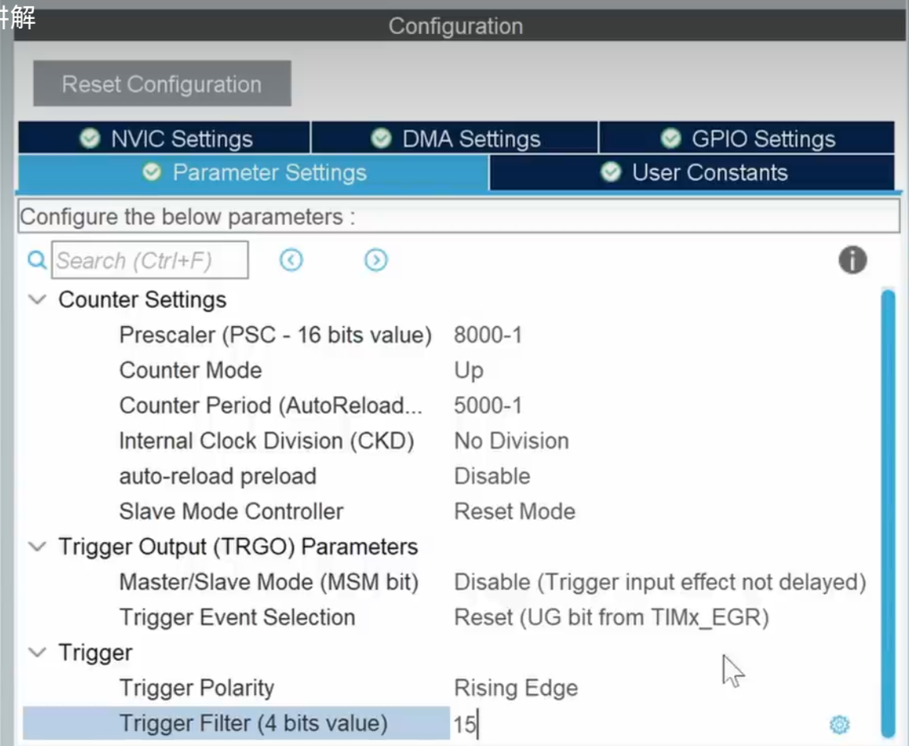

这里仍然使用前面循迹模块产生高低电平，滤波值设置为15用于减少外部信号抖动造成的误触发。

定时器本身设置为约 **5s产生一次自动重装载更新**：

`Prescaler` → `7200-1`

`Counter Period` → `50000-1`

因此：

$$f_{CNT}=\frac{72MHz}{7200}=10kHz$$

$$T=\frac{50000}{10kHz}=5s$$

所以没有外部触发时：

**CNT从0计数 → 5s后达到ARR → 自动重装载 → 重新从0开始**

有 TRGI 上升沿时：

**CNT正在计数 → TI1出现上升沿 → Reset Mode触发 → CNT立即重新从0开始**

##### 开启TIM2中断
进入 **TIM2 → NVIC Settings**，勾选：

`TIM2 global interrupt`

这样无论是正常计数到 ARR，还是复位模式产生对应的更新事件，都可以观察其执行情况。

#### 启动定时器并观察CNT
启动 TIM2：

```c
/* USER CODE BEGIN 2 */
HAL_TIM_Base_Start_IT(&htim2);    // 启动TIM2及其更新中断
/* USER CODE END 2 */
```

可以在 `while(1)` 中读取 CNT，并通过串口观察：

```c
char message[30] = "";

while (1)
{
    // 获取TIM2当前CNT计数值
    sprintf(message, "%lu\r\n", __HAL_TIM_GET_COUNTER(&htim2));

    // 通过串口发送当前CNT值
    HAL_UART_Transmit(&huart2,
                      (uint8_t *)message,
                      strlen(message),
                      100);

    HAL_Delay(100);
}
```

正常情况下 CNT 会不断增加，每5s重新从0开始；如果在中途让循迹模块产生一个符合条件的上升沿，则可以看到：

**CNT正在增加 → 外部触发 → CNT突然变为0 → 重新开始增加**

这就是 Reset Mode 的效果。

#### 区分自动重装载与从模式复位
这里会出现一个问题：**正常达到ARR会产生更新，而Reset Mode触发复位同样会产生更新**，两种情况都会进入定时器更新处理，因此需要判断这一次到底是“正常计满”还是“从模式触发”。

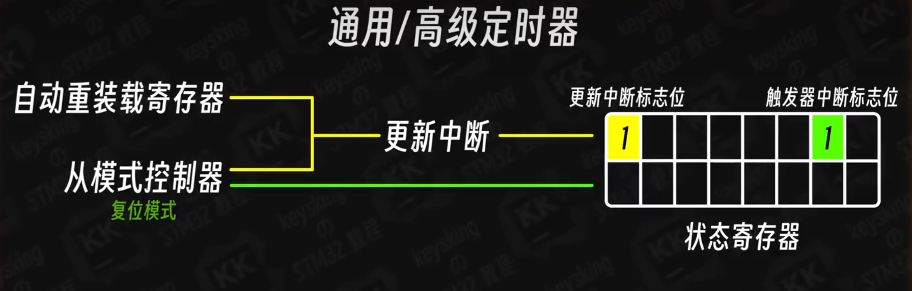

从模式控制器收到触发信号以后，会将定时器的**触发标志位 TIF**置1。HAL提供：

```c
__HAL_TIM_GET_FLAG(&htim2, TIM_FLAG_TRIGGER);
```

用于读取触发标志。如果返回非0，就说明当前发生过从模式触发。

因此可以在回调中判断：

```c
void HAL_TIM_PeriodElapsedCallback(TIM_HandleTypeDef *htim)
{
    if (htim == &htim2)
    {
        // 判断是否存在从模式触发标志
        if (__HAL_TIM_GET_FLAG(&htim2, TIM_FLAG_TRIGGER))
        {
            // 从模式触发后需要手动清除Trigger标志
            __HAL_TIM_CLEAR_FLAG(&htim2, TIM_FLAG_TRIGGER);

            char message[] = "Slave mode trigger\r\n";
            HAL_UART_Transmit(&huart2,
                              (uint8_t *)message,
                              strlen(message),
                              100);
        }
        else
        {
            // 没有Trigger标志，说明是正常计数达到ARR
            char message[] = "Auto reload\r\n";
            HAL_UART_Transmit(&huart2,
                              (uint8_t *)message,
                              strlen(message),
                              100);
        }
    }
}
```

其中：

`__HAL_TIM_GET_FLAG()` → **读取定时器标志位**

`TIM_FLAG_TRIGGER` → **触发器标志位**

`__HAL_TIM_CLEAR_FLAG()` → **清除指定标志位**

> **`TIM_FLAG_TRIGGER` 被置1以后需要手动清除，否则下一次进入回调时可能仍然读取到旧的触发标志。**

实验现象：

**正常运行5s → 输出 `Auto reload` → CNT重新计数**

**中途产生上升沿 → 输出 `Slave mode trigger` → CNT立即重新计数**

因此复位模式可以总结为：

**TRGI有效边沿 → CNT重新计数 + 触发标志位置1 + 产生更新事件**

### 门模式Gated Mode
接下来将从模式改成 **Gated Mode（门模式）**。门模式可以把 TRGI 想象成控制定时器时钟的一个“门”：

**TRGI高电平 → 门打开 → 时钟可以进入CNT → 正常计数**

**TRGI低电平 → 门关闭 → 时钟不能进入CNT → CNT暂停**

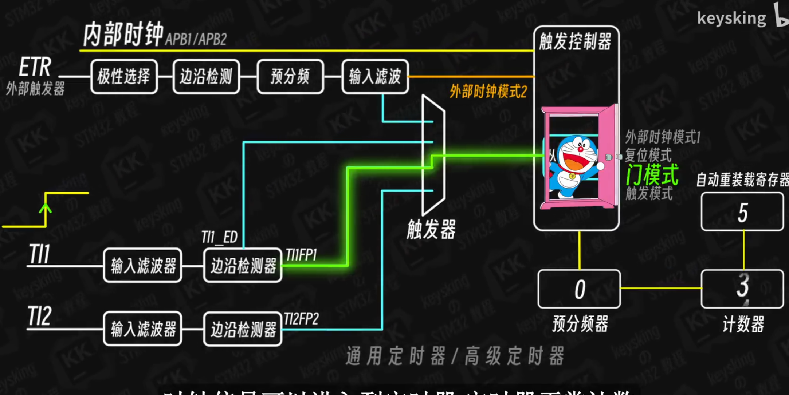
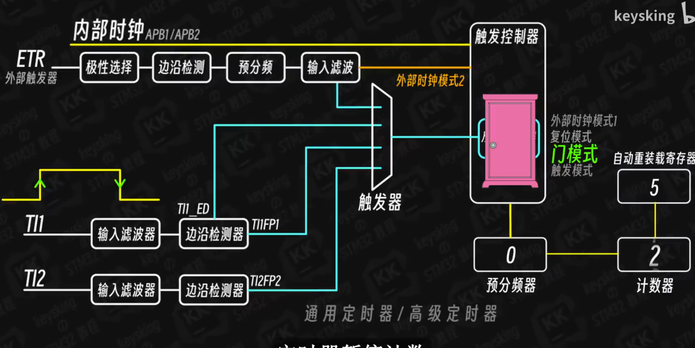

例如：

**CNT：0 → 1 → 2 → 3 → TRGI变低 → 3 → 3 → 3 → TRGI变高 → 4 → 5 → 6**

所以门模式暂停时**不会清零CNT**，恢复以后继续从原来的值向后计数。

> 修改触发极性后，高低电平对应的开启/关闭关系也可以反过来。

#### CubeMX配置
回到 **Timers → TIM2**，保持其他配置基本不变，只将：

`Slave Mode` → `Gated Mode`

`Trigger Source` → `TI1FP1`

触发滤波继续保持：

`Trigger Filter` → `15`

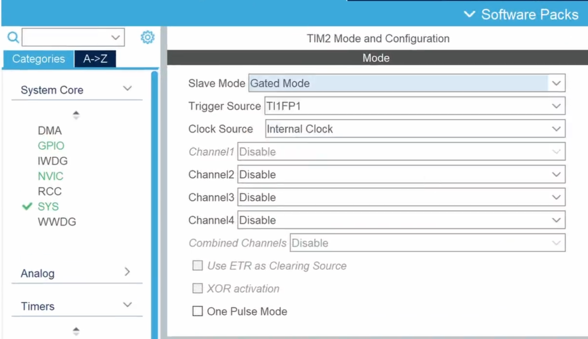
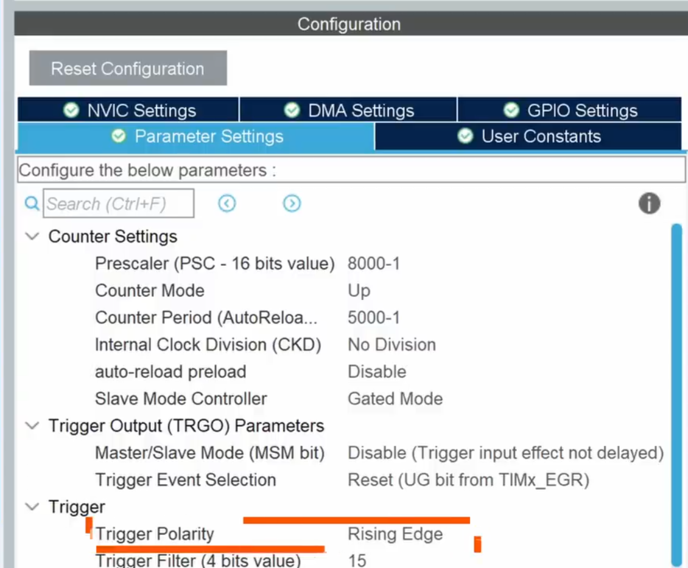

计数时钟仍然来自：

`Clock Source` → `Internal Clock`

因此：

**内部时钟 → Gated Mode控制是否通过 → CNT**

当 TI1 为有效高电平时正常计数；变成低电平以后暂停计数。

#### 门模式中的Trigger标志
门模式下，当控制信号发生高低电平变化时，同样会将：

`TIM_FLAG_TRIGGER`

置1。

但是与复位模式不同，**门控信号的边沿本身不会让CNT复位，也不会因为“门开/门关”本身产生一次更新事件**，所以不能像复位模式那样只在 `HAL_TIM_PeriodElapsedCallback()` 里面等待并判断门状态变化。

##### 轮询读取Trigger标志
可以将 Trigger 标志位的判断放到 `while(1)`：

```c
while (1)
{
    // 读取并显示CNT当前值
    sprintf(message, "%lu\r\n", __HAL_TIM_GET_COUNTER(&htim2));
    HAL_UART_Transmit(&huart2,
                      (uint8_t *)message,
                      strlen(message),
                      100);

    // 判断门控信号是否发生变化
    if (__HAL_TIM_GET_FLAG(&htim2, TIM_FLAG_TRIGGER))
    {
        // 手动清除触发标志
        __HAL_TIM_CLEAR_FLAG(&htim2, TIM_FLAG_TRIGGER);

        char triggerMessage[] = "Slave mode trigger\r\n";
        HAL_UART_Transmit(&huart2,
                          (uint8_t *)triggerMessage,
                          strlen(triggerMessage),
                          100);
    }

    HAL_Delay(100);
}
```

##### 触发回调函数
门模式也可以使用定时器的触发回调函数：

```c
/* USER CODE BEGIN 4 */
void HAL_TIM_TriggerCallback(TIM_HandleTypeDef *htim)
{
    if (htim == &htim2)
    {
        // 门控信号发生变化时执行
        char message[] = "Slave mode trigger\r\n";

        HAL_UART_Transmit(&huart2,
                          (uint8_t *)message,
                          sizeof(message) - 1,
                          100);
    }
}
/* USER CODE END 4 */
```

实验时可以看到：

**光电信号为高电平 → CNT不断增加**

**信号变低 → 输出从模式触发信息 → CNT停在某个值**

**重新变高 → 再次出现触发 → CNT从原来的值继续增加**

> **门模式的重点不是“重新计数”，而是“暂停 / 继续计数”。**

### 触发模式Trigger Mode
最后学习 **Trigger Mode（触发模式）**。触发模式的作用更加简单：**定时器开始时先不计数，检测到设置好的有效边沿后才启动CNT。**

例如初始：

**CNT = 0，停止计数**

产生一次 TRGI 上升沿以后：

**TRGI上升沿 → 启动定时器 → CNT：0 → 1 → 2 → 3 → ……**

因此 Trigger Mode 可以理解为给定时器增加一个**外部启动按钮**。

但它有一个特点：**Trigger Mode只能启动定时器，不能通过下一次触发把定时器停止。**

因此：

**第一次上升沿 → 定时器开始计数**

**第二次上升沿 → 产生新的Trigger标志，但定时器仍然继续计数**

**第三次上升沿 → 仍然继续计数**

#### CubeMX配置
回到 **Timers → TIM2**，将：

`Slave Mode` → `Trigger Mode`

`Trigger Source` → `TI1FP1`

其他触发极性、滤波和计数器参数保持不变。

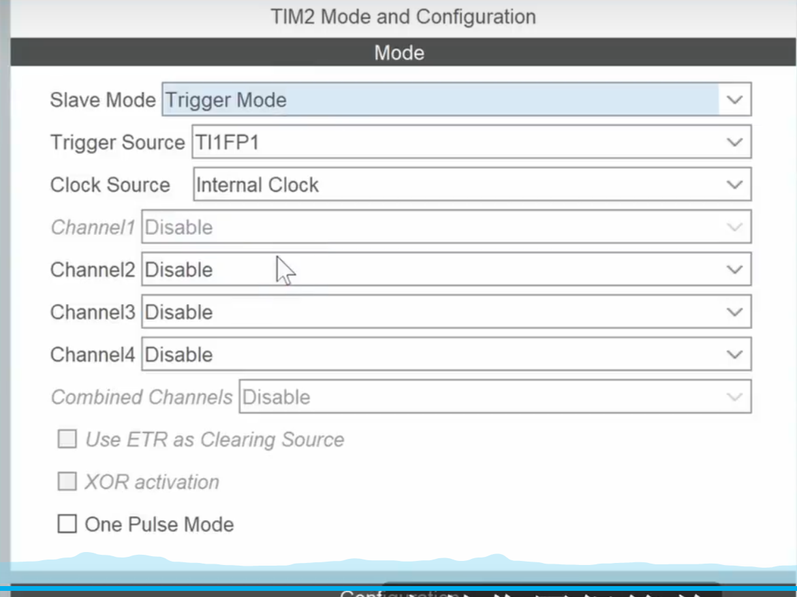
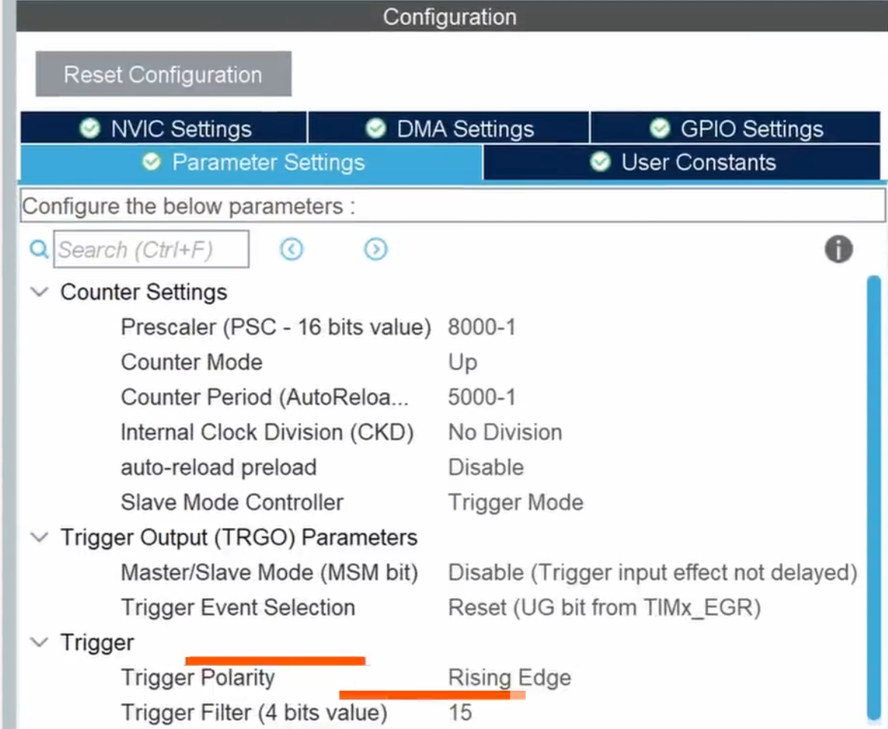

门模式的代码无需改动。

这里虽然调用了 `Start_IT()`，但 HAL 库检测到 TIM2 当前处于 **Trigger Mode** 后，不会直接让计数器开始运行，而是等待外部 TRGI 触发。

所以运行程序以后：

**没有触发信号 → CNT保持0**

**TI1出现上升沿 → CNT开始增加**

**再次出现上升沿 → CNT不会停止，继续增加**

> **Trigger Mode控制的是“开始”，并不能单独完成“启动 → 计数 → 自动停止”。**

#### 配合单脉冲模式
为了解决触发模式只能启动、不能自动停止的问题，视频继续引入 **One Pulse Mode（单脉冲模式）**。

普通定时器：

**CNT达到ARR → 产生更新事件 → CNT重新从0开始 → 继续下一轮计数**

开启单脉冲模式以后：

**CNT达到ARR → 产生更新事件 → 定时器停止**

也就是定时器每启动一次，只运行**一个计数周期**。

CubeMX 中继续保持：

`Slave Mode` → `Trigger Mode`

然后开启：

`One Pulse Mode`

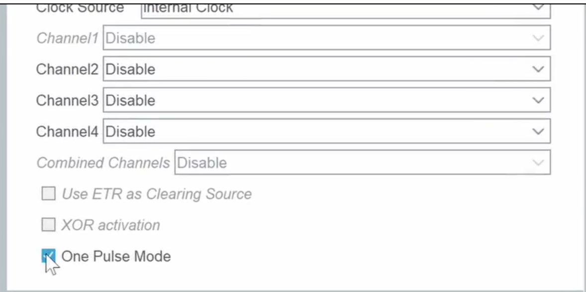

此时整个过程为：

**初始停止 → TRGI上升沿 → TIM2开始计数 → CNT达到ARR → 自动停止**

如果再产生一次上升沿：

**新的TRGI → TIM2再次开始一个计数周期 → 达到ARR → 再次停止**

因此：

**Trigger Mode负责“什么时候开始”**

**One Pulse Mode负责“计满以后自动停止”**

组合起来就是：

**外部触发一次 → 运行一次 → 自动停止 → 等待下一次触发**

#### 程序启动时为什么会出现一次自动重装载
视频最后还观察到一个现象：程序刚刚启动或者按下复位键时，即使定时器还没有真正完成一个计数周期，串口可能先输出一次：

`Auto reload`

原因在于 CubeMX 生成的 `MX_TIM2_Init()` 在初始化定时器时会产生更新操作，使 **Update Flag（更新标志位）**已经被置1。随后执行：

```c
HAL_TIM_Base_Start_IT(&htim2);
```

开启更新中断以后，NVIC发现之前的更新标志还存在，就立即响应一次更新中断。

所以实际过程为：

**`MX_TIM2_Init()` → 初始化产生Update Flag → `HAL_TIM_Base_Start_IT()`开启中断 → 检测到旧的Update Flag → 立即进入一次更新回调**

如果不希望程序一开始产生这一次额外的更新中断，可以在启动定时器前先清除更新标志：

```c
/* USER CODE BEGIN 2 */

// 清除初始化过程中产生的更新标志
__HAL_TIM_CLEAR_FLAG(&htim2, TIM_FLAG_UPDATE);

// 再启动定时器及更新中断
HAL_TIM_Base_Start_IT(&htim2);

/* USER CODE END 2 */
```

也可以使用对应的更新中断清除宏：

```c
__HAL_TIM_CLEAR_IT(&htim2, TIM_IT_UPDATE);
```

所以：

**初始化TIM2 → 先清除Update Flag → 再开启定时器中断**

> **这里清除的是 `TIM_FLAG_UPDATE`，而前面判断从模式触发使用的是 `TIM_FLAG_TRIGGER`，两个标志位不要混淆。**

### 三种从模式总结
| 模式 | TRGI如何控制定时器 | CNT变化 |
|---|---|---|
| Reset Mode | 有效边沿让定时器重新计数 | CNT清零并重新开始 |
| Gated Mode | TRGI电平控制定时器运行/暂停 | 暂停时保持当前CNT |
| Trigger Mode | 有效边沿启动定时器 | 启动后持续计数 |

可以简单记成：

**Reset Mode → 重新数**

**Gated Mode → 控制数不数**

**Trigger Mode → 开始数**

其中 Trigger Mode 常与 One Pulse Mode 配合：

**TRGI触发 → 开始计数 → 达到ARR → 自动停止 → 等待下一次TRGI**

> **从模式并不是定时器新的计数方式，而是利用 TRGI 对定时器的运行状态进行硬件控制。**
>
> **复位模式：触发后重新计数；门模式：通过电平控制暂停和继续；触发模式：通过边沿启动计数，并且可以配合单脉冲模式实现“触发一次、运行一次”。**
>
> **从模式实验中要特别注意两个标志位：`TIM_FLAG_TRIGGER` 表示发生了从模式触发，`TIM_FLAG_UPDATE` 表示发生了更新事件。**
>


## 8.4 输入捕获与超声波模块
汽车倒车雷达等测距功能可以利用**超声波测距**实现。本节使用 HC-SR04 超声波模块，并利用 STM32 定时器的 **输入捕获（Input Capture）** 功能测量 Echo 信号的高电平持续时间，最终在 OLED 上显示距离。

### 超声波测距模块
HC-SR04 主要有四个引脚：`VCC`、`GND`、`Trig`、`Echo`。其中 `Trig` 是控制端，由 STM32 控制模块开始一次测量；`Echo` 是输出端，通过高电平持续时间反映超声波往返所需时间。

#### 超声波测距原理
进行一次测量时，STM32 首先向 `Trig` 发送一个脉冲，模块随后发射超声波，并将 `Echo` 拉高；超声波遇到障碍物反射回来后，模块检测到回波并将 `Echo` 拉低。

因此：

**Trig产生脉冲 → 模块发射超声波 → Echo拉高 → 超声波遇到物体反射 → 模块收到回波 → Echo拉低**

所以 **Echo高电平持续时间就是超声波往返所消耗的时间**。

已知空气中的声速约为：

$$v=340m/s=0.034cm/\mu s$$

如果 Echo 高电平持续时间为 $t$，由于测得的是“发射 → 障碍物 → 返回”的往返距离，因此实际距离为：

$$distance=\frac{t\times0.034}{2}$$

> **超声波测距的核心就是：测量 Echo 高电平持续了多少时间。**

#### Trig控制
向 Trig 发送脉冲很简单，只需要让 GPIO 先输出高电平，再恢复低电平。视频中使用：

```c
// 向超声波模块发送触发脉冲
HAL_GPIO_WritePin(Trig_GPIO_Port, Trig_Pin, GPIO_PIN_SET);
HAL_Delay(1);
HAL_GPIO_WritePin(Trig_GPIO_Port, Trig_Pin, GPIO_PIN_RESET);
```

### 输入捕获
接下来需要解决的问题就是：**如何准确测量 Echo 从上升沿到下降沿之间经过了多长时间？**
一种方法是在程序中不断读取 GPIO，但程序什么时候运行到读取语句会受到其他代码影响，测量精度不高。因此定时器提供了 **Input Capture（输入捕获）** 功能。
输入捕获可以理解为：
**输入信号出现指定边沿 → 定时器立即把当前 CNT 的值保存到捕获寄存器 CCR**
例如 Echo 上升沿出现时：
**CNT = 100 → 捕获上升沿 → CCR保存100**
之后即使 CPU 过一段时间才读取 CCR，读到的仍然是边沿发生那一刻的 CNT 值，而不是读取时的 CNT，因此不会受到软件执行时间的影响。

#### 捕获高电平时间
要得到 Echo 的高电平时间，需要分别捕获：
**Echo上升沿 → 保存CNT值 `upEdge`**
**Echo下降沿 → 保存CNT值 `downEdge`**
因此：
$$t=downEdge-upEdge$$
只要让 CNT 每 `1μs` 加1，那么这个差值就直接表示高电平持续了多少微秒。

### 直接模式与间接模式
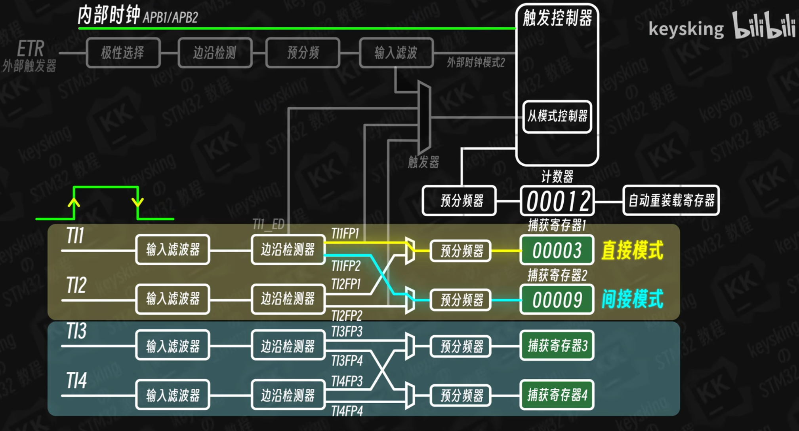
一个定时器通道既可以捕获自己对应的输入，也可以借用相邻通道的输入。
**直接模式（Direct Mode）**：捕获自己对应的输入信号。
**间接模式（Indirect Mode）**：捕获与自己配对的另一个输入通道。
其中：
**TI1 与 TI2 为一组，TI3 与 TI4 为一组。**
本节 Echo 接到 `TIM1_CH3`，因此可以让：
**CH3 Direct Mode → 捕获 TI3 的上升沿**
**CH4 Indirect Mode → 同样捕获 TI3，但检测下降沿**
也就是：
**Echo/TI3 ─→ CH3直接模式 ─→ 捕获上升沿 ─→ CCR3**
**Echo/TI3 ─→ CH4间接模式 ─→ 捕获下降沿 ─→ CCR4**
这样一个 Echo 信号就可以同时利用两个捕获寄存器记录上升沿和下降沿，不需要在程序中反复修改捕获极性。

> **直接模式和间接模式的重点不是两个GPIO，而是让两个捕获通道共同处理同一个输入信号。**

### CubeMX配置
#### SYS与RCC时钟
首先在 **System Core → SYS** 中设置：
`Debug` → `Serial Wire`
随后在 **System Core → RCC** 中开启外部高速晶振：
`High Speed Clock (HSE)` → `Crystal/Ceramic Resonator`
进入 **Clock Configuration**，配置：
**HSE 8MHz → PLL×9 → SYSCLK 72MHz**
本节需要利用定时器精确测量微秒级时间，因此将 TIM1 的计数频率配置为 `1MHz`，使：
**CNT每1μs加1**
TIM1 位于 APB2，本工程中定时器时钟为72MHz，因此后面设置：
$$PSC=72-1=71$$
即可得到：
$$f_{CNT}=\frac{72MHz}{72}=1MHz$$

> **这里配置72MHz不仅是为了让CPU运行更快，更重要的是后面可以方便地将TIM1分频到1MHz，从而使一个CNT计数对应1μs。**

#### 配置OLED
本节最后使用 OLED 显示距离，因此开启：
**Connectivity → I2C1 → I2C**
OLED 的具体配置和驱动库继续沿用前面的内容。
同时在 **Project Manager → Code Generator** 中勾选：
`Generate peripheral initialization as a pair of '.c/.h' files per peripheral`

#### 配置Trig引脚
根据学习板超声波接口，视频中：
`PA11` → `Trig`
`PA10` → `Echo`
将 `PA11` 配置为：`GPIO_Output`
并设置 User Label：`Trig`
因此后面可以直接使用：

```c
HAL_GPIO_WritePin(Trig_GPIO_Port, Trig_Pin, GPIO_PIN_SET);
```

#### 配置TIM1输入捕获
`PA10` 对应 `TIM1_CH3`，因此进入 **Timers → TIM1**，设置：
`Clock Source` → `Internal Clock`
`Channel3` → `Input Capture direct mode`
`Channel4` → `Input Capture indirect mode`
这里 CH4 虽然没有单独连接另一个 GPIO，但由于采用间接模式，它可以和 CH3 一起捕获 **TI3，也就是 PA10 上的 Echo 信号**。

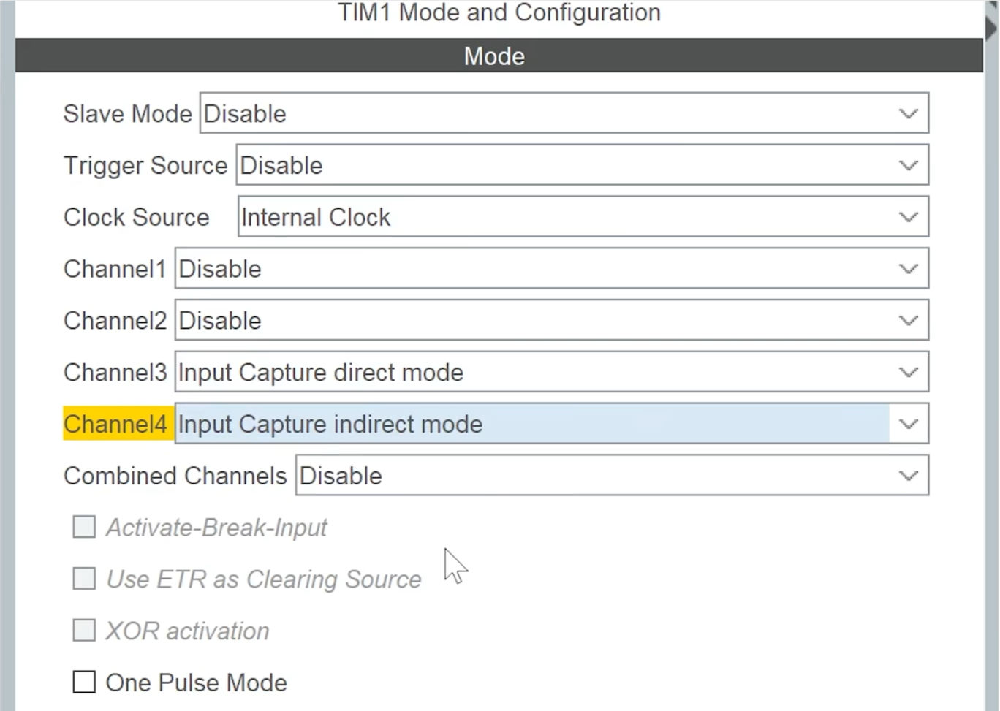

随后配置计数器：
`Prescaler` → `72-1`
使 CNT：
**72MHz → 72分频 → 1MHz → 每1μs加1**
输入捕获参数设置为：
**Channel3：**
`Polarity Selection` → `Rising Edge`
`IC Selection` → `Direct`
`IC Prescaler` → `DIV1`
**Channel4：**
`Polarity Selection` → `Falling Edge`
`IC Selection` → `Indirect`
`IC Prescaler` → `DIV1`
因此：
**Echo上升沿 → CH3捕获 → CCR3保存CNT**
**Echo下降沿 → CH4捕获 → CCR4保存CNT**

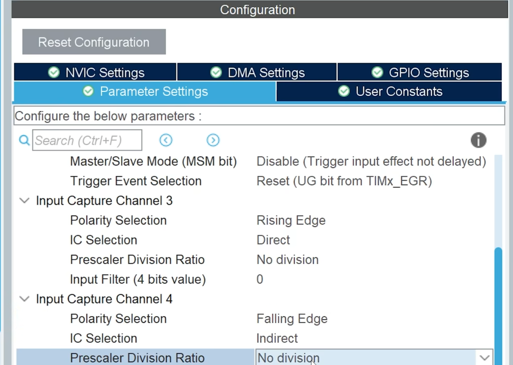

#### 开启输入捕获中断
进入 **TIM1 → NVIC Settings**，开启 TIM1 的 **Capture Compare Interrupt**。
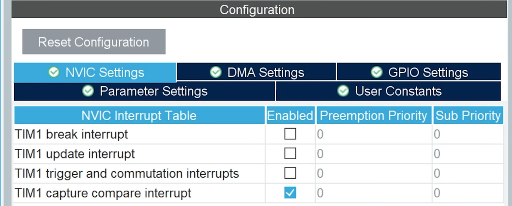
v 
本实验只需要在 Echo **下降沿发生以后通知CPU**，因为下降沿说明一整个高电平已经测量完成，所以后面的代码只给 CH4 开启输入捕获中断。

### 导入OLED驱动库
继续使用前面 keysking 提供的 OLED 驱动库，将对应 `oled.c/font.c` 与 `oled.h/font.h` 加入工程，在 `main.c` 中包含：

```c
/* USER CODE BEGIN Includes */
#include "oled.h"
#include <stdio.h>
/* USER CODE END Includes */
```

### 启动定时器与输入捕获
CubeMX 的初始化代码只是完成配置，还需要手动启动 TIM1 和两个输入捕获通道：

```c
/* USER CODE BEGIN 2 */
HAL_Delay(20);
OLED_Init();    // 初始化OLED
HAL_TIM_Base_Start(&htim1);                    // 启动TIM1计数器
HAL_TIM_IC_Start(&htim1, TIM_CHANNEL_3);       // CH3捕获上升沿，不开启中断
HAL_TIM_IC_Start_IT(&htim1, TIM_CHANNEL_4);    // CH4捕获下降沿，并开启捕获中断
char message[20] = "";
/* USER CODE END 2 */
```

三个函数的作用：
`HAL_TIM_Base_Start()` → **启动CNT计数**
`HAL_TIM_IC_Start()` → **启动普通输入捕获**
`HAL_TIM_IC_Start_IT()` → **启动输入捕获并开启对应捕获中断**
这里 CH3 只负责把上升沿时刻保存到 CCR3，不需要立即通知CPU；CH4检测到下降沿以后说明 Echo 高电平已经结束，所以使用 `_IT`：
**上升沿 → CH3硬件自动记录，不打断CPU**
**下降沿 → CH4硬件记录 + 中断通知CPU → 开始计算距离**

### 输入捕获回调函数
首先定义保存捕获值和距离的变量：

```c
/* USER CODE BEGIN 0 */
int upEdge = 0;       // Echo上升沿时CNT值
int downEdge = 0;     // Echo下降沿时CNT值
float distance = 0;   // 计算得到的距离，单位cm
```

输入捕获发生中断以后，HAL 会调用：

```c
HAL_TIM_IC_CaptureCallback()
```

代码：

```c
void HAL_TIM_IC_CaptureCallback(TIM_HandleTypeDef *htim)
{
    // 判断是否为TIM1的CH4下降沿捕获事件
    if (htim == &htim1 && htim->Channel == HAL_TIM_ACTIVE_CHANNEL_4)
    {
        // 读取CH3在上升沿时保存的CCR3
        upEdge = HAL_TIM_ReadCapturedValue(htim, TIM_CHANNEL_3);
        // 读取CH4在下降沿时保存的CCR4
        downEdge = HAL_TIM_ReadCapturedValue(htim, TIM_CHANNEL_4);
        // CNT每1us加1，因此差值就是Echo高电平持续时间(us)
        // 声速约0.034cm/us，除以2得到单程距离
        distance = ((downEdge - upEdge) * 0.034) / 2;
    }
}
/* USER CODE END 0 */
```

其中：
`htim->Channel` → **表示本次捕获事件来自哪个通道**
`HAL_TIM_ACTIVE_CHANNEL_4` → **本次中断由CH4捕获产生**
`HAL_TIM_ReadCapturedValue()` → **读取指定通道的捕获寄存器CCR**
整个过程为：
**Echo上升沿 → CCR3记录 `upEdge` → Echo下降沿 → CCR4记录 `downEdge` → CH4产生中断 → 读取两个捕获值 → 计算距离**

### 主循环进行超声波测距
在 `while(1)` 中周期性触发超声波模块：

```c
while (1)
{
    // 发送Trig触发脉冲
    HAL_GPIO_WritePin(Trig_GPIO_Port, Trig_Pin, GPIO_PIN_SET);
    HAL_Delay(1);
    HAL_GPIO_WritePin(Trig_GPIO_Port, Trig_Pin, GPIO_PIN_RESET);
    // 每次开始新的测量前重新从0附近开始计数，避免CNT溢出影响两次捕获值做差
    __HAL_TIM_SET_COUNTER(&htim1, 0);
    // 等待超声波测量完成；实际程序中这里也可以执行其他任务
    HAL_Delay(20);
    // OLED显示距离
    OLED_NewFrame();
    sprintf(message, "距离：%.2fcm", distance);
    OLED_PrintString(0, 0, message, &font16x16, OLED_COLOR_NORMAL);
    OLED_ShowFrame();
    // 控制测量间隔
    HAL_Delay(500);
}
```

#### 为什么要重新设置CNT
假设上升沿捕获时：
`upEdge = 65000`
随后 CNT 到达 ARR 并重新从0开始，下降沿捕获可能变成：
`downEdge = 1000`
此时直接计算：
$$downEdge-upEdge$$
就会得到错误结果。
所以视频在每次触发新的测量后使用：

```c
__HAL_TIM_SET_COUNTER(&htim1, 0);
```

让计数器重新从0附近开始计数。HC-SR04 的一次测量时间远小于 TIM1 当前的最大计数周期，因此可以避免正常测量过程中发生重装载。
可以理解为：
**开始一次新测量 → CNT重新开始 → 上升沿记录 → 下降沿记录 → 两次捕获值直接做差**

### OLED中文字模
最后 OLED 需要显示：
`距离：xx.xxcm`
其中“距”“离”等中文字符需要加入字体库，可以继续使用前面的：
[波特律动在线取模](https://les.baud-dance.com/)
**输入需要显示的汉字 → 生成16×16字模 → 加入 `font.c` → 使用 `font16x16` 显示**

### 本节核心
超声波模块的测距过程：
**Trig脉冲 → 发射超声波 → Echo上升沿 → 等待回波 → Echo下降沿**
输入捕获负责记录两个边沿发生的准确时刻：
**CH3 Direct + Rising Edge → 捕获上升沿 → CCR3**
**CH4 Indirect + Falling Edge → 捕获下降沿 → CCR4**
定时器配置成：
**TIM1 72MHz → PSC=71 → CNT=1MHz → 每1μs计数一次**
因此：
$$t=downEdge-upEdge$$
$$distance=\frac{t\times0.034}{2}$$
完整数据流：
**STM32输出Trig → HC-SR04发射超声波 → Echo产生高电平 → TIM1输入捕获两个边沿 → CH4捕获中断 → 计算Echo高电平时间 → 计算距离 → OLED显示**

> **输入捕获最重要的作用：边沿发生的一瞬间由硬件自动保存CNT，不需要CPU恰好在那个时刻执行代码，因此比软件轮询GPIO更加准确。**
>
> **Direct/Indirect组合的作用：让两个捕获通道同时处理同一个Echo输入，一个记录上升沿，一个记录下降沿。**
>
> **本实验只给CH4开启输入捕获中断，因为下降沿到来代表一次Echo高电平已经完整结束，此时再读取上升沿和下降沿捕获值并计算距离。**

