## 8.5 PWM基础与呼吸灯
本节学习 **PWM（Pulse Width Modulation，脉冲宽度调制）**，并利用定时器的**输出比较功能**产生PWM信号，通过不断改变PWM占空比实现LED渐亮、渐暗的呼吸灯效果。

### PWM
PWM本质上是一种周期性的数字脉冲信号。一个完整的高低电平变化所占的时间称为**周期 `T`**，单位时间内重复的次数就是频率：
$$f=\frac{1}{T}$$
一个周期内高电平持续时间占整个周期的比例称为**占空比（Duty Cycle）**：
$$Duty=\frac{T_{High}}{T}\times100\%$$
例如占空比为50%，表示一个周期中一半时间为高电平、一半时间为低电平；高电平持续时间越长，占空比越大，最大可以达到100%。

#### 数字信号与模拟信号
数字信号主要通过**高、低两个电平状态**传递信息，抗干扰能力较强；模拟信号则通过连续变化的电压表示信息，例如通过不同电压控制LED亮度。
前面和后面会接触三个相关概念：
- **ADC**：模拟信号 → 数字信号；
- **DAC**：数字信号 → 模拟信号；
- **PWM**：利用快速变化的数字高低电平，在宏观上模拟不同大小的模拟量。

例如STM32输出高电平为3.3V时，可以把PWM的平均效果理解为：
| 占空比 | 平均/等效电压 |
|---|---:|
| 10% | 约0.33V |
| 50% | 约1.65V |
| 100% | 3.3V |

> PWM引脚实际输出的仍然是 **0V和3.3V不断切换的数字方波**，并不是真的持续输出1.65V；这里的1.65V表示平均或等效效果。

如果不断动态改变占空比，就可以使平均输出效果不断变化，例如让LED逐渐变亮再逐渐变暗：
**占空比0% → 逐渐增大 → 100% → 逐渐减小 → 0%**
因此PWM不仅可以实现呼吸灯，后面还可以用于**控制电机转速、舵机角度等**。

### 定时器的输出比较
上一节学习输入捕获时，是让定时器**测量外部信号**：
**外部边沿到来 → 把CNT保存到CCR**
本节方向正好相反，要让STM32**产生信号**，因此使用定时器的 **Output Compare（输出比较）**功能。

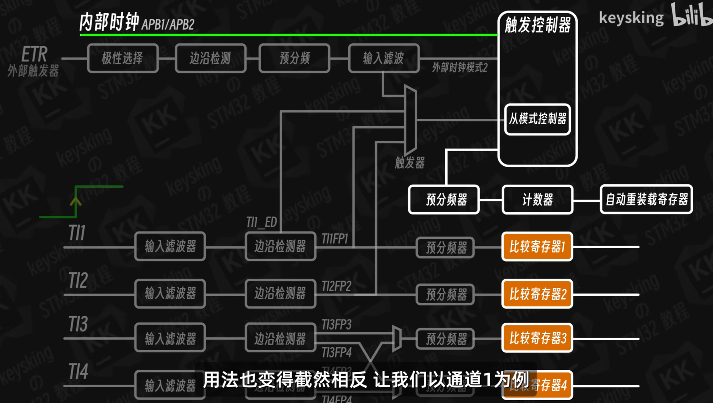

输出比较的基本原理是提前向**比较寄存器 CCR**写入一个值，定时器不断比较：
**CNT当前值 ↔ CCR比较值**
然后根据比较结果决定输出有效电平还是无效电平。因此：
**PSC、ARR决定计数周期 → CNT不断计数 → CNT与CCR比较 → 输出控制器决定GPIO电平**

#### 输出比较的几种模式
普通输出比较存在多种模式：
| 模式 | 作用 |
|---|---|
| Frozen | 匹配时不改变输出状态 |
| Active on Match | CNT与CCR匹配时输出有效 |
| Inactive on Match | CNT与CCR匹配时输出无效 |
| Toggle on Match | CNT与CCR匹配时翻转输出 |
| Forced Active | 强制输出有效 |
| Forced Inactive | 强制输出无效 |

其中 Toggle 模式可以在比较匹配时不断翻转输出，从而产生方波。但如果需要方便地产生**任意占空比**的PWM信号，就使用专门的 **PWM Mode 1 / PWM Mode 2**。

### PWM模式
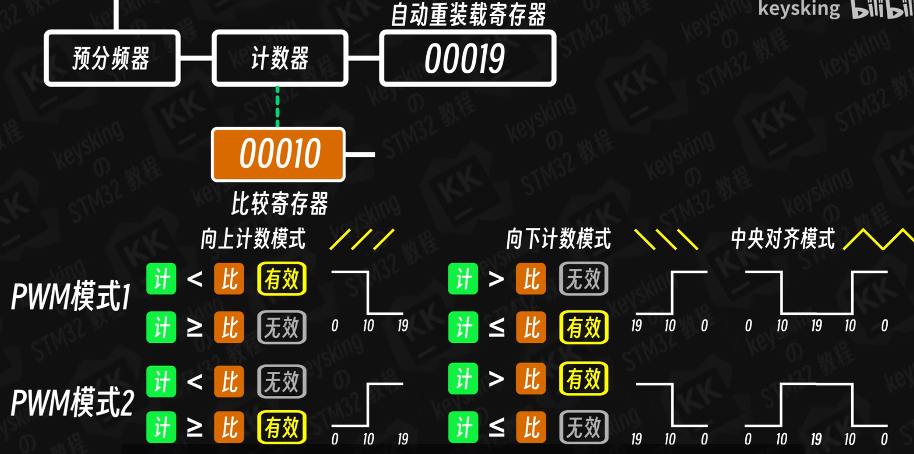
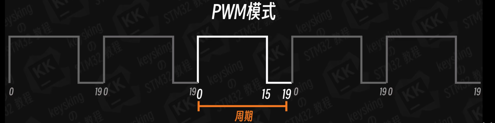
本节默认使用定时器**向上计数**：
**CNT：0 → 1 → 2 → …… → ARR → 0**
#### PWM Mode 1
PWM模式1中：
**CNT < CCR → 输出有效电平**
**CNT ≥ CCR → 输出无效电平**
如果有效电平设置为高电平，那么一个周期中：
**CNT从0开始 → 输出高电平 → CNT达到CCR → 输出低电平 → CNT达到ARR → 重新开始**
因此改变 CCR 就可以改变高电平持续时间，也就是改变占空比：
$$Duty=\frac{CCR}{ARR+1}\times100\%$$
例如：
`ARR = 99`
`CCR = 50`
则一个周期总共计数100次，高电平约占50次：
$$Duty=\frac{50}{100}=50\%$$
所以：**ARR主要决定PWM周期，CCR主要决定PWM占空比。**

#### PWM Mode 2
PWM模式2与模式1正好相反：
**CNT < CCR → 输出无效电平**
**CNT ≥ CCR → 输出有效电平**
如果有效电平对应高电平，那么 PWM Mode 2 输出的高低电平关系就与 Mode 1 相反。
> 输出控制器还可以修改有效电平的极性，所以“有效”不一定永远表示物理高电平，要结合 `Output Compare Polarity` 判断。
> 

### CubeMX配置
本节使用 **TIM3产生PWM → PWM输出到三色LED → 修改占空比形成呼吸效果**。

#### SYS与RCC
首先在 **System Core → SYS** 中设置：
`Debug` → `Serial Wire`
随后进入 **System Core → RCC**：
`High Speed Clock (HSE)` → `Crystal/Ceramic Resonator`
再进入 **Clock Configuration**，配置：
**HSE 8MHz → PLL×9 → SYSCLK/HCLK 72MHz**
TIM3位于APB1。虽然PCLK1为36MHz，但APB1预分频不为1时TIM3时钟会自动×2，因此：
$$f_{TIM3}=72MHz$$

#### TIM3与LED引脚
开发板上的三个LED控制引脚正好具有TIM3复用功能：
| GPIO | 定时器通道 |
|---|---|
| `PA6` | `TIM3_CH1` |
| `PA7` | `TIM3_CH2` |
| `PB0` | `TIM3_CH3` |

视频首先使用其中一个通道制作**单色呼吸灯**。进入 **Timers → TIM3**，设置：
`Clock Source` → `Internal Clock`
`Channel1` → `PWM Generation CH1`
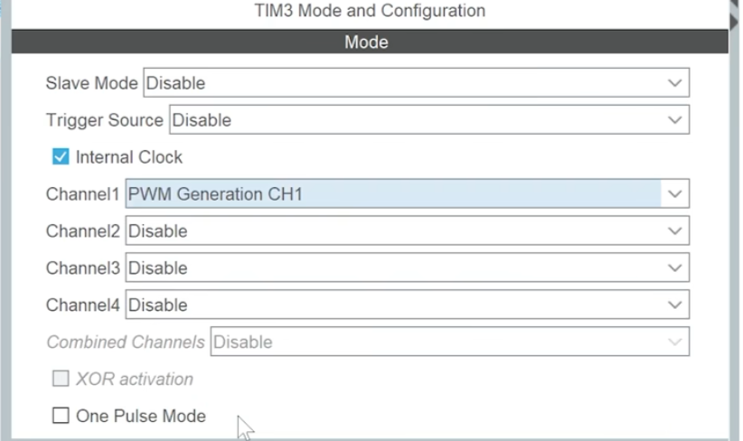
选择PWM以后，对应GPIO会作为定时器PWM复用输出使用，不再按照普通 `GPIO_Output` 的方式控制。

#### TIM3参数

TIM3设置：
`Prescaler` → `72-1`
`Counter Mode` → `Up`
`Counter Period` → `100-1`
PWM通道设置：
`Mode` → `PWM mode 1`
`Pulse` → `50`
`CH Polarity` → `ENABLE`，即不翻转
`Output Compare Preload` → `High`,即开启影子寄存器

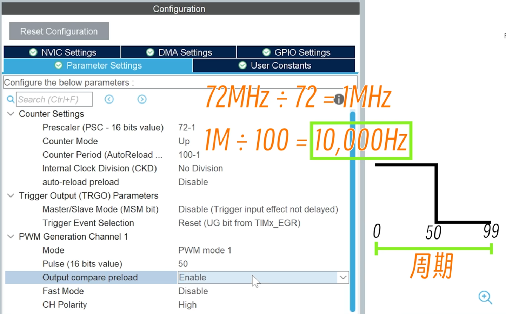
TIM3首先经过72分频：
$$f_{CNT}=\frac{72MHz}{72}=1MHz$$
ARR设置为99，一个PWM周期计数100次：
$$f_{PWM}=\frac{1MHz}{100}=10kHz$$
也可以直接写成：
$$f_{PWM}=\frac{f_{TIM}}{(PSC+1)(ARR+1)}$$
代入：
$$f_{PWM}=\frac{72MHz}{72\times100}=10kHz$$
而初始 `Pulse = 50`，也就是 `CCR1 = 50`：
$$Duty=\frac{50}{100}=50\%$$
所以当前配置可以理解为：
**TIM3 72MHz → PSC 72分频 → CNT 1MHz → ARR=99形成10kHz PWM → CCR决定占空比**

> **PSC和ARR决定PWM频率，CCR决定占空比。修改CCR不会改变PWM周期。**

### 单色呼吸灯
CubeMX只是完成PWM配置，要真正让TIM3开始输出，还需要调用PWM启动函数：
```c
/* USER CODE BEGIN 2 */
// 启动TIM3通道1的PWM输出
HAL_TIM_PWM_Start(&htim3, TIM_CHANNEL_1);
/* USER CODE END 2 */
```
函数：
```c
HAL_TIM_PWM_Start(&htim3, TIM_CHANNEL_1);
```
表示：**启动TIM3的CH1 PWM输出**。

#### 修改比较寄存器
HAL提供宏：
```c
__HAL_TIM_SET_COMPARE(&htim3, TIM_CHANNEL_1, compare);
```
用于修改对应通道的CCR值。例如：
```c
__HAL_TIM_SET_COMPARE(&htim3, TIM_CHANNEL_1, 20);
```
相当于将CCR1修改为20。由于ARR+1=100，所以占空比变成约20%。
因此：
**修改CCR → 改变高电平持续时间 → 改变占空比 → 改变LED平均亮度**

#### 实现渐亮渐暗
在 `while(1)` 中首先让CCR从0逐渐增加到99：
```c
while (1)
{
    // CCR由小到大，占空比逐渐增大，LED逐渐变化
    for (int i = 0; i < 100; i++)
    {
        __HAL_TIM_SET_COMPARE(&htim3, TIM_CHANNEL_1, i);
        HAL_Delay(10);
    }
    // CCR由大到小，占空比逐渐减小
    for (int i = 99; i >= 0; i--)
    {
        __HAL_TIM_SET_COMPARE(&htim3, TIM_CHANNEL_1, i);
        HAL_Delay(10);
    }
}
```
第一个循环：
**CCR：0 → 1 → 2 → …… → 99 → 占空比逐渐增大**
第二个循环：
**CCR：99 → 98 → …… → 0 → 占空比逐渐减小**
因此不断循环以后形成：
**暗 → 逐渐变亮 → 最亮 → 逐渐变暗 → 暗 → ……**
这就是呼吸灯效果。
`HAL_Delay(10)` 控制每次修改亮度之间的时间，因此也会影响呼吸灯渐变的速度。

### 三色呼吸灯
完成单个通道以后，视频继续将另外两个LED对应的通道也配置为PWM。回到 **TIM3**，继续开启：
`Channel2` → `PWM Generation CH2`
`Channel3` → `PWM Generation CH3`
三个通道分别为：
**PA6 → TIM3_CH1**
**PA7 → TIM3_CH2**
**PB0 → TIM3_CH3**
三个通道的 PWM Mode、Pulse、Polarity 等配置保持相同。
生成代码后，需要分别启动三个PWM通道：
```c
/* USER CODE BEGIN 2 */
// 启动TIM3三个通道的PWM输出
HAL_TIM_PWM_Start(&htim3, TIM_CHANNEL_1);
HAL_TIM_PWM_Start(&htim3, TIM_CHANNEL_2);
HAL_TIM_PWM_Start(&htim3, TIM_CHANNEL_3);
/* USER CODE END 2 */
```
然后在循环中同时修改三个通道的比较寄存器：
```c
while (1)
{
    // 三路PWM占空比逐渐增大
    for (int i = 0; i < 100; i++)
    {
        __HAL_TIM_SET_COMPARE(&htim3, TIM_CHANNEL_1, i);
        __HAL_TIM_SET_COMPARE(&htim3, TIM_CHANNEL_2, i);
        __HAL_TIM_SET_COMPARE(&htim3, TIM_CHANNEL_3, i);
        HAL_Delay(10);
    }
    // 三路PWM占空比逐渐减小
    for (int i = 99; i >= 0; i--)
    {
        __HAL_TIM_SET_COMPARE(&htim3, TIM_CHANNEL_1, i);
        __HAL_TIM_SET_COMPARE(&htim3, TIM_CHANNEL_2, i);
        __HAL_TIM_SET_COMPARE(&htim3, TIM_CHANNEL_3, i);
        HAL_Delay(10);
    }
}
```
这样三个通道的占空比同步变化：
**CH1、CH2、CH3占空比同时增加 → 三路LED逐渐变化**
**CH1、CH2、CH3占空比同时减小 → 三路LED逐渐恢复**

### PWM相关参数的关系
本节几个寄存器的作用可以概括为：
| 参数 | 作用 |
|---|---|
| `PSC` | 对TIM时钟进行预分频 |
| `ARR` | 决定PWM一个周期需要计数多少次 |
| `CNT` | 当前计数值 |
| `CCR` | 决定PWM电平切换位置，也就是占空比 |

PWM频率：
$$f_{PWM}=\frac{f_{TIM}}{(PSC+1)(ARR+1)}$$
PWM Mode 1、向上计数、有效电平为高时，占空比近似为：
$$Duty=\frac{CCR}{ARR+1}\times100\%$$
因此：
**修改PSC / ARR → 主要改变PWM频率**
**修改CCR → 改变PWM占空比**

### 本节核心
PWM利用高速切换的数字高低电平，通过改变**占空比**产生不同的平均输出效果：
**固定PWM频率 + 改变CCR → 改变占空比 → 改变LED亮度**
STM32通过定时器的**输出比较**产生PWM：
**TIM时钟 → PSC → CNT计数 → CNT与CCR比较 → PWM Mode决定输出状态 → GPIO输出PWM**
本节实际配置：
**TIM3 72MHz → PSC=71 → 1MHz → ARR=99 → PWM=10kHz**
程序通过：
```c
HAL_TIM_PWM_Start();
```
启动PWM，通过：
```c
__HAL_TIM_SET_COMPARE();
```
动态修改CCR。
最终呼吸灯：
**CCR逐渐增大 → 占空比逐渐增大 → LED逐渐变化 → CCR逐渐减小 → LED逐渐恢复 → 循环**
> **PWM最重要的三个量：频率、占空比、输出极性。**
>
> **PSC和ARR决定PWM周期，CCR决定PWM占空比；呼吸灯本质就是保持PWM频率基本不变，不断修改CCR。**
>
> **输入捕获是“外部边沿到来时记录CNT”，输出比较则是“CNT达到比较条件后改变输出”，两者分别对应定时器的输入和输出功能。**

## 8.6 编码器与旋钮
本节学习 STM32 定时器的**编码器接口（Encoder Interface）**，使用开发板上的旋转编码器检测旋转方向和角度，最终实现：**旋转旋钮 → 调节RGB灯亮度；按下旋钮 → 切换RGB灯颜色；OLED → 显示当前亮度和进度条**。

### 旋转编码器
旋转编码器可以把转轴的**角位移、转速和旋转方向**转换成数字脉冲信号。常见编码器可以分为增量型和绝对型：
- **增量型编码器**：旋转时输出脉冲，只能知道相对于原来位置转了多少；
- **绝对型编码器**：可以直接得到转轴当前的绝对位置。
本节旋钮中的 **EC11** 属于增量型旋转编码器，主要输出 **A、B两相信号**。

#### A、B两相信号
编码器没有转动时，A、B两相保持稳定；转动时，A、B都会输出方波，并且两路信号之间存在先后关系。
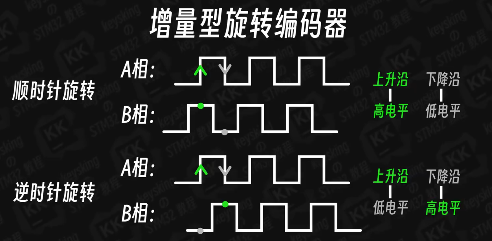
理想情况下，A、B两相信号相差约90°。视频中以一个方向旋转为例，**B相比A领先**；反方向旋转时则相反。因此不仅可以通过脉冲数量得到旋转了多少，还可以根据 **A、B哪个信号先发生变化**判断旋转方向。
例如：
**B先变化 → 一个旋转方向**
**A先变化 → 另一个旋转方向**

> A、B谁领先对应顺时针还是逆时针，与具体编码器接线和极性有关，因此实际使用时如果发现方向相反，可以调整输入极性。

EC11规格为 **20脉冲/360°**，如果只按一相的一个完整脉冲计算：
$$\frac{360^\circ}{20}=18^\circ$$
所以一个脉冲大约对应18°。实际项目中通常不一定需要真的换算成角度，而是直接利用脉冲计数值表示旋钮转动程度。

### 如何读取旋转编码器
视频先介绍了两种处理A、B相信号的方法。

#### 方法一：GPIO外部中断
可以将A、B两相接入GPIO，例如让A相产生上升沿或下降沿中断，在中断发生时读取B相电平，根据B相当前状态判断旋转方向，同时让软件计数值 `+1` 或 `-1`。
基本过程：
**A相发生边沿 → GPIO外部中断 → 读取B相电平 → 判断方向 → 软件计数±1**
这种方法普通GPIO就可以实现，但如果编码器旋转速度很快，就会频繁进入中断：
**脉冲越多 → 中断越频繁 → CPU占用越高**
对于高速电机编码器，还可能因为CPU处理不及时而发生丢脉冲。

#### 方法二：定时器编码器接口
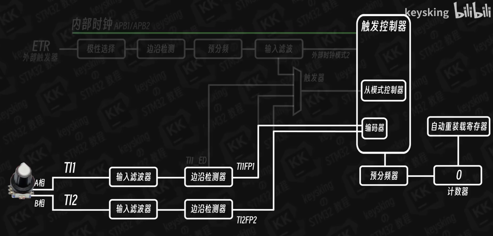
STM32的高级定时器和通用定时器提供了专门的 **Encoder Interface**，可以将A、B两相信号直接交给定时器硬件处理：
**A相 + B相 → 定时器编码器接口 → 自动判断方向 → CNT自动增加或减少**
编码器接口使用的两个输入就是前面见过的：
**TI1FP1 + TI2FP2**
也就是把A、B两相信号分别接到定时器：
**CH1 + CH2**
这样输入信号还可以经过定时器自身的**滤波器和边沿检测器**处理。

> **编码器模式最大的特点：A、B两相的方向判断和计数都由定时器硬件完成，CPU只需要读取CNT即可。**

### 编码器接口的计数
编码器模式会同时观察A、B两相，根据两路信号的状态决定 CNT 是增加还是减少。例如在一个方向旋转时：
**A/B发生边沿 → 编码器接口判断另一相当前电平 → CNT +1**
反方向旋转时：
**A/B发生边沿 → 判断相位关系相反 → CNT -1**
编码器接口不仅可以利用上升沿，还可以利用下降沿，因此一次机械脉冲可能对应多次CNT变化。视频中为了使旋钮每格对应的计数更加直观，在 CubeMX 中对编码器输入进行了相应的预分频处理。
可以简单理解为：
**外部时钟模式：只负责“来了几个脉冲”**
**编码器模式：不仅数脉冲，还根据A、B相位关系判断“应该加还是减”**

### CubeMX配置
本节要同时使用：
**TIM1 → 读取旋转编码器**
**TIM3 → PWM控制RGB灯亮度**
**PB15 → 检测旋钮按下**
**I2C1 → OLED显示**

#### SYS与RCC
首先进入 **System Core → SYS**：
`Debug` → `Serial Wire`
然后进入 **System Core → RCC**：
`High Speed Clock (HSE)` → `Crystal/Ceramic Resonator`
再进入 **Clock Configuration**，配置：
**HSE 8MHz → PLL×9 → SYSCLK/HCLK 72MHz**
本节编码器本身的计数脉冲来自A、B相，不依靠72MHz内部时钟决定旋钮计数速度；但是后面 **TIM3需要产生PWM控制LED**，I2C、CPU等也需要系统时钟，因此工程仍然配置为72MHz。

#### 配置TIM1编码器模式
根据开发板原理图，旋转编码器的A、B相分别连接：
**PA8 → TIM1_CH1**
**PA9 → TIM1_CH2**

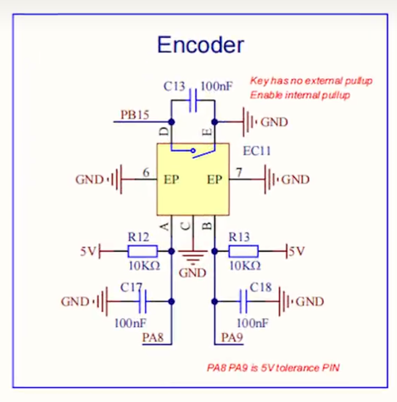

进入 **Timers → TIM1**，在：
`Combined Channels`
中选择：
`Encoder Mode`
选择后 PA8、PA9 会自动配置为 TIM1_CH1 和 TIM1_CH2：
**编码器A/B相 → PA8/PA9 → TIM1_CH1/CH2 → TI1FP1/TI2FP2 → Encoder Interface → CNT**

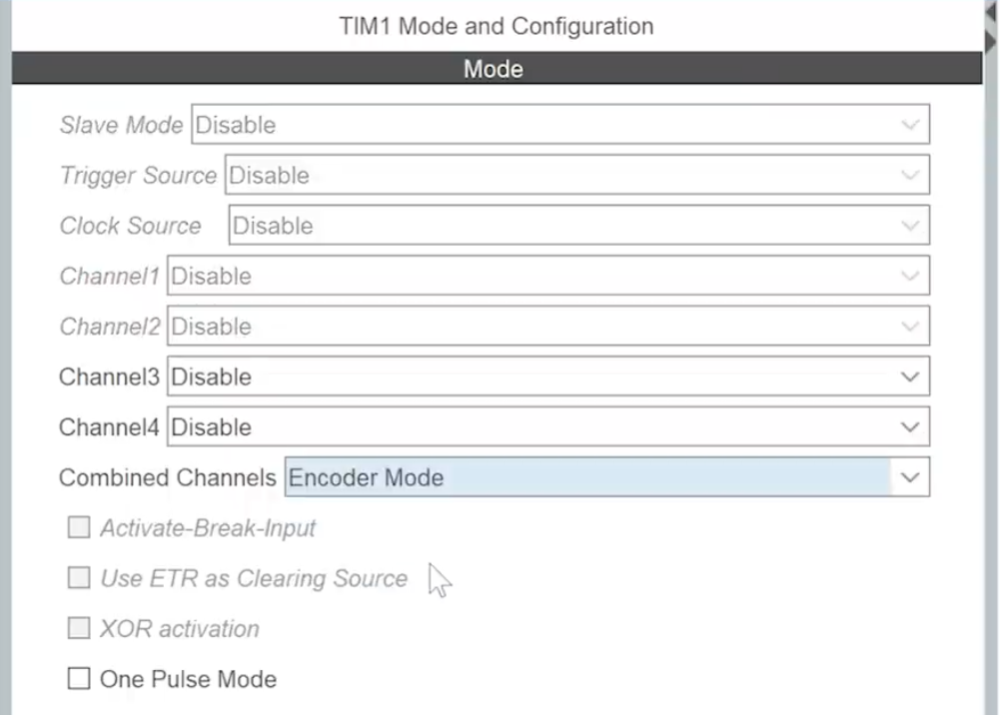
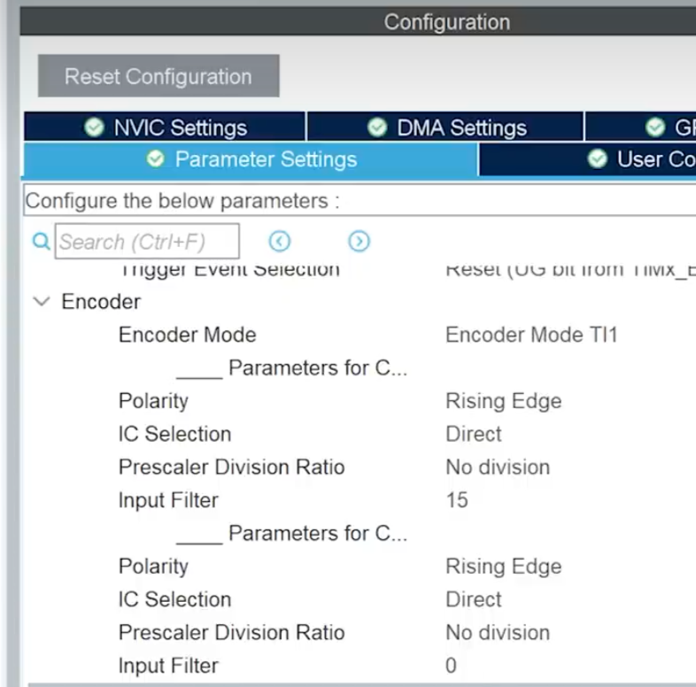

视频随后对输入参数进行配置。由于编码器接口会对输入边沿进行计数，视频通过输入预分频使旋钮每格对应的计数更加直观；同时将输入滤波设置得较大以减少机械编码器抖动：
`Input Filter` → `15`

> EC11本身属于机械编码器，转动时存在触点抖动，因此这里使用定时器输入滤波器非常重要。

如果发现实际旋钮转动方向与希望的 CNT 增减方向相反，可以修改对应输入通道的：
`Polarity`
改变编码器的正反方向，而不需要修改后面的程序逻辑。

#### 配置旋钮按键
EC11除了可以旋转，本身还可以**向下按压作为一个按键**。根据原理图，该按键连接：
`PB15`
将 PB15 设置为：
`GPIO_Input`
并设置 User Label：
`Key`
由于原理图中没有外部上拉，所以还需要：
`GPIO Pull-up/Pull-down` → `Pull-up`
因此：
**旋钮松开 → PB15高电平**
**旋钮按下 → PB15低电平**
后面利用这个按键切换RGB灯当前控制的颜色。

#### 配置TIM3 PWM
本节继续使用上一节的PWM控制RGB灯。三个LED分别对应TIM3三个通道：
**PA6 → TIM3_CH1**
**PA7 → TIM3_CH2**
**PB0 → TIM3_CH3**
进入 **Timers → TIM3**，开启：
`Clock Source` → `Internal Clock`
并设置：
`Channel1` → `PWM Generation CH1`
`Channel2` → `PWM Generation CH2`
`Channel3` → `PWM Generation CH3`
PWM参数继续采用上一节：
`Prescaler` → `72-1`
`Counter Period` → `100-1`
所以PWM频率：
$$f_{PWM}=\frac{72MHz}{72\times100}=10kHz$$
同时 CCR 的范围可以方便地使用 `0~99` 表示亮度：
**CCR越大 → PWM占空比越大 → LED亮度变化**

#### 配置OLED
开启：
**Connectivity → I2C1 → I2C**
随后进入 **Project Manager → Code Generator**，勾选：
`Generate peripheral initialization as a pair of '.c/.h' files per peripheral`
生成工程后继续使用前面的OLED驱动库：
`oled.c`、`font.c` → `Src`
`oled.h`、`font.h` → `Inc`

### 程序实现
#### 初始化
首先包含OLED和字符串格式化需要的头文件：
```c
/* USER CODE BEGIN Includes */
#include "oled.h"
#include <stdio.h>
/* USER CODE END Includes */
```

初始化完成后定义三个PWM通道，并启动编码器和当前RGB通道：

```c
/* USER CODE BEGIN 2 */
int channel_index = 0;    // 当前控制的RGB通道，0~2
// 三个RGB灯对应TIM3的三个PWM通道
uint32_t channels[3] = {
    TIM_CHANNEL_1,
    TIM_CHANNEL_2,
    TIM_CHANNEL_3
};
HAL_Delay(20);
OLED_Init();    // 初始化OLED
// 启动TIM1编码器接口，CH1和CH2同时工作
HAL_TIM_Encoder_Start(&htim1, TIM_CHANNEL_ALL);
// 启动当前颜色对应的PWM通道
HAL_TIM_PWM_Start(&htim3, channels[channel_index]);
int count = 0;          // 保存编码器当前计数值，同时作为亮度
char message[20] = "";  // OLED显示字符串
/* USER CODE END 2 */
```

其中：
`HAL_TIM_Encoder_Start(&htim1, TIM_CHANNEL_ALL);`
表示启动 TIM1 的编码器模式。因为编码器需要同时使用CH1、CH2，所以这里使用：
`TIM_CHANNEL_ALL`

### 读取旋钮计数
编码器模式启动以后，不需要在中断中自己判断A、B相，只需要读取CNT：

```c
count = __HAL_TIM_GET_COUNTER(&htim1);
```

旋钮向一个方向旋转时 CNT 增加，向另一个方向旋转时 CNT 减少。

#### 将计数限制到0~100
TIM1的CNT是16位计数器，其范围远大于LED需要的 `0~100`。而且当 CNT 在0时继续反向计数，会发生下溢：
**0 → 65535**
所以视频通过判断较大的数值识别这种下溢，并把亮度限制在0~100：

```c
count = __HAL_TIM_GET_COUNTER(&htim1);    // 获取编码器计数值
// CNT从0继续反向旋转会下溢到65535附近
if (count > 60000)
{
    count = 0;
    __HAL_TIM_SET_COUNTER(&htim1, 0);     // 限制最小值为0
}
else if (count > 100)
{
    count = 100;
    __HAL_TIM_SET_COUNTER(&htim1, 100);   // 限制最大值为100
}
```

因此：
**反向超过0 → CNT变成65535附近 → 判断 `>60000` → 拉回0**
**正向超过100 → 判断 `>100` → 拉回100**
最终得到：
$$0\le count\le100$$
这里使用：
```c
__HAL_TIM_SET_COUNTER(&htim1, value);
```
可以直接修改定时器CNT值。

> **不能只修改变量 `count`，还要把TIM1的CNT一起限制，否则下一次循环重新读取CNT时又会得到原来的越界值。**

### OLED显示计数值
每次循环先新建一帧：
```c
OLED_NewFrame();
```

随后把当前亮度转换成字符串并显示：

```c
sprintf(message, "count: %d", count);
OLED_PrintString(13, 0,
                 message,
                 &font16x16,
                 OLED_COLOR_NORMAL);
```

因此旋转编码器以后，OLED上的：
`count: xx`
会跟随 CNT 实时变化。

### OLED显示进度条
除了显示数字，视频还使用OLED库绘制一个亮度进度条。
首先绘制进度条外框：

```c
OLED_DrawRectangle(13, 25, 101, 12, OLED_COLOR_NORMAL);
```

然后根据 `count` 绘制内部填充：

```c
OLED_DrawFilledRectangle(13, 26, count, 11, OLED_COLOR_NORMAL);
```

因为：
$$0\le count\le100$$
所以 `count` 可以直接作为填充矩形的宽度：
**count = 0 → 进度条为空**
**count = 50 → 填充约一半**
**count = 100 → 进度条填满**
最终：
**旋转编码器 → CNT变化 → count变化 → OLED数字变化 + 进度条长度变化**

### 按下旋钮切换RGB颜色
旋钮按键 PB15 使用上拉输入，因此按下时读取到：
`GPIO_PIN_RESET`
代码：

```c
if (HAL_GPIO_ReadPin(Key_GPIO_Port, Key_Pin) == GPIO_PIN_RESET)
{
    HAL_Delay(10);    // 软件消抖
    if (HAL_GPIO_ReadPin(Key_GPIO_Port, Key_Pin) == GPIO_PIN_RESET)
    {
        // 先停止当前颜色的PWM
        HAL_TIM_PWM_Stop(&htim3, channels[channel_index]);
        // 0 → 1 → 2 → 0，循环切换三个颜色
        channel_index = (channel_index + 1) % 3;
        // 开启新的颜色PWM
        HAL_TIM_PWM_Start(&htim3, channels[channel_index]);
    }
    // 等待按键松开，防止一次按下连续切换
    while (HAL_GPIO_ReadPin(Key_GPIO_Port, Key_Pin) == GPIO_PIN_RESET)
    {
    }
}
```

其中：
```c
channel_index = (channel_index + 1) % 3;
```
可以使：
**0 → 1 → 2 → 0 → 1 → 2……**
对应：
**TIM3_CH1 → TIM3_CH2 → TIM3_CH3 → TIM3_CH1……**
所以每按一次旋钮：
**停止当前PWM通道 → 切换到下一个通道 → 启动新的PWM通道 → RGB灯颜色切换**

### 旋钮控制LED亮度
最后将编码器得到的 `count` 写入当前颜色对应的 CCR：

```c
__HAL_TIM_SET_COMPARE(&htim3,
                      channels[channel_index],
                      count);
```

由于 TIM3：
`Counter Period = 100-1`
所以 `count` 的 `0~100` 基本可以直接对应 PWM 的 `0~100%` 亮度范围：
**旋钮转动 → TIM1 CNT改变 → count改变 → TIM3 CCR改变 → PWM占空比改变 → LED亮度改变**

### 完整主循环
```c
while (1)
{
    OLED_NewFrame();
    // 读取TIM1编码器计数值
    count = __HAL_TIM_GET_COUNTER(&htim1);
    // 将编码器范围限制在0~100
    if (count > 60000)
    {
        count = 0;
        __HAL_TIM_SET_COUNTER(&htim1, 0);
    }
    else if (count > 100)
    {
        count = 100;
        __HAL_TIM_SET_COUNTER(&htim1, 100);
    }
    // OLED显示当前亮度
    sprintf(message, "count: %d", count);
    OLED_PrintString(13, 0,
                     message,
                     &font16x16,
                     OLED_COLOR_NORMAL);
    // 绘制亮度进度条
    OLED_DrawRectangle(13, 25, 101, 12, OLED_COLOR_NORMAL);
    OLED_DrawFilledRectangle(13, 26, count, 11, OLED_COLOR_NORMAL);
    // 按下旋钮切换RGB颜色
    if (HAL_GPIO_ReadPin(Key_GPIO_Port, Key_Pin) == GPIO_PIN_RESET)
    {
        HAL_Delay(10);
        if (HAL_GPIO_ReadPin(Key_GPIO_Port, Key_Pin) == GPIO_PIN_RESET)
        {
            // 关闭当前通道
            HAL_TIM_PWM_Stop(&htim3, channels[channel_index]);
            // 切换到下一个RGB通道
            channel_index = (channel_index + 1) % 3;
            // 启动新通道
            HAL_TIM_PWM_Start(&htim3, channels[channel_index]);
        }
        // 等待松手
        while (HAL_GPIO_ReadPin(Key_GPIO_Port, Key_Pin) == GPIO_PIN_RESET)
        {
        }
    }
    // 编码器计数值控制当前LED的PWM占空比
    __HAL_TIM_SET_COMPARE(&htim3,
                          channels[channel_index],
                          count);
    // 刷新OLED
    OLED_ShowFrame();
}
```

整个程序的数据流为：
**旋转旋钮 → A/B两相方波 → TIM1 Encoder Interface → CNT增减 → count限制到0~100 → TIM3 CCR改变 → PWM占空比改变 → LED亮度变化**
同时：
**count → OLED数字 + OLED进度条**
按下旋钮：
**PB15按下 → `channel_index`切换 → 停止旧PWM通道 → 开启新PWM通道 → RGB颜色切换**

### 本节核心
普通外部脉冲计数只能知道来了多少个脉冲，而旋转编码器需要同时知道**旋转量和旋转方向**，所以使用A、B两相信号：
**A、B相位差 → 判断旋转方向**
**脉冲数量 → 判断旋转程度**
STM32可以使用GPIO中断软件判断，但更适合直接利用定时器硬件：
**A相 → TIM1_CH1/TI1FP1**
**B相 → TIM1_CH2/TI2FP2**
**TI1FP1 + TI2FP2 → Encoder Interface → CNT自动加减**
主要函数：
```c
HAL_TIM_Encoder_Start(&htim1, TIM_CHANNEL_ALL);    // 启动编码器接口
__HAL_TIM_GET_COUNTER(&htim1);                     // 读取编码器CNT
__HAL_TIM_SET_COUNTER(&htim1, value);              // 修改CNT
__HAL_TIM_SET_COMPARE(&htim3, channel, value);     // 修改PWM占空比
```

> **编码器模式 = 定时器硬件同时处理A、B两相信号，自动判断方向并控制CNT增加或减少。**
>
> **本节把编码器CNT限制在0~100，然后直接用这个值控制PWM的CCR，所以旋钮的位置变化就转换成了LED亮度变化。**
>
> **旋钮不仅可以旋转，EC11还带一个按键；本实验利用这个按键在TIM3的CH1、CH2、CH3之间切换，从而控制不同颜色的LED。**

## 8.7 舵机
上一节已经学习了如何使用PWM控制LED亮度以及利用旋转编码器读取旋钮位置，本节将两部分结合起来：**旋转编码器作为输入 → 实时控制舵机转动角度**。

### 舵机
舵机常用于遥控模型、机器人、机械臂等设备。它和普通直流电机的一个明显区别是：普通电机主要控制**转动方向和转速**，而舵机可以控制输出轴**转动到指定角度并保持在该位置**。
本节使用 **SG90舵机**，通过STM32输出PWM信号控制摇臂转动到不同角度。
> 舵机内部存在塑料减速齿轮，不要直接用手强行转动舵机摇臂，避免损坏齿轮。

### 舵机的PWM控制
SG90并不是通过PWM控制转速，而是通过PWM信号的**高电平持续时间**控制目标角度。本节舵机要求PWM频率为：
$$f=50Hz$$
所以PWM周期为：
$$T=\frac{1}{50}=20ms$$
其中占空比 `2.5%~12.5%` 对应舵机大约 `0°~180°`：

| 舵机角度 | 占空比 | 高电平时间 |
|---|---:|---:|
| 0° | 2.5% | 0.5ms |
| 90° | 7.5% | 1.5ms |
| 180° | 12.5% | 2.5ms |

因此：**保持PWM频率为50Hz → 改变高电平宽度 → 改变舵机目标角度**
例如：
**0.5ms → 0°**
**1.5ms → 90°**
**2.5ms → 180°**
> **舵机控制时PWM周期保持20ms不变，真正决定角度的是每个周期中高电平持续了多久。**

### 舵机接线
SG90使用三根线：

| 舵机线 | 作用 | 学习板 |
|---|---|---|
| 黄色 | PWM控制信号 | `PB8` |
| 红色 | 电源正极 | `5V` |
| 棕色 | GND | `GND` |

学习板的舵机控制信号连接到：
**PB8 → TIM4_CH3**
因此后面使用 **TIM4通道3** 输出PWM。

### CubeMX配置
本节需要同时使用两个定时器：
**TIM1 → 读取旋转编码器**
**TIM4 → 输出PWM控制舵机**

#### RCC与系统时钟
进入 **System Core → RCC**，设置：
`High Speed Clock (HSE)` → `Crystal/Ceramic Resonator`
随后进入 **Clock Configuration**，配置：
**HSE 8MHz → PLL×9 → SYSCLK/HCLK 72MHz**
TIM4位于APB1，当前PCLK1为36MHz，由于APB1预分频不为1，所以TIM4时钟自动×2：
$$f_{TIM4}=72MHz$$

#### 配置TIM4舵机PWM
舵机信号引脚为：
`PB8` → `TIM4_CH3`
进入 **Timers → TIM4**，设置：
`Clock Source` → `Internal Clock`
`Channel3` → `PWM Generation CH3`
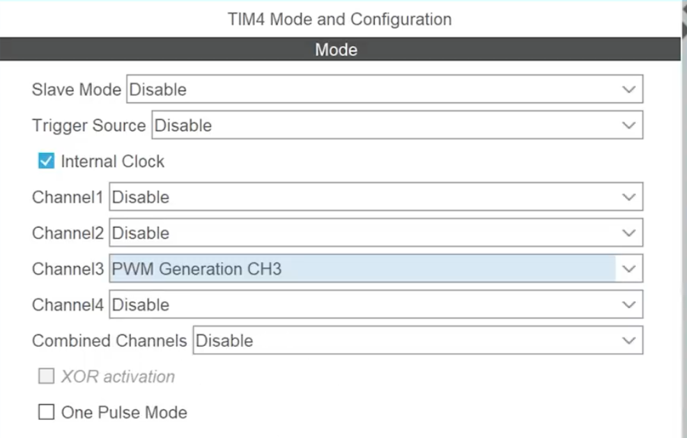
随后在 `Parameter Settings` 中设置：
`Prescaler` → `720-1`
`Counter Period` → `2000-1`
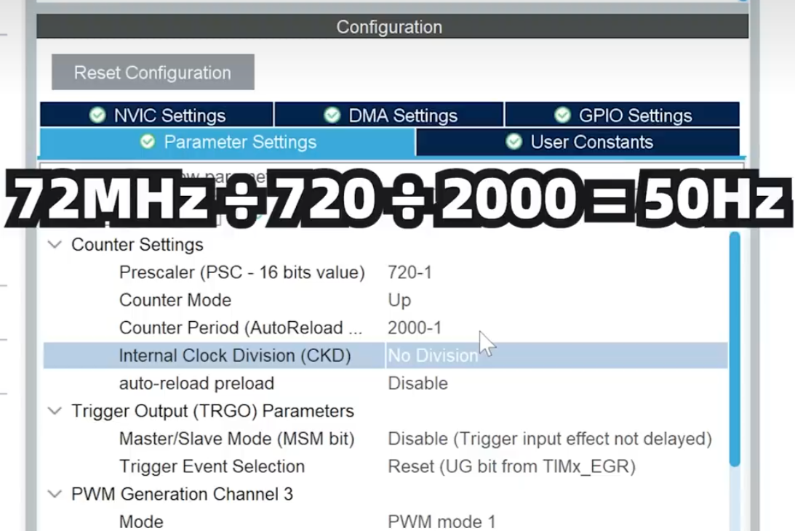

定时器首先进行720分频：
$$f_{CNT}=\frac{72MHz}{720}=100kHz$$
因此CNT每计数一次：
$$T_{CNT}=\frac{1}{100kHz}=10\mu s$$
一个PWM周期计数2000次：
$$T=2000\times10\mu s=20ms$$
所以：
$$f_{PWM}=\frac{72MHz}{720\times2000}=50Hz$$
整个过程为：
**TIM4 72MHz → PSC=719 → CNT=100kHz → 每10μs计数一次 → ARR=1999 → 20ms → 50Hz PWM**

#### 配置TIM1旋转编码器
本节继续使用上一节的旋转编码器。编码器A、B两相信号连接到：
**PA8 → TIM1_CH1**
**PA9 → TIM1_CH2**
进入 **Timers → TIM1**，将：
`Combined Channels` → `Encoder Mode`
编码器的两相信号进入：
**A/B相 → TIM1_CH1/CH2 → Encoder Interface → CNT自动加减**
输入滤波继续设置较大的值，例如：
`Input Filter` → `15`
用于减少机械编码器触点抖动。
> TIM1不负责控制舵机，它只负责把旋钮转动转换成CNT的增加或减少；真正输出舵机PWM的是TIM4。

### CCR与舵机角度
由于 `Counter Period = 2000-1`，一个PWM周期共有2000个计数，因此：
$$Duty=\frac{CCR}{2000}\times100\%$$

#### 0°
0°对应2.5%占空比：
$$CCR=2000\times2.5\%=50$$
高电平时间：
$$50\times10\mu s=0.5ms$$

#### 90°
90°对应7.5%占空比：
$$CCR=2000\times7.5\%=150$$
高电平时间：
$$150\times10\mu s=1.5ms$$

#### 180°
180°对应12.5%占空比：
$$CCR=2000\times12.5\%=250$$
高电平时间：
$$250\times10\mu s=2.5ms$$
所以：

| CCR | 占空比 | 高电平时间 | 舵机角度 |
|---:|---:|---:|---:|
| `50` | 2.5% | 0.5ms | 0° |
| `150` | 7.5% | 1.5ms | 90° |
| `250` | 12.5% | 2.5ms | 180° |

> **ARR确定20ms周期，CCR确定高电平宽度，所以舵机角度最终由CCR控制。**

### 旋钮控制舵机
本节实际实验不是让舵机自动在 `0°、90°、180°` 三个位置之间循环，而是利用上一节的**旋转编码器实时控制舵机角度**。
整体过程：
**旋转旋钮 → TIM1编码器CNT变化 → 映射成PWM比较值 → 修改TIM4_CH3的CCR → 舵机跟随旋钮转动**

#### 启动编码器与PWM
CubeMX只负责生成初始化代码，进入程序后还需要分别启动编码器接口和PWM：

```c
/* USER CODE BEGIN 2 */
// 启动TIM1编码器接口，CH1和CH2共同工作
HAL_TIM_Encoder_Start(&htim1, TIM_CHANNEL_ALL);
// 启动TIM4通道3的PWM输出
HAL_TIM_PWM_Start(&htim4, TIM_CHANNEL_3);
/* USER CODE END 2 */
```

因此：
`HAL_TIM_Encoder_Start()` → **开始读取旋转编码器**
`HAL_TIM_PWM_Start()` → **开始向SG90输出50Hz PWM**

### 编码器计数范围
视频中将旋转编码器的有效计数范围限制为：
$$0\sim20$$
于是可以让旋钮从一端转到另一端时，舵机完成：
$$0^\circ\sim180^\circ$$
对应关系：
**count = 0 → 舵机0°**
**count = 10 → 舵机约90°**
**count = 20 → 舵机180°**

### 限制编码器计数
首先读取TIM1当前CNT：

```c
count = __HAL_TIM_GET_COUNTER(&htim1);
```

由于TIM1计数器可以向上和向下计数，如果CNT已经为0还继续反方向旋转，就会发生下溢：
**0 → 65535**
所以需要限制范围：

```c
#define MAX_COUNT 20

count = __HAL_TIM_GET_COUNTER(&htim1);
// CNT从0继续反向计数，会下溢到65535附近
if (count > 60000)
{
    count = 0;
    __HAL_TIM_SET_COUNTER(&htim1, 0);
}
// 限制最大值为20
else if (count > MAX_COUNT)
{
    count = MAX_COUNT;
    __HAL_TIM_SET_COUNTER(&htim1, MAX_COUNT);
}
```

最终保证：
$$0\le count\le20$$
这里不能只修改变量 `count`，还要同时使用：
```c
__HAL_TIM_SET_COUNTER();
```
修改TIM1真正的CNT，否则下一次循环重新读取时仍然会得到越界值。

### 将旋钮位置映射到舵机PWM
编码器范围：
$$0\sim20$$
舵机占空比范围：
$$2.5\%\sim12.5\%$$
所以先将编码器计数转换成 `0~1`：
$$\frac{count}{MAX\_COUNT}$$
再映射到 `2.5~12.5`：
$$Duty=10\times\frac{count}{MAX\_COUNT}+2.5$$
于是：
**count=0 → Duty=2.5%**
**count=10 → Duty=7.5%**
**count=20 → Duty=12.5%**
由于一个PWM周期共有2000个计数，因此CCR为：
$$CCR=\frac{Duty}{100}\times2000$$
代码可以写成：

```c
duty = (10 * (count / (float)MAX_COUNT) + 2.5) / 100.0 * 2000;
```

这里：
```c
count / (float)MAX_COUNT
```
需要转换成浮点数，否则两个整数相除会进行整数除法，中间的小数部分会丢失。
整个映射过程：
**编码器0~20 → 比例0~1 → 占空比2.5%~12.5% → CCR 50~250 → 舵机0°~180°**
对应关系：

| `count` | 占空比 | CCR | 舵机角度 |
|---:|---:|---:|---:|
| 0 | 2.5% | 50 | 0° |
| 5 | 5% | 100 | 约45° |
| 10 | 7.5% | 150 | 90° |
| 15 | 10% | 200 | 约135° |
| 20 | 12.5% | 250 | 180° |

### 修改舵机角度
得到新的CCR以后，使用：

```c
__HAL_TIM_SET_COMPARE(&htim4, TIM_CHANNEL_3, duty);
```

修改TIM4_CH3的比较寄存器。
因此：
**旋钮转动 → TIM1 CNT改变 → count改变 → duty改变 → TIM4 CCR改变 → PWM高电平时间改变 → SG90角度改变**

### 完整程序
```c
/* USER CODE BEGIN PV */

#define MAX_COUNT 20

int count = 0;    // 旋转编码器计数值
int duty = 0;     // TIM4_CH3比较值
/* USER CODE END PV */
/* USER CODE BEGIN 2 */
// 启动旋转编码器
HAL_TIM_Encoder_Start(&htim1, TIM_CHANNEL_ALL);
// 启动舵机PWM
HAL_TIM_PWM_Start(&htim4, TIM_CHANNEL_3);
/* USER CODE END 2 */
/* Infinite loop */
/* USER CODE BEGIN WHILE */
while (1)
{
    // 获取旋转编码器当前计数值
    count = __HAL_TIM_GET_COUNTER(&htim1);
    // CNT从0继续反向旋转会下溢到65535附近
    if (count > 60000)
    {
        count = 0;
        __HAL_TIM_SET_COUNTER(&htim1, 0);
    }
    // 将旋钮最大位置限制为20
    else if (count > MAX_COUNT)
    {
        count = MAX_COUNT;
        __HAL_TIM_SET_COUNTER(&htim1, MAX_COUNT);
    }
    // 将编码器0~20映射到舵机2.5%~12.5%的PWM占空比
    // 最终得到CCR范围约为50~250
    duty = (10 * (count / (float)MAX_COUNT) + 2.5) / 100.0 * 2000;
    // 修改TIM4_CH3的CCR，使舵机跟随旋钮转动
    __HAL_TIM_SET_COMPARE(&htim4, TIM_CHANNEL_3, duty);
    /* USER CODE END WHILE */
}
/* USER CODE END 3 */
```

### 本节核心
本节将前面的**旋转编码器输入**和**PWM输出**结合起来：
**TIM1 Encoder Interface → 读取旋钮**
**TIM4 PWM → 控制舵机**
TIM4参数：
`TIM4_CH3 → PB8`
`Prescaler = 720-1`
`Counter Period = 2000-1`
因此：
$$f_{PWM}=50Hz$$
舵机PWM范围：
**CCR=50 → 0.5ms → 2.5% → 0°**
**CCR=150 → 1.5ms → 7.5% → 90°**
**CCR=250 → 2.5ms → 12.5% → 180°**
而视频实际实验通过旋钮连续控制：
**旋转编码器A/B相 → TIM1编码器模式 → CNT=0~20 → 映射为CCR=50~250 → TIM4_CH3输出PWM → SG90连续转动0°~180°**
主要函数：

```c
HAL_TIM_Encoder_Start(&htim1, TIM_CHANNEL_ALL);              // 启动旋转编码器
__HAL_TIM_GET_COUNTER(&htim1);                               // 获取旋钮计数值
__HAL_TIM_SET_COUNTER(&htim1, value);                        // 修改编码器CNT
HAL_TIM_PWM_Start(&htim4, TIM_CHANNEL_3);                    // 启动舵机PWM
__HAL_TIM_SET_COMPARE(&htim4, TIM_CHANNEL_3, compare);       // 修改舵机角度
```

> **舵机控制的核心：保持PWM频率为50Hz，通过修改CCR改变0.5~2.5ms的高电平脉宽，从而控制舵机角度。**
>
> **本节综合实验的核心：旋钮负责产生目标位置，TIM1把旋钮位置转换为计数值，再映射为TIM4的CCR，最终使舵机实时跟随旋钮转动。**

## 8.8 电机与DRV8833
前面已经利用PWM控制LED亮度和舵机角度，本节继续使用PWM控制**直流有刷电机**。电机需要的驱动电流远大于STM32 GPIO能够直接提供的电流，因此STM32不能直接连接电机，而是通过 **DRV8833电机驱动模块**完成：
**STM32输出PWM控制信号 → DRV8833进行功率驱动 → 直流电机转动**

### 直流有刷电机
本节使用的是**直流有刷电机**。给电机两端施加直流电压后，电机开始旋转；将电机两端电压方向反过来，电流方向随之改变，电机旋转方向也会反过来。
因此控制直流有刷电机主要解决两个问题：
**改变电机两端电压方向 → 控制正反转**
**改变电机获得的平均功率 → 控制转速**

### 为什么需要电机驱动
STM32 GPIO主要用于输出逻辑信号，例如0V和3.3V，本身只能提供较小的驱动电流，而电机启动和运行需要更大的电流。如果直接使用GPIO驱动电机，不仅无法正常带动电机，还可能损坏STM32。
因此需要在STM32和电机之间加入**电机驱动电路**：
**STM32 → 输出控制信号 → 电机驱动器 → 提供较大驱动电流 → 电机**
本节使用：
**DRV8833双H桥电机驱动模块**

### DRV8833
DRV8833内部集成了H桥电路，可以通过两个输入信号控制一个直流电机：
**IN1、IN2 → STM32控制输入**
**OUT1、OUT2 → 连接直流电机**
对于一个H桥，改变IN1、IN2的状态就可以改变OUT1、OUT2之间的电压关系：

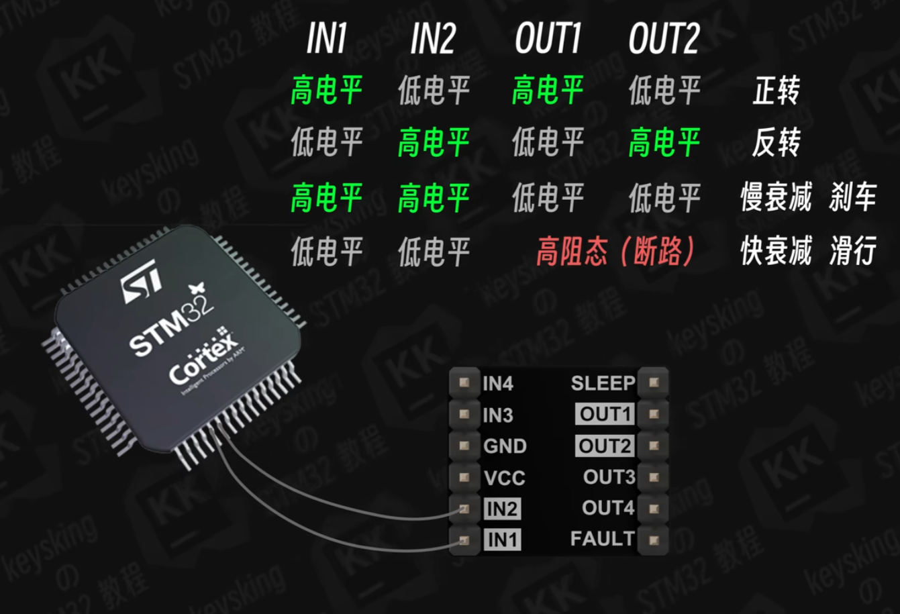

可以简单理解为：

| IN1 | IN2 | 电机状态 |
|---|---|---|
| 0 | 0 | 停止/滑行 |
| 1 | 0 | 向一个方向转动 |
| 0 | 1 | 向另一个方向转动 |
| 1 | 1 | 制动 |

如果：
**IN1输出PWM，IN2保持低电平**
就可以让电机向一个方向旋转，并通过PWM占空比控制速度。
反过来：
**IN1保持低电平，IN2输出PWM**
电机中的电流方向发生改变，因此电机会反向旋转。
所以：
**选择IN1还是IN2输出PWM → 控制方向**
**修改PWM占空比 → 控制转速**

### PWM控制电机转速
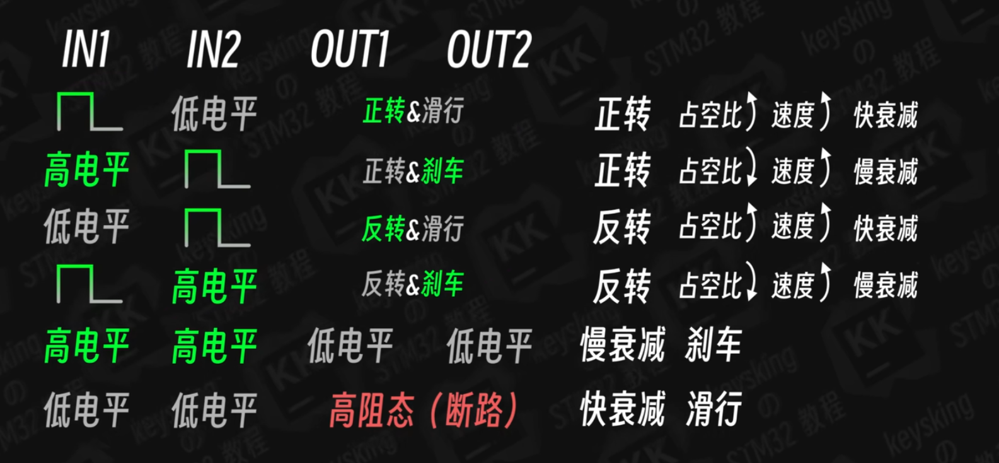

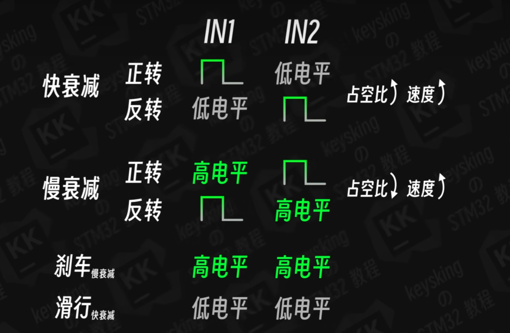

直流电机具有机械惯性，因此可以利用PWM控制电机获得的平均功率：
**PWM高电平 → DRV8833驱动电机**
**PWM低电平 → 暂时停止驱动**
只要PWM频率足够高，电机不会在每个PWM周期内真正完成一次“启动—停止”，而是表现为一个相对稳定的转速。
通常：
**占空比增大 → 平均驱动功率增大 → 电机转速提高**
**占空比减小 → 平均驱动功率减小 → 电机转速降低**

> 电机存在启动转矩，因此占空比过小时，即使已经存在PWM输出，电机也可能无法克服静摩擦而启动。

### 电机与DRV8833接线
电机连接到DRV8833：
**OUT1、OUT2 → 直流电机两端**
DRV8833与STM32连接：

| DRV8833 | STM32学习板 |
|---|---|
| `IN1` | `PA0` |
| `IN2` | `PA1` |
| `VCC` | `5V` |
| `GND` | `GND` |

其中：
**PA0 → TIM2_CH1**
**PA1 → TIM2_CH2**
所以可以使用TIM2的两个PWM通道控制DRV8833：
**TIM2_CH1 → IN1**
**TIM2_CH2 → IN2**
本节继续使用前面学习过的旋转编码器：
**PA8 → TIM1_CH1**
**PA9 → TIM1_CH2**
整个硬件关系：
**旋转编码器 → TIM1 → STM32得到速度控制量 → TIM2 PWM → DRV8833 → 电机**

### CubeMX配置
本节使用两个定时器：
**TIM1 → 读取旋转编码器**
**TIM2 → 输出PWM控制DRV8833**

#### RCC与系统时钟
进入 **System Core → RCC**：
`High Speed Clock (HSE)` → `Crystal/Ceramic Resonator`
随后进入 **Clock Configuration**：
**HSE 8MHz → PLL×9 → SYSCLK/HCLK 72MHz**
TIM2位于APB1，PCLK1为36MHz；由于APB1预分频不为1，TIM2时钟自动×2：
$$f_{TIM2}=72MHz$$

#### 配置TIM1旋转编码器
编码器A、B相：
**PA8 → TIM1_CH1**
**PA9 → TIM1_CH2**
进入 **Timers → TIM1**：
`Combined Channels` → `Encoder Mode`

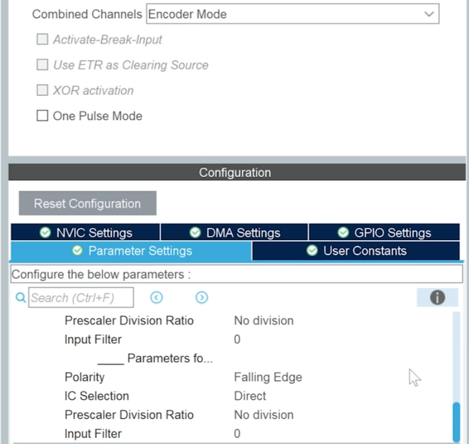

按照视频中的配置，将其中一个通道：
`Polarity` → `Falling Edge`
通过修改输入极性，使旋钮的旋转方向与后面CNT增减、速度正负的关系符合实验要求。
编码器工作过程：
**A/B两相信号 → TIM1_CH1/CH2 → Encoder Interface → CNT自动增加或减少**
所以程序不需要自己判断A、B相，只需要：

```c
__HAL_TIM_GET_COUNTER(&htim1);
```

即可读取旋钮位置。

#### 配置TIM2 PWM
DRV8833控制输入：
**PA0 → TIM2_CH1 → IN1**
**PA1 → TIM2_CH2 → IN2**
进入 **Timers → TIM2**：
`Clock Source` → `Internal Clock`
`Channel1` → `PWM Generation CH1`
`Channel2` → `PWM Generation CH2`

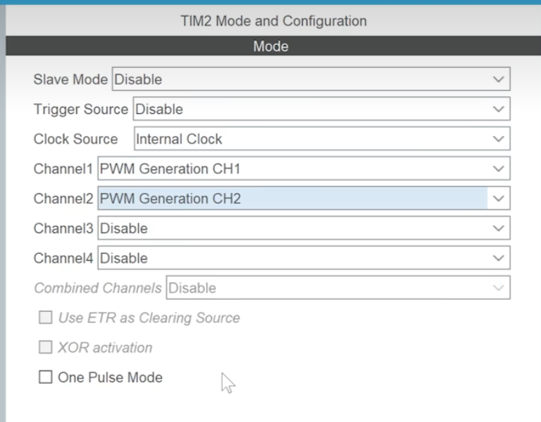

随后设置：
`Prescaler` → `72-1`
`Counter Period` → `100-1`

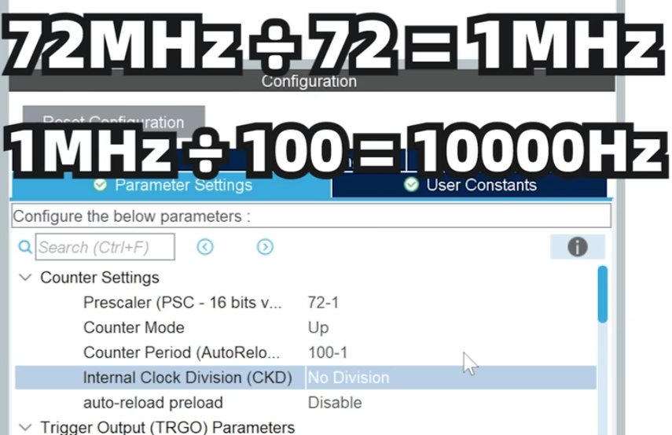

因此：
$$f_{CNT}=\frac{72MHz}{72}=1MHz$$
一个PWM周期计数100次：
$$f_{PWM}=\frac{1MHz}{100}=10kHz$$
也就是：
**TIM2 72MHz → PSC=71 → CNT=1MHz → ARR=99 → PWM=10kHz**
也可以直接计算：
$$f_{PWM}=\frac{72MHz}{72\times100}=10kHz$$
因此通过修改CCR即可改变PWM占空比：
**CCR增大 → 占空比增大 → 电机平均驱动功率增大 → 转速提高**

### 电机驱动库
如果直接在 `main.c` 中控制DRV8833，每次都需要处理：
**判断方向 → 选择CH1/CH2 → 修改CCR → 控制PWM**
这些属于底层硬件控制，所以视频使用**电机驱动库**进行封装，使主程序只需要提供一个速度控制量。
可以理解为：
**main.c给出speed → 电机驱动库判断方向和速度 → TIM2_CH1/CH2 → DRV8833 → 电机**

#### 驱动库的作用
驱动库把：
```c
HAL_TIM_PWM_Start();
HAL_TIM_PWM_Stop();
__HAL_TIM_SET_COMPARE();
```
等底层PWM操作封装起来。
主程序只需要调用类似：

```c
Motor_SetSpeed(speed);
```

的接口，而不需要关心具体使用的是CH1还是CH2。

> 如果视频配套工程里的驱动库函数名与这里不同，以实际工程函数名为准；这里重点是理解驱动库的功能和调用关系。

#### 速度参数
电机驱动函数接收一个带正负号的速度控制量：
$$-100\le speed\le100$$
其中：
**speed > 0 → 一个旋转方向**
**speed < 0 → 相反方向**
**speed = 0 → 电机停止**
**|speed|越大 → PWM占空比越大 → 电机越快**
例如：

| `speed` | 含义 |
|---:|---|
| `100` | 一个方向最大控制量 |
| `50` | 一个方向约50% |
| `0` | 停止 |
| `-50` | 相反方向约50% |
| `-100` | 相反方向最大控制量 |

> **这里的 `speed` 是PWM速度控制量，并不是电机真实转速RPM。**

#### 驱动库内部逻辑
其核心思想可以理解为：

```c
void Motor_SetSpeed(int16_t speed)
{
    // 限制速度控制量
    if (speed > 100)
        speed = 100;
    else if (speed < -100)
        speed = -100;
    if (speed > 0)
    {
        // 一个方向：CH1输出PWM，CH2关闭
        HAL_TIM_PWM_Stop(&htim2, TIM_CHANNEL_2);
        HAL_TIM_PWM_Start(&htim2, TIM_CHANNEL_1);
        __HAL_TIM_SET_COMPARE(&htim2, TIM_CHANNEL_1, speed);
    }
    else if (speed < 0)
    {
        // 相反方向：CH1关闭，CH2输出PWM
        HAL_TIM_PWM_Stop(&htim2, TIM_CHANNEL_1);
        HAL_TIM_PWM_Start(&htim2, TIM_CHANNEL_2);
        __HAL_TIM_SET_COMPARE(&htim2, TIM_CHANNEL_2, -speed);
    }
    else
    {
        // speed=0，停止
        HAL_TIM_PWM_Stop(&htim2, TIM_CHANNEL_1);
        HAL_TIM_PWM_Stop(&htim2, TIM_CHANNEL_2);
    }
}
```

所以：
**speed正负 → 决定方向**
**speed绝对值 → 决定PWM占空比**
主程序只需要：
```c
Motor_SetSpeed(speed);
```

### 旋转编码器控制电机
本节最终实验将**旋转编码器输入**和**DRV8833电机控制**结合起来。
完整过程：
**旋转旋钮 → TIM1 CNT变化 → CNT转换为speed → 电机驱动库 → TIM2 PWM → DRV8833 → 电机**
其中最关键的一步就是：
**把编码器的读数转换成 `-100~100` 的速度控制量。**

#### 定义编码器中点
视频定义一个中点：

```c
#define COUNT_MID 20
```

编码器的有效范围为：
$$0\le count\le COUNT\_MID\times2$$
也就是：
$$0\le count\le40$$
其中：
**count = 0 → 一侧最大位置**
**count = 20 → 中间位置**
**count = 40 → 另一侧最大位置**
中间值：
$$count=COUNT\_MID$$
对应：
$$speed=0$$
也就是**旋钮在中间时电机停止**。

### 启动旋转编码器
初始化完成后启动TIM1编码器接口，并把CNT初值设置到中点：

```c
/* USER CODE BEGIN 2 */
// 启动TIM1编码器接口
HAL_TIM_Encoder_Start(&htim1, TIM_CHANNEL_ALL);
// 将编码器初值设置到中点
__HAL_TIM_SET_COUNTER(&htim1, COUNT_MID);
/* USER CODE END 2 */
```

因此程序刚开始时：
**count = COUNT_MID = 20 → speed = 0 → 电机停止**

### 限制编码器读数范围
主循环首先读取CNT：

```c
count = __HAL_TIM_GET_COUNTER(&htim1);
```

由于CNT是16位计数器，如果在0时继续向减小方向旋转，会发生下溢：
**0 → 65535**
所以视频先判断：

```c
if (count > 60000)
{
    count = 0;
    __HAL_TIM_SET_COUNTER(&htim1, 0);
}
```

再限制最大值：

```c
else if (count > COUNT_MID * 2)
{
    count = COUNT_MID * 2;
    __HAL_TIM_SET_COUNTER(&htim1, COUNT_MID * 2);
}
```

因此最终：
$$0\le count\le2COUNT\_MID$$
当：
```c
#define COUNT_MID 20
```

就是：
$$0\le count\le40$$

### 编码器读数转换为速度
编码器CNT的范围为：
$$0\sim40$$
电机驱动需要的速度范围为：
$$100\sim0\sim-100$$
所以视频以 `COUNT_MID` 为中心，分别计算左右两侧的速度。

#### count小于COUNT_MID
当：

```c
count < COUNT_MID
```

时：

```c
speed = (COUNT_MID - count) * 100 / COUNT_MID;
```

也就是：
$$speed=\frac{COUNT\_MID-count}{COUNT\_MID}\times100$$
如果：
```c
COUNT_MID = 20
```

那么：

| `count` | `speed` |
|---:|---:|
| 0 | 100 |
| 5 | 75 |
| 10 | 50 |
| 15 | 25 |
| 20 | 0 |

所以：
**count从20减小到0 → speed从0增加到100**
也就是：
**旋钮越向这一侧转 → 电机向一个方向转得越快**

#### count大于COUNT_MID
当：

```c
count > COUNT_MID
```

时，需要得到负方向速度：

```c
speed = -(count - COUNT_MID) * 100 / COUNT_MID;
```

也就是：
$$speed=-\frac{count-COUNT\_MID}{COUNT\_MID}\times100$$
对应：

| `count` | `speed` |
|---:|---:|
| 20 | 0 |
| 25 | -25 |
| 30 | -50 |
| 35 | -75 |
| 40 | -100 |

所以：
**count从20增加到40 → speed从0减小到-100**
也就是：
**旋钮越向另一侧转 → 电机反方向转得越快**

#### count等于COUNT_MID
如果：
```c
count == COUNT_MID
```

则：

```c
speed = 0;
```

因此：
**旋钮处于中间 → speed=0 → 电机停止**
完整对应关系：

| `count` | `speed` | 电机状态 |
|---:|---:|---|
| 0 | 100 | 一个方向最大速度 |
| 10 | 50 | 一个方向中等速度 |
| 20 | 0 | 停止 |
| 30 | -50 | 反方向中等速度 |
| 40 | -100 | 反方向最大速度 |

整个映射关系为：
**count：`0 → 20 → 40`**
对应：
**speed：`100 → 0 → -100`**

> **编码器并不是直接把CNT作为PWM值，而是以 `COUNT_MID` 为零点，将旋钮两侧分别转换为正、负速度。**

### 主循环
视频中的主循环核心代码为：

```c
while (1)
{
    // 获取TIM1编码器CNT
    count = __HAL_TIM_GET_COUNTER(&htim1);
    // CNT从0继续向下计数时，会下溢到65535附近
    if (count > 60000)
    {
        count = 0;
        __HAL_TIM_SET_COUNTER(&htim1, 0);
    }
    // 限制编码器最大值
    else if (count > COUNT_MID * 2)
    {
        count = COUNT_MID * 2;
        __HAL_TIM_SET_COUNTER(&htim1, COUNT_MID * 2);
    }
    // 旋钮位于中点一侧
    if (count < COUNT_MID)
    {
        // count：20 → 0
        // speed：0 → 100
        speed = (COUNT_MID - count) * 100 / COUNT_MID;
    }
    // 旋钮位于中点另一侧
    else if (count > COUNT_MID)
    {
        // count：20 → 40
        // speed：0 → -100
        speed = -(count - COUNT_MID) * 100 / COUNT_MID;
    }
    else
    {
        // 位于中点，电机停止
        speed = 0;
    }
    // 将速度交给电机驱动库
    Motor_SetSpeed(speed);
}
```

因此主循环实际完成三件事：
**① 读取并限制编码器CNT**
**② 将编码器位置转换成 `-100~100` 的速度控制量**
**③ 将speed交给电机驱动库控制DRV8833**

### 完整程序逻辑
相关变量可以定义为：

```c
/* USER CODE BEGIN PV */

#define COUNT_MID 20

uint32_t count = COUNT_MID;    // 编码器CNT：0~40
int32_t speed = 0;             // 电机控制量：-100~100
/* USER CODE END PV */
```

这里 `count` 使用无符号变量，是因为需要判断16位CNT下溢后出现的：
```c
count > 60000
```

初始化：

```c
/* USER CODE BEGIN 2 */
// 启动旋转编码器
HAL_TIM_Encoder_Start(&htim1, TIM_CHANNEL_ALL);
// 将编码器初始位置设置到中点
__HAL_TIM_SET_COUNTER(&htim1, COUNT_MID);
/* USER CODE END 2 */
```

主循环：

```c
/* USER CODE BEGIN WHILE */
while (1)
{
    // 读取编码器当前CNT
    count = __HAL_TIM_GET_COUNTER(&htim1);
    // 处理CNT向下计数时的下溢
    if (count > 60000)
    {
        count = 0;
        __HAL_TIM_SET_COUNTER(&htim1, 0);
    }
    // 限制最大编码器位置
    else if (count > COUNT_MID * 2)
    {
        count = COUNT_MID * 2;
        __HAL_TIM_SET_COUNTER(&htim1, COUNT_MID * 2);
    }
    // 左侧：速度0~100
    if (count < COUNT_MID)
    {
        speed = (COUNT_MID - count) * 100 / COUNT_MID;
    }
    // 右侧：速度0~-100
    else if (count > COUNT_MID)
    {
        speed = -(count - COUNT_MID) * 100 / COUNT_MID;
    }
    // 中点：停止
    else
    {
        speed = 0;
    }
    // 控制电机
    Motor_SetSpeed(speed);
}
/* USER CODE END WHILE */
```

整个数据流：
**EC11旋钮**
→ **TIM1 Encoder**
→ **CNT：0~40**
→ **以COUNT_MID=20为中心**
→ **speed：100~0~-100**
→ **Motor_SetSpeed(speed)**
→ **TIM2_CH1/CH2 PWM**
→ **DRV8833**
→ **电机正反转和调速**

### 实验现象
程序启动时：
**count=20 → speed=0 → 电机停止**
旋钮向一侧旋转：
**count：20 → 15 → 10 → 5 → 0**
对应：
**speed：0 → 25 → 50 → 75 → 100**
所以：
**旋钮越向这一侧旋转 → 正速度越大 → 电机向一个方向逐渐加速**
旋钮向另一侧旋转：
**count：20 → 25 → 30 → 35 → 40**
对应：
**speed：0 → -25 → -50 → -75 → -100**
所以：
**旋钮越向另一侧旋转 → 负速度绝对值越大 → 电机反方向逐渐加速**
最终：
**旋钮一端 → speed=100 → 一个方向最大速度**
**旋钮中间 → speed=0 → 电机停止**
**旋钮另一端 → speed=-100 → 反方向最大速度**

> **这里的旋转编码器只是人工输入设备，并没有安装在电机轴上，因此 `speed` 是速度控制量，而不是测量得到的电机实际RPM。**

### PWM控制LED、舵机和电机的区别
前面几个实验都使用PWM，但作用不同：

| 应用 | PWM控制的量 |
|---|---|
| LED | 平均功率 → 亮度 |
| 舵机 | 特定高电平脉宽 → 目标角度 |
| 直流电机 | 平均驱动功率 → 转速 |

呼吸灯：
**CCR变化 → 占空比变化 → LED亮度变化**
舵机：
**固定50Hz → CCR变化 → 高电平脉宽变化 → 舵机角度变化**
直流电机：
**固定较高PWM频率 → CCR变化 → 平均驱动功率变化 → 电机转速变化**
虽然底层都使用PWM，但最终控制的物理量不同。

### 本节核心
本节把**旋转编码器、PWM、DRV8833和电机驱动库**组合起来。
硬件：
**PA8/PA9 → TIM1 → 旋转编码器**
**PA0 → TIM2_CH1 → DRV8833 IN1**
**PA1 → TIM2_CH2 → DRV8833 IN2**
TIM2：
`Prescaler = 72-1`
`Counter Period = 100-1`
因此：
$$f_{PWM}=10kHz$$
编码器：
```c
#define COUNT_MID 20
```

所以：
$$0\le count\le40$$
速度转换：
当：
$$count<COUNT\_MID$$
$$speed=\frac{COUNT\_MID-count}{COUNT\_MID}\times100$$
当：
$$count>COUNT\_MID$$
$$speed=-\frac{count-COUNT\_MID}{COUNT\_MID}\times100$$
因此最终：
**count：`0 → 20 → 40`**
**speed：`100 → 0 → -100`**
软件数据流：
**旋转编码器 → TIM1 CNT → count → speed → 电机驱动库 → TIM2 PWM → DRV8833 → 电机**
核心代码：

```c
count = __HAL_TIM_GET_COUNTER(&htim1);
if (count < COUNT_MID)
{
    speed = (COUNT_MID - count) * 100 / COUNT_MID;
}
else if (count > COUNT_MID)
{
    speed = -(count - COUNT_MID) * 100 / COUNT_MID;
}
else
{
    speed = 0;
}
Motor_SetSpeed(speed);
```

> **本节最关键的转换不是“编码器CNT直接控制PWM”，而是“编码器CNT → 以COUNT_MID为中心转换成正负speed → 驱动库根据speed控制方向和PWM占空比”。**
>
> **DRV8833解决驱动功率和正反转，PWM解决电机调速，旋转编码器负责输入目标速度，驱动库负责把speed转换成具体的TIM2控制。**

# 9 ADC

## 9.1 ADC模拟数字转换
STM32内部主要处理的是数字信号，但现实中的温度、光照、电压等很多物理量最终表现为连续变化的模拟电压，因此需要使用 **ADC（Analog to Digital Converter，模数转换器）** 将模拟电压转换为STM32能够处理的数字量。

### 数字信号与模拟信号
数字信号只有离散的几个状态，例如STM32 GPIO常见的：
**低电平 → 0**
**高电平 → 1**

而模拟信号的电压可以在一定范围内连续变化，例如：
**0V、0.5V、1.23V、2.8V、3.3V……**

STM32内部的CPU和数字逻辑电路无法直接处理任意连续电压，所以需要：
**模拟电压 → ADC → 数字量 → STM32程序处理**

### ADC分辨率
STM32F103的ADC为 **12位ADC**，也就是转换结果使用12个二进制位表示。

12位一共有：
$$2^{12}=4096$$
种不同状态，因此ADC转换结果范围为：
$$0\sim4095$$

如果参考电压为3.3V，可以近似理解为：

| 输入电压 | ADC值 |
|---:|---:|
| 0V | 0 |
| 约1.65V | 约2048 |
| 3.3V | 4095 |

所以ADC实际上完成的是：
**0~3.3V模拟电压 → 0~4095数字量**

ADC值与电压近似成线性关系，因此：
$$Voltage=\frac{ADC}{4095}\times3.3V$$

例如ADC读取：
$$ADC=2048$$
则：
$$Voltage=\frac{2048}{4095}\times3.3\approx1.65V$$

> **ADC读取出来的首先不是“电压”，而是一个0~4095的数字量，需要根据参考电压进一步换算成电压。**

### SAR逐次逼近
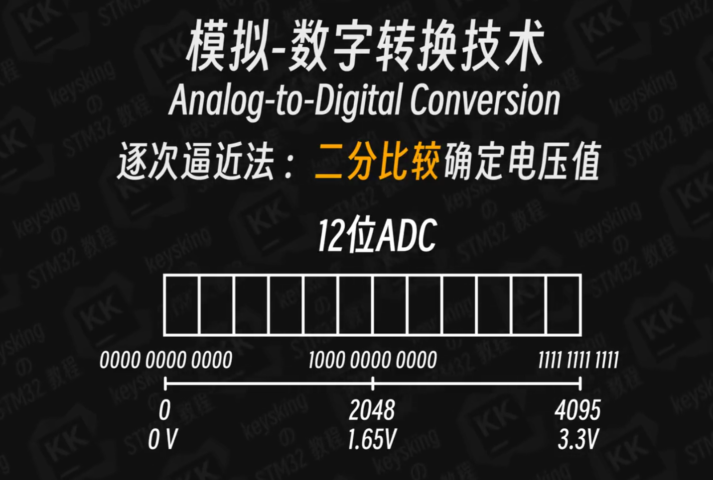
ADC有多种实现方式，STM32F103使用的是 **SAR（Successive Approximation Register，逐次逼近）ADC**。

它的基本思想可以理解为：
**不断进行二分比较，逐位确定最终的数字结果。**

#### 采样与保持
ADC首先通过输入引脚采集外部电压，并将电压保存到内部的采样保持电容中：
**GPIO模拟输入 → 给内部电容充电 → 断开输入 → 保持当前电压**

这样ADC后面进行比较时，即使外部电压发生一些变化，也可以利用已经保持的电压完成本次转换。

整个过程：
**采样（Sample） → 保持（Hold） → 逐次比较 → 得到数字结果**

### 逐次逼近过程
假设ADC参考电压：
$$V_{REF}=3.3V$$

现在需要测量：
$$V_{IN}=0.9V$$

12位ADC首先尝试最高位，也就是数字量：
$$2048$$

2048对应：
$$\frac{2048}{4095}\times3.3\approx1.65V$$

比较：
$$0.9V<1.65V$$

所以最高位不能为1，确定为0。

接下来继续尝试：
$$1024$$

对应：
$$\frac{1024}{4095}\times3.3\approx0.825V$$

此时：
$$0.9V>0.825V$$

所以这一位可以保留为1。

接下来再尝试1024和2048中间的值：
$$1536$$

对应：
$$\frac{1536}{4095}\times3.3\approx1.238V$$

因为：
$$0.9V<1.238V$$

所以这一位又确定为0。

随后继续不断二分：
**比较 → 保留或清除当前位 → 继续比较下一位**

经过12次逐位比较以后，就可以得到最接近输入电压的12位数字量。

可以理解为：
**先判断在哪一半 → 再判断这一半中的哪一半 → 继续二分 → 最终确定结果**

> **SAR ADC的核心就是“逐位试探 + 二分逼近”。**

### ADC转换结果
逐次逼近完成以后，转换结果会被放入ADC的数据寄存器中，程序再从寄存器读取这个值。

因此整个ADC过程为：
**模拟电压 → 采样保持 → SAR逐次比较 → 12位数字量 → 数据寄存器 → 程序读取**

程序读取到ADC值以后，再利用：
$$Voltage=\frac{ADC}{4095}\times3.3$$
得到实际电压。

### STM32的ADC结构
STM32F103中存在多个ADC输入通道。ADC外部通道通常编号为：
`ADC_IN0 ~ ADC_IN15`

不过由于不同封装引出的GPIO数量不同，并不是所有通道都会真正引出到芯片引脚。

STM32内部还有两个特殊ADC通道，可以测量芯片内部信号：
**内部温度传感器**
**内部参考电压 VREFINT**

STM32F103中还具有：
**ADC1**
**ADC2**

两个ADC外设。

### 规则组与注入组
每个ADC内部又可以把转换通道分成：
**规则组（Regular Group）**
**注入组（Injected Group）**

本节暂时不讲注入组，主要使用**规则组**。

规则组可以理解为一张ADC的“转换任务表”：
**将ADC通道加入规则组 → 启动ADC → 按顺序采样和转换 → 把结果放入数据寄存器**

例如只加入：
`ADC1_IN5`

那么：
**启动ADC → ADC采样IN5 → 转换 → 结果写入规则数据寄存器**

以后还可以在规则组中加入多个通道：
**通道1 → 通道2 → 通道3 → ……**

让ADC依次进行转换。

### 使用电位器产生模拟电压
为了实际测试ADC，本节使用学习板上的**电位器**。

电位器两端分别连接电源和GND，中间的滑动端可以输出一个连续变化的电压。旋转电位器后，中间端电压会在：
$$0\sim3.3V$$
之间变化。

学习板上的电位器连接到：
**PA5 → ADC1_IN5**

所以实验流程为：
**旋转电位器 → PA5电压变化 → ADC1_IN5采样 → ADC转换 → 得到0~4095数字量**

### CubeMX配置

#### SYS与RCC
进入 **System Core → SYS**：
`Debug` → `Serial Wire`

随后进入 **System Core → RCC**：
`High Speed Clock (HSE)` → `Crystal/Ceramic Resonator`

进入 **Clock Configuration**：
**HSE 8MHz → PLL×9 → SYSCLK/HCLK 72MHz**

#### 配置ADC输入
学习板上的电位器连接：
**PA5 → ADC1_IN5**

在Pinout界面点击：
`PA5`

选择：
`ADC1_IN5`

随后进入：
**Analog → ADC1**

开启：
`IN5`
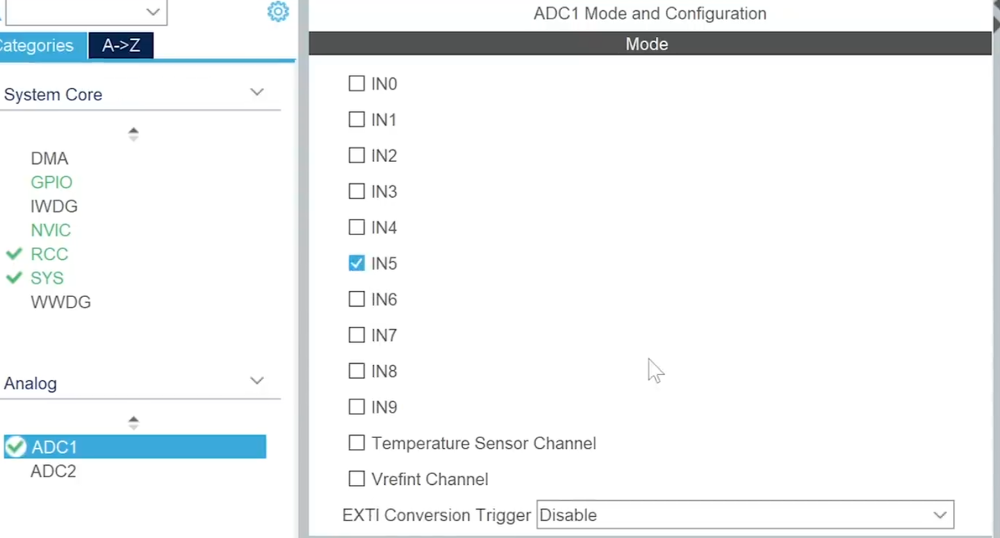

这样：
**PA5模拟电压 → ADC1通道5**

本节首先只使用一个ADC通道，所以其他ADC转换参数暂时保持默认。

#### 配置USART2
为了观察ADC转换结果，本节继续使用USART2将数据发送到电脑。

进入：
**Connectivity → USART2**

设置：
`Mode` → `Asynchronous`

串口参数：
`Baud Rate` → `115200`
`Word Length` → `8 Bits`
`Parity` → `None`
`Stop Bits` → `1`

最终：
**电位器 → ADC1 → STM32 → USART2 → 串口助手**

#### ADC时钟
完成ADC配置后，可以看到Clock Configuration中出现ADC时钟警告。

ADC1和ADC2的时钟来自APB2，但ADC的工作频率不能直接使用过高的72MHz时钟。STM32F103的ADC时钟不能超过约14MHz，因此需要对PCLK2进行分频。

将ADC预分频设置为：
`ADC Prescaler` → `/6`

由于：
$$PCLK2=72MHz$$

所以：
$$f_{ADC}=\frac{72MHz}{6}=12MHz$$

满足ADC时钟要求。

因此：
**PCLK2 72MHz → ADC Prescaler ÷6 → ADC Clock 12MHz**

> **ADC也有自己的工作时钟，并不是系统时钟越高ADC就能直接运行得越快，必须满足芯片对ADC最大时钟频率的要求。**

### 单次ADC转换
CubeMX生成代码以后，首先使用最基本的**单次转换模式**。

程序每次需要ADC数据时执行：
**启动一次转换 → 等待转换完成 → 读取结果**

#### 定义变量
首先包含串口字符串处理需要的头文件：

```c
/* USER CODE BEGIN Includes */

#include <stdio.h>
#include <string.h>

/* USER CODE END Includes */
```

定义保存ADC结果、电压值和串口字符串的变量：

```c
/* USER CODE BEGIN PV */

uint16_t value = 0;       // ADC原始转换结果，范围0~4095
float voltage = 0.0f;     // 根据ADC值计算出的电压
char message[50] = "";    // 串口发送缓冲区

/* USER CODE END PV */
```

#### 启动ADC转换
使用：

```c
HAL_ADC_Start(&hadc1);
```

启动ADC1进行一次采样和转换。

但是调用这个函数以后，ADC转换需要一定时间，不应该立即认为数据已经转换完成。

所以完整顺序不是：
**Start → 立刻GetValue**

而应该是：
**Start → 等待转换完成 → GetValue**

#### 等待ADC转换完成
HAL库提供：

```c
HAL_ADC_PollForConversion(&hadc1, HAL_MAX_DELAY);
```

用于轮询等待ADC转换结束。

其中：
`&hadc1` → ADC1句柄
`HAL_MAX_DELAY` → 一直等待，直到转换完成

因此一次完整的ADC读取流程：

```c
HAL_ADC_Start(&hadc1);                              // 启动一次ADC转换
HAL_ADC_PollForConversion(&hadc1, HAL_MAX_DELAY);  // 等待ADC转换完成
value = HAL_ADC_GetValue(&hadc1);                  // 读取转换结果
```

三个函数对应：
**`HAL_ADC_Start()` → 开始转换**
**`HAL_ADC_PollForConversion()` → 等待转换完成**
**`HAL_ADC_GetValue()` → 读取转换结果**

> 如果没有等待转换完成就直接读取数据，可能得到默认值或者上一次转换留下来的结果。

### ADC值转换成电压
ADC读取范围：
$$0\sim4095$$

对应输入电压：
$$0\sim3.3V$$

所以：
$$Voltage=\frac{Value}{4095}\times3.3$$

代码：

```c
voltage = value / 4095.0f * 3.3f;
```

这里使用：

```c
4095.0f
```

而不是：

```c
4095
```

是为了进行**浮点数运算**，避免整数除法导致小数部分丢失。

例如：
$$Value=2048$$

则：
$$Voltage=\frac{2048}{4095}\times3.3\approx1.65V$$

### 串口输出ADC值
将ADC原始值和计算出的电压转换成字符串：

```c
sprintf(message,
        "ADC: %d, Voltage: %.2f V\r\n",
        value,
        voltage);
```

然后通过USART2发送：

```c
HAL_UART_Transmit(&huart2,
                  (uint8_t *)message,
                  strlen(message),
                  100);
```

完整的单次转换主循环：

```c
while (1)
{
    // 启动一次ADC转换
    HAL_ADC_Start(&hadc1);

    // 等待转换完成
    HAL_ADC_PollForConversion(&hadc1, HAL_MAX_DELAY);

    // 读取12位ADC结果
    value = HAL_ADC_GetValue(&hadc1);

    // 将0~4095转换成0~3.3V
    voltage = value / 4095.0f * 3.3f;

    // 组合串口输出字符串
    sprintf(message,
            "ADC: %d, Voltage: %.2f V\r\n",
            value,
            voltage);

    // 发送ADC值和电压
    HAL_UART_Transmit(&huart2,
                      (uint8_t *)message,
                      strlen(message),
                      100);

    HAL_Delay(500);
}
```

旋转电位器以后可以看到：
**电位器电压升高 → ADC值增大 → Voltage增大**
**电位器电压降低 → ADC值减小 → Voltage减小**

最终：
**约0V → ADC≈0**
**约1.65V → ADC≈2048**
**约3.3V → ADC≈4095**

### 开启浮点数打印
由于：

```c
sprintf(message, "%.2f", voltage);
```

需要输出浮点数，所以CubeIDE需要开启浮点打印支持。

进入：
**Project → Properties → C/C++ Build → Settings → Tool Settings → MCU Settings**

勾选：
`Use float with printf from newlib-nano (-u _printf_float)`

否则：
```c
%.2f
```
可能无法正常输出。

### ADC校准
运行程序以后，可能会发现：
**电位器已经旋转到最大，但ADC值并没有准确达到4095，计算出的电压也存在一定误差。**

STM32提供ADC校准功能，HAL库使用：

```c
HAL_ADCEx_Calibration_Start(&hadc1);
```

ADC校准一般只需要在程序启动以后执行一次，并且在第一次正式转换之前完成：

```c
/* USER CODE BEGIN 2 */

// ADC上电后进行一次校准
HAL_ADCEx_Calibration_Start(&hadc1);

/* USER CODE END 2 */
```

随后再进入正常ADC转换：

```c
HAL_ADC_Start(&hadc1);
```

所以启动流程变成：
**ADC初始化 → ADC校准 → 开始ADC转换**

> **ADC校准不是每次读取都执行，而是在初始化以后、正式使用ADC之前执行一次。**

### 连续转换模式
前面的单次转换模式每次循环都需要：

```c
HAL_ADC_Start(&hadc1);
HAL_ADC_PollForConversion(&hadc1, HAL_MAX_DELAY);
```

也就是：
**启动一次 → 转换一次 → 读取一次 → 下一轮重新启动**

STM32还提供 **Continuous Conversion Mode（连续转换模式）**。

开启以后：
**启动ADC一次 → 第一次转换完成 → 自动开始下一次转换 → 不断更新ADC数据寄存器**

所以程序不需要每次读取前重新调用：

```c
HAL_ADC_Start();
```

### CubeMX开启连续转换
回到：
**Analog → ADC1 → Parameter Settings**

找到：
`Continuous Conversion Mode`

设置：
`Enable`

重新生成代码。

此时ADC流程变为：
**`HAL_ADC_Start()`一次 → ADC不断采样、转换 → 数据寄存器不断更新**

### 连续转换模式代码
ADC校准仍然首先执行：

```c
HAL_ADCEx_Calibration_Start(&hadc1);
```

随后只需要启动一次ADC：

```c
HAL_ADC_Start(&hadc1);
```

第一次启动以后，可以等待第一次转换结束：

```c
HAL_ADC_PollForConversion(&hadc1, HAL_MAX_DELAY);
```

初始化部分：

```c
/* USER CODE BEGIN 2 */

// ADC上电校准
HAL_ADCEx_Calibration_Start(&hadc1);

// 启动ADC连续转换，只需要启动一次
HAL_ADC_Start(&hadc1);

// 等待第一次转换完成
HAL_ADC_PollForConversion(&hadc1, HAL_MAX_DELAY);

/* USER CODE END 2 */
```

之后主循环不需要再反复启动ADC，只需要读取正在不断更新的数据寄存器：

```c
while (1)
{
    // 读取ADC最新转换结果
    value = HAL_ADC_GetValue(&hadc1);

    // 转换为实际电压
    voltage = value / 4095.0f * 3.3f;

    // 组合输出数据
    sprintf(message,
            "ADC: %d, Voltage: %.2f V\r\n",
            value,
            voltage);

    // 串口发送
    HAL_UART_Transmit(&huart2,
                      (uint8_t *)message,
                      strlen(message),
                      100);

    HAL_Delay(500);
}
```

单次转换和连续转换的区别：

| 模式 | ADC工作方式 | `HAL_ADC_Start()` |
|---|---|---|
| 单次转换 | 转换一次后停止 | 每次测量前调用 |
| 连续转换 | 转换完成后自动进行下一次 | 开始时调用一次 |

单次模式：
**Start → Poll → GetValue → Start → Poll → GetValue → ……**

连续模式：
**Start一次 → 转换 → 转换 → 转换 → ……**

程序：
**GetValue → GetValue → GetValue → ……**

### 本节核心
ADC负责：
**模拟电压 → 数字量**

STM32F103使用12位ADC：
$$0\sim3.3V\Longleftrightarrow0\sim4095$$

电压计算：
$$Voltage=\frac{ADC}{4095}\times3.3V$$

ADC内部主要经历：
**模拟输入 → 采样保持 → SAR逐次逼近 → 数据寄存器**

SAR的核心：
**不断二分比较 → 从最高位到最低位逐位确定结果**

本节硬件：
**电位器 → PA5 → ADC1_IN5**

ADC时钟：
**PCLK2 72MHz → ÷6 → ADC Clock 12MHz**

单次ADC转换：

```c
HAL_ADC_Start(&hadc1);                              // 启动转换
HAL_ADC_PollForConversion(&hadc1, HAL_MAX_DELAY);  // 等待转换完成
value = HAL_ADC_GetValue(&hadc1);                  // 获取结果
```

ADC校准：

```c
HAL_ADCEx_Calibration_Start(&hadc1);
```

连续转换模式：
**CubeMX开启Continuous Conversion Mode → `HAL_ADC_Start()`只调用一次 → ADC自动持续转换 → 程序直接读取最新结果**

整个实验数据流：
**旋转电位器 → PA5模拟电压变化 → ADC1采样 → SAR转换 → 得到0~4095 → 换算0~3.3V → USART2发送 → 串口助手显示**

> **ADC最重要的三个概念：参考电压决定量程，分辨率决定可以划分多少个数字等级，采样与转换决定如何把实际模拟电压变成数字量。**
>
> **本节代码最重要的顺序：校准 → 启动转换 → 等待转换完成 → 读取ADC值 → 根据4095和参考电压换算实际电压。**

## 9.2 多通道ADC、NTC热敏电阻与内部参考电压
上一节只使用ADC读取一个电位器，本节进一步学习**多通道ADC扫描 + DMA**，一次采集4个ADC信号：
**NTC热敏电阻 → 外部温度**
**电位器 → 外部模拟电压**
**STM32内部温度传感器 → 芯片温度**
**VREFINT → 内部参考电压，用来反推实际VDDA**
本节先使用**单次扫描模式**完成一次4通道采集，再改成**连续扫描模式**持续采集：
**单次扫描 + DMA Normal → 连续扫描 + DMA Circular**

### 多通道ADC
ADC虽然可以连接多个输入通道，但内部真正完成模数转换的转换器只有一个，因此多个通道并不是同时转换，而是按照设定顺序依次转换：
**通道1 → ADC转换 → 通道2 → ADC转换 → 通道3 → ADC转换 → 通道4 → ADC转换**
这种依次转换多个通道的方式就是：
**Scan Conversion Mode（扫描转换模式）**

### 规则序列Rank
ADC规则组可以提前安排多个通道的转换顺序，每一个位置称为一个 **Rank**。本节4个Rank为：
**Rank1 → ADC1_IN4 → PA4 → NTC**
**Rank2 → ADC1_IN5 → PA5 → 电位器**
**Rank3 → Temperature Sensor → STM32内部温度**
**Rank4 → VREFINT → 内部参考电压**
所以一轮扫描：
**NTC → 电位器 → 内部温度 → VREFINT**
其中：
**Rank → 决定先后顺序**
**Channel → 决定这个Rank测量哪个信号**

### 为什么多通道ADC需要DMA
ADC每完成一次规则转换，结果都会写入同一个数据寄存器 `DR`：
**Rank1转换 → DR写入结果1**
**Rank2转换 → DR覆盖成结果2**
**Rank3转换 → DR覆盖成结果3**
**Rank4转换 → DR覆盖成结果4**
如果CPU来不及读取，前面的数据就会被覆盖。因此多通道ADC通常配合DMA：
**ADC完成一次转换 → DMA立刻把DR搬到内存 → ADC继续下一个Rank**
定义数组：

```c
uint16_t adcValue[4];
```

对应：

```c
adcValue[0]    // Rank1：NTC
adcValue[1]    // Rank2：电位器
adcValue[2]    // Rank3：内部温度传感器
adcValue[3]    // Rank4：VREFINT
```

所以：
**ADC负责转换 → DMA负责搬运 → CPU直接处理adcValue[]**

### CubeMX公共配置
两个实验的大部分CubeMX配置相同，只有 **Continuous Conversion Mode** 和 **DMA Mode** 不同。

#### RCC与系统时钟
进入 **System Core → RCC**：
`High Speed Clock (HSE)` → `Crystal/Ceramic Resonator`
进入 **Clock Configuration**：
**HSE 8MHz → PLL×9 → SYSCLK/HCLK 72MHz**
ADC时钟不能直接使用72MHz，因此设置：
`ADC Prescaler` → `/6`
得到：
$$f_{ADC}=\frac{72MHz}{6}=12MHz$$
也就是：
**PCLK2 72MHz → ÷6 → ADC Clock 12MHz**

#### SYS
进入 **System Core → SYS**：
`Debug` → `Serial Wire`

#### 配置两个外部ADC通道
NTC：**PA4 → ADC1_IN4**
电位器：**PA5 → ADC1_IN5**
因此：
**PA4 → Rank1**
**PA5 → Rank2**

#### 开启内部温度与VREFINT
进入 **Analog → ADC1**，除了外部通道以外，还需要使用：
**Temperature Sensor Channel**
**Vrefint Channel**
因此ADC1最终一共采集4个信号：
**IN4 + IN5 + Temperature Sensor + VREFINT**

### ADC1规则组配置
进入 **Analog → ADC1 → Parameter Settings**，公共参数设置：
`Scan Conversion Mode` → `Enable`
`Discontinuous Conversion Mode` → `Disable`
`External Trigger Conversion Source` → `Regular Conversion launched by software`
`Data Alignment` → `Right alignment`
`Number Of Conversion` → `4`
然后配置规则序列：

| Rank | Channel | 用途 |
|---:|---|---|
| 1 | `ADC_CHANNEL_4` | NTC |
| 2 | `ADC_CHANNEL_5` | 电位器 |
| 3 | `Temperature Sensor` | STM32内部温度 |
| 4 | `VREFINT` | 内部参考电压 |

> **DMA数组的下标与Rank严格一一对应，改变Rank顺序以后，程序中的数组含义也必须一起改变。**

内部温度传感器和VREFINT属于芯片内部模拟信号，为了保证采样稳定应使用较长的采样时间；NTC、电位器也可以设置较长采样周期以提高稳定性。

### DMA配置
进入：
**ADC1 → DMA Settings → Add**
STM32F103的ADC1使用对应的：
**DMA1 Channel1**
公共DMA参数：
`Direction` → `Peripheral To Memory`
`Peripheral Increment` → `Disable`
`Memory Increment` → `Enable`
`Peripheral Data Width` → `Half Word`
`Memory Data Width` → `Half Word`
其中：
**Peripheral Increment关闭 → 始终从ADC_DR读取**
**Memory Increment开启 → adcValue[0]、[1]、[2]、[3]依次写入**
接下来两个实验的区别主要就在：
**DMA Normal / Circular**
以及：
**ADC Continuous Conversion Disable / Enable**

### 实验一：不连续采样
这里所谓“不连续采样”，是指：
**启动一次ADC → 扫描完整4个Rank → 停止 → 下次需要重新启动**
CubeMX中设置：
`Scan Conversion Mode` → `Enable`
`Continuous Conversion Mode` → `Disable`
`Discontinuous Conversion Mode` → `Disable`
`Number Of Conversion` → `4`
DMA：
`Mode` → `Normal`

> **不要把这里的“不连续采样”理解成打开 `Discontinuous Conversion Mode`。本实验仍然是一次完整扫描4个Rank，只是扫描完这一轮以后ADC停止。**

工作过程：
**HAL_ADC_Start_DMA()**
→ **Rank1**
→ **Rank2**
→ **Rank3**
→ **Rank4**
→ **DMA得到4个数据**
→ **ADC停止**
所以每调用一次：

```c
HAL_ADC_Start_DMA(&hadc1, (uint32_t *)adcValue, 4);
```

就只得到**一组4通道数据**。

#### 定义ADC数组
```c
/* USER CODE BEGIN PV */
uint16_t adcValue[4] = {0};
/* USER CODE END PV */
```

#### ADC校准
ADC正式使用之前先进行一次校准：

```c
/* USER CODE BEGIN 2 */
HAL_ADCEx_Calibration_Start(&hadc1);
/* USER CODE END 2 */
```

#### 不连续采样主循环
因为一轮扫描结束以后ADC会停止，所以每次需要新数据时都要重新调用：

```c
while (1)
{
    // 启动一次4通道ADC扫描
    HAL_ADC_Start_DMA(&hadc1, (uint32_t *)adcValue, 4);
    // 等待这一轮采样完成，实验中留出足够时间观察数据
    HAL_Delay(500);
    // 此时adcValue[0~3]保存这一轮的4个ADC结果
}
```

每执行一次：
```c
HAL_ADC_Start_DMA(&hadc1, (uint32_t *)adcValue, 4);
```

DMA依次得到：

```c
adcValue[0]    // NTC
adcValue[1]    // 电位器
adcValue[2]    // MCU内部温度
adcValue[3]    // VREFINT
```

所以单次扫描模式可以理解为：
**Start_DMA → 扫描4个Rank → DMA搬4次 → 停止**
下一次：
**再次Start_DMA → 再扫描4个Rank**

### 实验一的数据流
**软件启动**
→ **ADC Rank1~Rank4扫描一轮**
→ **DMA Normal搬运4个数据**
→ **adcValue[0~3]**
→ **ADC停止**
→ **等待下一次软件启动**
这种模式适合：
**需要数据时采一次，不需要ADC一直工作的情况**

### 实验二：连续采样
完成单次扫描以后，再将ADC改成**连续转换模式**。
CubeMX中保持：
`Scan Conversion Mode` → `Enable`
修改：
`Continuous Conversion Mode` → `Enable`
仍然保持：
`Discontinuous Conversion Mode` → `Disable`
`Number Of Conversion` → `4`
DMA中将：
`Mode` → `Normal`
修改为：
`Mode` → `Circular`
因此最终组合：
**ADC Scan + ADC Continuous + DMA Circular**
工作过程变成：
**Rank1 → Rank2 → Rank3 → Rank4 → Rank1 → Rank2 → Rank3 → Rank4 → ……**
DMA则不断循环：
**adcValue[0] → adcValue[1] → adcValue[2] → adcValue[3] → adcValue[0] → ……**

### 连续模式只启动一次
连续模式下不需要在 `while(1)` 中不断调用：

```c
HAL_ADC_Start_DMA();
```

而是在初始化阶段启动一次：

```c
/* USER CODE BEGIN 2 */
// ADC校准
HAL_ADCEx_Calibration_Start(&hadc1);
// 启动4通道连续ADC + DMA
HAL_ADC_Start_DMA(&hadc1, (uint32_t *)adcValue, 4);
/* USER CODE END 2 */
```

之后ADC和DMA会在后台自动运行，主循环只需要读取数组：

```c
while (1)
{
    // adcValue[0~3]会被DMA持续更新
    HAL_Delay(100);
}
```

所以连续采样模式：
**Start_DMA一次 → ADC不断扫描 → DMA不断覆盖更新数组**

### 两种模式对比

| 项目 | 不连续采样 | 连续采样 |
|---|---|---|
| `Scan Conversion Mode` | Enable | Enable |
| `Continuous Conversion Mode` | Disable | Enable |
| `Discontinuous Conversion Mode` | Disable | Disable |
| Rank数量 | 4 | 4 |
| DMA Mode | Normal | Circular |
| `HAL_ADC_Start_DMA()` | 每次采样重新调用 | 初始化时调用一次 |
| ADC行为 | 扫描一轮后停止 | 一轮结束自动进入下一轮 |
| DMA行为 | 搬完4个数据停止 | 4个数据循环搬运 |

最直观的区别：
**不连续：Start → 1、2、3、4 → Stop**
**连续：Start → 1、2、3、4 → 1、2、3、4 → ……**

### 本节测量的4个量
完成连续ADC后：

| DMA数组 | 来源 | 最终用途 |
|---|---|---|
| `adcValue[0]` | PA4 / ADC1_IN4 | NTC温度 |
| `adcValue[1]` | PA5 / ADC1_IN5 | 电位器电压 |
| `adcValue[2]` | Internal Temperature Sensor | MCU内部温度 |
| `adcValue[3]` | VREFINT | 计算实际VDDA |

接下来分别把4个ADC原始值转换成实际物理量。

### VREFINT计算实际VDDA
前面一直默认ADC参考电压为：
$$V_{DDA}=3.3V$$
但真实电源可能是：
**3.28V、3.31V、3.35V……**
STM32内部提供一个相对稳定的：
**VREFINT**
其典型电压约为：
$$V_{REFINT}\approx1.20V$$
对于VREFINT：
$$ADC_{VREFINT}=\frac{V_{REFINT}}{V_{DDA}}\times4095$$
因此：
$$V_{DDA}=\frac{1.20\times4095}{ADC_{VREFINT}}$$
本节VREFINT在：

```c
adcValue[3]
```

所以：

```c
vdda = 1.20f * 4095.0f / adcValue[3];
```

例如：
$$ADC_{VREFINT}=1500$$
那么：
$$V_{DDA}=\frac{1.20\times4095}{1500}\approx3.276V$$
因此：
**VREFINT已知 → 测量VREFINT ADC值 → 反推出实际VDDA**

### 电位器电压
电位器：
**PA5 → ADC1_IN5 → Rank2 → adcValue[1]**
利用刚刚得到的实际VDDA：
$$V_{pot}=\frac{ADC_{pot}}{4095}\times V_{DDA}$$
代码：

```c
potVoltage = adcValue[1] / 4095.0f * vdda;
```

这样就不需要简单假设电源永远正好是3.3V。

### STM32内部温度
内部温度传感器：
**Temperature Sensor → Rank3 → adcValue[2]**
首先计算内部温度传感器输出电压：
$$V_{SENSE}=\frac{ADC_{TEMP}}{4095}\times V_{DDA}$$
代码：

```c
tempVoltage = adcValue[2] / 4095.0f * vdda;
```

STM32F103内部温度传感器典型参数：
$$V_{25}\approx1.43V$$
$$Avg\_Slope\approx4.3mV/^\circ C$$
所以：
$$T=\frac{V_{25}-V_{SENSE}}{Avg\_Slope}+25$$
即：
$$T=\frac{1.43-V_{SENSE}}{0.0043}+25$$
代码：

```c
mcuTemperature = (1.43f - tempVoltage) / 0.0043f + 25.0f;
```

因此：
**adcValue[2] → VSENSE → MCU内部温度**

> 内部Temperature Sensor测量的是**STM32芯片自身温度**，不是外界环境温度。

### NTC热敏电阻
NTC即：
**Negative Temperature Coefficient，负温度系数热敏电阻**
特点：
**温度升高 → 阻值减小**
**温度降低 → 阻值增大**
本节NTC参数：

| 参数 | 数值 |
|---|---:|
| 25℃阻值 | 10kΩ |
| B值 | 3950 |
| 固定分压电阻 | 10kΩ |

ADC无法直接测量电阻，因此需要：
**NTC阻值变化 → 分压电压变化 → ADC变化 → 计算NTC阻值 → 计算温度**
NTC连接：
**PA4 → ADC1_IN4 → Rank1 → adcValue[0]**

### ADC值转换成NTC阻值
根据分压关系：
$$R_{NTC}=\frac{ADC}{4095-ADC}\times10000$$
代码：

```c
float ADC2Resistance(uint32_t adcValue)
{
    return adcValue / (4095.0f - adcValue) * 10000.0f;
}
```

所以：

```c
ntcResistance = ADC2Resistance(adcValue[0]);
```

### NTC阻值转换成温度
B参数公式：
$$\frac{1}{T}=\frac{1}{T_0}+\frac{1}{B}\ln\left(\frac{R}{R_0}\right)$$
其中：
`R` → 当前NTC阻值
`R0` → 25℃时10kΩ
`B` → 3950
`T0` → 25℃ = 298.15K
代码：

```c
float Resistance2Temperature(float resistance)
{
    float B = 3950.0f;
    float R0 = 10000.0f;
    float T0 = 25.0f + 273.15f;
    return 1.0f /
           ((1.0f / B) * log(resistance / R0) + 1.0f / T0)
           - 273.15f;
}
```

调用：

```c
ntcResistance = ADC2Resistance(adcValue[0]);
ntcTemperature = Resistance2Temperature(ntcResistance);
```

所以：
**adcValue[0] → NTC阻值 → 外部温度**
使用 `log()` 需要：

```c
#include <math.h>
```

### 连续采样最终程序结构
定义变量：

```c
/* USER CODE BEGIN Includes */

#include <math.h>

/* USER CODE END Includes */
/* USER CODE BEGIN PV */
uint16_t adcValue[4] = {0};
float vdda = 0.0f;
float potVoltage = 0.0f;
float tempVoltage = 0.0f;
float mcuTemperature = 0.0f;
float ntcResistance = 0.0f;
float ntcTemperature = 0.0f;
/* USER CODE END PV */
```

NTC转换函数：

```c
float ADC2Resistance(uint32_t adcValue)
{
    return adcValue / (4095.0f - adcValue) * 10000.0f;
}
float Resistance2Temperature(float resistance)
{
    float B = 3950.0f;
    float R0 = 10000.0f;
    float T0 = 25.0f + 273.15f;
    return 1.0f /
           ((1.0f / B) * log(resistance / R0) + 1.0f / T0)
           - 273.15f;
}
```

初始化：

```c
/* USER CODE BEGIN 2 */
// 校准ADC
HAL_ADCEx_Calibration_Start(&hadc1);
// 连续模式只需要启动一次
HAL_ADC_Start_DMA(&hadc1, (uint32_t *)adcValue, 4);
/* USER CODE END 2 */
```

主循环：

```c
while (1)
{
    // Rank4：VREFINT → 实际VDDA
    vdda = 1.20f * 4095.0f / adcValue[3];
    // Rank2：电位器电压
    potVoltage = adcValue[1] / 4095.0f * vdda;
    // Rank3：STM32内部温度
    tempVoltage = adcValue[2] / 4095.0f * vdda;
    mcuTemperature = (1.43f - tempVoltage) / 0.0043f + 25.0f;
    // Rank1：NTC外部温度
    ntcResistance = ADC2Resistance(adcValue[0]);
    ntcTemperature = Resistance2Temperature(ntcResistance);
    HAL_Delay(100);
}
```

完整的数据对应关系：

```c
adcValue[0]    // NTC → 外部温度
adcValue[1]    // 电位器 → 电压
adcValue[2]    // 内部温度传感器 → MCU温度
adcValue[3]    // VREFINT → VDDA
```

### 两种温度不要混淆
本节测量了两种完全不同的温度：
**NTC热敏电阻 → 测外部温度**
**STM32 Temperature Sensor → 测芯片内部温度**
因此：
**NTC温度 ≠ MCU内部温度**
两个温度数值接近只是因为开发板和周围环境最终会达到一定热平衡，并不代表两者测量的是同一个东西。

### 本节核心
本节首先把ADC从单通道扩展到4通道：
**Rank1 → NTC**
**Rank2 → 电位器**
**Rank3 → 内部温度**
**Rank4 → VREFINT**
DMA数组：

```c
uint16_t adcValue[4];
```

第一阶段使用：
**Scan Conversion = Enable**
**Continuous Conversion = Disable**
**DMA = Normal**
因此：
**启动一次 → 扫描4个Rank → DMA搬4个数据 → 停止**
代码：

```c
HAL_ADC_Start_DMA(&hadc1, (uint32_t *)adcValue, 4);
```

每次需要新数据都要重新启动。
第二阶段改为：
**Scan Conversion = Enable**
**Continuous Conversion = Enable**
**DMA = Circular**
因此：
**启动一次 → Rank1~4不断循环 → DMA不断更新adcValue[0~3]**
初始化只调用一次：

```c
HAL_ADCEx_Calibration_Start(&hadc1);
HAL_ADC_Start_DMA(&hadc1, (uint32_t *)adcValue, 4);
```

4个最终结果：
**NTC → 外部温度**
**电位器 → 模拟电压**
**内部Temperature Sensor → MCU温度**
**VREFINT → 实际VDDA**

> **这一节真正的主线是：先学习“多通道扫描一轮”，再学习“多通道连续扫描”；前者是 `Continuous Disable + DMA Normal`，后者是 `Continuous Enable + DMA Circular`。**
> **注意这里两个实验中的 `Discontinuous Conversion Mode` 都保持 Disable，不要把“非连续采样”与ADC硬件的 Discontinuous Conversion Mode 混为一谈。**

# 10 RTC
## 10.1 RTC实时时钟
RTC（Real Time Clock，实时时钟）类似钟表，可以持续记录日期和时间。STM32中除了用于CPU和外设的高速时钟外，还有一个低速时钟用于RTC等低功耗外设。RTC模块内部使用一个32位计数器保存时间信息，即使主电源断开，只要备用电源仍然存在，RTC仍然能够继续运行。
### RTC基本原理
STM32学习板主要使用两类外部时钟：
**HSE（High Speed External）→ 8MHz → CPU、外设、定时器等**
**LSE（Low Speed External）→ 32.768kHz → RTC等低功耗外设**
RTC使用：
$$f_{LSE}=32768Hz=2^{15}Hz$$
经过分频后得到1Hz，因此：
**LSE 32.768kHz → 分频 → 1Hz → RTC计数器每秒+1**
RTC依靠备份域中的备用电源继续工作，所以：
**正常供电 → VDD为STM32和RTC供电**
**VDD断电 → VBAT继续给备份域供电 → LSE与RTC继续运行**
> RTC掉电走时的前提是VBAT仍然有电。如果备用电源也断开，RTC数据也会丢失。
### 时间戳
STM32F103的RTC核心可以理解为一个**32位秒计数器**。RTC本身只需要不断执行：
**每经过1秒 → 计数器+1**
为了把这个不断增加的秒数转换成年、月、日、时、分、秒，可以使用Unix时间戳。Unix时间戳以：
**1970年1月1日 00:00:00**
作为起点，从这个时间开始每经过1秒，时间戳增加1：
```text
1970-01-01 00:00:00 → 0
1970-01-01 00:00:01 → 1
1970-01-01 00:01:00 → 60
```
因此RTC可以直接保存Unix时间戳：
**日期时间 → Unix时间戳 → RTC计数器**
读取时：
**RTC计数器 → Unix时间戳 → 日期时间**
这样闰年、月份天数等复杂日期计算都可以交给C语言时间库完成。
### C语言时间库
需要包含：
```c
#include <time.h>
```
C语言使用 `struct tm` 保存拆分后的日期和时间，常用成员：
```c
struct tm
{
    int tm_sec;     // 秒
    int tm_min;     // 分
    int tm_hour;    // 时
    int tm_mday;    // 日
    int tm_mon;     // 月
    int tm_year;    // 年
};
```
其中需要特别注意：
**`tm_year` → 从1900年开始计数**
**`tm_mon` → 从0开始计数**
所以2025年1月应写为：
```c
.tm_year = 2025 - 1900,
.tm_mon  = 1 - 1,
```
日期时间和Unix时间戳之间可以利用：
```c
mktime();   // struct tm → Unix时间戳
gmtime();   // Unix时间戳 → struct tm
```
因此：
**年月日时分秒 ⇄ `struct tm` ⇄ Unix时间戳 ⇄ RTC计数器**
### CubeMX配置
#### RCC配置
进入 **System Core → RCC**，设置：
`High Speed Clock (HSE)` → `Crystal/Ceramic Resonator`
`Low Speed Clock (LSE)` → `Crystal/Ceramic Resonator`
即：
**HSE 8MHz → 系统主时钟**
**LSE 32.768kHz → RTC时钟**
#### Clock Configuration
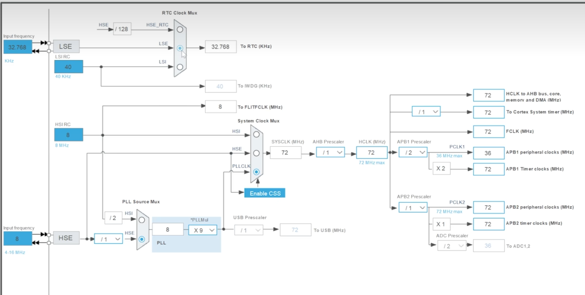
进入 **Clock Configuration**，设置：
**HSE 8MHz → PLL×9 → SYSCLK/HCLK 72MHz**
$$8MHz\times9=72MHz$$
RTC时钟源选择：
`RTC Clock Source` → `LSE`
所以：
**LSE 32.768kHz → RTC**
#### RTC配置
进入 **Timers → RTC → Mode**，勾选：
`Activate Clock Source`
`Activate Calendar`
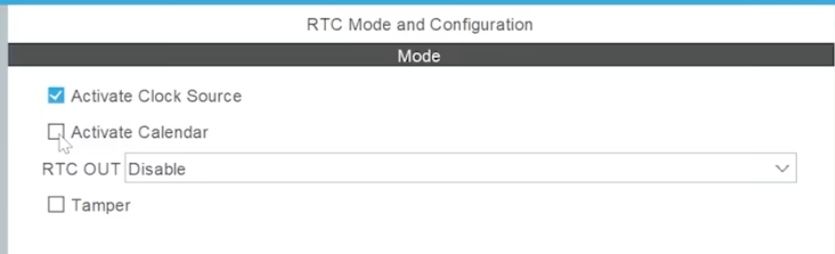
其中：
**Activate Clock Source → 开启RTC时钟**
**Activate Calendar → 启用日期功能**
> 只开启RTC时钟只能记录时间；视频中同时开启Calendar，用于日期和时间。
#### USART2配置
进入 **Connectivity → USART2**：
`Mode` → `Asynchronous`
串口继续使用默认实验配置：
`Baud Rate` → `115200`
`Word Length` → `8 Bits`
`Parity` → `None`
`Stop Bits` → `1`
最终：
**RTC → STM32 → USART2 → 串口助手显示日期和时间**
### HAL库日期掉电问题
STM32F103的RTC硬件本质是一个计数器。视频中指出，直接使用HAL库提供的RTC日期和时间功能时，虽然时间可以掉电继续走，但**日期不能正确实现掉电走时**。因此本节自己封装：
**`kk_rtc.h` + `kk_rtc.c`**
核心思想：
**把Unix时间戳直接保存到RTC的32位计数器中**
这样日期和时间统一成一个秒数：
**年月日时分秒 → Unix时间戳 → RTC_CNT**
只要RTC_CNT在掉电时继续增加，重新上电后再将时间戳转换成年月日时分秒，就可以同时实现日期和时间的掉电走时。
### 创建kk_rtc.h
在：
**Core → Inc**
中新建：
```text
kk_rtc.h
```
内容：
```c
#ifndef INC_KK_RTC_H_
#define INC_KK_RTC_H_

#include "stm32f1xx_hal.h"
#include "rtc.h"
#include "time.h"

HAL_StatusTypeDef KK_RTC_SetTime(struct tm *time);
struct tm *KK_RTC_GetTime();
void KK_RTC_Init();

#endif /* INC_KK_RTC_H_ */
```
三个接口分别用于：
| 函数 | 作用 |
|---|---|
| `KK_RTC_SetTime()` | 设置RTC时间 |
| `KK_RTC_GetTime()` | 获取RTC时间 |
| `KK_RTC_Init()` | 初始化RTC并判断是否已经设置过时间 |
### 创建kk_rtc.c
在：
**Core → Src**
中新建：
```text
kk_rtc.c
```
首先：
```c
#include "kk_rtc.h"

// RTC已经初始化的标志，保存在RTC_BKP_DR1中
#define RTC_INIT_FLAG 0x2333
```
这里使用：
**RTC_BKP_DR1 → RTC备份寄存器1**
保存一个特殊值：
```c
0x2333
```
用于判断RTC是否曾经初始化过。
### RTC初始化模式
RTC寄存器不能直接随意修改，因此写RTC计数器前需要先进入初始化模式。视频中的库封装了两个函数：
```c
static HAL_StatusTypeDef RTC_EnterInitMode(RTC_HandleTypeDef *hrtc)
{
    uint32_t tickstart = HAL_GetTick();

    while ((hrtc->Instance->CRL & RTC_CRL_RTOFF) == RESET)
    {
        if ((HAL_GetTick() - tickstart) > RTC_TIMEOUT_VALUE)
            return HAL_TIMEOUT;
    }

    __HAL_RTC_WRITEPROTECTION_DISABLE(hrtc);
    return HAL_OK;
}
```
作用：
**等待上一条RTC写操作完成 → 允许修改RTC寄存器**
退出初始化模式：
```c
static HAL_StatusTypeDef RTC_ExitInitMode(RTC_HandleTypeDef *hrtc)
{
    uint32_t tickstart;

    __HAL_RTC_WRITEPROTECTION_ENABLE(hrtc);
    tickstart = HAL_GetTick();

    while ((hrtc->Instance->CRL & RTC_CRL_RTOFF) == RESET)
    {
        if ((HAL_GetTick() - tickstart) > RTC_TIMEOUT_VALUE)
            return HAL_TIMEOUT;
    }

    return HAL_OK;
}
```
作用：
**结束RTC寄存器修改 → 等待写入完成**
### 写入RTC计数器
RTC计数器是32位，但STM32F103中分成：
**CNTH → 高16位**
**CNTL → 低16位**
因此：
$$RTC\_CNT=(CNTH<<16)|CNTL$$
写入时：
```c
static HAL_StatusTypeDef RTC_WriteTimeCounter(RTC_HandleTypeDef *hrtc,
                                               uint32_t TimeCounter)
{
    HAL_StatusTypeDef status = HAL_OK;

    if (RTC_EnterInitMode(hrtc) != HAL_OK)
    {
        status = HAL_ERROR;
    }
    else
    {
        WRITE_REG(hrtc->Instance->CNTH, (TimeCounter >> 16U));
        WRITE_REG(hrtc->Instance->CNTL,
                  (TimeCounter & RTC_CNTL_RTC_CNT));

        if (RTC_ExitInitMode(hrtc) != HAL_OK)
            status = HAL_ERROR;
    }

    return status;
}
```
即：
```c
CNTH = TimeCounter >> 16;
CNTL = TimeCounter & 0xFFFF;
```
### 读取RTC计数器
读取时也需要把高16位和低16位重新组合：
```c
static uint32_t RTC_ReadTimeCounter(RTC_HandleTypeDef *hrtc)
{
    uint16_t high1 = 0U, high2 = 0U, low = 0U;
    uint32_t timecounter = 0U;

    high1 = READ_REG(hrtc->Instance->CNTH & RTC_CNTH_RTC_CNT);
    low   = READ_REG(hrtc->Instance->CNTL & RTC_CNTL_RTC_CNT);
    high2 = READ_REG(hrtc->Instance->CNTH & RTC_CNTH_RTC_CNT);

    if (high1 != high2)
    {
        timecounter =
            ((uint32_t)high2 << 16U) |
            READ_REG(hrtc->Instance->CNTL & RTC_CNTL_RTC_CNT);
    }
    else
    {
        timecounter = ((uint32_t)high1 << 16U) | low;
    }

    return timecounter;
}
```
这里连续读取两次高16位：
**读取CNTH → 读取CNTL → 再读取CNTH**
是因为读取过程中低16位有可能刚好发生溢出。例如：
```text
CNTL：0xFFFF → 0x0000
CNTH：+1
```
如果两次高位不同：
```c
high1 != high2
```
说明读取期间发生了进位，所以重新读取低16位；否则直接组合第一次读取的数据。
### KK_RTC_SetTime
设置时间：
```c
HAL_StatusTypeDef KK_RTC_SetTime(struct tm *time)
{
    uint32_t unixTime = mktime(time);
    return RTC_WriteTimeCounter(&hrtc, unixTime);
}
```
过程：
**`struct tm` → `mktime()` → Unix时间戳 → RTC_CNT**
所以程序并不是分别向RTC写入年、月、日、时、分、秒，而是将它们转换成一个32位时间戳。
### KK_RTC_GetTime
读取时间：
```c
struct tm *KK_RTC_GetTime()
{
    time_t unixTime = RTC_ReadTimeCounter(&hrtc);
    return gmtime(&unixTime);
}
```
过程：
**RTC_CNT → Unix时间戳 → `gmtime()` → `struct tm`**
读取以后即可获得：
```c
now->tm_year
now->tm_mon
now->tm_mday
now->tm_hour
now->tm_min
now->tm_sec
```
### KK_RTC_Init
如果每次STM32重新上电都重新设置RTC时间，那么掉电期间RTC虽然一直走时，但上电后又会被初始值覆盖。因此需要利用备份寄存器判断RTC是否已经初始化过。
初始化标志：
```c
#define RTC_INIT_FLAG 0x2333
```
初始化函数：
```c
void KK_RTC_Init()
{
    uint32_t initFlag = HAL_RTCEx_BKUPRead(&hrtc, RTC_BKP_DR1);

    if (initFlag == RTC_INIT_FLAG)
        return;

    if (HAL_RTC_Init(&hrtc) != HAL_OK)
    {
        Error_Handler();
    }

    struct tm time = {
        .tm_year = 2025 - 1900,
        .tm_mon  = 1 - 1,
        .tm_mday = 1,
        .tm_hour = 23,
        .tm_min  = 59,
        .tm_sec  = 55,
    };

    KK_RTC_SetTime(&time);

    HAL_RTCEx_BKUPWrite(&hrtc,
                        RTC_BKP_DR1,
                        RTC_INIT_FLAG);
}
```
判断过程：
**读取RTC_BKP_DR1 → 是否等于0x2333**
如果：
```c
initFlag == RTC_INIT_FLAG
```
说明RTC之前已经初始化过：
**直接return → 不重新设置时间**
否则：
**初始化RTC → 设置初始时间 → RTC_BKP_DR1写入0x2333**
本节初始时间设置为：
```text
2025-01-01 23:59:55
```
这样很快就能观察：
```text
2025-01-01 23:59:59
→
2025-01-02 00:00:00
```
验证日期能够随着时间正常变化。
### 修改rtc.c
CubeMX原本会自动生成：
```c
MX_RTC_Init();
```
找到 `MX_RTC_Init()` 的定义，在 `rtc.c` 中加入：
```c
#include "kk_rtc.h"
```
随后在：
```c
/* USER CODE BEGIN RTC_Init 0 */
```
中配置RTC参数并调用：
```c
hrtc.Instance = RTC;
hrtc.Init.AsynchPrediv = RTC_AUTO_1_SECOND;
hrtc.Init.OutPut = RTC_OUTPUTSOURCE_ALARM;

KK_RTC_Init();
return;
```
也就是：
```c
void MX_RTC_Init(void)
{
    /* USER CODE BEGIN RTC_Init 0 */

    hrtc.Instance = RTC;
    hrtc.Init.AsynchPrediv = RTC_AUTO_1_SECOND;
    hrtc.Init.OutPut = RTC_OUTPUTSOURCE_ALARM;

    KK_RTC_Init();
    return;

    /* USER CODE END RTC_Init 0 */

    ...
}
```
这里的：
```c
return;
```
非常重要，它会直接退出 `MX_RTC_Init()`，从而绕过CubeMX后面自动生成的RTC初始化代码。
所以视频中的结构是：
**CubeMX生成RTC框架 → `KK_RTC_Init()`接管RTC初始化 → `return`跳过后面的默认代码**
### main.c
在 `main.c` 中加入：
```c
#include "kk_rtc.h"
#include <stdio.h>
#include <string.h>
```
定义：
```c
struct tm *now;
char message[50];
```
主循环：
```c
while (1)
{
    now = KK_RTC_GetTime();

    sprintf(message,
            "%d-%d-%d %02d:%02d:%02d",
            now->tm_year + 1900,
            now->tm_mon + 1,
            now->tm_mday,
            now->tm_hour,
            now->tm_min,
            now->tm_sec);

    HAL_UART_Transmit(&huart2,
                      (uint8_t *)message,
                      strlen(message),
                      HAL_MAX_DELAY);

    HAL_Delay(1000);
}
```
其中：
```c
now->tm_year + 1900
```
得到实际年份：
```text
125 + 1900 = 2025
```
而：
```c
now->tm_mon + 1
```
把0~11转换为正常使用的1~12月。
格式：
```c
%02d
```
表示不足两位时前面补0，例如：
```text
8:5:3 → 08:05:03
```
串口最终不断输出类似：
```text
2025-1-1 23:59:55
2025-1-1 23:59:56
2025-1-1 23:59:57
2025-1-1 23:59:58
2025-1-1 23:59:59
2025-1-2 00:00:00
```
### 掉电走时
程序第一次运行：
**BKP_DR1中没有0x2333 → 初始化RTC → 设置2025-01-01 23:59:55 → 写入0x2333**
之后RTC：
**LSE持续运行 → RTC_CNT每秒+1**
主电源断开后：
**VDD断电 → CPU停止运行 → VBAT继续给备份域供电 → RTC继续计时**
重新上电：
**读取RTC_BKP_DR1 → 发现0x2333 → `KK_RTC_Init()`直接return → 不重新设置时间**
因此掉电期间经过的时间会被继续保留下来。
### HAL日期掉电与kk_rtc的区别
HAL原本的使用方式可以记录RTC时间，但视频中特别解决的是：
**时间可以掉电走时，而日期重新上电后会重置的问题**
`kk_rtc`的解决方法：
**把“日期+时间”统一转换成Unix时间戳保存到RTC_CNT**
因此掉电期间：
**RTC_CNT继续增加**
重新上电后：
**RTC_CNT → gmtime() → 重新得到正确的年/月/日/时/分/秒**
所以：
**RTC硬件只需要保存一个32位秒数，就同时解决了时间和日期的连续变化。**
### 本节核心
RTC时钟：
$$LSE=32.768kHz$$
RTC工作：
**LSE → 分频成1Hz → RTC_CNT每秒+1**
本节使用Unix时间戳：
**日期时间 → `mktime()` → 时间戳 → RTC_CNT**
读取：
**RTC_CNT → `gmtime()` → `struct tm` → 日期时间**
库函数：
```c
KK_RTC_Init();
KK_RTC_SetTime();
KK_RTC_GetTime();
```
防止重新上电后覆盖时间：
```c
#define RTC_INIT_FLAG 0x2333
```
并使用：
```c
HAL_RTCEx_BKUPRead(&hrtc, RTC_BKP_DR1);
HAL_RTCEx_BKUPWrite(&hrtc, RTC_BKP_DR1, RTC_INIT_FLAG);
```
CubeMX最关键配置：
**HSE → Crystal/Ceramic Resonator**
**LSE → Crystal/Ceramic Resonator**
**SYSCLK/HCLK → 72MHz**
**RTC Clock Source → LSE**
**Activate Clock Source → 开启**
**Activate Calendar → 开启**
**USART2 → Asynchronous**
代码最关键修改：
**创建 `kk_rtc.h/.c` → 在 `MX_RTC_Init()` 中调用 `KK_RTC_Init()` → `return`绕过后面的CubeMX默认初始化 → `main.c`中使用 `KK_RTC_GetTime()`读取并通过USART2打印**
> **本节最关键的是理解：STM32F103 RTC本质上使用32位计数器持续记录秒数，`kk_rtc`把日期和时间统一转换成Unix时间戳写入这个计数器，从而实现完整日期和时间的掉电走时。**